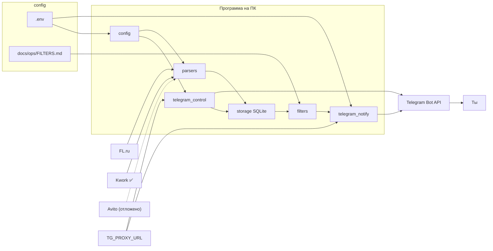

# Архитектура FL Radar

Краткая схема для Lead, Coder и владельца. Детали поведения — в **`docs/team/TZ.md`**.

---

## Поток данных (MVP)

**Сеть (MVP):** запросы к **FL / Kwork / Avito** — **напрямую** с домашнего IP (без системного VPN). Запросы к **`api.telegram.org`** — **только через `TG_PROXY_URL`** в `.env` (HTTP-прокси с логином).

**Kwork** — в проде (этап 1.5 закрыт). **Avito** — отложено.

**ИИ (этап 2):** после фильтра — полная страница FL + OpenRouter → расширенное сообщение в TG. См. `docs/team/TZ.md` §5.

**Фаза 1 (план):** ветка **Telethon** (мониторинговый аккаунт + прокси) → те же фильтр/ИИ/уведомления в личный чат через Bot API. См. **`docs/team/PRODUCT_VISION.md`**, **`docs/ROADMAP.md`**.

## Слои

| Слой | Назначение | Где в коде | MVP (по факту репо) |
|------|------------|------------|---------------------|
| Конфиг | Секреты, URL, интервал, пути БД/лога | `src/config.py`, `.env` | ✅ |
| Загрузка FL | HTTP GET ленты, до 3 стр. | `src/fl_parser.py` | ✅ |
| Загрузка Kwork | GET, JSON `wants` | `src/kwork_parser.py` | ✅ |
| Хранение | Дедуп по `project_id` | `src/storage.py` → `data/projects.db` | ✅ |
| Отбор | Ключевые слова | `src/filters.py` ← `docs/ops/FILTERS.md` | ✅ |
| Уведомление | Bot API + кнопка; **через `TG_PROXY_URL`** | `src/telegram_notify.py`, `src/tg_smoke.py` | ✅ |
| **Управление** | Пауза/старт, Reply keyboard | `src/telegram_control.py` | ✅ |
| Оркестрация | Цикл, sleep, лог | `src/main.py` → `data/radar.log` | ✅ |
| ИИ (этап 2) | Разбор + черновик отклика | `src/ai_analyze.py` | ✅ |

Очередь Coder: **`docs/team/TASKS.md`**. После смены модулей Lead сверяет этот файл с блоком **«Последняя сессия (Coder)»** в `docs/team/STATUS.md`.

---

## Внешние системы

| Система | Протокол | Ограничения |
|---------|----------|-------------|
| FL.ru | HTTPS, публичные страницы | Интервал ≥ 10 мин; **без прокси** (домашний IP) |
| Kwork / Avito (1.5) | HTTPS | Отдельные парсеры; **без прокси** |
| Telegram | HTTPS Bot API | **Только через `TG_PROXY_URL`**; не в чужие чаты |
| LLM (этап 2) | HTTPS API провайдера | Ключ в `.env`, не в Git |

---

## Что **не** входит в архитектуру (ещё)

- **Telethon** / чтение чатов — фаза 1, см. `ROADMAP.md`
- **Supabase** — фаза 1+ (SQLite только фаза 0)
- Облачный бэкенд, WordPress — фазы 3–4
- Авто-отклик на FL / автоспам в ЛС

---

_Ведёт Lead. Фаза 0 актуальна на 2026-05-20; фаза 1 — после `TZ_TG.md`._
