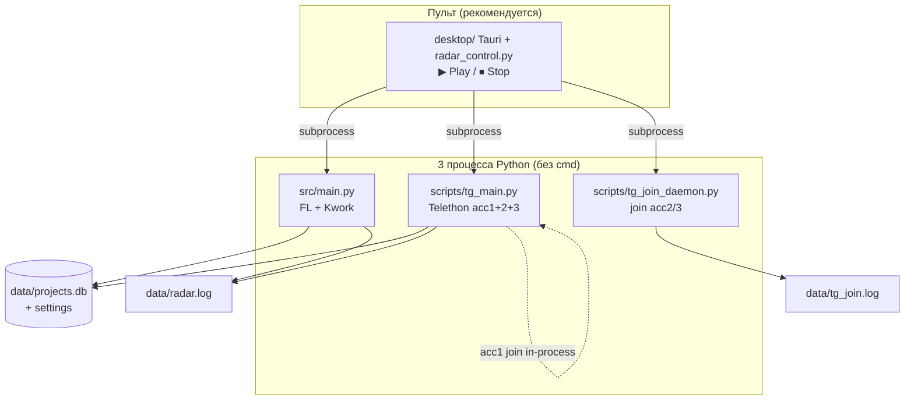
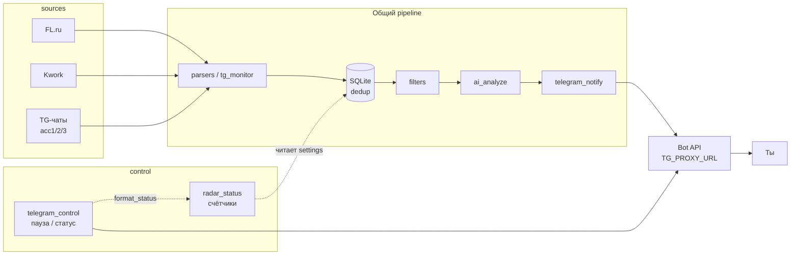

# Архитектура FL Radar

Краткая схема для Lead, Coder и владельца. Поведение — **`docs/team/TZ.md`**, TG — **`docs/team/TZ_TG.md`**.

_Актуально: 2026-05-23 (фаза 1 + пульт + multi-session)._

---

## Процессы на ПК (как запускается)

| Процесс | Модуль | Роль |
|---------|--------|------|
| **Биржи** | `src/main.py` | Цикл FL/Kwork, фильтр, ИИ, Bot API, `poll_commands` |
| **TG** | `scripts/tg_main.py` → `src/tg_monitor.py` | 3× Telethon в одном asyncio; acc1 join внутри |
| **Join** | `scripts/tg_join_daemon.py` | Очередь CSV для acc2/acc3 |
| **Пульт** | `desktop/` + `scripts/radar_control.py` | Tauri UI + HTTP API; **не** парсит заказы |

Запасной запуск: `scripts/start-radar-full.bat` (3 видимых cmd). См. [`../ops/DESKTOP_LAUNCH.md`](../ops/DESKTOP_LAUNCH.md).

**Lock-файлы:** `data/.tg_main.lock` (один tg_main), `data/.radar_desktop.lock` (один пульт).

---

## Поток данных (заказ → бот)

**Сеть:** FL/Kwork — домашний IP. `api.telegram.org` — **только `TG_PROXY_URL`**. Telethon — **прокси per acc** (`TELETHON_PROXY_ACC1`…).

**Дедуп TG:** `source = tg:{chat_id}` в `listing.telegram_source()`.

---

## Слои (код)

| Слой | Назначение | Где |
|------|------------|-----|
| Конфиг | `.env`, интервалы, acc, пути id | `src/config.py` |
| Пульт | Старт/стоп, UI, tail логов | `scripts/radar_desktop.py` |
| Биржи | FL + Kwork | `src/fl_parser.py`, `src/kwork_parser.py`, `src/main.py` |
| TG монитор | Multi-session, handlers | `src/tg_monitor.py`, `scripts/tg_main.py` |
| TG join | CSV очередь, daemon | `src/tg_join_runner.py`, `src/tg_join_lib.py`, `scripts/tg_join_daemon.py` |
| Telethon | Сессии acc1–3 | `src/tg_client.py` |
| Listen-списки | id чатов per acc | `data/telethon_chat_ids_accN.txt`, `scripts/tg_sync_chat_ids.py` |
| Хранение | Дедуп, пауза, offset бота, **статус** | `src/storage.py` |
| Статус (бот + пульт) | Счётчики, текст ℹ | `src/radar_status.py` |
| Управление ботом | Пауза, клавиатура | `src/telegram_control.py` |
| Уведомления | Карточки заказов | `src/telegram_notify.py` |
| ИИ | OpenRouter | `src/ai_analyze.py` |
| Фильтр | Слова | `src/filters.py` ← `docs/ops/FILTERS.md` |
| Здоровье | Пульс tg_main, алерт | `src/health_check.py` |
| Облако лидов | Опционально | `src/pg_storage.py` → Neon |

Очередь: **`docs/team/TASKS.md`**. Сверка с **`docs/team/STATUS.md`**.

---

## Telegram (фаза 1)

| Компонент | Деталь |
|-----------|--------|
| **Монитор** | `TELETHON_MONITOR_ACCOUNTS=acc1,acc2,acc3` → один `tg_main`, три клиента |
| **Join acc1** | `TG_JOIN_AUTO_ACC1=1` внутри `tg_monitor` |
| **Join acc2/3** | `tg_join_daemon.py`, лог `data/tg_join.log` |
| **Очередь** | `docs/ops/TG_JOIN_QUEUE.csv` |
| **Бот** | Только личный чат; не читает чужие группы |

---

## Внешние системы

| Система | Протокол | Примечание |
|---------|----------|------------|
| FL.ru, Kwork | HTTPS | Интервал ≥ 10 мин, без прокси |
| Telegram Bot API | HTTPS + прокси | Уведомления, кнопки |
| Telethon | MTProto + SOCKS/HTTP per acc | Чтение чатов, join |
| OpenRouter | HTTPS | Ключ в `.env` |
| Neon Postgres | Опционально | `DATABASE_URL` |
| GitHub | Git | Код: `Rode51/uisness`, секреты не в repo |

---

## Вне скоупа (пока)

- WordPress пульт — фаза 3, [`TZ_WP.md`](TZ_WP.md)
- Авто-отклик на FL / спам в ЛС
- Avito, SaaS-мультитенант

---

_Ведёт Lead. После смены модулей — обновить этот файл и блок в `STATUS.md`._
