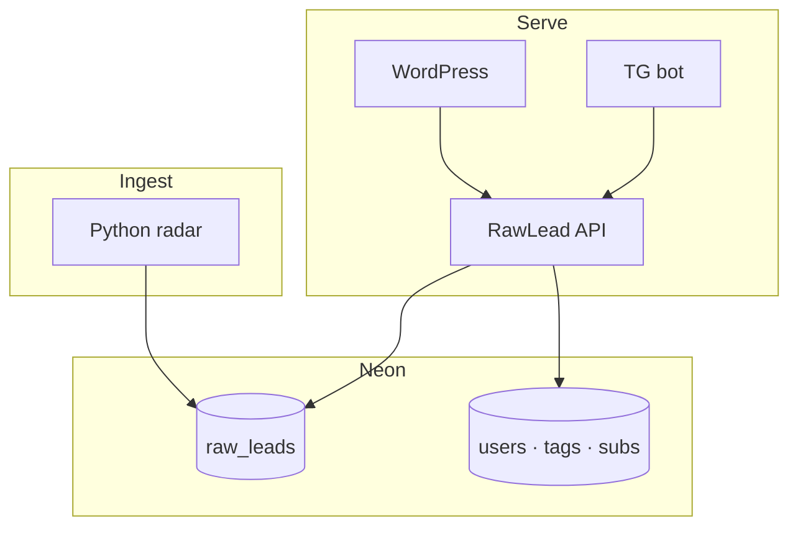
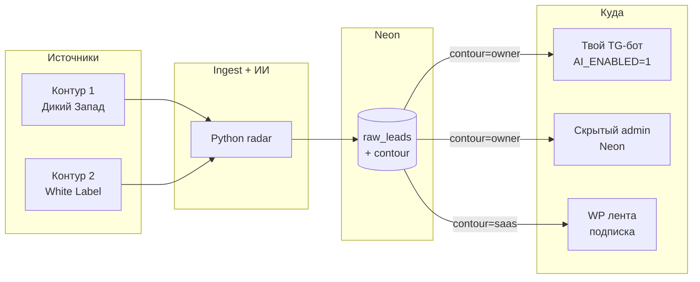

# Видение продукта — match + агрегатор заказов

Версия: **0.5** · Lead · 2026-05-23

Для владельца — **`docs/FOR_YOU.md`**. Код сейчас — **этап 0** (радар + бот). Ниже — **куда идём**.

**Архитектура v1:** [`NEON_SCHEMA.md`](NEON_SCHEMA.md) · [`TZ_API.md`](TZ_API.md) · [`TZ_WP.md`](TZ_WP.md)

---

## 0. Северная звезда

**RawLead** — **персональный агрегатор заказов** с match-логикой и % совместимости.

> **Внутри команды:** метафора dating (match, «мэтч»).  
> **Наружу:** **«умный подбор»**, **«совместимость»**, **«лиды без шума»** — слово dating **не используем**.

| Внутренне | Агрегатор |
|-----------|-----------|
| Match | FL.ru, Kwork, Telegram |
| % совместимости | Лента под теги юзера |
| Мэтч = откликнуться | ИИ + черновик ЛС |

Лендинг: **источники → 88%** — [`design/wp/REFERENCE.md`](../design/wp/REFERENCE.md).

| Слой | Что |
|------|-----|
| **Этап 0** ✅ | Рadar ПК + бот (владелец) |
| **v1** | **Сайт WP** (кабинет, теги, подписка) + **бот** (digest) |
| **v2+** | VPS 24/7, аналитика, SaaS |

**Не делаем:** mobile app (владелец 2026-05-23).

---

## 0b. Архитектура v1 (зафиксировано)



### Scoring

| Поле | Когда |
|------|--------|
| `ai_score` | ingest — ИИ, 0–100, «годность заказа» |
| `lead_tags` | ingest — JSON из ИИ |
| `keyword_match` | read — `lead_tags` ∩ `user_tags` |
| **final_rank** | read — `ai_score×0.6 + keyword_match×0.4` |

Детали: [`NEON_SCHEMA.md`](NEON_SCHEMA.md) §3.

### WP кабинет

Теги юзера → REST **`/v1/feed`** → лента по **final_rank** (не прямой SQL из WP).

### Бот

Per `tg_chat_id`: top-K по rank, только активная подписка.

---

## 0c. Два контура (решение владельца 2026-05-23)

**Один радар, два потока.** Источники и качество **не смешиваем** в одной ленте для подписчиков.



### Контур 1 — «Дикий Запад» (лично для тебя)

| | |
|--|--|
| **Источники** | Все открытые и закрытые TG-чаты, FL/Kwork, каналы-агрегаторы, «заказчики с улицы» |
| **Качество** | ~90% шлак: спам, «табличка за 500 ₽», «бот без ТЗ» |
| **Куда** | **Только** твой TG-бот (`AI_ENABLED=1`), скрытый admin в Neon |
| **Зачем** | Вручную выцепить **самородки** → отклик по промпту v7 → закрыть долги (Т-Банк/Сбер) |
| **В коде сейчас** | ✅ по сути это **этап 0** — весь текущий радар |

Подписчики **никогда** не видят этот поток.

### Контур 2 — «White Label / SaaS» (под подписку)

| | |
|--|--|
| **Источники** | Только **модерируемые** площадки: Habr Career, крупные проверенные TG-каналы (админы режут скам), позже — закрытые VK-группы с премодерацией |
| **Качество** | Очищенные заказы/вакансии, понятный бюджет |
| **Куда** | WP-кабинет — «лента совместимости» ([`design/wp/REFERENCE.md`](../design/wp/REFERENCE.md)); digest в бот для платных |
| **Ценность** | Пользователь **платит**, чтобы **не читать чаты-помойки** — ты уже отфильтровал источник и шум |

Пул источников Контура 2 — отдельный whitelist в docs/ops (Lead заведёт `SOURCES_SAAS.md`).

### Техническая метка (Coder)

В Neon у лида поле **`contour`**: `owner` | `saas` (см. [`NEON_SCHEMA.md`](NEON_SCHEMA.md)).

| API / UI | Фильтр |
|----------|--------|
| `/v1/feed` (подписчики) | только `contour=saas` + порог `ai_score` |
| Owner bot | `contour=owner` (или all + жёсткий фильтр) |
| Admin | оба контура |

---

## 0d. Монетизация — честная оценка Lead

| Горизонт | Реалистично | Комментарий |
|----------|-------------|-------------|
| **Сейчас – 1 мес** | 💰 **лично для тебя**, не SaaS | Контур 1 уже работает. Деньги = **выигранные отклики**, не подписки. Один закрытый заказ окупает месяцы хостинга. |
| **1–3 мес** | 🟡 **ранние подписчики** (5–15 человек) | Если: API + лента + **10–20 ручных источников Контура 2** + кейс «я сам так закрыл N ₽». Цена пилота **300–990 ₽/мес** — не «массовый SaaS». |
| **3–6 мес** | 🟢 **повторяемая подписка** | Нужны: VPS 24/7, стабильный whitelist, оплата (ЮKassa/Woo), 1 страница «до/после шума». |
| **Не ждать** | ❌ пассивный доход без Контура 2 | Продавать «всё из TG» подписчикам = **убить продукт** (они уйдут в шлак). |

**Шанс на монетизацию в ближайшее время:** **да для личного ROI** (Контур 1); **умеренный для подписок** — только после **отделённого чистого потока**, не раньше API и whitelist Habr/каналов.

**Риск:** Habr Career / VK — проверить ToS и способ ingest (RSS, партнёрство, ручной импорт на старте).

---

Находить заказы в TG (+ биржи), **самому писать** — без автоспама.

---

## 2. Telegram (три роли)

См. прежнюю схему: мониторинг (купленные acc + прокси), бот (уведомления), личный.

**VPN на ПК** режет `TG_PROXY_URL` → бот молчит. См. [`ops/RUN.md`](../ops/RUN.md).

---

## 3. Источники

TG — главный; FL/Kwork — дополнение. [`SOURCES_POOLS.md`](../ops/SOURCES_POOLS.md).

---

## 4. Фазы

| Фаза | Статус | Суть |
|------|--------|------|
| 0 Рadar ПК | ✅ | FL, Kwork, TG, пульт, бот |
| 1 TG MVP | ✅ | join, proxy wait-loop |
| 2 Scoring | → | `ai_score` + match % в боте (владелец) |
| 3 WP маркетинг | ✅ | Kadence child, REFERENCE E |
| **3b Кабинет + Neon** | → | schema, API, теги, feed |
| **3c Подписки + бот SaaS** | → | multi-user digest |
| 4 Аналитика | потом | конверсия мэтчей |
| 5 SaaS | опц. | [`TZ.md`](TZ.md) §10 |

**Убрано:** отдельное mobile app (заменено сайтом + ботом).

---

## 5. Карточка лида (целевая)

```
Совместимость: 88%  (final_rank)
  · Оценка заказа: 92  (ai_score)
  · Ваши теги: 82  (keyword_match)
Источник · ссылка · текст
🤖 Вердикт · черновик ЛС
```

---

## 6. Что не делаем

- Авто-отклик на биржах · спам в ЛС
- Секреты в Git · Telethon без прокси
- Dating-тон в маркетинге и сообщениях заказчикам
- WP → прямой доступ к Neon (только API)

---

## 7. Данные

| Что | Где |
|-----|-----|
| Этап 0 | SQLite `data/projects.db` |
| v1+ | Neon — [`NEON_SCHEMA.md`](NEON_SCHEMA.md) |
| WP | MySQL хостера — только users WP, не лиды |

---

## 8. Документы

| Файл | Роль |
|------|------|
| [`NEON_SCHEMA.md`](NEON_SCHEMA.md) | Таблицы, формула |
| [`TZ_API.md`](TZ_API.md) | REST, бот, ingest |
| [`TZ_WP.md`](TZ_WP.md) | Кабинет, подписки |
| [`ARCHITECTURE.md`](ARCHITECTURE.md) | Схемы |
| [`TASKS.md`](TASKS.md) | Очередь |

---

_Владелец 2026-05-23: два контура owner/saas; dating — внутренний язык; rank = ai_score + user tags._
