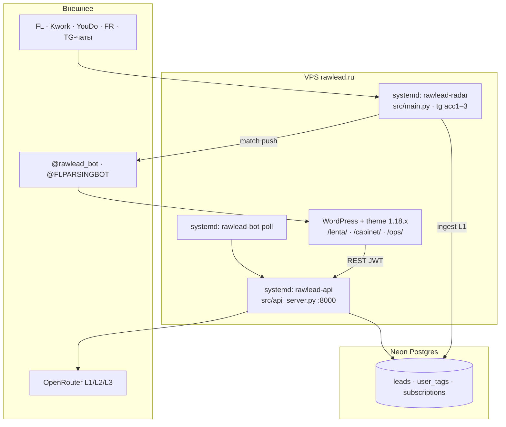
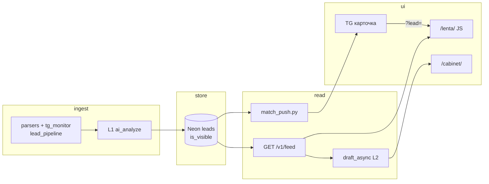
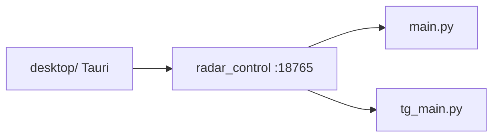

# Архитектура RawLead

**Навигация:** [`PROJECT_MAP.md`](../common/PROJECT_MAP.md) · **файлы кода:** [`CODE_STRUCTURE.md`](CODE_STRUCTURE.md) · **схема БД:** [`NEON_SCHEMA.md`](NEON_SCHEMA.md)

**Для кого:** Lead, Coder, Mechanic — **одна страница «как устроено»**. Детали запуска → [`../../ops/RUN.md`](../../ops/RUN.md) · [`../../FOR_YOU.md`](../../FOR_YOU.md).

_Актуально: **2026-06-08** · vision **v0.12** · prod на **VPS** (rawlead.ru)._

---

## Prod сейчас (главное)

| Сервис | Роль |
|--------|------|
| **rawlead-radar** | Site-профиль: биржи + TG → L1 → Neon; match push; healthchecks pulse |
| **rawlead-api** | FastAPI `/v1/*` — feed, auth, draft, me, admin/ops |
| **rawlead-bot-poll** | Long-poll @rawlead_bot (login, pay, draft callbacks) |
| **WordPress** | Маркетинг, лента, ЛК, прокси REST → API |

**Rank на чтении:** `final_rank = ai_score×0.6 + keyword_match×0.4` · см. [`TZ_API.md`](TZ_API.md).

---

## Два контура (один repo)

| | **SITE** (продукт) | **LEGACY** (dogfood) |
|--|-------------------|----------------------|
| Env | `.env.site` на VPS | `.env.legacy` на ПК |
| Бот | @rawlead_bot | @FLPARSINGBOT |
| Рadar | VPS `rawlead-radar` — **единственный writer** в Neon | ПК: consumer, без main бирж |
| Фильтры | `docs/ops/FILTERS_SITE.md` | `docs/ops/FILTERS_LEGACY.md` |
| ИИ | L1 → лента · L2 → черновик подписчику | legacy промпты → FLPARSING |

Подробнее — [`PROJECT_MAP.md`](../common/PROJECT_MAP.md) § «Два контура». **`contour` owner/saas отменён** (v0.9).

---

## Поток: заказ → лента → push → черновик

1. **Ingest:** listing → dedup (`pg_storage`) → L1 → `is_visible` в Neon.
2. **Лента:** WP REST → API → `keyword_match` по `user_tags` (Premium instant, anon delay 15m).
3. **Push:** `push_match_for_lead` — dedup по user + order URL/source (O158).
4. **Черновик:** `POST /v1/me/leads/{id}/draft` → OpenRouter (часто через `OPENROUTER_HTTP_PROXY` acc2).

---

## Биржи и прокси

| Источник | Модуль | Прокси |
|----------|--------|--------|
| FL, Kwork | `fl_parser`, `kwork_parser` | VPS: `FL_PROXY_URLS` / `KWORK_PROXY_URLS`; часто direct ok |
| YouDo, FR, job, Пчёл | `youdo_parser`, … | `YOUDO_PROXY_URLS` · **YouDo: Camoufox Firefox** (`YOUDO_BROWSER=camoufox`, worker subprocess) · FL/Kwork: Playwright Chromium |
| TG | `tg_monitor` | SOCKS/HTTP **per acc** (≠ биржи) |
| Bot API | `telegram_notify` | `TG_PROXY_URL` |

Пул и баны: `exchange_proxy.py` · trace: `exchange_trace.py` · health в `/ops/`: `exchange_health.py`.

**YouDo 🔴 в /ops/** = только listing этой биржи (antibot/cooldown); FL/Kwork/TG могут работать параллельно.

---

## ПК / пульт (опционально)

Для локальной отладки и **LEGACY** — не prod-путь:

Lock: `data/.tg_main.lock`, `data/.radar_desktop.lock` · guard: `process_guard.py`.  
См. [`../../ops/DESKTOP_LAUNCH.md`](../../ops/DESKTOP_LAUNCH.md).

---

## Слои кода (куда смотреть)

**Полная таблица файлов** — только [`CODE_STRUCTURE.md`](CODE_STRUCTURE.md). Здесь — маршрут:

| Задача | Модули |
|--------|--------|
| Цикл радара | `main.py`, `lead_pipeline.py` |
| Парсинг бирж | `*_parser.py`, `exchange_detail.py` |
| Browser / antibot | `exchange_browser_fetch.py`, `youdo_parser.py` |
| API / feed / draft | `api_server.py`, `draft_async.py`, `match_push.py` |
| Ops UI | `owner_admin.py` + WP `rawlead-api.php` |
| Neon | `pg_storage.py` |
| WP front | `wordpress/rawlead-kadence-child/` |

**God-files** (`api_server`, `ai_analyze`) — не читать целиком; только § «Файлы» в `CODER_PROMPT.md`.

---

## Внешние системы

| Система | Назначение |
|---------|------------|
| Neon Postgres | Канон лидов, users, tags, push log |
| OpenRouter | L1/L2/L3 |
| Telegram | Bot API + Telethon (3 acc) |
| Healthchecks.io | Dead man's switch (доп. к FLPARSING watchdog) |
| GitHub `Rode51/uisness` | Код; секреты только в `.env` на VPS/ПК |

---

## Что не в этом файле

| Тема | Канон |
|------|--------|
| Очередь задач | [`TASKS.md`](../common/TASKS.md) |
| Снимок prod | [`STATUS.md`](../common/STATUS.md) |
| API контракт | [`TZ_API.md`](TZ_API.md) |
| UX лента/ЛК | [`../../design/wp/feed-cabinet-mvp.md`](../../design/wp/feed-cabinet-mvp.md) |
| Старое TZ фазы 0 | [`../../archive/TZ.md`](../../archive/TZ.md) |

---

_Ведёт **Lead Architect**. Обновлять после смены процессов (VPS services, контуры, ingest). Не дублировать таблицы модулей — править `CODE_STRUCTURE.md`._
