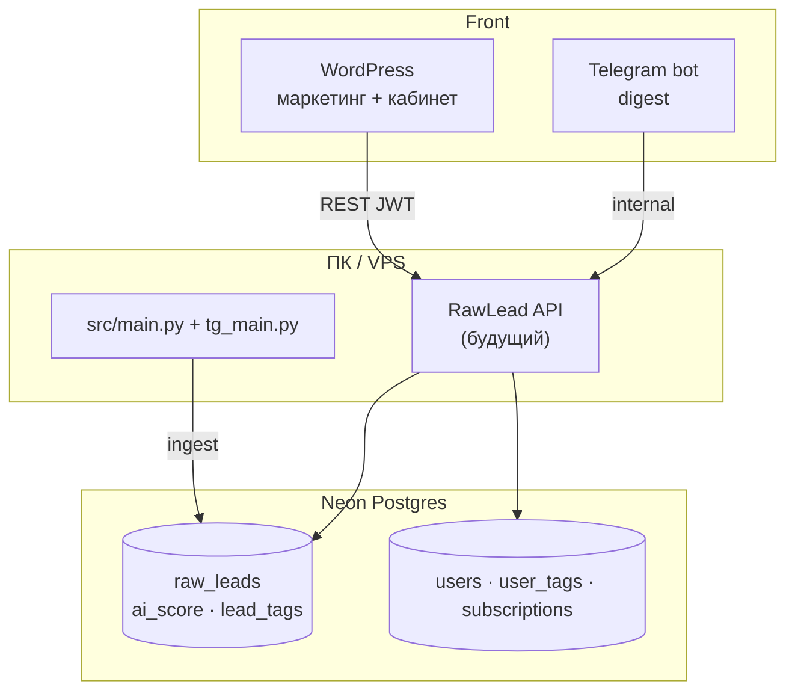
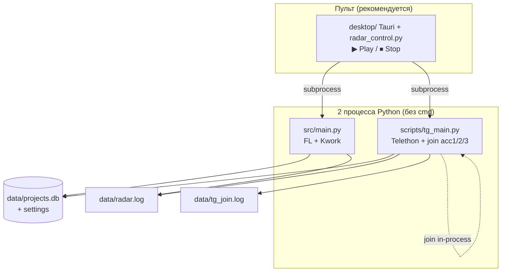
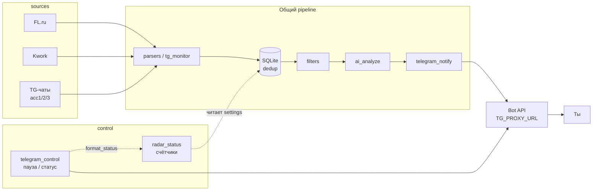

# Архитектура RawLead

**Процессы на ПК и зоны кода** — канон: [`PROJECT_MAP.md`](../common/PROJECT_MAP.md).  
**Регламент docs** — [`DOCS_ARCHITECTURE.md`](../common/DOCS_ARCHITECTURE.md).

Краткая схема для Lead, Coder. Поведение фазы 0 — **`archive/TZ.md`**, TG — **`TZ_TG.md`**.

_Актуально: 2026-05-24 (vision v0.9 · фазы 3b–3f MVP)._

---

## Целевая архитектура v1 (SaaS)

См. [`PRODUCT_VISION.md`](../product/PRODUCT_VISION.md) §0b · [`NEON_SCHEMA.md`](NEON_SCHEMA.md) · [`TZ_API.md`](TZ_API.md).

**Rank на чтении:** `final_rank = ai_score×0.6 + keyword_match×0.4` (v0).

**Сейчас в коде:** ingest → SQLite (+ Neon частично); dogfood → TG-бот владельца. **Цель MVP:** один поток + `is_visible` на ingest → `/feed` (anon) + `/cabinet` (user_id=1) + ИИ-агент. Модель `contour` owner/saas — **отменена** v0.9. См. [`PRODUCT_VISION.md`](../product/PRODUCT_VISION.md) §0c.

---

## Процессы на ПК (как запускается)

| Процесс | Модуль | Роль |
|---------|--------|------|
| **Биржи** | `src/main.py` | Цикл FL/Kwork, фильтр, ИИ, Bot API, `poll_commands` |
| **TG** | `scripts/tg_main.py` → `src/tg_monitor.py` | 3× Telethon + join acc1/2/3 в одном asyncio |
| **Пульт** | `desktop/` + `scripts/radar_control.py` | Tauri 2 + WebView2, HTTP :18765; **не** парсит заказы |

Запасной запуск: `scripts/start-radar-full.bat` (2 видимых cmd). См. [`../ops/DESKTOP_LAUNCH.md`](../ops/DESKTOP_LAUNCH.md).

**Lock-файлы:** `data/.tg_main.lock` (один tg_main), `data/.radar_desktop.lock` (один пульт).

---

## Поток данных (заказ → бот)

**Сеть:** FL/Kwork — домашний IP. `api.telegram.org` — **только `TG_PROXY_URL`**. Telethon — **прокси per acc** (`TELETHON_PROXY_ACC1`…); **TCP probe** до connect (`proxy_probe.py`, `TELETHON_PROXY_PROBE=1`).

**Дедуп TG:** `source = tg:{chat_id}` в `listing.telegram_source()`.

---

## Слои (код)

| Слой | Назначение | Где |
|------|------------|-----|
| Конфиг | `.env`, интервалы, acc, пути id | `src/config.py` |
| Пульт | Старт/стоп, UI, tail логов | `scripts/radar_control.py`, `desktop/` |
| Биржи | FL + Kwork | `src/fl_parser.py`, `src/kwork_parser.py`, `src/main.py` |
| TG монитор | Multi-session, handlers | `src/tg_monitor.py`, `scripts/tg_main.py` |
| TG join | CSV очередь, in-process в tg_main | `src/tg_join_runner.py`, `src/tg_join_lib.py`, `src/tg_join_registry.py` |
| Telethon | Сессии acc1–3 | `src/tg_client.py` |
| Listen-списки | id чатов per acc | `data/telethon_chat_ids_accN.txt`, `scripts/tg_sync_chat_ids.py` |
| Хранение | Дедуп, пауза, offset бота, **статус** | `src/storage.py` |
| Статус (бот + пульт) | Счётчики, текст ℹ | `src/radar_status.py` |
| Управление ботом | Пауза, клавиатура | `src/telegram_control.py` |
| Уведомления | Карточки заказов | `src/telegram_notify.py` |
| ИИ | OpenRouter | `src/ai_analyze.py` |
| Фильтр | Слова | `src/filters.py` ← `docs/ops/FILTERS.md` |
| Здоровье | Пульс tg_main, алерт | `src/health_check.py` |
| Облако лидов | Опционально | `src/pg_storage.py` → Neon |

Очередь: **`docs/team/common/TASKS.md`**. Сверка с **`docs/team/common/STATUS.md`**.

---

## Telegram (фаза 1)

| Компонент | Деталь |
|-----------|--------|
| **Монитор** | `TELETHON_MONITOR_ACCOUNTS=acc1,acc2,acc3` → один `tg_main`, три клиента |
| **Join** | `TG_JOIN_IN_TG_MAIN=1` — цикл join для всех `TELETHON_MONITOR_ACCOUNTS`, лог `data/tg_join.log` |
| **Метка в боте** | `accN · название чата` в пересылке и разборе |
| **Очередь** | `docs/ops/TG_JOIN_QUEUE.csv` |
| **Бот** | Только личный чат; не читает чужие группы |

---

## Внешние системы

| Система | Протокол | Примечание |
|---------|----------|------------|
| FL.ru, Kwork | HTTPS | Интервал ≥ 10 мин, без прокси |
| Telegram Bot API | HTTPS + прокси | Уведомления, кнопки |
| Telethon | MTProto + SOCKS/HTTP per acc | Чтение чатов, join |
| OpenRouter | HTTPS | Ключ в `.env` |
| Neon Postgres | Опционально | `DATABASE_URL` |
| GitHub | Git | Код: `Rode51/uisness`, секреты не в repo |

---

## Вне скоупа (пока)

- Mobile app (владелец: только сайт + бот)
- Авто-отклик на FL / спам в ЛС
- Avito

**В работе (docs):** кабинет WP + API + Neon — [`TZ_WP.md`](TZ_WP.md), [`TZ_API.md`](TZ_API.md)

---

_Ведёт Lead. После смены модулей — обновить этот файл и блок в `STATUS.md`._
