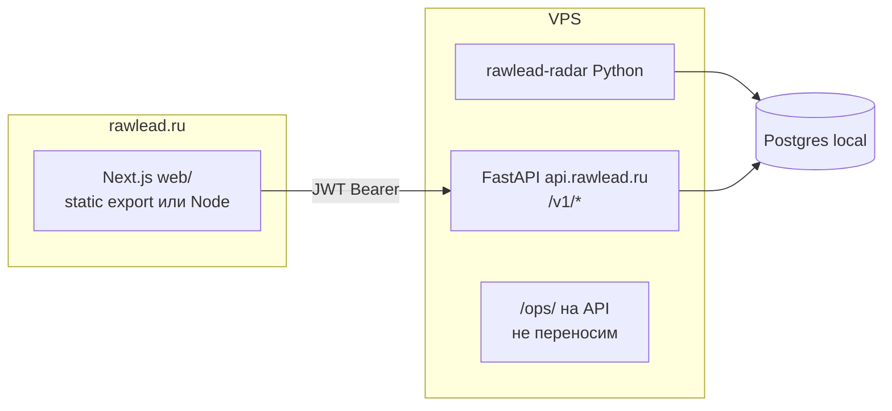

# WP → Next.js — handoff для Claude Code (O280)

**Решение владельца (2026-06-18):** убрать **WordPress как UI** до рекламы · **Python API + радар не трогать** · визуал на **Next.js** (как `portfolio/`).

**Кто пишет промпты:** `@lead-architect` · **кто кодит:** Claude Code в **`rawlead-next/`** · **verify/deploy:** `@lead-architect` / `@coder`.

**Статус фаз (verify 2026-06-19):** phase 0–1 ✅ · cabinet **MVP** (parity gaps) · pricing ❌ · as-built [`O280_AS_BUILT.md`](../../migration/O280_AS_BUILT.md) § **Prod parity**

**Пакет документации:** [`docs/migration/README.md`](../../migration/README.md) (PAGES · API · TOKENS · `rawlead-next/CLAUDE.md`).

---

## Реальность сроков (честно)

| | Портфолио `portfolio/` | Продукт `web/` |
|---|--------------------------|----------------|
| Что сделали за ~2ч | статический лендинг, 0 API | — |
| Объём WP сейчас | — | **~12k строк JS** (feed 5.2k · cabinet 5.6k · quiz 1.6k · pricing…) + **38 REST** прокси в `rawlead-api.php` |
| «За день» | ✅ v1 лендинг | ✅ **MVP для ads** (см. § Gate ниже) · ❌ не 100% parity с WP |

**Не переписывать с нуля логику** — **портировать поведение** из `wordpress/.../assets/js/rawlead-*.js` и спеки `docs/design/wp/feed-cabinet-mvp.md`.

---

## Read order (обязательно перед кодом)

1. [`feed-cabinet-mvp.md`](../../design/wp/feed-cabinet-mvp.md) — UX behavior (quiz-first, tiers) — **не** визуальный brief
2. [`KAK_ETO_RABOTAET.md`](../../KAK_ETO_RABOTAET.md) — auth, trial, pay
3. `wordpress/rawlead-kadence-child/inc/rawlead-api.php` — маппинг REST → FastAPI
4. `src/api_server.py` — источник истины `/v1/*` (если расхождение — API wins)
5. `wordpress/.../assets/js/rawlead-feed.js` — reference behavior
6. [`PROD_FACTS.md`](../common/PROD_FACTS.md) — prod URLs, API

---

## Целевая архитектура



| Остаётся | Уходит после cutover |
|----------|----------------------|
| `src/api_server.py`, радар, бот | WordPress тема (PHP + Kadence) |
| `/ops/` как сейчас | `rawlead-api.php` прокси |
| Postgres, JWT, квиз API | `page-lenta.php`, `page-cabinet.php` |

---

## Новый пакет: `rawlead-next/`

> Имя папки: **`rawlead-next/`** (в старых § ниже может встречаться `web/` — то же самое).

```
rawlead-next/
  CLAUDE.md              ← краткие правила (скопировать из § bootstrap)
  package.json
  next.config.mjs        ← output: 'export' ИЛИ standalone — см. § Deploy
  app/
    layout.tsx           ← шрифты, Metrika, header
    page.tsx             ← home (из template-parts/rawlead/hero + flow)
    lenta/page.tsx
    cabinet/page.tsx
    pricing/page.tsx
  lib/
    api.ts               ← base URL, authHeaders, JWT rotation header
    auth.ts              ← token localStorage key как WP
    types.ts
  components/
    feed/                ← портировать из rawlead-feed.js кусками
    cabinet/
    quiz/
    ui/                  ← match bar, cards, chips
  public/
```

**Не трогать:** `src/`, `wordpress/` (read-only reference), `portfolio/` (отдельный rode51.ru).

---

## API: как звонить бэкенду

**Prod API:** `https://api.rawlead.ru/v1/...`

WP сейчас: same-origin ` /wp-json/rawlead/v1/*` → прокси на API.

**Вариант A (рекомендуется):** браузер → `api.rawlead.ru` напрямую.

- JWT в `localStorage` (ключ как в `rawlead-feed.js`: `rawlead_access_token` или из `rawleadFeed` config — **grep и совпасть**).
- Заголовок `Authorization: Bearer …`
- Обработка `X-Rawlead-Access-Token` rotation (см. `applyRotatedAccessToken` в feed.js).
- На VPS в `.env.site`: `RADAR_CORS_ORIGINS=https://rawlead.ru,https://www.rawlead.ru` (не `*` + credentials).

**Вариант B:** Next Route Handlers `app/api/[...path]/route.ts` — BFF-прокси. Только если CORS блокер.

### Маппинг эндпоинтов (минимум MVP)

| UI | FastAPI | WP REST (reference) |
|----|---------|---------------------|
| Лента | `GET /v1/feed` | `/rawlead/v1/feed` |
| Карточка | `GET /v1/leads/{id}` | `/rawlead/v1/leads/{id}` |
| Логин бот | `POST /v1/auth/bot-session` + bot + `GET /v1/auth/bot-complete` | same paths under wp-json |
| Профиль | `GET /v1/me` | `/rawlead/v1/me` |
| Теги | `GET/PUT /v1/me/tags` | `/rawlead/v1/me/tags` |
| Квиз import | `POST /v1/me/tags/import` | `/rawlead/v1/me/tags/import` |
| Подписка | `GET /v1/me/subscription` | `/rawlead/v1/me/subscription` |
| Trial | `POST /v1/me/subscription/trial-start` | same |
| Draft | `GET/POST /v1/me/leads/{id}/draft` | `/rawlead/v1/me/leads/...` |
| Inbox | `GET /v1/me/replies` | `/rawlead/v1/me/replies` |
| Каталог навыков | `GET /v1/skills/catalog` | `/rawlead/v1/skills/catalog` |

Полный список: `grep register_rest_route wordpress/.../rawlead-api.php`.

---

## Auth flow (не сломать)

1. Пользователь жмёт «Войти» → `POST /v1/auth/bot-session` → deep link `t.me/rawlead_bot?start=auth_…`
2. Бот пишет в `auth_bot_sessions` → пользователь возвращается на `/cabinet?auth=TOKEN` или polling `bot-complete`
3. JWT сохраняется → все `fetch` с `Authorization`

Скопировать edge cases из `rawlead-cabinet.js` / `rawlead-feed.js`: 401 → logout, rotation header.

---

## События (O272)

После квиза:

```js
window.dispatchEvent(new CustomEvent("rawlead-tags-imported"));
localStorage rawlead_user_tags_rev
```

Next **обязан** слушать `rawlead-tags-imported` и refetch tags + feed (см. `tests/test_o272_quiz_feed_tags_sync.py`).

---

## Фазы работ (owner: до рекламы)

### Фаза 0 — scaffold (2–4 ч)

- [ ] `npx create-next-app` в `rawlead-next/` · TS · Tailwind · App Router
- [ ] `lib/api.ts` · smoke: `GET /v1/health` or public feed anon
- [ ] Minimal layout shell (nav links — см. `PAGES_INVENTORY`)
- [ ] `rawlead-next/CLAUDE.md`

### Фаза 1 — лента + логин (день 1)

- [ ] `/lenta/` — список карточек, load more, sort time/match
- [ ] Match bar · quiz-locked / premium tiers (логика `getFeedTier`, `hasUserSkills`)
- [ ] TG bot login end-to-end
- [ ] Квиз overlay + import tags
- [ ] **DoD:** owner logged in · квиз · % совместимости без reload · anon видит ленту

### Фаза 2 — кабинет + draft (день 2)

- [ ] `/cabinet/` inbox `GET /v1/me/replies`
- [ ] Draft generate/copy · quota
- [ ] Retake quiz link
- [ ] **DoD:** «Написать отклик» из ленты → черновик в кабинете

### Фаза 3 — pricing + home + cutover (день 3)

- [ ] `/pricing/` trial + checkout → bot deep links (как `rawlead-pricing.js`)
- [ ] Home: hero, flow, FAQ (упрощённо)
- [ ] Metrika (`rawlead-metrika.js` goals)
- [ ] `scripts/deploy-web-rawlead-vps.py` + nginx `rawlead.ru` → `web/out`
- [ ] **Cutover:** nginx переключить с PHP-WP на static Next · WP остановить или оставить `/wp-admin` off
- [ ] **DoD:** `curl -I https://rawlead.ru/lenta/` 200 · O218 paths updated · ads gate

### Вне MVP (после ads или v1.1)

- Support tickets UI
- Notification settings
- Полный parity home animations (ticker, scroll)
- `/ops/` — остаётся на FastAPI

---

## Gate «можно в рекламу»

| # | Критерий |
|---|----------|
| 1 | `/lenta/` anon + logged · perf LCP лучше WP (subjective OK) |
| 2 | TG login + owner plan |
| 3 | Квиз → tags → match % |
| 4 | Draft + copy |
| 5 | Trial start или pricing → bot |
| 6 | Metrika на prod |
| 7 | `tests/test_o218_quiz_e2e.py` зелёный на **новом** URL (обновить base URL) |

---

## Deploy (целевой)

| Домен | Содержимое |
|-------|------------|
| `rawlead.ru` | `web/out/` после `npm run build` |
| `api.rawlead.ru` | без изменений |
| `rode51.ru` | `portfolio/out/` |
| `/ops/` | `api.rawlead.ru/ops/` |

Nginx: `try_files` + SPA fallback как `deploy/nginx/labs.rawlead.ru.conf`.

**CORS:** при cutover добавить origin rawlead.ru на API.

---

## § bootstrap — копипаст в Claude Code

```text
Bootstrap RawLead product UI — rawlead-next/ (O280 WP→Next).

Read FIRST (in order):
- docs/migration/PAGES_INVENTORY.md
- docs/migration/API_CONTRACTS.md
- rawlead-next/CLAUDE.md
- docs/team/architect/WP_TO_NEXT_HANDOFF.md
- docs/design/wp/feed-cabinet-mvp.md (§0 + §0.1 behavior only)
- wordpress/rawlead-kadence-child/assets/js/rawlead-feed.js (reference)
- wordpress/rawlead-kadence-child/inc/rawlead-api.php (REST map)

Goal: New Next.js 14 app in rawlead-next/ — product face for rawlead.ru. Do NOT rewrite Python backend.

Rules:
- Create rawlead-next/ only. Do not modify src/, wordpress/, portfolio/ except reading.
- Port behavior from WP JS; API is https://api.rawlead.ru/v1/ (see api_server.py).
- JWT localStorage + Bearer + X-Rawlead-Access-Token rotation — match existing feed.js.
- Quiz-first profile; no manual skill tree as primary UX (see PAGES_INVENTORY prod snapshot + feed-cabinet-mvp §0.1).
- Listen for rawlead-tags-imported event (O272).
- Strings/flows: port from PAGES_INVENTORY prod snapshot unless owner says otherwise in chat.

Phase 0 only in this session:
1. Scaffold rawlead-next/ with TypeScript, Tailwind, App Router.
2. lib/api.ts with health + anon feed fetch.
3. app/lenta/page.tsx — minimal feed list (title, source, budget) proving API works.
4. Update rawlead-next/CLAUDE.md as-built section.

Stop and report. Wait for owner before cabinet/pricing/cutover.
```

---

## § phase-1-lenta — ✅ done 2026-06-19

```text
O280 Phase 1 — full /lenta/ parity with rawlead-feed.js (MVP).

Read WP_TO_NEXT_HANDOFF.md § Phase 1 + feed-cabinet-mvp.md.

Implement in web/:
- Feed cards, match bars (tier/quiz/premium), load more, filters chips
- TG bot auth flow
- Quiz overlay + POST /v1/me/tags/import + rawlead-tags-imported
- Subscription tier state for match visibility

Reference implementation: wordpress/.../rawlead-feed.js (port, don't import file).

Tests: manual owner smoke checklist in handoff § Gate.
Do not deploy until @lead-architect says cutover.
```

**Lead verify:** ✅ см. [`O280_AS_BUILT.md`](../../migration/O280_AS_BUILT.md). Home `/` собран в той же сессии.

---

## § phase-2-cabinet — 🟡 fix parity

```text
O280 Phase 2 — /cabinet/ prod parity fix.

READ FIRST (mandatory):
- docs/migration/O280_AS_BUILT.md § «Prod-канон кабинета»
- docs/migration/PAGES_INVENTORY.md §5
- rawlead-next/CLAUDE.md § «/cabinet/ prod canon»
- wordpress/.../rawlead-cabinet.js (renderSubscription, renderTags O219, renderNotificationSettings)
- wordpress/.../page-cabinet.php

DO NOT use ?dev=free|paid mocks as design reference — they are wrong (skills, Free badge, Activate Trial).

Fix rawlead-next/app/cabinet/page.tsx:
1. REMOVE skills chips block («Твои навыки» + tag list).
2. REMOVE «Активировать Trial» — trial starts on first TG login via API.
3. Subscription UI: mirror rawlead-cabinet.js states (trial badge, hide price when active, pay CTA only when !effective_access).
4. Keep: user bar, notifications (effective_access), inbox, load more, anon QR flow.
5. Optional: keep ?dev=paid only for inbox UI testing — relabel or remove ?dev=free.

Reference API: GET /v1/me/subscription after login — expect trial + effective_access for new user.

npm run build · update O280_AS_BUILT § Next column.
```

---

## § phase-3-cutover

```text
O280 Phase 3 — pricing, home, deploy.

Read rawlead-pricing.js, template-parts/rawlead/*.php for copy structure.
Add scripts/deploy-web-rawlead-vps.py (pattern: scripts/deploy-portfolio-labs-vps.py).
nginx: rawlead.ru serves web/out; document rollback to WP in docs/ops/DEPLOY_VPS.md § appendix.

@coder may add FastAPI CORS env if needed — separate small PR.
```

---

## Риски

| Риск | Митигация |
|------|-----------|
| «За день всё» | жёсткий MVP gate § Gate, фазы 1–3 |
| CORS/JWT | тест login на staging subdomain сначала |
| SEO regression | metadata в `app/layout.tsx` · sitemap позже |
| Playwright O218 | обновить base URL в тестах |
| Два фронта | cutover одним флагом nginx, не держать WP и Next параллельно на /lenta |

---

_Lead Architect · O280 · 2026-06-18_
