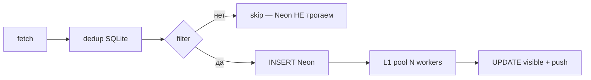

# CODER_PROMPT — архив (холодное хранилище)

**Не читать @coder по умолчанию.** Активное ТЗ: [CODER_PROMPT.md](../architect/CODER_PROMPT.md) § в шапке.

Перенесено **2026-05-30** (~4300 строк). Grep по O71, O37c, WAVE-2 и т.д.

---

# Перенесено из hot **2026-06-13** (O194 YouDo ingest after listing)

## § O194-YOUDO-INGEST-AFTER-LISTING ✅ Lead 2026-06-13

**Symptom:** listing `parsed=50` but ingest 0 — owner: new tasks on YouDo today.

**Root cause:** listing subprocess (O190) OK · `_process_listings` → in-process `fetch_project_detail` → `Sync API inside asyncio`.

**Fix (approach A):** `fetch_youdo_detail_snapshot` → camoufox **`youdo_fetch_worker.py --stage detail`** (same as listing subprocess).

**DoD (Lead verify VPS):** deploy `deploy-o194-youdo-detail-subprocess-vps.py` · post-deploy **00:07** `fetch_end parsed=50` → **`pipeline:L1 youdo:id=` ×29+** (7× `visible=1`) · **0** asyncio on 2026-06-13 · `health:youdo ok parsed=50`

**Files:** `src/exchange_browser_fetch.py` · `scripts/youdo_fetch_worker.py` · `scripts/deploy-o194-youdo-detail-subprocess-vps.py`

---

# Перенесено из hot **2026-06-12** (O193 FL subprocess)

## § O193-FL-SUBPROCESS-WORKER ✅ Lead 2026-06-12

**DoD:** `fl_fetch_worker.py` · `fetch_listing_html_browser` → subprocess when `FL_LISTING_SUBPROCESS=1` (default) · deploy `deploy-o193-fl-subprocess-vps.py` · radar `listing:fl parsed=30` · rollback env `FL_LISTING_SUBPROCESS=0`

---

# Перенесено из hot **2026-06-12** (O191 YouDo proxy mix)

## § O191-YOUDO-PROXY-MIX ✅ Lead 2026-06-12

**DoD:** prepend 1 DC slot (185.147) + 25 RU → **26** `YOUDO_PROXY_URLS` · active_slot reset 0 · radar `slot=1/26` · `fetch_end parsed=50` · smoke failover CLI · rollback `patch-vps-youdo-proxy-env.py`

**Files:** `scripts/deploy-o191-youdo-proxy-vps.py` · `scripts/patch-vps-youdo-proxy-env.py` comment

---

# Перенесено из hot **2026-06-12** (O190 YouDo ingest DoD — full chronicle)

## § O190-YOUDO-CAMOUFOX ✅ Lead 2026-06-12

**DoD:** subprocess `youdo_fetch_worker.py` · t0j cycle gate · `fetch_end parsed=50` · `health:youdo ok` · deploy `deploy-o190-t0e-vps.py` · next: **O191** proxy · **O193** FL worker

**Root cause (t0i):** uvicorn/anyio infects threads — 5 asyncio approaches failed — **process isolation** via subprocess worker.

| Step | Result |
|------|--------|
| t0a–t0b | camoufox env · patchright ❌ |
| t0c | firefox deps ✅ |
| t0d | proxy failover · asyncio on listing ❌ |
| t0e–t0h | loop guards · AsyncCamoufox · all ❌ ingest |
| t0i | subprocess ✅ 50 cards |
| t0j | `_safe_close_browser_contexts` · `_commit_youdo_fetch_gate` · delist cap **10** · ✅ cycle ~50s |

Detail + Mechanic notes → [`problems/2026-06-12-youdo-antibot-permanent.md`](../../problems/2026-06-12-youdo-antibot-permanent.md)

---

# Перенесено из hot **2026-06-12** (O185 t5b reset-btn hotfix)

## § O185-t5b-reset-btn ✅ Lead 2026-06-12

**DoD:** `readFilters()` at end of `updateFilterBarUi()` — reset button reappears after sort/source/category change without F5 · skills still kept on reset · theme **1.18.75** · deploy `deploy-o185-w3-vps.py`

---

# Перенесено из hot **2026-06-12** (O185 wave 3)

## § O185-w3-PRELAUNCH ✅ Lead 2026-06-12 (t6 tail → Mechanic)

**t5b ✅** — `rawlead-feed.js` reset: source/category/sort/min_match only · **no** `persistTags([])` · explicit clearSkills unchanged · theme **1.18.74** · deploy `deploy-o185-w3-vps.py`

**t8 ✅** — `rawlead-purge-leads.timer` **active** · dry-run **162** rows >7d (**2.3%**) · Neon **7113** total · policy OK

**t6 ⚠️ partial** — `_looks_like_antibot` `<4000` + task-id SSR guard on VPS · pytest youdo/health **32/32** · **ingest still broken**: `empty HTML after goto` · traffic_guard streak 13 · `health:youdo ok parsed=0` on skip cycles · **→ @mechanic** `2026-06-12-youdo-antibot-permanent.md` (t6b ops honesty · t6c wait_until/stealth)

---

# Перенесено из hot **2026-06-12** (O185 wave 2)

## § O185-w2-PRELAUNCH ✅ Lead 2026-06-12

**DoD:** t3 `user_avatar.py` — cache on login · `/v1/me` + `/v1/me/avatar` · octet-stream guard · VPS `rawlead-avatars/` · t4 `rank.keyword_match` lead-coverage only (extra user tags no penalty) · cabinet `refreshUserProfile` + header sync · theme **1.18.73** · deploy `deploy-o185-w2-vps.py` · pytest match+avatar **29/29**

**Point fixes:** image magic-byte check · avatar `onerror` hide · CSS empty `[src]` · sessionStorage cabinet sort/min_match

**Gap → t5b:** `/lenta/` «Сбросить фильтры» must **not** clear skills (owner confirmed **2026-06-12**)

---

# Перенесено из hot **2026-06-12** (O185 t1b)

## § O185-t1b-SMOKE-PRICE ✅ Lead 2026-06-12

**DoD:** `PAY_PREMIUM_RUB=10` VPS smoke · owner subscription checkout ✅ · revert **790** + cabinet copy · hide «Продлить» on active Premium · `rawlead-cabinet.js` · script `_tmp_o185_t1b_smoke_price.py`

---

# Перенесено из hot **2026-06-12** (O185 wave 1)

## § O185-w1-PAY ✅ Lead 2026-06-12

**DoD:** t1 trial→790 checkout (`validate_checkout` + UI «Подключить Premium») · t2 remove push hint under toggle · t7 `_claim_payment_row` + Neon `022_yookassa_processing_status.sql` · pytest **16/16** · theme **1.18.66** · `deploy-o185-vps.py`

**Owner:** smoke 790 ₽ on active trial

---

# Перенесено из hot **2026-06-12** (O174 pay)

## § O174c-PAY-SMOKE ✅ Lead 2026-06-12

**DoD:** `.cursorignore` (venv/target/data/playwright/audit PNGs) · `confirmSubscriptionOnReturn()` only on `?pay=return` · owner trial **1 ₽** ✅ · Neon `plan=trial` `active_until=2026-06-15` · payment **#6 succeeded** · pytest **12/12** · theme **1.18.65**

**Do not (deferred):** manual trial grant · cancel UI · `YOOKASSA_SAVE_PAYMENT_METHOD=1` → **O174d**

---

## § O174b-HOTFIX ✅ Lead 2026-06-11

**Delivered:** `confirm_pending_payment` · `POST /v1/me/subscription/confirm` · `POST /v1/me/subscription/cancel` (API) · `POST /v1/webhooks/yookassa` · WP confirm proxy · theme **1.18.65** · pytest **21/21**

**Owner:** webhook URL + events in YooKassa LK ✅ · VPS keys ✅ · **`YOOKASSA_SAVE_PAYMENT_METHOD=0`** · webhook POST → **200**

**Gap fixed in O174c:** confirm on every cabinet load → only `?pay=return`

---

# Перенесено из hot **2026-06-09** (O133-FILTER FL + O146–O159 + O160 summary)

## § O133-FILTER ✅ FL (Lead verify 2026-06-09)

**DoD:** `_FL_LEGAL_PATH_RE` · `_is_fl_site_legal_attachment` · `_is_fl_legal_boilerplate` · skip in `find_attachment_urls` + enrich · pytest **48/48** · **без Neon backfill**

**Bug:** #19954 FL #5508777 — `appendix_2_regulations.pdf` (328 FL leads polluted) · real customer `.docx` skipped

**Хвост:** Kwork legal + VPS deploy → hot § O133-FILTER-KW

---

# Перенесено из hot **2026-06-09** (O146–O159 + O160 summary)

## § O160-RADAR-INGEST ✅ Lead 2026-06-09

**DoD:** per-source locks · FL/YouDo wall-clock · `_CycleWatchdog` · `WatchdogSec=660` `NotifyAccess=all` · `ping_cycle_overrun` · pytest **4/4** · deploy VPS ✅ · active · cycles running.

**Root cause:** global `_FETCH_LOCK` held by hung FL thread → Kwork starved. Wall-clock alone insufficient without per-source isolation.

---

## § O159-DRAFT-BURST ✅ Lead 2026-06-08

**DoD:** concurrency 3 → **3/3 ready** · p95 **69.4s** · pytest **9/9** · deploy ✅

**Coder:** OR L2 sem (1×proxy) · poll `queued`/`queue_ahead` · feed «В очереди…»

**Lead hotfix:** `poll_draft` — не вызывать `_pending_poll` под `_jobs_lock` (deadlock POST >30s)

---

## § O158-MATCH-UX ✅ deploy 2026-06-08

**DoD:** pytest **7/7** · theme deploy · owner smoke ⏸

**Coder:** match push dedup `(user_id, source, external_id)` · `syncMatchFill` fix · ?lead= Bearer proxy · `1.18.49`

---

## § O157-YOUDO-TRAFFIC ✅ deploy 2026-06-08

**DoD:** pytest **7/7** · detail min 300 chars · `YOUDO_FETCH_EVERY_N_CYCLES=4` · warm TTL 45m · lean abort

---

## § O156-YOUDO-HUMAN ✅ deploy 2026-06-08

**DoD:** pytest **6/6** · browser-only YouDo · persistent profile · 1 slot/cycle · cooldown 30m

---

## § O155-EXTERNAL-PULSE ✅ deploy 2026-06-08

**DoD:** HC ping after ok-cycle · `ping_after_site_cycle` · fail URL · pytest **5/5**

---

## § O154-GRID-NEIGHBOR ✅ Lead smoke 2026-06-08

**DoD:** `align-items: start` · no height jump · `1.18.48`

---

## § O153-CARD-CHIPS ✅ Lead smoke 2026-06-08

**DoD:** `syncCardChips` fix for O149 no-flip · expanded→all chips · `1.18.48`

---

## § O152-EXCHANGE-TRACE ✅ deploy 2026-06-08

**DoD:** `exchange_trace.jsonl` · `/ops/` last trace · FL lamp fix · pytest **12/12**

---

## § O151-OR-ACC2-UX ✅ deploy 2026-06-08

**DoD:** L2 draft proxy · hideFeedBanner · no «ИИ пишет…» · `1.18.47` · pytest **7/7**

---

## § O150-DRAFT-UX-POLISH ✅ deploy 2026-06-08

**DoD:** pending body keeps task_summary · 20s slow btn · neo-brutalist banner · fonts preload · `1.18.46`

---

## § O149-NO-FLIP ✅ deploy 2026-06-08

**DoD:** no `rotateY` · inline expand · `renderExpandedBody` in `.rl-feed-card__body-inner` · `1.18.45`

---

## § O148-DRAFT-OR ✅ deploy 2026-06-08

**DoD:** `POST /draft/warm` · `tools_from_tz_text` (0 LLM) · `DRAFT_WARM_HOURLY_CAP=30` · btn >40s copy

---

## § O147-FEED-FLIP-MATCH ✅ (flip → O149, match+trial kept) deploy 2026-06-08

**DoD:** `syncMatchFill` · trial hide guard · `1.18.44`

---

## § O146-DRAFT-CARD-UX ✅ код 2026-06-08 (регресс → O147)

**DoD:** flip lock · `draftInflight` · btn shimmer · `1.18.39`

---

# Перенесено из hot **2026-06-08** (O136–O138 + slim hot)

## § O158-MATCH-UX ✅ (2026-06-08)

Push dedup `_user_already_pushed_for_order` (source+external_id / URL) · `get_lead` Bearer+`keyword_match` · `syncMatchFillsInViewport` · theme **1.18.49** · `pytest tests/test_match_push.py` **7/7** · `deploy-o158-vps.py`.

## § O139-FL-PINNED-FRESH ✅ (2026-06-08)

filter unseen в `listing_fresh.py` · full page в `fl_parser.py` · `deploy-o139-fl-pinned-vps.py` · VPS fresh=26.

---

## § O138-PARSER-OBS ✅ (2026-06-08)

**Суть:** parsed vs fresh в health + `/ops/` · red при `parsed=0`, green при `parsed≥1 fresh=0` (O134 догнали).

| A parsed/fresh log | B O104 health | C /ops/ row | D smoke script | Deploy |
|--------------------|---------------|-------------|----------------|--------|
| `listing:fl parsed=N` · `stash_listing_metrics` | `last_parsed_cards` · `status_level` | `listing_line` · `what_happened` | `exchange_parse_smoke.py` | **`deploy-o138-vps.py` ✅** |

**Verify Lead:** pytest **7/7** · VPS deploy ✅ radar+api

---

## § O137-FEED-SORT ✅ (2026-06-08)

**Симптом:** Premium «10 заказов» при 75 new/day · match sort 6 шт.

**Fix:** `_personal_feed_page` — `sort=time` без `min_match`, SQL LIMIT/OFFSET; match scan `_ME_FEED_SCAN_LIMIT=500`.

**Deploy:** `deploy-o137-feed-sort-vps.py` · `tests/test_personal_feed_time.py`

---

## § O136-DRAFT-TRACE ✅ (2026-06-08)

**Суть:** `draft_trace.py` · stage timing в `match_push`/`draft_async`/`ai_analyze` · uvicorn INFO для app loggers.

**Deploy:** `deploy-o136-draft-trace-vps.py` · `tests/test_draft_trace.py`

---

## § O135-DRAFT ✅ (2026-06-08)

L2-only 1-й user · draft_async restart · OR proxy env · `deploy-o135-vps.py`

---

# Перенесено из hot **2026-06-03** (Lead slim CODER_PROMPT)

## § O109 — Kwork delist + bot deeplink (архив DoD **2026-06-04**)

**Симптом:** push Match 82% Kwork «Разработать дизайн сайта AAA» — карточка скрыта из ленты; «Лента» в боте без якоря.

**Fix:** `kwork_parser._KWORK_GONE_MARKERS` без `"404"` · grace 6h · relist 234 rows · `match_push._lenta_lead_url` · feed JS/CSS pulse · theme 1.18.6.

**Tests:** `test_kwork_delist_gone.py` · `test_match_push_o50.py` (9/9).

**Deploy:** `deploy-o109-bot-deeplink-vps.py` · `ops-relist-kwork-vps.py`.

---

## § O104 — Биржи (архив DoD)

**Решение владельца 2026-06-03:** «Как узнать, если YouDo/биржа снова отъебёт?» — **понятная админка + бот FLPARSING** с причинами и таймингами. Язык — **простой**, как у хороших SaaS, без ops-жаргона.

**Контекст:** YouDo починили node-proxy + код; без датчиков снова узнаем только по «0 в Neon». Часть инфра **уже есть** — собрать в одно:

| Уже в коде | Файл |
|------------|------|
| `/ops/` SSR | `owner_admin.py` · `api_server.py` |
| `ingest_ops_snapshot` | `pg_storage.py` |
| `source_published_at` | `sql/016_*` · insert в `pg_storage` |
| `/status` биржи (кратко) | `radar_status.py` |
| Watchdog FL/Kwork | `scripts/ingest_watchdog.py` |
| Алерты **только FLPARSING** | `health_check.send_flparsing_admin_text` |
| Прокси-алерты FLPARSING | `exchange_proxy.py` |

**Не дублировать:** второй парсер · алерты в @rawlead_bot · regen/judge.

### DoD (приёмка Lead)

| # | Критерий |
|---|----------|
| 1 | **Каждая биржа** (fl, kwork, youdo, freelance_ru, freelancejob, pchyol, tg) — статус 🟢/🟡/🔴 + **причина простым языком** |
| 2 | **`/status` в @FLPARSINGBOT** — блок «Биржи» со всеми источниками, последний OK, «тишина N мин», текст ошибки (≤80 симв.) |
| 3 | **Push в @FLPARSINGBOT** при 🔴 (источник молчит или fetch_error) · cooldown **≥30 мин** на источник (не спам) |
| 4 | **`https://…/ops/`** — секция **«Биржи и скорость»**: таблица + карточки; подписи **по-русски** (см. ниже) |
| 5 | **Тайминги** (где есть `source_published_at`): med/p95 **«На бирже → к нам»**, **«К нам → в ленту»** (ingest_lag / feed_lag) |
| 6 | **`pytest`** — запись health + формат статуса + cooldown алерта (mock TG) |

### w1 — Реестр здоровья (`exchange_health.py` новый)

После каждого fetch в `main.py` / `run_cycle`:

```text
exchange_health:{source} → JSON в SQLite settings:
  last_fetch_at, last_ok_at, last_error_at,
  last_error_kind (ok|antibot|403|browser|parse|proxy|timeout|unknown),
  last_error_short, last_downloaded, last_new_ids
```

**kind → текст для владельца (канон):**

| kind | Показываем |
|------|------------|
| ok | «Работает» |
| antibot | «Антибот / блок IP» |
| 403 | «403 запрещено» |
| browser | «Браузер не открыл страницу» |
| parse | «Страница открылась, разбор не смог» |
| proxy | «Прокси кончились / в бане» |
| timeout | «Таймаут» |

🟢 last_ok &lt; 15 мин · 🟡 15–45 мин · 🔴 &gt;45 мин или last fetch = error.

### w2 — @FLPARSINGBOT (`radar_status.py` + `ingest_watchdog.py`)

- Расширить `_format_exchange_line` / site block — **все** `PUBLIC_FEED_SOURCES`, не только FL/Kwork.
- Watchdog: те же пороги для **youdo + secondary** (`WATCHDOG_YOUDO_GAP_MIN=45` env, default 45).
- Алерт шаблон: `🔴 YouDo · тишина 52 мин · Антибот / блок IP · последний OK 17:04 UTC`
- **Только** `send_flparsing_admin_text` · verify getMe @FLPARSINGBOT (уже есть).

### w3 — `/ops/` (`owner_admin.py`)

Новый блок **«Биржи и скорость»** (SSR в `ops_html`):

| Колонка (RU) | Данные |
|--------------|--------|
| Биржа | FL.ru, Kwork, YouDo, … |
| Сейчас | 🟢 Работает / 🟡 Давно не видели / 🔴 Сломалось |
| Последний заказ к нам | `last_insert_at` + «N мин назад» |
| На бирже → к нам | p50 ingest_lag (мин) |
| К нам → в ленту | p50 feed_lag (мин) |
| Что случилось | `last_error_short` или «—» |

Стиль: как текущие карточки `/ops/` — крупно, без таблиц на 20 колонок.

### w4 — Логи (`radar_site.log`)

Одна строка на источник за цикл (если ещё нет явной):  
`health:youdo status=ok downloaded=50 new=3 lag_p50=2m` или `health:youdo status=fail kind=antibot`.

### Файлы

`src/exchange_health.py` (новый) · `src/main.py` · `src/radar_status.py` · `src/owner_admin.py` · `scripts/ingest_watchdog.py` · `tests/test_exchange_health.py` · `docs/ops/RADAR_LOG.md` (1 абзац health:*)

**STOP:** WP theme · L2/L3 · парсеры (кроме 1 строки record в main) · @rawlead_bot.

**Проверка Coder:** VPS или local mock · `/status` скрин · `/ops/?key=…` · симуляция `fetch_error` → один алерт FLPARSING.

Канон: [`OWNER_INTENT.md`](OWNER_INTENT.md) § O104 · [`FOR_YOU.md`](../../FOR_YOU.md) § два бота.

---

## § O72e-10 — ✅ принято Lead (2026-06-03)

Judge — **владелец** (команды в [`archive/CODER_PROMPT_ARCHIVE.md`](../archive/CODER_PROMPT_ARCHIVE.md) или problem-doc O98).

---

## Два чата — граница файлов

| Чат | § | Можно | STOP |
|-----|---|-------|------|
| **O104 ops/health** | **O104** | `exchange_health.py` · `radar_status` · `owner_admin` · `ingest_watchdog` · tests | WP · L2/L3 · regen |

---

## § O72e-10 — L1/L2/L3 premium (архив DoD)

**Решение владельца 2026-06-03:** L3 uniquify = **`google/gemini-2.5-flash`** · gate send **≥50%** · judge **Sonnet-4** (не менять).

**Вход судьи (обязательно Read):** [`data/preprod_ai_prod_audit_judge.md`](../../data/preprod_ai_prod_audit_judge.md) · сводка [`docs/problems/2026-06-03-o98-reply-humanize-bench.md`](../../problems/2026-06-03-o98-reply-humanize-bench.md)

**Baseline r3 (71 лид):** L1 PASS · L2 send **43.7%** FAIL · L3 send **48%** uniq **2.64** FAIL. Humanize **не** катить regen до этой сдачи.

### DoD (приёмка Lead)

| Слой | Метрика | Порог |
|------|---------|-------|
| L1 | complexity_ok | **≥90%** (на том же judge sample) |
| L2 | send_as_is | **≥50%** · combined ≥4.0 |
| L3 | send_as_is + avg uniqueness | **≥50%** · uniq **≥3.0** |
| Код | `pytest tests/test_l3_human_style.py tests/test_o97_complexity.py -q` | green |
| Neon | — | **не** regen в сдаче Coder |

### w1 — L1 (`ai_analyze.py` lite path)

1. **`complexity` обязателен 1–4** — post-validate: если пусто/0 → default **2** + warn в log (не fail ingest).
2. **Категория:** «макет», «UI/UX», «figma», «продающая страница» без кода → `primary_category=design`, не dev (см. judge #9520).
3. **Few-shot complexity** в `_LITE_SYSTEM` (3–5 строк из judge § Top complexity-fix): SMM месяц=2, книга=3–4, транскрипция+перевод=2, лидgen 4000=3.
4. **Не менять** L1 модель, judge-инфру, Neon schema.

### w2 — L2 shared (`l3_human_style.build_shared_l2_system` + `_shared_reply_system`)

**Substance-first** (судья r3): проблема **не тон**, а **якоря ТЗ** + галлюцинации.

1. **2–3 якоря** из «Описание заказа» в `reply_draft` (цифры, названия, стек **только из ТЗ**).
2. **Тип заказа:** `primary_category` text/design → **игнор** PHP/WordPress из `tools_required` (#8772).
3. **Вопросы:** max **1** с «?»; если ТЗ полное — **0** (утверждение понимания вместо «подскажите стек»).
4. **Anti-hallucination:** запрет упоминать WP Rocket, LCP/CLS, WooCommerce, PageSpeed если **нет** в описании (#10362, #9885).
5. **Плотность:** 4–5 предл., не «обсудим детали»; глагол действия в 1–2 фразе.
6. **BAD/GOOD** — 2 мини-примера в промпт из judge worst (#9366 TON, #8772 creative).

### w3 — L3 uniquify (`l3_human_style` + `ai_analyze.rephrase_*`)

1. **Модель:** новый env **`OPENROUTER_MODEL_L3_UNIQUIFY=google/gemini-2.5-flash`** · `config.py` поле `ai_model_l3_uniquify` · `rephrase_reply_draft_per_user_model()` → **только** этот ключ (fallback flash, не shared pro).
2. **Структурные паттерны** по `variation_seed`: 3 каркаса в `build_uniquify_system` — (A) опыт→план→вопрос (B) вопрос первым (C) суть→детали ТЗ→вопрос; seed выбирает каркас.
3. **`l3_too_similar`:** `_L3_SIMILAR_MIN_RATIO` **0.63 → 0.70**; retry text: «другой каркас, не синонимы».
4. **Temperature:** cap 0.5 на L3 (flash стабильнее).
5. **Не** возвращать `seed` в OpenRouter body (HTTP 400 — уже убрано).

### w4 — тесты

- `test_l3_human_style.py`: cosmetic pair → **similar=True** при 0.70; restructured TON example → **False**.
- Новый test: `build_uniquify_system` содержит 3 каркаса.
- Опц.: unit на L1 complexity default.

### Файлы

`src/l3_human_style.py` · `src/ai_analyze.py` (L1 lite + rephrase model only) · `src/config.py` · `tests/test_l3_human_style.py` · `.env.example`

**Не трогать:** `regen_*.py`, `preprod_ai_prod_audit.py`, парсеры, WP, L1 ingest модель slug.

### Как проверить (Coder → STATUS)

1. `pytest tests/test_l3_human_style.py tests/test_o97_complexity.py -q`
2. Локально: mock `rephrase_reply_draft_per_user` → assert model == `google/gemini-2.5-flash` при env.
3. **STATUS:** что изменил в промптах · env keys · **не** прикладывать judge (владелец гоняет Sonnet).

### После сдачи (владелец + Sonnet judge)

```powershell
.venv\Scripts\python.exe scripts\regen_shared_reply_drafts.py --profile site --apply --limit 80 --since 2026-06-01
.venv\Scripts\python.exe scripts\regen_personal_reply_drafts.py --profile site --apply --force --since 2026-06-01
.venv\Scripts\python.exe scripts\preprod_ai_prod_audit.py --profile site --limit 71 --judge --judge-limit 71 --judge-l1 --judge-l1-limit 71 --judge-l3 --judge-l3-limit 25 --judge-since 2026-06-01
```

Канон: [`OWNER_INTENT.md`](OWNER_INTENT.md) § O89 · [`2026-06-03-o98-reply-humanize-bench.md`](../../problems/2026-06-03-o98-reply-humanize-bench.md) § Wave 2

---

## § O63-FIX — закрыто (2026-06-03)

**Код ✅** · **deploy VPS ✅** (Lead verify) · fixture `o63_freelance_ru_listing_live.html` · **10 OK** `test_o63_parsers`.

| source | DoD | Факт VPS после deploy |
|--------|-----|------------------------|
| **freelance.ru** | ≥3 скачано | **25 новых** · Neon **69** (+20) · L1 идёт |
| **freelancejob** | filter 6 | ✅ документировано `FILTERS_SITE.md` |
| **youdo** | browser, не httpx-ban | ✅ `browser_fail` · Playwright на VPS — **install chromium** + опц. `YOUDO_PROXY_URLS` |
| **pchyol** | floor cap | код + тесты · на листинге часто 0 новых (floor/dup) |

Deploy: `scripts/deploy-youdo-browser-vps.py` · детали: [`2026-06-03-ingest-l1-tg-youdo.md`](../../problems/2026-06-03-ingest-l1-tg-youdo.md) § O63.

---

# § O71 — API HTTPS + shared draft gate (**✅ Lead verify 2026-05-30**)

**Контекст:** O37 load FAIL · S6 + O37c UX **✅** · рекламы нет · **shared draft pro уже на VPS**.

## Lead verify (факты prod)

### Env `/opt/rawlead/.env.site`

| Переменная | Значение | Путь |
|------------|----------|------|
| `AI_ENABLED` | `1` | — |
| `OPENROUTER_MODEL_SUMMARY` | `deepseek/deepseek-chat` | L1 ingest |
| `OPENROUTER_MODEL_PREMIUM` | `google/gemini-2.5-flash-lite` | бот / **preprod_ai_matrix** (≠ сайт) |
| **`OPENROUTER_MODEL_SHARED_DRAFT`** | **`google/gemini-2.5-pro`** | **сайт «Написать отклик»** ✅ |

**Pro для shared draft уже стоит** — менять модель не задача O71.

### API localhost `:8000` (rawlead-api active)

| URL | HTTP code |
|-----|-----------|
| `/health` | **200** |
| `/v1/feed?limit=1` | **200** |
| `/v1/skills/catalog` | **200** |

### `api.rawlead.ru` снаружи

| URL | **http** | **https** |
|-----|----------|-----------|
| `/health` | **200** | **404** |
| `/v1/feed?limit=1` | **200** | **301→RSS** (не API!) |
| `/v1/skills/catalog` | **200** | **404** |

**Root cause k6 50% fail:** nginx `api.rawlead.ru.conf` — только **:80** · **TLS/certbot для api не включён** · k6 и prod-clients идут на **https** → wrong vhost.

Repo-конфиг: `deploy/nginx/api.rawlead.ru.conf` (SSL блок закомментирован).

### O37 S1 (preprod_ai_matrix)

| | |
|--|--|
| L1 | **12/12** ✅ |
| L2 через `analyze_premium` (flash-lite) | **8/12** — **не путь сайта** |
| Сайт | `analyze_shared_reply_draft` + **pro** + O57 cache |

**Gate S1 для premium:** тест **shared draft path**, не premium-lite.

---

## o71-1 — Infra: HTTPS api.rawlead.ru (**P0**)

| # | Задача |
|---|--------|
| n1 | VPS: `certbot --nginx -d api.rawlead.ru` · раскомментировать/добавить `listen 443 ssl` в `deploy/nginx/api.rawlead.ru.conf` |
| n2 | `nginx -t && reload` |
| n3 | Accept **https://api.rawlead.ru**: `/health` · `/v1/feed?limit=1` · `/v1/skills/catalog` → **200** JSON (не 404, не RSS 301) |
| n4 | Re-run k6: `fail rate < 1%` · feed p95 `< 2s` |

**Не трогать:** theme v1.11.15 (UX ok).

---

## o71-2 — Stress: правильный путь draft (**P1**)

| # | Задача |
|---|--------|
| t1 | `preprod_ai_matrix.py`: добавить режим **`--shared-draft`** (или отдельный `preprod_shared_draft_matrix.py`) — вызывает **`analyze_shared_reply_draft`** + фикстуры с готовым `lite` · модель = `cfg.ai_model_shared_draft` |
| t2 | S1 accept: **≥11/12** non-empty `reply_draft` на shared path (без вердиктов «Брать/МИМО» в UI — только «draft не пустой») |
| t3 | Опц.: retry в `analyze_shared_reply_draft` **2→4** + backoff как `_analyze_shared_ondemand` — только если shared matrix &lt; 11/12 |

---

## o71-3 — Accept O71

| # | Критерий | Lead verify |
|---|----------|-------------|
| a1 | **https** api: health + catalog + feed **200** | **✅ 2026-05-30** |
| a2 | k6 **s3_pass: true** | **✅** fail 0% · p95 **1677 ms** |
| a3 | shared draft **≥11/12** | **✅ 12/12** · pro path |
| a4 | STATUS | **✅** |

**Accept O71:** ✅ **Lead verify 2026-05-30** · **→ Владелец:** 5× «Написать отклик» → реклама проекта ok по infra.

---

# § O70 — O37c triage (**✅ · v1.11.15 prod**)

**Re-run (local script, prod URL):** **17/19 pass · 2 critical** (только **U5** «ИИ временно недоступен») · было **8 critical**.

| § | Проверка |
|---|----------|
| **f1–f2** | `rawlead-cabinet.js`: `stopPropagation` panel · backdrop click · `skillsPanelEl` ✅ |
| **a1–a4** | `ux_audit.py`: burger · `_wait_mobile_feed_sheet` · `_tap_cabinet_skills_backdrop` · skip ERR_ABORTED ✅ |
| **Theme** | **v1.11.15** в repo ✅ · **VPS still 1.11.14** — **deploy pending** |
| **U1–U4,U6–U10** | desktop + mobile **✅** |
| **U7** | **✅** re-run (prod без deploy — pass за счёт `_tap_cabinet_skills_backdrop`; cabinet fix → deploy) |
| **U5** | ❌ OpenRouter intermittent (**O67**, не O70) |

**Accept O70 (код):** ✅ **Lead verify 2026-05-30** · владелец принял · **deploy v1.11.15** → S6 + manual U7 overlay.

**→ Deploy:** `scripts/deploy-wp-theme-vps.py` · grep prod **1.11.15**.

---

# § O69 — Лента: сортировка в счётчике + навыки «Ещё» / 2 ниши (**✅ Lead verify 2026-05-30 · v1.11.14**)

**Симптомы (скрины владельца, prod `/lenta/`):**

| # | Симптом | Ожидание |
|---|---------|----------|
| s1 | Строка **«20 заказов · по дате»**, а в bar/sheet активна **«По совместимости»** | Счётчик **всегда** отражает `state.sort` |
| s2 | 1 специализация (Разработка) → **«Ещё навыки»** не раскрывает Tier B | Tier B по нише после клика · **«Свернуть»** обратно |
| s3 | 2 специализации (Разработка + Дизайн) → блок навыков **пустой** | Сразу **популярные (Tier A)** обеих ниш · **«Ещё навыки»** → все навыки выбранных category |

**Root cause (Lead code review):**

| # | Где | Почему |
|---|-----|--------|
| r1 | `feedCountSuffix()` ~845 | `sort === "match"` без applied tags → fallback **«пo датe»**; bar/sheet берут `state.sort` напрямую |
| r2 | `renderSkillsInto` + `pickerRowVisible` ~1091 | В `groups[].skills` API **нет `category` на skill** (есть только на group) → multi-cat: `TIER_A_BY_NICHE[row.category]` = `[]` → **0 chips** |
| r3 | то же r2 | 1 niche + `showRareSkills`: `row.category === niche` **false** (undefined) → Tier B не показывается |

## o69-1 — Fix sort label

| # | Задача |
|---|--------|
| f1 | `feedCountSuffix()`: `match` → **«пo совместимости»**, `time` → **«пo датe»** (без зависимости от `appliedTags`) |
| f2 | После смены sort в sheet (~2024) и sidebar — **`updateCount()`** (если feed уже загружен) |
| f3 | Regression: sort **time** без tags → «пo датe»; sort **match** с/без tags → «пo совместимости» |

## o69-2 — Fix skills picker

| # | Задача |
|---|--------|
| f4 | В `renderSkillsInto`: при фильтре передавать **`category: row.category \|\| group.category`** в `pickerRowVisible` |
| f5 | **2+ category:** collapsed = Tier A из `TIER_A_BY_NICHE` для каждой выбранной ниши; expanded = все skills групп выбранных category |
| f6 | **1 category:** collapsed = Tier A; expanded = остальные skills этой category (Tier B+) |
| f7 | `applySkillsSectionText`: при **2+ category** показывать подпись **«Популярные навыки»** (не `hidden: true`) |
| f8 | Desktop: кнопка **«Ещё навыки»** доступна и при **2+ category** (сейчас `skillsRareBtn.hidden = catsLengthGt1`) — или явно только sheet; **mobile sheet обязателен** |

**Файлы:** `wordpress/rawlead-kadence-child/assets/js/rawlead-feed.js` · опц. `rawlead.css` · bump **`RAWLEAD_CHILD_VERSION` → v1.11.14+** · deploy prod.

## o69-3 — Accept

| # | Критерий |
|---|----------|
| t1 | Sort **match** applied → count **«N заказов · по совместимости»** (desktop + mobile после Apply) |
| t2 | Sort **time** → **«… · по дате»** |
| t3 | **Разработка** → Фильтры → 6 popular chips → **Ещё навыки** → доп. chips → **Свернуть** |
| t4 | **Разработка + Дизайн** → сразу popular dev+design · **Ещё навыки** → полный список обеих ниш |
| t5 | Deploy prod theme **v1.11.14+** | **✅ VPS grep 2026-05-30** |

**Accept O69:** ✅ **Lead verify 2026-05-30** · владелец принял · prod **v1.11.14**.

**→ Владелец:** S6 глазами (390px + desktop) · re-run O37c U2/U8.

---

# § O67 — ИИ health + draft fail (**P0 · владелец 2026-05-30**)

**Симптом (prod VPS):** `lenta:draft:7578:fail` · **«ИИ временно недоступен»** · L1 site **OK** (`pipeline:L1 visible=1`).

**Не путать:** L1 (lite, лента) ≠ L2 draft (OpenRouter full).

## o67-1 — Диагностика

| # | Шаг |
|---|-----|
| d1 | VPS: `OPENROUTER_API_KEY` site · quota · models endpoint |
| d2 | `journalctl -u rawlead-api` · draft fail rate 24h |
| d3 | `/status`: **«ИИ: L1 ok · draft fail N/ч»** (см. O64) |

## o67-2 — Fix

| # | Задача |
|---|--------|
| f1 | Ключ/429 — ops; код: retry в `draft_async` — регресс? |
| f2 | `/health`: `draft_ok`/`draft_fail` · `ai_last_error` |
| f3 | UI «Повторить» при `ai_unavailable` |

**Accept:** fail rate <5% · status строка ИИ.

**Mechanic:** `docs/problems/2026-05-30-ai-draft-unavailable.md` если ключ OK.

---

# § O66 — Legacy @FLPARSINGBOT: не отставать от Neon (**P0 · владелец 2026-05-30**)

**Симптом:** в `/lenta/` часами · в @FLPARSINGBOT — только сейчас.

**Факт VPS:** `neon_legacy_consumer` active · циклы **~10 мин** · cursor `id>after LIMIT 40`.

## o66-1 — Задачи

| # | Задача |
|---|--------|
| l1 | Legacy poll **1 мин** (`LEGACY_NEON_POLL_SEC`) |
| l2 | SELECT `is_visible=true` AND not legacy-notified — не только id-cursor |
| l3 | Опц. reuse L1 из Neon для legacy (Product) |
| l4 | `/status`: lag visible→bot |
| l5 | Test: visible → notify **<180с** |

**Файлы:** `neon_legacy_consumer.py`, `pg_storage.py`, `config.py`, `radar_status.py`.

---

# § O65 — Снятие с ленты: заказ закрыт (**P1 · владелец 2026-05-30**)

| # | Правило |
|---|---------|
| d1 | Re-check URL fl/kwork (batch ~1×/ч) |
| d2 | 404 / «закрыт» / «исполнитель найден» |
| d3 | `is_visible=false`, `delist_reason='source_gone'` |
| d4 | Feed API не отдаёт delisted |

**Файлы:** `fl_parser.py`, `lead_pipeline.py`, `pg_storage.py`, `api_server.py`, `main.py`.

---

# § O64 — L1 хвост: breakdown + cleanup + /status (**P0 · владелец 2026-05-30**)

## o64-1 — Ops

```powershell
.venv\Scripts\python.exe scripts\clear_l1_backlog.py --profile site --by-age --days-old 7 --apply
```

VPS: `/opt/rawlead` под `sudo -u rawlead`.

## o64-2 — `scripts/l1_backlog_report.py`

COUNT без L1 48h по **source** (fl/kwork/tg) · bucket по age · sample 5 id.

## o64-3 — /status блок

```
L1 48ч: fl:N kwork:N tg:N │ hot path ждут: M │ хвост: K
ИИ: L1 ok (10м) · draft fail F/ч
```

Warn «свежие ждут ИИ» **только** если hot path M>0.

**Файлы:** `clear_l1_backlog.py`, `pg_storage.py`, `radar_status.py`.

---

# § O68 — «Отклик ✓» вниз карточки (**P1 · владелец 2026-05-30**)

**Запрос:** на `/lenta/` у карточек **с откликом** убрать жёлтую плашку **«ОТКЛИК ✓»** из **шапки** (рядом с FL.ru) · поставить **вниз**, на место кнопки **«Написать отклик»** (collapsed). **Стиль плашки — как сейчас** (`.rl-badge--replied`).

## o68-1 — Поведение

| # | Правило |
|---|---------|
| a1 | **Нет отклика** → внизу **«Написать отклик»** — без изменений |
| a2 | **Есть отклик** → внизу **«Отклик ✓»** в `.rl-feed-card__cta` · **не** в head |
| a3 | Шапка: source · ИДЕАЛЬНО ✦ · HOT — **без** replied |
| a4 | `updateCardDraft` — CTA → плашка, head **не** получает badge |

## o68-2 — Код

| Место | Fix |
|-------|-----|
| `headBadgesHtml()` | убрать `repliedBadgeHtml()` |
| `replyCtaHtml(item)` | если reply → CTA с плашкой |
| `updateCardDraft()` | не удалять CTA — заменить на плашку |

## o68-3 — CSS

`.rl-feed-card__cta .rl-badge--replied` — **width 100%**, center (как кнопка). Цвета **не менять**.

## o68-4 — Accept

t1 head без «ОТКЛИК» · t2 плашка вниз · t3 после draft — плашка вниз · deploy **v1.11.13+**

**Файлы:** `rawlead-feed.js` · `rawlead.css` · **только `/lenta/`**

**Accept O68:** ✅ **Lead verify + deploy 2026-05-30** · prod **v1.11.13**

**Accept O64–O67:** ✅ **Lead verify + deploy 2026-05-30** · VPS smoke OK

---

# § O37c-filters — навыки по специализации + highlight (**✅ Lead verify 2026-05-30 · v1.11.12**)

**Проблема (владелец):** на `/lenta/` специализации (Разработка · Дизайн · Маркетинг · Тексты) **остаются в bar**. Кнопка **«Фильтры ▾»** / **«Навыки ▾»** должна показывать **навыки выбранной ниши**. Навыки **кликаются** и **визуально выделяются** (`is-active`). Сейчас на mobile sheet / desktop dropdown — skills не перерисовываются или chip не подсвечивается.

**Deploy:** ✅ **v1.11.12** prod VPS · `buildSheetContent` · `syncChipActiveStates` · `ensureSheetDelegation` · `openSheet→renderSkillsCatalog+loadCatalog`.

## f1 — UX (канон владельца)

| # | Правило |
|---|---------|
| a1 | Bar **без изменений состава:** «Все» + **Разработка** · **Дизайн** · **Маркетинг** · **Тексты** (`dev` / `design` / `marketing` / `text`) |
| a2 | **1 специализация** выбрана → панель навыков = **только эта category** (Tier A + «Ещё навыки» Tier B) |
| a3 | **«Все»** или **несколько** category → popular / все группы по выбранным |
| a4 | Клик по skill-chip → **toggle** draft · класс **`is-active`** на chip (desktop + mobile sheet) |
| a5 | Смена category → список навыков **перерисовывается** · orphan draft-tags **сбрасываются** (`pruneDraftTagsForCategories`) |
| a6 | **«Применить»** → applied tags + reload feed · badge «N» на триггере |

## f2 — Баги (Lead code review)

| # | Симптом | Fix |
|---|---------|-----|
| b1 | Mobile `openSheet()` клонирует HTML, skills **пустые/устаревшие** | После clone: `state.draftCategories = readCategoriesFrom(sheetBody)` · **`renderSkillsCatalog()`** · `loadCatalog()` если catalog пуст |
| b2 | В sheet **category chips** без `is-active` | `syncCategoryInputs` / `syncChips` для **`.rl-cat-chip`** в sheet (сейчас только `.rl-feed-chip` в openSheet) |
| b3 | Skill click в sheet не подсвечивает | `toggleDraftTag` → `renderSkillsInto(sheetSkills)` · не терять `bindSkillButtons` при re-render |
| b4 | Повторное открытие sheet — **дубли listeners** | Idempotent bind (clone без listeners / `once` / replace node) |

## f3 — Desktop + mobile

| Viewport | Поведение |
|----------|-----------|
| **≥768px** | Category chips в bar · **«Навыки ▾»** dropdown — те же правила a2–a4 |
| **<768px** | Category chips в bar (scroll) · **«Фильтры ▾»** sheet — category + skills + sort · sticky **«Применить →»** |

## f4 — Accept

| # | Критерий |
|---|----------|
| t1 | Выбрать **Дизайн** → открыть навыки → только design-группа · клик **Figma** → `is-active` |
| t2 | Сменить на **Разработка** → список меняется · Figma снимается если не dev |
| t3 | Mobile 390px: **Фильтры ▾** → category + skills · tap chip → highlight · **Применить →** → feed reload |
| t4 | Desktop: **Навыки ▾** — то же без регресса M1–M5 |
| t5 | **Deploy prod** theme **v1.11.12** | **✅ VPS** |

**Accept O37c-filters:** ✅ **Lead verify 2026-05-30** — код + prod theme **1.11.12**.

**→ Владелец:** re-run `ux_audit.py` (U2 · U8) или S6 глазами mobile filters.

---

# § O37c — UX audit «как человек» + ИИ (**P0 · владелец 2026-05-30**)

**Проблема:** `ux_review.py` (O37b) — **3 скрина** на viewport · **мобила без кликов** → rating 5/5 **бессмысленен**. Владелец: **моб кривой** · нужны tap-outside, CTA, понятность.

**Gate:** **S6** и **O37 load** — **после** O37c findings → правки (Coder) → re-run.

## Метод (канон)

```
Playwright (paid test user) → чек-лист жестов → JSON findings + скрины
→ LLM pass (OpenRouter vision/text) → preprod_ux_audit.md «человеческий»
→ @lead-designer triage → Coder WAVE-UX-FIX → повтор audit
```

## c1 — Test-аккаунт (**обязательно, blockers**)

| # | Правило |
|---|---------|
| a1 | **Запрещено** gate только на yandex-cdp / браузер владельца |
| a2 | `RAWLEAD_PREPROD_ACCESS_TOKEN` в `.env.site` — **paid** uuid · отчёт `has_auth: true` + `browser: cdp+token` или `chromium+token` |
| a3 | Если токена нет — **создать** test user в Neon (`plan=owner`/`agent`) + выдать JWT · описать в `PREPROD_ACCOUNTS.md` (uuid без секрета) |
| a4 | J5/J8/J10 + audit — **только** с token |
| a5 | @rawlead_bot: acc1 Telethon на VPS **или** test `tg_chat_id` — ops ticket если lock |

## c2 — `ux_audit.py` (новый, не `ux_review.py`)

Расширить § **PRE-PROD-UX-AUDIT** · база `ux_journey.py`.

**Desktop 1440 + Mobile 390** — **одинаковые сценарии:**

| ID | Жест «как пользователь» | PASS |
|----|-------------------------|------|
| U1 | Header: logo → `/` · «Лента» · «Кабинет» · footer links 200 | все ведут куда надо |
| U2 | `/lenta/` категория chip · **Навыки ▾** → chip → **Применить** · лента обновилась | нет 500 banner |
| U3 | **Сортировка ▾** → match/time · закрытие **tap outside** / Esc | dropdown закрыт |
| U4 | Карточка expand · **tap пустое место** → collapse | свернулось |
| U5 | Paid: **«Написать отkлик»** → draft · **инструменты** видны | не placeholder |
| U6 | **FAB «?»** → modal · tap overlay → **закрылась** | |
| U7 | `/cabinet/` logged: навыки modal · tap outside · inbox expand | |
| U8 | Mobile: **bottom sheet** навыки · sticky **Применить** · scroll категорий | нет horizontal page scroll |
| U9 | Marketing `/how/` `/pricing/` CTA → `/lenta/` или `/cabinet/` | |
| U10 | Console: 0 **error** (warn OK) · network 0× 4xx/5xx на API feed/draft | |

**Артефакты:** `data/preprod_ux_audit.json` · `.md` · `data/preprod_ux_audit/` (скрин **до/после** каждого U*).

## c3 — LLM «человеческий» слой (**обязательно**)

| # | Задача |
|---|--------|
| l1 | После прогона: OpenRouter (модель из `.env`) — **все mobile скрины** + findings JSON |
| l2 | Промпт: «Ты UX-редактор. Оцени: понятно ли куда жать? криво на 390px? перекрытия? мелкий tap target?» |
| l3 | Выход: **`data/preprod_ux_audit_human.md`** — секции **Критично / Раздражает / Ок** · **без** авто-5/5 если не было U8 |
| l4 | Rating: Lead/Design **не** из `_rating()` скрипта — из LLM + critical count |

## c4 — Цикл правок

| # | Кто |
|---|-----|
| f1 | Findings → `@lead-designer` — приоритет P0/P1 |
| f2 | CSS/JS fixes → **@coder** § **WAVE-UX-FIX** (отдельный чат на волну) |
| f3 | Re-run O37c → critical=0 → **S6** владелец |

**Accept O37c (код):** ✅ **Lead verify 2026-05-30** — `ux_audit.py` U1–U10 · token blocker · LLM human.md · docs sync.

**Accept O37c (gate):** после прогона — JSON + human.md · test token · U8 mobile прогнан.

**Отменить как gate:** `ux_review.py` rating 4/5 · 5/5 без U8.

---

# § O37c-a — Mint JWT для preprod (**P0 · блокирует прогон**)

**Проблема (владелец 2026-05-30):** token из DevTools — **личный TG** (owner). Gate нужен **test user**, привязанный к **acc1** (Telethon), не к браузеру владельца.

**Почему acc нельзя «войти на сайт»:** acc1/acc2 — **файлы `.session` на ПК**, телефонов нет. Login Widget на `/cabinet/` для них **недоступен**. Token только **программно**.

## ca1 — Скрипт `scripts/preprod_mint_token.py`

| # | Шаг |
|---|-----|
| 1 | Telethon `--account acc1` → `get_me()` → `tg_user_id` |
| 2 | Neon: upsert `users` по `tg_user_id` · `subscriptions` plan=`agent` или paid active |
| 3 | `issue_access_token(user_id, tg_user_id=…)` — секрет **тот же**, что на prod API (`RAWLEAD_JWT_SECRET` / `RAWLEAD_API_KEY` из `.env`) |
| 4 | `--write-env-site` — дописать/обновить `RAWLEAD_PREPROD_ACCESS_TOKEN=` в `.env.site` (не git) |
| 5 | stdout: `user_id` (uuid) · `tg_user_id` · «token written» — **без** печати token в лог CI |

## ca2 — Docs

| Файл | Что |
|------|-----|
| `PREPROD_ACCOUNTS.md` | uuid acc1-test · команда mint · «не owner JWT» |
| `FOR_YOU.md` | владельцу: одна команда mint + audit (без DevTools) |

## ca3 — Accept

| # | Критерий |
|---|----------|
| a1 | `preprod_mint_token.py --account acc1 --write-env-site` → `.env.site` |
| a2 | `ux_audit.py` стартует (не exit 2) · `has_auth: true` · uuid **≠** owner `164786fe-…` |
| a3 | U5 draft проходит под acc1 user |

**Accept O37c-a (код):** ✅ **Lead verify 2026-05-30** — `preprod_mint_token.py` · uuid acc1 в `PREPROD_ACCOUNTS.md`.

**→ Lead:** после ca3 — владелец или Lead ops запускает `ux_audit.py` (Lead не правит `.env`).

---

# § WAVE-UX-MOBILE — пересборка mobile feed + ЛК (**P0 · D-O40 ✅**)

**Канон (читать целиком):** [`DESIGNER_PROMPT.md`](../design/DESIGNER_PROMPT.md) § **WAVE-UX-MOBILE** · wire [`feed-cabinet-mvp.md`](../../design/wp/feed-cabinet-mvp.md) §7.6

**Тикет:** `docs/problems/2026-05-30-mobile-ux-owner-review.md`

| # | Задача | Источник |
|---|--------|----------|
| **M1** | Overflow карточек feed + ЛК | DESIGNER § M1 |
| **M2** | Burger header + drawer | DESIGNER § M2 |
| **M3** | Unified sheet «Фильтры» | DESIGNER § M3 |
| **M4** | Tap-outside card + cabinet modal | DESIGNER § M4 |
| **M5** | `#rl-feed-filters-open` → sheet | DESIGNER § M3 JS |

**Файлы:** `header.php` · `page-lenta.php` · `page-cabinet.php` · `rawlead-feed.js` · `rawlead-cabinet.js` · `rawlead.css`

**Accept (Design m1–m11):** ✅ **Lead verify код 2026-05-30** · theme **v1.11.4**.

**Gate:** local eyes 390px → Lead deploy → re-run `ux_audit.py` → **S6**.

---

# § O37b — UX deep + tools + бот (**P0 · владелец 2026-05-30**)

**Контекст:** O37-UX 11/11, но через **yandex-cdp владельца** · **не** test-аккаунты · **не** @rawlead_bot · скрин: **черновик есть, инструменты пусто**.

**Gate O37 load / S6:** **после** O37b.

## b1 — Инструменты на карточке (**P0**)

**Симптом:** «Список инструментов появится после генерации отклика» при **готовом** черновике.

**Корень:** draft пишет `reply_draft`, но `tools_required` = **`leads.tools_required` из БД**, L2 tools **не persist** при on-demand.

| # | Fix |
|---|-----|
| t1 | On-demand draft → L2 tools → **UPDATE leads.tools_required** + poll JSON |
| t2 | JS: reply есть, tools пусто → **не** «появится после…» · honest empty-state |
| t3 | Test + theme **v1.11.3** |

## b2 — Test-аккаунты (программно, не браузер владельца)

| # | Задача |
|---|--------|
| a1 | JWT: `RAWLEAD_PREPROD_ACCESS_TOKEN` или test uuid с paid в Neon |
| a2 | Playwright J5/J8 с **token inject** · отчёт `browser: chromium+token` |
| a3 | `docs/ops/PREPROD_ACCOUNTS.md` (без секретов в git) |

## b3 — @rawlead_bot

| # | Сценарий |
|---|----------|
| bot1 | `/start` test user (Telethon acc / Bot API) |
| bot2 | `/status` |
| bot3 | push или callback `draft:{id}` |
| bot4 | `data/preprod_bot_smoke.json` |

## b4 — UX-отчёт ПК + мобила

| # | Deliverable |
|---|-------------|
| u1 | 1440 + 390 · scroll · tap outside · full-page скрины |
| u2 | **`data/preprod_ux_review.md`** — ПК / Мобила / Критично / OK (1–5) |
| u3 | Имитация пользователя, не только assert pass |

**Accept:** tools deploy · bot smoke · ux_review.md · J5 test-token.

---

# § O61 — draft без порога km (**✅ Lead verify + deploy 2026-05-30 · v1.11.2**)

**O62 владелец:** km **информативен** · paid draft на любом visible lead · tests **20/20** · prod JS без `km<=0` gate · API без `no skill overlap`.

---

# § O60 — hotfix приёмки владельца (**✅ Lead verify 2026-05-30**)

**Контекст:** приёмка prod 2026-05-30 · блокирует O37-UX · **deploy v1.11.1 + API** · tests **17/17**.

## O60a — «Отклик ✓» виден anon (**P0 privacy**)

**Корень:** `/v1/feed` отдаёт `leads.reply_draft` (shared) всем · JS `headBadgesHtml` показывает badge если `reply_draft` не пуст.

| # | Fix |
|---|-----|
| a1 | **API:** anon/free feed **не** отдавать `reply_draft` (или всегда `""`) · только JWT user + его `user_lead_replies` |
| a2 | **JS:** badge «Отклик ✓» только если **logged in** и есть **personal** reply (не shared cache) |
| a3 | Test: anon `/lenta/` после чужого draft — **нет** badge |

## O60b — убрать лимит 10 draft/час (**P0 · решение владельца**)

| # | Fix |
|---|-----|
| b1 | `_DRAFT_HOURLY_LIMIT` → env `DRAFT_HOURLY_LIMIT` · **0 = без лимита** (default **0** на prod) |
| b2 | Убрать/не показывать 429 «10/час» в UI если limit=0 |
| b3 | `.env.example` + deploy VPS `.env.site` |

## O60c — надпись счётчика = реальный фильтр (**P1**)

**Сейчас:** `rawlead-feed.js` `updateCount()` всегда «· по совместимости».

| sort | Текст |
|------|-------|
| `time` | `N заказов · по дате` |
| `match` + skills | `N заказов · по совместимости` |
| `match` без skills | `N заказов · по дате` (или «все заказы») |

Синхрон с `#rl-feed-sort-trigger` · center CSS `#rl-feed-count` если владелец просил по центру (см. O60d layout).

## O60d — главная «Последние заказы» = **живая** лента (**P1**)

**Сейчас:** `live-preview.php` — **static** demo O55 (42/100/67) — поэтому «не обновляется».

| # | Fix |
|---|-----|
| d1 | WP: fetch `/wp-json/rawlead/v1/feed?limit=3&sort=time` (или JS hydrate) · **реальные** 3 lead |
| d2 | **Совместимость %** — фиксированная вёрстка: label **по центру** (`.rl-match__label { text-align:center }` в блоке preview) |
| d3 | Fallback: skeleton → static demo только если API empty |
| d4 | CTA «Написать отkлик» → `/lenta/` (не генерить draft на главной) |

## O60e — радар / лента не пополняется (**P0 ops**)

**Lead VPS 2026-05-30:** `rawlead-radar` **active** · но циклы: **FL.ru скачано 0** · Kwork dup/filter · `neon_insert: 0` · последний lead в feed ~ `2026-05-30T00:41 UTC`.

| # | Fix |
|---|-----|
| e1 | Диагностика **FL.ru** — почему 0 скачано (proxy, URL, 403) · smoke `fl_parser` на VPS |
| e2 | TG ingest — `radar_site_tg.log` · acc1–3 listen alive · новые TG лиды → Neon `is_visible` |
| e3 | L1 backlog / `clear_l1_backlog` если зомби без L1 |
| e4 | STATUS одна строка: last_visible_created_at · inserts/24h |

**Accept O60e:** ≥1 новый visible lead за 2 цикла радара или явный root-cause в `docs/problems/`.

---

# § O37 — PRE-PROD (**→ после O60 P0**)

**Theme:** **v1.11.0** · API+bot-poll **active** · tests **14/14**

## O59a — Draft stability (**P0**)

| # | Fix | Файлы |
|---|-----|-------|
| a1 | Worker `draft_async` / `generate_and_store_lead_draft`: при fail писать **`ai_errors`** в `lead_draft_jobs.error_msg` + `logger.warning` полный текст | `draft_async.py`, `match_push.py` |
| a2 | Poll `status=failed`: body **`error`** с sanitized detail (не только generic) | `draft_async.py`, `api_server.py` |
| a3 | Sync-path `DraftError ai_fail`: если ещё 503 без detail — пробросить `exc.detail` / ai_errors в JSON | `api_server.py` |
| a4 | Feed + cabinet JS: на `failed` / 503 — **«Повторить»** (есть частично) · показать `error`/`detail` из API | `rawlead-feed.js`, `rawlead-cabinet.js` |
| a5 | Опц. 4-й retry только on-demand shared L2 (`max_retries=4` в `_analyze_shared_ondemand`) | `match_push.py`, `ai_analyze.py` |
| a6 | Tests: mock L2 fail → failed poll · retry → success path | `tests/test_draft_async.py` |

**Accept:** 10× draft на разных leads подряд · 0 необъяснимых 503 · лог содержит причину fail.

## O59b — SaaS-ready owner id (**P2**, быстро)

| # | Fix |
|---|-----|
| b1 | Env `RAWLEAD_OWNER_USER_ID` (default seed UUID) · один источник в `config.py` |
| b2 | `api_server.py` + `pg_storage.py` — импорт из config, не дубли `_OWNER_USER_ID` |
| b3 | `.env.example` строка + комментарий |

**Не блокирует O37** — можно после a1–a6 если время.

---

# § O37 — PRE-PROD (**→ Coder · prod v1.11.2**)

**Prod baseline:** O60 + **O61** задеплоены · theme **v1.11.2** · draft limit off · km-gate снят.

**Канон:** [`PRE_PROD_GATE.md`](PRE_PROD_GATE.md) S1–S6 · runbook [`docs/ops/PREPROD_STRESS_RUN.md`](../../ops/PREPROD_STRESS_RUN.md)  
**Цель владельца:** понять **реальный UX** — «мышкой потыкать все сценарии», не только k6.

## Порядок (3 слоя — строго)

| Слой | Что | Критерий | Кто смотрит |
|------|-----|----------|-------------|
| **O37-UX** | Playwright **клики** по prod | **S2 + S3** | отчёт + скрины |
| **O37-AI** | L1/L2 матрица | **S1** | JSON отчёт |
| **O37-LOAD** | k6 + API burst | **S4–S5** | p95, 0% 5xx |
| **O37-YOU** | 15 мин глазами | **S6** | **ты** |

**Gate:** O37-UX **PASS** (0 critical) → только потом LOAD.

---

## O37-UX — «ИИ-тестировщик» (Playwright · мышь)

**Перед прогоном (O61):** обновить `ux_journey.py` — J5 **не** требует km>0 · `_ensure_feed_draft_ready` / `_cards_with_reply_btn` — только **paid + кнопка** (убрать `_card_match_percent > 0`).

**База:** `scripts/preprod_playwright/smoke.py` (5 сцен.) · **расширить** → `ux_journey.py` (или дополнить smoke).

**Запуск prod:**

```powershell
.venv\Scripts\python.exe scripts\preprod_playwright\ux_journey.py --base-url https://rawlead.ru
.venv\Scripts\python.exe scripts\preprod_playwright\ux_journey.py --base-url https://rawlead.ru --headed
.venv\Scripts\python.exe scripts\preprod_playwright\ux_journey.py --viewport mobile
```

**На каждый сценарий:** скрин до/после · console errors · failed network (4xx/5xx) → `data/preprod_ux_journey/`.

### User journeys (обязательные)

| ID | Сценарий | Шаги мышью |
|----|----------|------------|
| J1 | **Главная** | `/` · hero · **live preview** (API 3 cards) или fallback demo · CTA «Смотреть ленту» → `/lenta/` |
| J2 | **Лента load** | карточки или empty · нет error banner · счётчик |
| J3 | **Фильтры** | категория design · навыки ▾ → chip → «Применить» · лента без 500 |
| J4 | **Карточка** | click expand · task_summary · «Читать на бирже» visible · collapse |
| J5 | **Draft ×2** | paid · «Написать отклик» A → текст · **B подряд** · km=0 OK (O61) · «Повторить» только ai_fail |
| J6 | **Draft collapse** | после отклика карточка сворачивается · повторный expand работает |
| J7 | **ЛК anon** | `/cabinet/` → блок TG Login · header nav |
| J8 | **ЛК logged** | `--storage-state` (владелец один раз логинится, сохранить state) · inbox карточки · expand черновик |
| J9 | **Маркeting** | `/how/` `/pricing/` `/faq/` `/contact/` · footer links 200 |
| J10 | **Mobile 390** | J2–J6 на viewport 390×844 |
| J11 | **FAB** | «?» открывает support modal · закрыть |

**PASS:** 0 **critical** · draft J5 **2/2 OK** · отчёт `data/preprod_ux_journey.json` + `.md`.

**Опц. LLM pass:** OpenRouter по JSON+скринам — «мертвые кнопки, неудобно, регресс» (не блокер).

**MCP Playwright в Cursor:** владелец включает [`MCP_POOL.md`](../common/MCP_POOL.md) § Playwright — агент может **explore** prod ad-hoc; **канон прогона** = скрипт выше (повторяемо).

---

## O37-AI + O37-LOAD (после UX green)

| # | Задача | Скрипт |
|---|--------|--------|
| t1 | L1/L2 по 4 category | `preprod_ai_matrix.py` → S1 |
| t2 | 50–100 VU feed/catalog | `preprod_k6_feed.js` → S4 |
| t3 | 50× draft burst (API) | из O38 checklist · не 1000× premium |
| t4 | Site radar 2–4 цикла VPS | S5 |

**Accept O37:** S1–S6 green в [`PRE_PROD_GATE.md`](PRE_PROD_GATE.md) · Lead обновляет STATUS → **go prod traffic**.

---

# § O58 — (**✅ deploy 2026-05-29 v1.10.9**)

**Симптом:** после O56 POST отклика — banner **«No route was found matching the URL and request method.»**

**Корень:** `rawlead-feed.js` poll → **GET** `/wp-json/rawlead/v1/me/leads/{id}/draft` · в `rawlead-api.php` зарегистрирован только **POST** → WordPress 404.

| # | Fix |
|---|-----|
| h1 | `register_rest_route` draft: **`GET`** + **`POST`** (или второй route тот же path) |
| h2 | GET callback → `wp_remote_get($url, …)` · те же auth headers что POST |
| h3 | Проброс status **202** pending / **200** ready без потери body |
| h4 | Smoke: POST draft → pending → GET poll → ready · `/lenta/` |

**Файлы:** `inc/rawlead-api.php` · bump theme **v1.10.9** · deploy theme

---

# § O56+O57 — (**✅ deploy 2026-05-29 v1.10.8**)

**Решение владельца (2026-05-29):** если на lead уже есть черновик — **всем** отдавать его · не генерировать заново на каждого · сильно меньше токенов при «все нажали на новый заказ».

## Сейчас (Lead verify)

| | |
|--|--|
| `leads.reply_draft` | **есть** · при on-demand пишется `COALESCE` — **первый** текст остаёт |
| Проблема | `generate_and_store_lead_draft` смотрит только **`user_lead_replies`** per user → **100 юзеров = 100 L2** |
| Промпт | L2 с **`profile_excerpt`** пользователя — каждый вызов персональный и дорогой |

## Целевая модель

```
Новый lead в ленте
  → (опц.) фон: 1× L2 generic → leads.reply_draft
  → User₁ жмёт «Отклик» → если reply_draft есть → копия в user_lead_replies → 0 AI
  → User₂…₁₀₀ → тот же cache hit
  → Если пусто → ONE job (lock lead_id) → остальные poll pending → тот же текст всем
```

| # | Fix |
|---|-----|
| s1 | **Fast path:** `leads.reply_draft` не пуст → strip → `INSERT user_lead_replies` для user → **return без L2** · log `draft:cache_hit lead=` |
| s2 | **Thundering herd:** `draft_status` pending на lead (или row lock) · 2–100-й запрос → **202 pending** · poll до ready · **один** worker |
| s3 | **Промпт shared:** on-demand L2 **без** `profile_excerpt` — универсальный отклик по **task_summary + tools** заказа (приветствие + 2–3 шага) · km% остаётся персональным |
| s4 | **Не перезаписывать** канон: `UPDATE leads SET reply_draft=… WHERE reply_draft IS NULL OR reply_draft=''` |
| s5 | Feed/TG/inbox: показывать shared draft если user ещё не «сохранил» в inbox — badge «Отклик ✓» после copy |
| s6 | **Опц. v2 backlog:** кнопка «Персонализировать» = отдельный L2 с profile (rate limit) — **не в O57** |
| s7 | Tests: 2 user same lead → 1 analyze_premium call · 2nd instant cache |
| s8 | **Модель умнее (владелец 2026-05-29):** env `OPENROUTER_MODEL_SHARED_DRAFT` (или поднять `OPENROUTER_MODEL_PREMIUM` только для shared path) · **L1 остаётся flash-lite** · shared L2 = **1×/lead** → можно **pro/sonnet** · radar ingest L2 **не** трогать без отдельного решения |

**Экономика:** 100 users × 1 lead = **1 L2** вместо 100 (~99% tokens on-demand) → **1 дорогой вызов** вместо 100 дешёвых/flaky.

**Пример env (Lead, не коммитить ключи):**
```env
AI_MODEL=google/gemini-2.5-flash-lite          # L1 ingest
OPENROUTER_MODEL_SHARED_DRAFT=google/gemini-2.5-pro  # O57 один отклик/lead
```

---

# § WAVE-2-ACCEPT-FIX O56 — draft · размер · expand (**→ Coder · один чат**)

**Контекст:** владелец после O55 · скрин «draft generation failed» · карточка не разворачивается после отклика.

## Корень (Lead verify)

| # | Симптом | Почему |
|---|---------|--------|
| 1 | Отклик **иногда OK, иногда fail** | L2 on-demand **sync** в HTTP · OpenRouter flaky · `analyze_premium` → None → `DraftError("ai_fail", "draft generation failed")` · конкуренция с radar L2 |
| 2 | Свернутые карточки **разной высоты** | `height: auto` · разное число чипов/строк title |
| 3 | После отклика **не разворачивается** | `updateCardDraft` → `delete dataset.bound` + `bindCards()` **вешает 2-й click listener** · 1-й expand + 2-й collapse в одном клике |

---

## O56a — Draft **async** + надёжнее (не блокировать HTTP)

**Цель:** генерация не падает от нагрузки/таймаута · UI не висит 30s.

| # | Fix |
|---|-----|
| a1 | `POST /v1/me/leads/{id}/draft` → если L2 не готов за **3s** (или сразу): **202** `{status:"pending", lead_id}` · фон: thread/`asyncio.create_task` / простая очередь in-process |
| a2 | `GET /v1/me/leads/{id}/draft` (или тот же POST idempotent) → `{status: pending\|ready\|failed, reply_draft?, error?}` |
| a3 | Таблица/колонка `draft_jobs` или reuse `user_lead_replies` + status · TTL pending 10 min |
| a4 | L2 worker: `max_retries=5` · backoff 1s/2s/4s · timeout 90s · **отдельный** semaphore (max 2 concurrent on-demand L2, radar не душит) |
| a5 | UI feed + TG callback: poll каждые 2s до ready/failed (max 90s) · spinner «Генерируем…» |
| a6 | Ошибка пользователю **по-русски**: «ИИ временно недоступен — повторите» · **не** raw `draft generation failed` |
| a7 | Лог: `lenta:draft:{id}:fail {exc}` с `_log_ai_failure` detail |

**Файлы:** `api_server.py` · `match_push.py` · `ai_analyze.py` · `rawlead-feed.js` · `match_push.py` TG path · tests · опц. migration

**Не over-engineer:** Redis/Celery не нужен · in-process queue достаточно для MVP.

---

## O56b — Свернутые карточки **одинаковой высоты**

| # | Fix |
|---|-----|
| b1 | `.rl-feed-list .rl-lead-card:not(.is-expanded)` + `#rl-cabinet-list` — **`min-height`** (подобрать ~220–260px desktop) |
| b2 | Title collapsed: **1 строка** ellipsis (уже) · budget всегда 1 строка |
| b3 | `.rl-chips` — **`min-height`** под 1–2 ряда · max 3 чипа + `+N` в collapsed (опц.) |
| b4 | Expanded — `min-height: auto` · без ломания O54 grid |

**Файлы:** `rawlead.css` · опц. `renderTagChips` limit collapsed

---

## O56c — После отклика: **collapse OK, expand снова работает**

| # | Fix |
|---|-----|
| c1 | **Убрать** per-card re-bind pattern · **event delegation** на `#rl-feed-list` / `#rl-cabinet-list` (один listener) **или** `card.replaceWith(card.cloneNode(true))` перед bind |
| c2 | `updateCardDraft`: collapse после success · **клик** → toggle expand с черновиком (как ЛК) |
| c3 | Regression: generate → collapsed + badge · click → body + copy · click → collapse |
| c4 | То же **`rawlead-cabinet.js`** если `updateCardDraft` там |

**Файлы:** `rawlead-feed.js` · `rawlead-cabinet.js`

---

# § WAVE-2-ACCEPT-FIX O55 — (**✅ deploy 2026-05-29 v1.10.7**)

**Контекст:** владелец 2026-05-29 · три бага/фичи.

## Корень (Lead verify)

| # | Симптом | Почему |
|---|---------|--------|
| 1 | Главная — **фикс. %** + **идеальная** карточка по центру | `rawlead-scroll.js` тянет **3 реальных** лида из API |
| 2 | Лента: после отклика **не сворачивается** | `updateCardDraft()` **принудительно** expand · в ЛК toggle |
| 3 | TG «Сгенерировать отклик» — **тишина** | Код есть · prod **0** `tg:draft:` в логе · callback/send молча падает |

---

## O55a — Главная live preview = **рекламный demo**

| # | Fix |
|---|-----|
| a1 | Убрать API fetch в `initLivePreview()` — **3 статические** карточки |
| a2 | Фикс. %: левая **42%** · центр **100%** + `ИДЕАЛЬНО ✦` · правая **67%** |
| a3 | Центр — визуальный акцент (col 2 · scale/shadow) |
| a4 | CTA → `/lenta/` · PHP в `live-preview.php` предпочтительно |
| a5 | Mobile: ideal card первая |

**Файлы:** `live-preview.php` · `rawlead-scroll.js` · `rawlead.css`

---

## O55b — Лента: после отклика → **свернуть** (как ЛК)

| # | Fix |
|---|-----|
| b1 | `updateCardDraft()`: `state.expandedId = null` · remove `is-expanded` |
| b2 | Badge «Отклик ✓» на collapsed · expand по клику |
| b3 | Toggle = логика `rawlead-cabinet.js` |

**Файлы:** `rawlead-feed.js`

---

## O55c — TG «Сгенерировать отклик» → сообщение + ЛК

| # | Fix |
|---|-----|
| c1 | `getWebhookInfo` → `deleteWebhook` если set · restart `rawlead-bot-poll` |
| c2 | Лог каждого `draft:` callback |
| c3 | Не глотать ошибки sendMessage / answerCallbackQuery |
| c4 | Retry getUpdates при ConnectionResetError |
| c5 | Deploy src + **restart rawlead-bot-poll** |
| c6 | Smoke: push → callback → `tg:draft:ok` + inbox row |

**Файлы:** `match_push.py` · `telegram_control.py` · `bot_poll_main.py`

---

# § WAVE-2-ACCEPT-FIX O54 — (**✅ deploy 2026-05-29 v1.10.6 + API**)

**Контекст:** владелец после O53 · скрин: сосед «раскрывается» · в черновике «срок … стоимость …».

## Корень (Lead verify)

| Баг | Почему |
|-----|--------|
| **Сосед растягивается** | Grid `align-items: stretch` + `.rl-lead-card { height: 100% }` — при expand одной карточки **строка** растёт, сосед **тянется** на всю высоту (`margin-top: auto` на chips → пустота как «раскрытие») |
| **Срок/цена в черновике** | O52a сделали **только TG** (`strip_tg_draft_price_deadline` в `match_push.py`). **Сайт** — промпты L2 **явно требуют** срок+цену в `reply_draft`: `_PREMIUM_SPLIT_SYSTEM` стр.605 · `_CABINET_REPLY_SYSTEM` стр.614 · API отдаёт draft **без strip** |

---

## O54a — Соседняя карточка **не меняет высоту**

| # | Fix |
|---|-----|
| a1 | `.rl-feed-list`, `#rl-cabinet-list` → **`align-items: start`** (не stretch) |
| a2 | `.rl-lead-card` → **`height: auto`** · убрать `height: 100%` на feed + cabinet |
| a3 | Expanded: `align-self: start` — оставить · body растёт **только** у `.is-expanded` |
| a4 | Smoke: 2 col · expand A · **B остаётся компактной** (chips у верха, без пустого хвоста) · collapse A · B не дёргается |

**Файлы:** `rawlead.css` (~1958–2031)

---

## O54b — Черновик **без срока и цены** (сайт + TG + новые генерации)

| # | Fix |
|---|-----|
| b1 | **Промпты** `ai_analyze.py`: `_PREMIUM_SPLIT_SYSTEM`, `_CABINET_REPLY_SYSTEM`, legacy `_SYSTEM` (стр.159) — `reply_draft` **без** срока/цены/«от X ₽»/«N недель» · только приветствие + интерес + 2–3 шага · `time_for_client` и `money` — **отдельные поля JSON**, не в текст отклика |
| b2 | Вынести `strip_reply_draft_price_deadline()` (из `strip_tg_draft_*`) в общий модуль · расширить regex под **inline** хвост: «Ориентировочный срок …», «стоимость — от …», «, срок …, цена …» в **одном абзаце** |
| b3 | Применить strip: `api_server.py` `_row_to_feed_item` · `POST /v1/me/leads/{id}/draft` response · inbox select · TG callback (alias) |
| b4 | Опц. post-strip после L2 validate в `lead_pipeline` / `analyze_cabinet_reply_draft` перед save в БД |
| b5 | Tests: inline «…Python и Neon. Ориентировочный срок — 2 недели, стоимость — от 45 000 руб.» → хвост обрезан |

**Файлы:** `ai_analyze.py` · `match_push.py` · `api_server.py` · `tests/test_match_push_o50.py` (rename/extend)

**Не трогать:** F2 match · O53 card layout (кроме a1–a2)

---

# § WAVE-2-ACCEPT-FIX O53 — (**✅ deploy 2026-05-29 v1.10.5**)

**Контекст:** владелец после O52 · скрин 2026-05-29.

## O53a — Expand **внутри ячейки**, не на всю сетку

**Симптом:** раскрытая карточка **на всю ширину** (2 col) — «вообще не то», должна остаться **как была** (420px в своей колонке).

| # | Fix |
|---|-----|
| a1 | **Убрать** `.is-expanded { grid-column: 1 / -1; max-width: 100% }` — feed + cabinet |
| a2 | Раскрытие = **только** body внутри карточки · `max-width: 420px` · `justify-self: center` **без изменений** |
| a3 | Сосед **не дёргается** (без `:has` на list) — align-items stretch на grid |
| a4 | Expanded: title multiline · body visible · **та же рамка/тень** что collapsed |

**Файлы:** `rawlead.css` (~1968–1976, 2318, 3530, 4065)

---

## O53b — Убрать «Р» и «N» в текстах карточки

**Симптом:** бюджет «до 500 **Р**» · в заголовках/тексте артефакты (**`\r\n`**, `&mdash;`).

| # | Fix |
|---|-----|
| b1 | JS `formatBudgetDisplay(s)` — `500 Р` / `500р` / `500 руб` → **`500 ₽`** · единый символ |
| b2 | `decodeHtmlEntities` в title/body/draft перед `escapeHtml` (`&mdash;` → —, `&amp;` …) |
| b3 | Strip `\r`, лишние `\n` в однострочных полях (title, budget line) |
| b4 | Опц. API `display_budget_text` / normalize при ingest — если дубли |

**Файлы:** `rawlead-feed.js` · `rawlead-cabinet.js` · опц. `budget.py`

---

## O53c — ЛК inbox = те же карточки что лента (**без глаза**)

**Симптом:** `/cabinet/` карточки **другая вёрстка** (`rl-inbox-card`, draft всегда виден, другой head).

| # | Fix |
|---|-----|
| c1 | **Один** шаблон карточки с лентой: `renderLeadCard(item, { showViews: false, showDelete: true, mode: 'inbox' })` — вынести общее из `rawlead-feed.js` или дублировать markup **1:1** |
| c2 | **Без** `viewsHeadHtml` в ЛК · **с** time в head-meta как лента |
| c3 | Expand/collapse + body (суть · инструменты · черновик) — **как лента**, не отдельный `.rl-inbox-card__draft` block |
| c4 | Кнопка **✕ удалить** — в head-meta (как сейчас), не ломая layout ленты |
| c5 | CSS: убрать/deprecated `.rl-inbox-card` overrides, если карточка = `.rl-lead-card` |

**Файлы:** `rawlead-cabinet.js` · `rawlead.css` · `page-cabinet.php` если нужно

---

# § WAVE-2-ACCEPT-FIX — O52 (**✅ deploy 2026-05-29**)

**Контекст:** владелец 2026-05-29 после Wave-2 deploy.

## O52a — TG L2: без срока/цены · с приветствием

| # | Задача |
|---|--------|
| t1 | **TG callback** (`match_push.py` `handle_tg_draft_callback`): в сообщение бота **не** включать строки с ценой/сроком из draft — post-process strip (regex «от … ₽», «N дней», «срок») **или** отдельный prompt `analyze_tg_reply_draft` |
| t2 | **Приветствие разрешить** для TG (и опц. сайт): «Здравствуйте» / «Добрый день» — **1 короткая фраза** в начале · site L2 может оставить шаги + «от …» |
| t3 | O49 validate: `_REPLY_DRAFT_BAD_START_RE` — **не** блокировать «Здравствуйте» если дальше не канцелярит |

**Файлы:** `match_push.py` · `ai_analyze.py` · tests

---

## O52b — Карточка после отклика: expand + badge

**Симптом:** после генерации отклика карточка **не раскрывается** по клику; кнопка «Написать отклик» остаётся.

| # | Задача |
|---|--------|
| c1 | Если `reply_draft` не пустой → **убрать** CTA «Написать отkлик» |
| c2 | Вместо CTA — badge **`Отклик ✓`** (`.rl-badge--replied`) в head, NEO жёлтый/чёрный как `--perfect` |
| c3 | **Клик по карточке** всегда toggle `is-expanded` · показывать секцию «Черновик отклика» |
| c4 | Кнопка «Написать отклик» до генерации: по клику expand + generate (как сейчас) |
| c5 | После generate: **не** ломать `dataset.bound` / re-bind · `updateCardDraft` перерисовать head+cta |
| c6 | То же **`rawlead-cabinet.js`** inbox |

**Файлы:** `rawlead-feed.js` · `rawlead-cabinet.js` · `rawlead.css`

---

## O52c — ~~ИДЕАЛЬНО ✦ при 100%~~ **❌ отменено владельцем**

**Остаётся F2 (O46):** «ИДЕАЛЬНО ✦» только при **≥2** тегах лида и `km=100`. Один тег → 100% **без** ✦ — **ожидаемо**.

---

## O52e — Grid: соседняя карточка дёргается при collapse (**P1**)

**Симптом:** сворачиваешь раскрытую карточку → **соседняя** резко expand/collapse.

**Корень (Lead):** CSS `.rl-feed-list:has(.rl-lead-card.is-expanded)` меняет `align-items` / `height` **на всех** карточках в grid ([`rawlead.css`](../../wordpress/rawlead-kadence-child/assets/css/rawlead.css) ~1969–2017). То же `#rl-cabinet-list:has(...)`.

| # | Fix |
|---|-----|
| e1 | **Убрать** parent `:has(.is-expanded)` rules, влияющие на **соседей** |
| e2 | Expand/collapse — **только** `.rl-lead-card.is-expanded` (body, title clip) · соседи **height: 100%** / stretch **без изменений** |
| e3 | Опц.: expanded card `grid-column: 1 / -1` на desktop — если нужно место для body, **не** через `:has` на list |
| e4 | Smoke: 2 col · expand A · collapse A · **B не двигается** · `/lenta/` + `/cabinet/` |

**Файлы:** `rawlead.css` · опц. `rawlead-feed.js` / `rawlead-cabinet.js`

---

## O52d — Блок «Уведомления» под NEO UI

**Симптом:** `.rl-cabinet-notif` — дефолтный select/toggle, не как лента/фильтры.

| # | Задача |
|---|--------|
| n1 | Карточка как `.rl-cabinet-panel` / filter bar: **2px border**, `--rl-shadow-card`, radius card |
| n2 | Порог % — **slider** или chip-row 30/40/50/60/70/80/90/100 (как min_match на ленте) · не native `<select>` |
| n3 | Toggle — стиль `.rl-toggle` как в design system · label + hint `/start` в `@rawlead_bot` |
| n4 | Mobile 390px |

**Ref:** `docs/design/wp/wave-2-css-brief.md` · `REFERENCE.md` · `page-cabinet.php`

---

# § PRE-STRESS-WAVE-2 — (**✅ deploy 2026-05-29**)

**Контекст:** владелец 2026-05-29 · premium продукт · **до stress** · тикеты: [`2026-05-29-lenta-draft-503-flaky.md`](../../problems/2026-05-29-lenta-draft-503-flaky.md)

## O47 — L1-TAGS-STRICT: CMS и lead_tags (**P0**)

**Проблема:** Joomla + BaForms → L1 ставит `wordpress_dev` → ложный 100% / ИДЕАЛЬНО ✦. **«Так оставлять нельзя».**

| # | Задача |
|---|--------|
| t1 | L1 prompt [`ai_analyze.py`](../../src/ai_analyze.py) `_LITE_SYSTEM_HEAD`: **жёсткие правила CMS** — Joomla/Bitrix/OpenCart **≠** `wordpress_dev`; WP только если явно WordPress/WooCommerce/theme/plugin |
| t2 | Post-validate L1: если body/title содержит `joomla|bitrix|opencart|baforms` (casefold) → **strip** `wordpress_dev` из lead_tags · опц. добавить `php` если dev-ниша |
| t3 | Golden tests: 5 кейсов (Joomla captcha, WP plugin, чистый API, TG bot, 1C) — expected tags |
| t4 | Backfill **не** обязателен v1; новые L1 после деплоя |

**Файлы:** `ai_analyze.py` · `skills_catalog.py` · `tests/test_l1_tags_cms.py`

---

## O48 — DRAFT-RELIABILITY: on-demand L2 под нагрузку (**P0**)

**Проблема:** `POST /v1/me/leads/{id}/draft` → **503** flaky (lead 7019 ×3). «Много пользователей» — чинить **сейчас**.

| # | Задача |
|---|--------|
| r1 | `me_lead_draft`: `errors=[]` → **logger.warning** с `lenta:draft:{id}:ai:…` |
| r2 | **3 retry** analyze_premium только для on-demand (не pipeline) |
| r3 | Ответ 503: JSON `detail` + `retry_after_sec` · UI: «Повторить» + не generic toast |
| r4 | Rate limit per user: max **10 draft/h** (429) — защита OpenRouter |
| r5 | Метрика в `/status` или log: `draft_ok` / `draft_fail` за 24h |

**Файлы:** `api_server.py` · `ai_analyze.py` · `rawlead-feed.js` · `rawlead-cabinet.js` · `rawlead-api.php`

---

## O49 — L2-PREMIUM-V2: качество отклика (**P1 · premium**)

**Проблема:** черновик ~7/10 · «Готов заменить…» · слабый блок «как сделаю».

| # | Задача |
|---|--------|
| q1 | L2 prompt: **запрет** начала с «Готов…» / «Готов заменить» · старт: «Заинтересовал…» / «Беру задачу…» / «Сделаю…» |
| q2 | Обязательно **2–3 конкретных шага** (не абстракции) · срок + «от X ₽» из money |
| q3 | `_validate_reply_draft_take`: reject «^готов\s» (regex) — **retry** LLM |
| q4 | Smoke matrix 10 лидов — Lead/владелец sample |

**Файлы:** `ai_analyze.py` · `docs/team/architect/AI.md` § L2

---

## O50 — TG-PUSH-FULL-CARD: карточка + генерация в боте (**P1**)

**Запрос владельца:** push = **вся инфа с карточки** + кнопка **«Сгенерировать отклик»** → черновик **в TG** · та же карточка → **ЛК** на сайте.

**Сейчас:** push = title + summary + ссылка на ленту ([`match_push.py`](../../src/match_push.py) `_format_push_text`).

| # | MVP |
|---|-----|
| b1 | Push text: source · budget · match% · task_summary · lead_tag labels · tools (если есть) |
| b2 | Inline **`callback_data`**: `draft:{lead_id}` — **не** только URL |
| b3 | Handler @rawlead_bot: callback → тот же `me_lead_draft` / shared fn → **sendMessage** с reply_draft |
| b4 | **INSERT** `user_lead_replies` — карточка в `/cabinet/` inbox без повторного клика на сайте |
| b5 | Dedupe: повтор callback → отдать сохранённый draft |
| b6 | Free user: push **без** кнопки generate (только «Открыть») · paid/beta — полный flow |

**Файлы:** `match_push.py` · `bot_poll.py` / `scripts/bot_poll_main.py` · `api_server.py` (shared draft fn)

---

## O51 — LK-GRID-2COL: inbox как лента (**P1 · UI**)

**Запрос:** `/cabinet/` карточки **2 колонки** как `.rl-feed-list` на `/lenta/`.

| # | Задача |
|---|--------|
| g1 | `#rl-cabinet-list`: `display: grid; grid-template-columns: repeat(2, minmax(0, 1fr))` · max-width как feed |
| g2 | Mobile `<768px`: 1 col · expanded card full width |
| g3 | Smoke 390px + desktop |

**Файлы:** `rawlead.css` · опц. `page-cabinet.php`

---

# § PRE-STRESS-PACK — (**✅ deploy 2026-05-29**)

**Контекст:** владелец 2026-05-29 · канон match: [`NEON_SCHEMA.md`](NEON_SCHEMA.md) §3 · push: **O30** · навыки: **O24** (конфликт → **O42**)

## O42 — MATCH-SYSTEM: совместимость и лимит навыков

**Решение владельца 2026-05-29:** **F2** — % = пересечение / теги лида · «ИДЕАЛЬНО ✦» только если у лида **≥2** тега и все совпали · cap **12**.

**Запрос:** снять давление «не набрать 50%» · больше карточек с осмысленным %.

**Старая формула (убрать):** `matched / sum(user_tags) * 100` — чем больше навыков в ЛК, тем **ниже** %.

**Новая база (все F1–F4):**

```
km = round(100 * matched_lead_tags / max(len(lead_tags), 1))
```

`matched` = сколько тегов **лида** есть в профиле пользователя · `0%` если пересечения нет.

**Пример:** лид `[wordpress, php, woocommerce]` · у тебя `[wordpress, php, js]` → **67%** (2/3), не 2/6=33%.

### Как добиться 100% — подварианты (владелец выбирает **один**)

| ID | Формула % | Когда **100%** на карточке | «ИДЕАЛЬНО ✦» (O26) | Lead |
|----|-----------|---------------------------|---------------------|------|
| **F1** | пересечение / **теги лида** | все теги лида есть у тебя | = km === 100 | Просто, понятно |
| **F2** ✅ | пересечение / **теги лида** | все теги лида есть у тебя | **только** если у лида **≥2** тега и все совпали | **Принято владельцем 2026-05-29** |
| **F3** | **Jaccard:** пересечение / **объединение** | только если наборы тегов **идентичны** | = km === 100 | Жёстко · 100% почти никогда · не для MVP |
| **F4** | как F1, но % = `min(100, round(100 * matched / min(len(lead_tags), 4)))` | все теги лида (до 4 в знаменателе) | km === 100 и ≥2 тега у лида | Искусственно завышает % на «толстых» лидах |

**Смысл 100% при F1/F2:** «заказ полностью закрыт твоими навыками» — у лида 3 тега, у тебя в профиле **все три** (можно иметь и 10 лишних — **не штрафуют**).

**Лимит навыков:** с формулой от лида cap **6** больше не нужен для % → поднять до **12** (O24 смягчить) · UI picker без «макс 6».

**Код (после выбора F1–F4):**

| # | Файлы |
|---|--------|
| m1 | `rank.py` `keyword_match()` · unit-тесты (таблица кейсов F*) |
| m2 | `skills_catalog.py` `_USER_MAX_TAGS=12` · `api_server.py` · WP hint |
| m3 | `rawlead-feed.js` / cabinet: perfect-match = правило F* · smoke |
| m4 | `NEON_SCHEMA.md` §3 одна строка · опц. `PRODUCT_VISION` |

**→ @lead-product:** O24 «≤6» → «≤12» + формула от лида.

---

## O43 — MATCH-PUSH: не шлёт + настройка порога

**Симптом владельца:** push **не приходит**; настройки порога **не видит / не работает**.

**Уже есть (STATUS O30):** API `notification-settings` · UI `#rl-cabinet-notif` (**hidden** до paid) · `match_push.py`.

| # | Задача | Готово когда |
|---|--------|--------------|
| p1 | **Диагностика prod:** `.env.site` `MATCH_PUSH=1` · `@rawlead_bot` poll · `users.tg_chat_id` после `/start` · `push_enabled` · лог `push:match:` в radar | checklist в STATUS |
| p2 | UI: блок «Уведомления» **виден** paid-user · hint free: «Подключи Stars + /start в боте» · порог 30–100 сохраняется | `/cabinet/` |
| p3 | Smoke: 2 тест-user порог 30/60 · лид km=45 → push только 30 · `/status` или log | Lead verify |

**Файлы:** `match_push.py` · `rawlead-cabinet.js` · `page-cabinet.php` · `rawlead-api.php` · ops `.env.site`

---

## O44 — L2 черновик: подход + без воды

**Запрос владельца:** в `reply_draft` — **как выполнишь** (ключевые шаги), уникально, компетентно, **без простыней** (ориентир FL: «Укажите, как именно…»).

| # | Задача |
|---|--------|
| d1 | L2 prompt [`ai_analyze.py`](../../src/ai_analyze.py): `reply_draft` = 3–5 предл. · **1-е** — суть/интерес · **2-е** — **как сделаешь** (из `approach`, без дубля полей в UI) · **3-е** — срок/цена «от …» |
| d2 | Запрет: шаблон «Здравствуйте. Готов…» · вода · >6 предл. → warn не fail |
| d3 | Inbox/cabinet: показывать черновик как сейчас · smoke 3 лида |

**Не делать:** отдельное поле `approach` в UI (склеить в draft).

---

## O45 — OWNER-ADMIN-MVP (**✅ scope · → Coder после O44**)

**Решение владельца:** **A** — `/ops/` на VPS, доступ **только owner TG** (`TELEGRAM_CHAT_ID`).

| # | MVP |
|---|-----|
| a1 | **`/ops/`** на rawlead.ru (nginx → static или FastAPI template) · gate: owner JWT / TG id · **403** для остальных |
| a2 | **Пользователи:** таблица из Neon — tg @, `created_at`, plan, `tags` count |
| a3 | **Визиты v1:** beacon `POST /v1/admin/pageview` (path, day) **или** parse nginx access · счётчик по дням |
| a4 | Не WP-admin · не публичный URL в sitemap |

**Файлы:** `api_server.py` · `pg_storage.py` · nginx snippet · опц. `wordpress/` не трогать

---

# § WAVE-4-MICRO — микроправки UI (**✅ Coder · Lead verify + deploy 2026-05-29**)

## micro-6…7 — (**✅ v1.10.3**)

micro-6 modal ЛК + micro-7 TG badge — **✅** Lead verify + deploy prod 2026-05-29.

## micro-6…7 — (архив спека)

**Симптом (владелец):** кнопка «Добавить навык» / «+» — modal **не виден** или не открывается.

**Корень (Lead):** panel в `#rl-cabinet-skills-modal` имеет класс **`rl-skills-panel`** (dropdown ленты). В CSS `.rl-skills-panel { position: absolute; top: calc(100% + 8px) }` идёт **после** `.rl-cabinet-skills-modal__panel` и **перебивает** center-layout → panel уезжает за viewport.

| # | Задача | Файлы |
|---|--------|-------|
| m6-1 | Изолировать modal от dropdown: **не** наследовать dropdown-позиционирование · вариант A: убрать `rl-skills-panel` с cabinet panel · вариант B: `.rl-cabinet-skills-modal .rl-cabinet-skills-modal__panel` — `position: relative; top/left/right/bottom: auto !important` **после** блока `.rl-skills-panel` | `rawlead.css` · `page-cabinet.php` |
| m6-2 | Layout: overlay `position:absolute; inset:0` · panel flex-center · **desktop + mobile 390px** · z-index panel > overlay | `rawlead.css` |
| m6-3 | JS: `openSkillsPicker()` → `skillsModalEl.hidden = false` · overlay/ESC/«Отмена» закрывают · catalog рендерится | `rawlead-cabinet.js` |

**Готово когда:** `/cabinet/` → «+ навык» / «Добавить первый» → **видимое** окно **по центру** · можно выбрать chip и «Добавить».

---

## micro-7 — Badge источника Telegram = **«TG»** (не chat id)

**Симптом:** live preview / карточки — `TG:-1001090393372` вместо **TG**.

**Корень:** `rawlead-scroll.js` `sourceLabel()` — только exact `tg`/`telegram`; source с API = `tg:-100…` → fallback на raw string.

| # | Задача | Файлы |
|---|--------|-------|
| m7-1 | `sourceLabel`: `s.indexOf("tg") === 0` → `{ label: "TG", cls: "tg" }` (как в `rawlead-feed.js`, но label **«TG»** не «Telegram») | `rawlead-scroll.js` · `rawlead-feed.js` · `rawlead-cabinet.js` — **одинаково** |
| m7-2 | Опц.: strip `**` из title в preview (`renderPreviewCard`) если в строке markdown-bold | `rawlead-scroll.js` |

**Готово когда:** главная live preview + `/lenta/` + `/cabinet/` — TG-заказ badge = **TG** · без chat id в UI.

---

## micro-1…5 — (**✅ v1.10.2**)

micro-1…5 + DEPLOY-CRLF — **✅** Lead verify 2026-05-29. Детали ниже (архив).

---

## micro-1 — Убрать hero live-счётчик

**Решение владельца:** удалить UI, API не трогать.

| Файл | Действие |
|------|----------|
| `template-parts/rawlead/hero.php` | убрать `.rl-hero__stat` |
| `assets/js/rawlead-scroll.js` | убрать `initHeroCounter()` |
| `assets/css/rawlead.css` | убрать `.rl-hero__stat*` |

**Готово когда:** grep `hero-counter|rl-hero__stat|initHeroCounter` = 0.

---

## micro-2 — FAB «Поддержка» → открывает окно чата

**Симптом:** кнопка не открывает модалку (или не на всех страницах).  
**Корень (Lead):** `assets/js/rawlead-support.js` **не enqueued** в `functions.php`.

| # | Задача | Файлы |
|---|--------|-------|
| m2-1 | Enqueue `rawlead-support.js` на всех shell-страницах (как footer FAB) + `wp_localize_script` `rawleadSupport.restSupport` | `functions.php` |
| m2-2 | Клик FAB → модалка `#rl-support-modal` visible · overlay/ESC/✕ закрывают | `rawlead-support.js` · `footer.php` |
| m2-3 | UI = **окно чата** (textarea + «Отправить →») — backend stub `/support` ok · **реальный чат позже** | без API |

**Готово когда:** Ctrl+F5 `/` `/lenta/` `/cabinet/` — FAB → модалка · отправка → success · mobile 390px.

---

## micro-3 — Навыки ленты ≠ навыки ЛК (развязать)

**Проблема владельца:** «Сбросить» на **/lenta/** не должен сбрасывать навыки **профиля** в **/cabinet/**.

**Корень (Lead):** `rawlead-feed.js` при login делает `PUT /me/tags` — тот же endpoint, что профиль ЛК.

**Правило (канон `feed-cabinet-mvp.md`):**

| Контекст | Хранение | Назначение |
|----------|----------|------------|
| **/lenta/** | `localStorage` `rawlead_lenta_skills` (guest **и** logged-in) | только **сортировка** ленты |
| **/cabinet/** | `GET/PUT /me/tags` | **профиль** для match / push |

| # | Задача | Файлы |
|---|--------|-------|
| m3-1 | `rawlead-feed.js`: `loadTags` / `persistTags` / `clearSkills` — **не** PUT/GET `/me/tags` для sort-skills | `rawlead-feed.js` |
| m3-2 | `rawlead-cabinet.js`: не чистить профиль при операциях ленты; `clearGuestSkillKeys` — только merge-after-auth, не при «Сбросить» ленты | `rawlead-cabinet.js` |
| m3-3 | Regression: выбрал навыки в ЛК → на ленте «Сбросить» → в ЛК навыки **на месте** | manual |

---

## micro-4 — Лента: кнопка «Мои навыки»

В panel/sheet навыков **/lenta/** — кнопка **«Мои навыки»**:

- `GET /me/tags` (только если logged-in; иначе hint «Войди в кабинет»)
- подставляет теги в **draft** sort-skills (не сохраняет в профиль автоматически — user жмёт «Применить»)

| Файл | Действие |
|------|----------|
| `page-lenta.php` | кнопка в `.rl-skills-panel__footer` рядом с «Применить» / «Сбросить» |
| `rawlead-feed.js` | handler `loadMyProfileSkills()` |
| `rawlead.css` | ghost btn, mobile sheet |

---

## micro-5 — ЛК: модалка «Добавить навык» по центру экранa

**Симптом:** `#rl-cabinet-skills-modal` прилипает к верху (`top: header`), «болтается внизу».

| # | Задача |
|---|--------|
| m5-1 | `.rl-cabinet-skills-modal` — flex center overlay · panel `max-width ~480px` · `max-height 85vh` · **center** desktop + mobile |
| m5-2 | Убрать `top: var(--rl-header-h)` full-width sheet-стиль для modal |

**Файлы:** `rawlead.css` · при необходимости обёртка в `page-cabinet.php`.

---

## Deploy + сдача (micro-6…7)

| # | Готово когда |
|---|--------------|
| d1 | `RAWLEAD_CHILD_VERSION` → **1.10.3** |
| d2 | `/cabinet/` modal center + open · `/` TG badge |
| d3 | **→ Lead ops:** `deploy-wp-theme-vps.py` + `fix-vps-radar-crlf.py` |

**Сдача:** `STATUS.md` § WAVE-4-MICRO micro-6…7 · **не** менял `src/`.

---

# § DEPLOY-CRLF — radar не должен падать после deploy (**✅ Coder · deploy-wp-theme v1.10.2**)

**Приоритет:** P0 · повторяющийся инцидент (CRLF → exit 127)  
**Канон:** `deploy-l3-vps.py` уже делает `sed` на `deploy/*.sh`

| # | Файл | Готово когда |
|---|------|--------------|
| dc1 | `scripts/deploy-wp-theme-vps.py` | sed `deploy/*.sh` после theme rsync **✅** |
| dc2 | Lead ops | `fix-vps-radar-crlf.py` restart после deploy (пока не auto-restart в theme deploy) |

---

# § WAVE-2-CSS — Neo-Brutalist Wave 2 (**✅ Coder · Lead verify 2026-05-29**)

| Документ | Содержание |
|----------|------------|
| [`docs/design/wp/wave-2-css-brief.md`](../../design/wp/wave-2-css-brief.md) | **CSS/JS/анимации** w2-1…w2-8 · delta audit · приёмка Designer |
| [`docs/design/wp/REFERENCE.md`](../../design/wp/REFERENCE.md) **v5** | Страницы · nav W16 · announcement W15 · `/pricing` W17 · `/how` W18 · `/contact` W19 |
| [`docs/team/design/LEAD_DESIGN_PROMPT.md`](../design/LEAD_DESIGN_PROMPT.md) § **DESIGN-WAVE-2** | Решения **W1–W19** |
| [`docs/design/wp/feed-cabinet-mvp.md`](../../design/wp/feed-cabinet-mvp.md) | `/lenta/` · `/cabinet/` flows |
| [`docs/team/design/DESIGN_SYSTEM.md`](../design/DESIGN_SYSTEM.md) § NEO-BRUTALIST | Токены |
| [`docs/design/assets/`](../../design/assets/) | Концепты PNG (mark, hero geo, category icons) |

**Scope:** `wordpress/rawlead-kadence-child/**` (+ при необходимости `wordpress/rawlead-landing/content/` для W17–W19 copy/HTML).

**Запрещено:** `src/`, `scripts/`, `desktop/`, API-контракты.

---

## A — Motion + лента/кабинет (brief w2-1…w2-4)

| # | Задача | Файлы | Готово когда |
|---|--------|-------|--------------|
| a1 | Scroll reveal `.rl-lead-card` + IO | `rawlead-feed.js`, `rawlead-cabinet.js`, `rawlead.css` | stagger при viewport; `prefers-reduced-motion` → сразу visible |
| a2 | Match-bar 0→N% **только** при `.is-visible` | CSS + JS | удалить `.rl-match-ready` + rAF; **без `!important`** в финале (см. brief § Lead review) |
| a3 | 100% match NEO | JS `renderCard` + CSS | `.rl-lead-card--perfect-match` · бейдж `ИДЕАЛЬНО ✦` · жёлтый pulse · **без indigo REVOLUTION** |
| a4 | Пагинация «Загрузить ещё» | feed + cabinet JS/PHP | убрать sentinel IO; кнопка + `Показано X из Y`; `.is-loading` |

Детали и сниппеты — **только** в [`wave-2-css-brief.md`](../../design/wp/wave-2-css-brief.md).

---

## B — Brand + UI polish (w2-5…w2-8)

| # | Задача | Готово когда |
|---|--------|--------------|
| b1 | Мегафон SVG в категориях | `page-lenta.php` — brief w2-5 |
| b2 | **by Rode51** | `header.php` + `footer.php` — brief w2-6 |
| b3 | Марка ◎ (опц. v1) | SVG в `assets/images/` или PNG-concept; header — brief w2-7 |
| b4 | Hero geo-декор | `::before/::after` на `.rl-hero` — brief w2-8; без SVG — закомментировать bg, hero не ломать |
| b5 | Hover/press | карточка 120ms shadow+translate; btn active 0.96/60ms — brief w2-3b |

---

## C — Страницы (REFERENCE v5 · W14–W19)

| # | Страница | W# | Готово когда |
|---|----------|-----|--------------|
| c1 | **Announcement bar** (только `/`) | W15 | чёрная полоска 38px · «800+ лидов» · CTA `/lenta/` |
| c2 | **Header nav** | W16 | `Лента · Тарифы · Как устроено` · `Войти →` · `by Rode51` · без «Контакты» в primary |
| c3 | **`/pricing/`** | W17 | H1 на жёлтом · таблица Free vs ИИ-агент · **300 ⭐** · CTA Stars |
| c4 | **`/how/`** | W18 | 3 шага горизонтально (не 4 карточки 2×2) |
| c5 | **`/contact/`** | W19 | **без CF7** · только TG + email muted |
| c6 | **Ценник везде** | W14 | grep `590` / beta-waitlist → 0 · **300 ⭐** на landing + pricing-preview |

Продуктовые `/lenta/`, `/cabinet/` — **минимальный header** (REFERENCE §3.1).

---

## D — Удалить (W13 · Lead финал)

| # | Готово когда |
|---|--------------|
| d1 | **`flow.php`:** секция `.rl-flow__sources` **удалена полностью** (не заменять chips) |
| d2 | CSS/JS: все `.rl-flow__sources`, cube-анимации, REVOLUTION perfect-match (indigo/green) |
| d3 | `rawlead-scroll.js`: убрать `.rl-flow__sources` из observer |

---

## E — Theme bump + deploy

| # | Готово когда |
|---|--------------|
| e1 | `RAWLEAD_CHILD_VERSION` → **1.9.0** (или **1.9.1** при hotfix) · `style.css` Version |
| e2 | Ctrl+F5 prod: `/` `/lenta/` `/cabinet/` `/pricing/` `/how/` `/contact/` · desktop + **390px** |
| e3 | **→ Lead ops / owner:** `scripts/deploy-wp-theme-vps.py` на VPS после сдачи |

---

## F — Приёмка (Lead verify)

Список Designer — [`wave-2-css-brief.md`](../../design/wp/wave-2-css-brief.md) § «Приёмка» +:

| # | Проверка |
|---|----------|
| f1 | Лента: stagger · match-bar on visible · perfect yellow · «Загрузить ещё» |
| f2 | Нет auto infinite scroll (sentinel) |
| f3 | Нет кубиков flow · нет indigo perfect-match |
| f4 | Nav + announcement + 300 ⭐ + `/how` 3 шага + contact без формы |
| f5 | `prefers-reduced-motion`: анимации off |
| f6 | **Не** менял `src/` |

**Сдача Coder:** кратко в `STATUS.md` § WAVE-2-CSS + theme version · скрин не обязателен.

**После prod:** stress O37 (владелец — после theme deploy).

---

# § BACKLOG-TAIL-CLEAR-O40 — хвост без L1 старше N дней (**✅ код** · ops по запросу)

**Контекст (владелец 2026-05-29):** `/status` «Очередь без L1: **153**» пугает зря. После **O34** новые идут через L1 pool — хвост **не блокирует** ленту.  
**Факт deploy:** `clear_l1_backlog --apply` → `to_clear=0` — все 153 под **top 100 id DESC** + 48h, хотя большинство **старое**.

**Цель:** пометить старьё **без OpenRouter** (`ai_verdict='Пропущено'`, `is_visible=false`) · в `/status` — **не** пугать, если «живой» хвост = 0.

## A — Скрипт (расширить `clear_l1_backlog.py` + `pg_storage.py`)

| # | Готово когда |
|---|--------------|
| a1 | Флаг **`--days-old N`** (default **7**) — чистить только `created_at < NOW() - N days` |
| a2 | **`--hours-protect`** (default 48) — **никогда** не трогать строки моложе (даже если days-old большой) |
| a3 | Режим **`--by-age`**: при `--days-old` **не** применять `top_ids_protect` (иначе 153 не очищается) · legacy режим без `--by-age` — как сейчас |
| a4 | dry-run печатает: `missing_before`, `older_than_Nd`, `protected_48h`, `to_clear`, `missing_after` |
| a5 | apply: `ai_verdict='Пропущено'`, `ai_score=0`, `is_visible=false`, `ai_reasons=["backlog_cleared_age"]` |
| a6 | **Не** вызывать `analyze_lite` / replay с L1 на cleared rows |

**Пример VPS:**

```powershell
.venv\Scripts\python.exe scripts\clear_l1_backlog.py --profile site --by-age --days-old 7 --dry-run
.venv\Scripts\python.exe scripts\clear_l1_backlog.py --profile site --by-age --days-old 7 --apply
```

## B — `/status` v2 (не пугать зря)

| # | Готово когда |
|---|--------------|
| b1 | `count_leads_missing_l1_recent(hours=48)` — «без L1 за 48 ч» |
| b2 | В блоке «Лента»: **«Без L1 (48 ч): N»** · если N=0 и backlog drain **выкл** — OK, без ⚠ |
| b3 | **«Хвост исторический: M»** — всего без L1 минус recent (или `created_at` старше 48h) · **без** текста «свежие ждут ИИ», если `L1_BACKLOG_DRAIN=0` |
| b4 | ⚠ «Проблемы» только если **`missing_recent > 0`** при drain off **или** drain on и total > 100 |

**Файлы:** `scripts/clear_l1_backlog.py`, `src/pg_storage.py`, `src/radar_status.py`, `docs/ops/RADAR_LOG.md`, `docs/FOR_YOU.md` (1 блок ops)

## C — Приёмка

| # | Проверка |
|---|----------|
| c1 | dry-run на prod DB (или fixture): `older_than_7d > 0`, `to_clear > 0` при текущих 153 |
| c2 | apply → `/status`: «Без L1 (48 ч)» ≤ few · «Хвост исторический» ↓ · нет ложного ⚠ |
| c3 | Новые заказы после apply — L1 pool как раньше (regression `test_l1_pipeline`) |
| c4 | Unit: `--by-age` не трогает строку `created_at` = now-1d без L1 |

**→ Lead ops после Coder:** VPS `--apply` · владелец — `/status` в TG.

---

# § PIPELINE-FAST-STABLE-O39 — быстрее биржи + не ломать ленту (**после O32**)

**Решение владельца (2026-05-29):** ускорять, но **стабильность важнее сырой скорости**. Не повторять сценарий «код локально ✅, VPS старый → лента мертва».

**Корень медленности (факт VPS):** не `POLL_INTERVAL` и не L1 на новых — **~4 мин уходит на resync ~102 dupes/цикл**: для каждого SQLite-dup вызывается `pg.lead_exists()` + лог `neon_resync_skip:sqlite_dup_neon_ok` (`lead_pipeline.py` ~348–362).

**Цели (измеримые):**

| Метрика | Сейчас | Цель O39 |
|---------|--------|----------|
| Цикл при **0 новых** (idle) | ~234 с | **≤ 90 с** |
| Новый подходящий FL/Kwork → `is_visible` | ~4–5 мин worst | **≤ 2 мин** worst (TG не трогать) |
| Deploy → prod parity | ручной, ломался CRLF | smoke **авто** |

**Принцип:** ускорять **холодный путь dupes**, не резать L1/filter и не «fetch каждые 10 сек» без лимитов.

## A — Стабильность (сначала)

| # | Готово когда |
|---|--------------|
| a1 | § **BOT-STATUS-V2** в TG: блок **«Цикл»** — `cycle_sec`, `neon_dup_skip`, `is_visible` за 10 мин, **нет** `конвейер:backlog` при O34 |
| a2 | `scripts/deploy-o34-vps.py` (или `check-vps-e2.py`): post-deploy smoke — `rawlead-radar` active · `l1_pool.py` exists · **нет** `конвейер:backlog=` в последних 3 циклах · feed API 200 |
| a3 | `.gitattributes`: `*.sh text eol=lf` — CRLF не ломает systemd |
| a4 | Тест `tests/test_l1_pipeline.py` + новый `tests/test_dup_fast_path.py` — **зелёные** до merge |

## B — Fast path dupes (главное ускорение)

| # | Готово когда |
|---|--------------|
| b1 | **SQLite-dup + exchange_neon:** если `not inserted` и локально известно «уже в Neon + L1 ok» — **не** звать `pg.lead_exists()` каждый цикл. Вариант: колонка/флаг `neon_synced_at` или кеш in-cycle; replay-path (`_neon_needs_l1_replay`) — **всегда** сохранить |
| b2 | Счётчик в footer цикла: `dup_fast_skip=N` (сколько пропущено без Neon RTT) · `neon_dup_skip` остаётся для audit |
| b3 | **Не** менять порядок O34: filter → budget → Neon insert → L1 pool на **новых** |
| b4 | Лимит FL fetch без флага не урезать; опц. env `FL_FETCH_LIMIT` / `KWORK_FETCH_LIMIT` — только документ в `.env.example`, default = как сейчас |

## C — Приёмка

| # | Проверка |
|---|----------|
| c1 | Локально: симуляция 90 dupes — цикл **< 90 с** (mock Neon или integration с счётчиком вызовов `lead_exists`) |
| c2 | VPS после deploy: 3 цикла подряд `cycle_sec ≤ 120` при `новых 0` |
| c3 | Сценарий **1 новый** заказ (fixture/mock): filter pass → L1 → `is_visible=1` **в том же цикле**, без backlog |
| c4 | Replay: смена `content_hash` у dup → L1 replay **срабатывает** (не регресс NEON-DEDUP-REPLAY) |
| c5 | § **PRE-PROD-STRESS** — прогон **после** O39, не до |

**Файлы:** `src/lead_pipeline.py`, `src/storage.py` (или sqlite schema), `src/radar_cycle_log.py`, `src/radar_status.py`, `scripts/deploy-o34-vps.py`, `.gitattributes`, `tests/`

**Не делать в O39:** убирать L1 · `POLL_INTERVAL=0` · параллельные записи SQLite без lock-review · «instant» за счёт `is_visible` без L1.

---

# § BOT-STATUS-V2 (O32) — `/status` v2 (**→ сейчас**)

**Симптом:** владелец не видит разницу «парсер жив» vs «лента свежая» · старый формат `/status`.

| # | Готово когда |
|---|--------------|
| s1 | Первая строка **`@rawlead_bot`** (не FLPARSINGBOT) |
| s2 | Блоки: FL · Kwork · TG · лента (last visible human ago) · L1 backlog · acc one-liner |
| s3 | «Проблемы» — **только** при реальных сбоях (fetch error, radar down, backlog при O34 off) |
| s4 | `< 3500` символов · `tests/test_radar_status_v2.py` зелёный |

**Файлы:** `src/radar_status.py`, `src/radar_cycle_log.py`, `src/telegram_control.py`, `docs/ops/RADAR_LOG.md`

**→ Lead ops:** deploy `src/` + restart radar после сдачи.

---

# § E5b-COPY-GAP — PM copy доработка (**после O33/O32**)

**Канон:** [`LEAD_PRODUCT_PROMPT.md`](../product/LEAD_PRODUCT_PROMPT.md) § PRE-LAUNCH-UX c1–c4 · § TWO-SPEEDS · голос **«ты»** (2026-05-29)

**Что уже ✅ в E5:** `/lenta/` c1 (filter, empty, strip) · c3 bug modal · `pricing-preview.php` · часть `page-cabinet.php` inbox empty · `functions.php` CTA

**Что ❌ пропущено:**

| # | Задача | Файлы |
|---|--------|-------|
| **b1** | **«ты»-форма** — заменить вы/ваш/вам → ты/твой/тебе (PM канон) | `page-cabinet.php`, `hero.php`, `audience.php`, `pricing-preview.php`, `marketing.php`, `rawlead-feed.js` (403 msg), `rawlead-landing/content/*.html` |
| **b2** | **Лендинг c4** — home/how/pricing/faq/contact: без «ранний доступ» **и** «ты» | `wordpress/rawlead-landing/content/` — **в E5 не трогали** |
| **b3** | **marketing.php** — cabinet meta: не «лента по тегам», а inbox/отклики (O23) | `inc/marketing.php` |
| **b4** | **faq** — строка «Сервис платный?» = PM: Stars **300 ⭐** / подписка (согласовать с pricing-preview) | `rawlead-landing/content/faq.html` |
| **b5** | Theme **v1.8.1** · deploy |

**Не в волне:** hero «Лиды без шума» (Design § landing) — отдельно после copy gap.

**Приёмка:** grep `ранний|Ранний|7 дней|Мои заказы` → 0 · на `/` `/faq/` `/cabinet/` везде «ты» · faq/contact/pricing без beta-waitlist.

---

# § FL-VISIBILITY-CHECK — «в ленте только Kwork» (**O31, диагностика**)

**Симптом владельца:** на `/lenta/` кажется, что заказы только с Kwork; FL «мёртв»?

**Как устроено (не гадать):**

```
Site radar main.py → FL + Kwork параллельно → Neon (insert)
→ L1 (ИИ) → is_visible=true → только тогда /v1/feed
```

**FL может быть жив**, но **не виден** если: (1) `fl:fetch:` ошибка/proxy; (2) L1 backlog — свежие FL ждут очереди; (3) L1 → МИМО/filter → `is_visible=false`.

| # | Диагностика | Где смотреть |
|---|-------------|--------------|
| d1 | Парсер FL **качает**? | VPS `radar_site.log` — строки `FL.ru │ скачано N · новых M` |
| d2 | Ошибка fetch? | `fl:fetch:` / `HTTP 403` / `нет карточек` в том же логе |
| d3 | FL в Neon, но не в ленте? | `/status` @rawlead_bot → «Очередь без L1» · «Последний visible» |
| d4 | Mix источников в API | `GET /v1/feed?limit=50` — поле `source`: `fl` / `kwork` / `tg` |

**Корень (известный, Lead 2026-05-28):** L1 backlog **ASC по id** — свежие FL/Kwork ждут, Kwork может чаще проходить L1 первым по объёму/вердикту.

**Fix:** § **FEED-FRESHNESS** f1–f3 (приоритет свежих DESC · L1 на ingest для fl/kwork).

**Владельцу сейчас:** `/status` в [@rawlead_bot](https://t.me/rawlead_bot) → блок «Лента / Neon» · или VPS `tail -50 /opt/rawlead/data/radar_site.log | grep -E 'FL\\.ru|Kwork|site:сводка|fl:fetch'`

---

# § PIPELINE-INSTANT-O34 — канон без очереди (**P0**)

**Запрос владельца 2026-05-29:** реализовать цепочку:

```
fetch → dedup → filter → Neon → L1 (parallel) → visible → feed (±15m) → match → L2 по клику
```

**Без** отложенной очереди на **новых** заказах. L2 / match / delay **не трогать** — уже так.

---

## Диагноз (код, не гадать)

| Сейчас | Проблема |
|--------|----------|
| `record_new_lead` **до** `word_filter` | Отсеянные заказы **висят** в Neon без L1 → backlog |
| `drain_l1_backlog` 40/цикл | Отдельная «очередь» — **не нужна** для hot path |
| L1 **последовательно** в цикле | 3 новых × ~15 с = **45 с** блокируют fetch |
| AI fail → `return` без UPDATE | Строка **вечно** `ai_verdict IS NULL` |
| FL/Kwork | `defer_l1=False` уже ✅ — O33 i1 **не актуален** |

---

## Архитектура (канон Lead)

### Hot path — только **новые** прошедшие filter



| # | Задача | Детали | Файлы |
|---|--------|--------|-------|
| **p1** | **Порядок p1:** dedup → **filter → budget** → Neon → L1 | Вынести filter **до** `record_new_lead` в `plan_new_listing` | `lead_pipeline.py` |
| **p2** | **Убрать очередь** на Site | `drain_l1_backlog` **не вызывать** при `RADAR_PROFILE=site` (или `L1_BACKLOG_DRAIN=0` default site) | `main.py`, `config.py` |
| **p3** | **defer_l1=0** везде Site | Удалить ветку `if defer_l1: return` для site + public feed | `lead_pipeline.py`, `main.py` |
| **p4** | **Parallel L1** | `ThreadPoolExecutor(max_workers=L1_MAX_WORKERS)` default **3** — только **новые** после filter; worker: neon insert (если ещё нет) → `analyze_lite` → `update_after_lite` → `push_match` | `lead_pipeline.py`, новый `l1_pool.py` или функция |
| **p5** | **AI fail — терминал** | После 2 retry: `UPDATE ai_verdict='l1_failed'`, `is_visible=false` — **не** в backlog count | `pg_storage.py`, `lead_pipeline.py` |
| **p6** | **Лог** | `pipeline:L1 fl:id=123 visible=1 worker=2/3` · `pipeline:skip filter` · **без** `конвейер:backlog` на site | `radar_cycle_log.py` |
| **p7** | Env | `L1_MAX_WORKERS=3` · `L1_BACKLOG_DRAIN=0` (site) · `.env.example` | `config.py` |
| **p8** | TG | `process_new_listing_from_tg` — **тот же** `ingest_with_l1()` (filter→neon→pool), не дублировать | `lead_pipeline.py`, `tg_main` callers |
| **p9** | Тесты | unit: filter-before-neon · mock L1 pool 2 workers · fail→l1_failed | `tests/` |

### Второй ИИ — **не отдельный процесс**, а pool

| Вопрос владельца | Решение |
|------------------|---------|
| Зачем очередь? | **Не нужна** на новых — убираем drain на site |
| Async? | **Да** — thread pool в том же `main`/`tg_main` (не новый systemd-сервис в O34) |
| Второй ИИ? | **Фаза O34:** 3 **параллельных** вызова `OPENROUTER_MODEL_SUMMARY` (уже L1-модель). **Опционально p10:** `OPENROUTER_API_KEY_L1_2` — round-robin если 429 rate limit |

**Не в O34:** отдельный daemon `l1_worker.py`, Celery, Redis queue — только если pool не хватит (отложить).

### One-shot ops (Lead/владелец после деплоя)

```powershell
.venv\Scripts\python.exe scripts\clear_l1_backlog.py --profile site --dry-run
.venv\Scripts\python.exe scripts\clear_l1_backlog.py --profile site --apply
# VPS: restart rawlead-radar
```

---

## Не ломать

- Legacy `neon_legacy_consumer` — без изменений ingest
- `/v1/feed` delay 15m anon — без изменений
- L2 по клику — без изменений
- `OPENROUTER_MODEL_PREMIUM` — только L2

---

## Приёмка

1. Новый kwork/fl (1 шт.) → `is_visible=true` **&lt; 60 с** после insert (paid JWT в `/v1/feed`).
2. Filter-skip → **0** новых строк Neon (grep log `pipeline:skip filter`).
3. `count_leads_missing_l1` **не растёт** на новых циклах.
4. 3 новых в одном цикле → L1 wall time **&lt; 2×** одиночного (pool работает).
5. AI down → `l1_failed`, не ∞ backlog.

**STATUS.md:** Сделано / Файлы / Как проверить.

**Связано (архив):** § **FEED-FRESHNESS** · § **INSTANT-FEED-L1/O33** — заменено O34.

---

---

# § TG-AUTH-500-HOTFIX — вход TG 500 (**P0, блокер**)

**Тикет:** [`docs/problems/2026-05-29-cabinet-tg-auth-500.md`](../../problems/2026-05-29-cabinet-tg-auth-500.md)

**Симптом:** widget OK → после auth **500 Internal Server Error** (не 401 hash).

**Корень:** `api_server.py` ~612 — `verify_telegram_login`, `login_bot_token` **не импортированы**.

| # | Задача |
|---|--------|
| h1 | `from src.telegram_login import login_bot_token, verify_telegram_login` |
| h2 | Smoke: `POST /v1/auth/telegram` с fake hash → **401** `invalid telegram hash`, не 500 |
| h3 | VPS: `systemctl restart rawlead-api` · повтор входа владельца |

**Приёмка:** rawlead.ru/cabinet/ → вход TG → JWT → кабинет без 500.

**После:** § **BOT-STATUS-V2** (O32).

---

# § BOT-STATUS-V2 — читаемый `/status` (**O32, после hotfix**)

**Запрос владельца 2026-05-29:** пересобрать статус — **понятно**, не стена текста. **Да, меняем.**

**Баг сейчас:** SITE профиль показывает **`@FLPARSINGBOT`** — должно **`@rawlead_bot`**.

**Файлы:** `radar_status.py` · `telegram_control.py` · `radar_cycle_log.py` · `docs/ops/RADAR_LOG.md`

**Правила UX:**

- Блоки с **заголовком** + пустая строка между блоками
- **🟢/🟡/🔴** только для health (не на каждой строке)
- Цифры **в одну строку** «FL: 90 скачано · 0 новых · OK»
- **Проблемы** — отдельный блок внизу (или «Всё ок»)
- **&lt; 3500** символов (лимит TG)

**Макет Site `/status` (канон для Coder):**

```
📡 RawLead SITE · @rawlead_bot
▶ Работает · poll 1 мин · Neon OK

── Биржи (последний цикл) ──
FL.ru   🟢 90 скачано · 0 новых · fetch OK
Kwork   🟢 12 скачано · 1 новый · 1 в Neon
TG      🟢 пульс 30с назад

── Лента ──
Последний заказ на сайте: 12 мин назад (kwork)
Очередь L1: 42 (норма)          ← после O33
За 10 мин: L1=8 · visible=3

── Telegram acc ──
acc1 🟢 ready · 10 чатов · +12 msg
acc2 🟡 нет chat_ids (только join)
acc3 🟢 ready · 11 чатов

── Если проблемы ──
(пусто — блок не показывать)
```

**Legacy** — отдельный шаблон (Dogfood, без бирж).

| # | Задача |
|---|--------|
| s1 | `_bot_label(cfg)` — site=@rawlead_bot, legacy=@FLPARSINGBOT |
| s2 | `_format_site_block` + per-source FL/Kwork из last cycle summary |
| s3 | Human timestamps («12 мин назад», не UTC простыня) |
| s4 | Блок «Проблемы» только если есть |
| s5 | Кнопка «Статус» = тот же текст |

**Приёмка:** владелец за 10 с понимает: парсеры · лента · acc · что чинить.

---

# § DESIGN-WAVE-1-E5 — NEO CSS + copy + mobile (**✅ partial 2026-05-29**)

**Канон Design:** [`DESIGNER_PROMPT.md`](../design/DESIGNER_PROMPT.md) · [`LEAD_DESIGN_PROMPT.md`](../design/LEAD_DESIGN_PROMPT.md) § DESIGN-WAVE-1 · [`REFERENCE.md`](../../design/wp/REFERENCE.md) v4 · [`feed-cabinet-mvp.md`](../../design/wp/feed-cabinet-mvp.md) v3

**Канон Copy:** [`LEAD_PRODUCT_PROMPT.md`](../product/LEAD_PRODUCT_PROMPT.md) § PRE-LAUNCH-UX c1–c4 · § TWO-SPEEDS-COPY

| # | Задача | Файлы |
|---|--------|-------|
| **e5-1** | **NEO-BRUTALIST** — пересобрать `:root` + компоненты по `DESIGNER_PROMPT` (жёлтый hero, чёрные рамки, flat shadow) | `rawlead.css` |
| **e5-2** | **Copy c1–c4** — filter bar, empty states, report bug, убрать «ранний доступ» | `rawlead-feed.js`, `rawlead-cabinet.js`, `faq.html`, `contact.html`, `pricing-preview.php`, `marketing.php`, `functions.php`, `page-*.php` |
| **e5-3** | **TWO-SPEEDS strip** — `.rl-feed-delay-notice` под filter bar (anon/free): copy из TWO-SPEEDS | `page-lenta.php`, `rawlead-feed.js`, `rawlead.css` |
| **e5-4** | **Inbox UI** — compact list; дата = **`replied_at`** (не `created_at` лида); подпись «Черновик · {date}»; аккордеон черновик + [Скопировать] [Удалить] | `rawlead-cabinet.js`, `rawlead.css` |
| **e5-5** | **C1 mobile** — skills/sort **bottom sheets** 95vh/40vh; sticky «Применить» 52px; filter bar sticky 48px | `rawlead.css`, `rawlead-feed.js`, `page-lenta.php` |
| **e5-6** | **Счётчик ленты A1** — убрать «N лидов за 7 дней» → «N заказов» / «N заказов · по совместимости» | `rawlead-feed.js` |
| **e5-7** | **Cabinet H1** — «Мои отклики»; empty inbox по c2 (paid/free) | `page-cabinet.php`, `rawlead-cabinet.js` |
| **e5-8** | Theme **v1.8.0** · `deploy-wp-theme-vps.py` |

**Не в волне:** live preview feed на `/` (отдельно) · TG Login deep link без iframe (e5-9 backlog) · O11 delay в API · P4b per-user draft · stress PRE-PROD.

**Приёмка Lead:** Ctrl+F5 `/`, `/lenta/`, `/cabinet/` desktop + 390px · brutalist tokens · strip 15 мин · inbox date = replied_at · нет «ранний доступ».

---

# § CABINET-SKILLS-PICKER-HOTFIX — «+ Добавить навык» (**P0, prod 2026-05-28**)

**Симптом (скрин, /cabinet/):** при выбранных тегах модалка показывает **только MARKETING & SMM (~6)**. «Ещё навыки» — пусто. После «Очистить теги» — полный каталог.

**Корень (`rawlead-cabinet.js`):** `openSkillsPicker` → `pickerNiche = catalogCategoryForTag(state.tags[0])` (email_marketing → marketing) + `loadCatalog?category=marketing` + «Ещё навыки» = Tier B **той же** ниши.

**Fix:** s1 `pickerNiche = null` при открытии · s2 always `mode=full` без category · s3 вкладки 4 ниш / все группы · s4 не lock по `tags[0]`.

**Workaround:** навыки на `/lenta/` или «Очистить теги» → выбрать заново.

---

# § FEED-SORT-DD-HOTFIX — закрытие сортировки (**P0**)

**Симптом:** «Сортировка ▾» не закрывается кликом вне (у «Навыки» — закрывается).

**Fix:** `mousedown` на `.rl-filter-sort-dd` как у `.rl-feed-skills-dd` · **v1.7.23**.

---

# § DRAFT-403-UX-HOTFIX — лента vs draft (**P0, prod 2026-05-28**)

**Симптом (скрин владельца):** paid → «Написать отклик» на Kwork-видео → **«Не удалось сгенерировать черновик»**. API: `POST /v1/me/leads/6389/draft` → **403**.

**Корень (Lead verify):**

| # | Факт |
|---|------|
| 1 | Карточка показывает **«Совместимость N%»** = `final_rank` (ai×0.6 + km×0.4), **не** `keyword_match` — `rawlead-feed.js` `barPct = perfect ? km : rank` |
| 2 | Лид 6389: tags `video_editing`, `motion_design` · user Neon: `python`, `web_scraping`, `email_marketing` → **km=0**, ai_score=85 → **final_rank=51** |
| 3 | Draft: `403 no skill overlap` при km≤0 — корректно по API, **ложно** по UI |

**Fix:**

| # | Задача |
|---|--------|
| h1 | Полоса/лейбл: **«Совместимость»** = `keyword_match` %; опционально «Рейтинг» = `final_rank` |
| h2 | Кнопка «Написать отклик» — **только** если `keyword_match > 0` |
| h3 | `fetchDraft` 403: **«Нет пересечения с вашими навыками»** |
| h4 | Theme **v1.7.23** · `deploy-wp-theme-vps.py` |

**Приёмка:** лид без overlap → **нет** кнопки · FL-лид с `python` → draft 200 + tools.

**Workaround владельцу:** карточка с вашим тегом (FL «Telegram-бот» + Python) или добавить `video_editing` в навыки.

# § CABINET-INBOX-O23 — лента vs inbox (**P0, владелец 2026-05-28**)

## Модель (канон)

```
/lenta/  — единственная лента заказов
  anon / free:  delay 15 мин, без «Написать отклик»
  paid:         instant, кнопка «Написать отkлик» на карточке

/cabinet/ — профиль + inbox откликов (НЕ match-feed)
  навыки, подписка, TG-вход
  список: лиды, где user нажал «Написать отkлик»
  действие: удалить из своего ЛК (soft-delete)
```

| # | Задача | Готово когда |
|---|--------|--------------|
| o23-1 | **Neon:** `user_lead_replies` (или аналог): `user_id`, `lead_id`, `reply_draft`, `created_at`, `deleted_at` | UNIQUE (user_id, lead_id) |
| o23-2 | **`GET /v1/feed`:** без `effective_access` (anon **или** free TG) → `created_at <= now()-15min`; **paid** → без delay | JWT без Stars = gate как anon **✅ владелец** |
| o23-3 | **`/lenta/` UI:** «Написать отkлик» **только** если paid (JWT + subscription) | free/anon кнопки нет |
| o23-4 | **`POST …/draft`** на ленте → L2 → **INSERT inbox** + показать черновик | см. § L2-REPLY-SCENARIO |
| o23-5 | **`GET /v1/me/replies`** (или `/me/inbox`) — список inbox, без deleted | `/cabinet/` только это |
| o23-6 | **`DELETE /v1/me/replies/{lead_id}`** — soft-delete | карточка исчезает из ЛК |
| o23-7 | **Убрать** из `/cabinet/`: match-feed, sidebar фильтры ленты (sort/min_match/source) → **перенести на `/lenta/`** для paid при необходимости | O22 фильтры живут на **ленте**, не в ЛК |
| o23-8 | Навыки: picker остаётся в ЛК **или** перенос на ленту — **минимум:** навыки в профиле ЛК, match-sort на `/lenta/` | согласовать с Design |

**Не в волне:** NEO-BRUTALIST CSS.

---

# § L2-REPLY-SCENARIO — промпт отклика (**O23, владелец**)

**Куда:** `analyze_premium` / отдельный system prompt для cabinet draft · [`docs/ops/AI.md`](../../ops/AI.md) § L2 reply.

**System / instruction (канон, править только с Product):**

```text
Ты — опытный фрилансер. Твоя задача — написать сопроводительное письмо к заказу.

ПРАВИЛА:
1. Запрещены клише: «Уважаемый заказчик», «Готов взяться», «Качественно и в срок», «Имею большой опыт».
2. Тон: уверенный, профессиональный, человечный, без лишней лести. Говори с заказчиком как коллега с коллегой.
3. Структура: сразу к сути проблемы → короткое техническое решение → вопрос по делу в конце.
4. Максимум 4–5 предложений. Никаких простыней.

Контекст: ниша и навыки пользователя из profile_excerpt; текст заказа из task_summary.
```

**Примечание Lead:** пример владельца — «разработчик»; в коде подставлять **нишу** (dev/design/marketing/text) из `user_tags` / category лида.

---

# § FEED-DELAY-O11 — gate 15 мин (**часть O23**, на `/lenta/`)

Объединено с **o23-2**. Anon + free → delay; paid → instant на **`/lenta/`**.

---

# § SITE-FUNCTIONS-WAVE (SFW) — все функции, текущий UI (**P0, владелец 2026-05-28**)

**Цель:** каждая страница **работает** (не 404, не пустышка); ЛК + лента + маркeting + подписка + L2 — end-to-end на prod.

**Не в волне:** NEO-BRUTALIST CSS, продающий rewrite copy (→ Lead PM позже), stress k6.

### Страницы (must work on VPS)

| URL | Функция | Статус / задача |
|-----|---------|-----------------|
| `/` | hero, CTA → `/lenta/` + `/cabinet/` | sfw-1 проверить plugin/шаблон |
| `/lenta/` | feed, навыки, фильтры, sort | ✅ · деплoy v1.7.11 |
| `/cabinet/` | TG-вход, навыки, match-лента, user bar | ✅ · sfw-2 деплoy |
| `/how/` | схема «радар → лента → отклик» + CTA | sfw-3 контент из `marketing.php`, не lorem |
| `/pricing/` | тариф(ы), что входит, CTA «В ЛК» / Stars soon | sfw-4 § 3f-B блок в ЛК + pricing |
| `/faq/` | accordion / якоря, ссылки footer | sfw-5 |
| `/contact/` | email/TG/form stub + footer | sfw-6 |
| footer | how/pricing/faq/contact/lenta/cabinet | sfw-7 все 200 |

**Скрипт страниц:** `scripts/wp-vps-skeleton-pages.py` — после правок theme перезапуск.

### Функции продукта (must work)

| # | Функция | Задача |
|---|---------|--------|
| sfw-8 | **L2 по клику** «Написать отклик» | ✅ `POST /v1/me/leads/{id}/draft` · v1.7.14 |
| sfw-9 | **3f-B** подписка в ЛК | ✅ Lead verify · v1.7.13 |
| sfw-3…7 | how/faq/contact/pricing/footer | ✅ контент + FAQ `<details>` |
| sfw-10 | **3f-A4** (опц.) | push match в TG после `/start` — env `MATCH_PUSH=1` |
| sfw-11 | **Stars заглушка** | `/pricing/` + ЛК: «Оплата Stars скоро»; кнопка disabled или deep link заготовка |
| sfw-12 | **Commit + деплoy** | theme bump, API restart, `wp-vps-skeleton-pages.py` |

### Приёмка владельца (SFW done) — **→ § SITE-ACCEPT-GATE**

Чеклист перенесён в § **SITE-ACCEPT-GATE** (модель O23). **Design/PM — только после ✅ приёмки** (O20).

---

# § SITE-ACCEPT-GATE — полная приёмка функций сайта (**O20**)

**✅ Закрыт владельцем 2026-05-28.** Design + PM **разблокированы**.

**Когда было:** после деплоя O23…O30. **До этого** — @lead-designer и @lead-product не стартовали.

**Где проверять:** [rawlead.ru](https://rawlead.ru) prod · VPN для TG-login из РФ.

**Владелец (#0):** TG-login создаёт `plan=free` — для a5–a6 нужен **beta**. Ops: Neon `UPDATE subscriptions SET plan='owner', is_active=TRUE WHERE user_id=(твой uuid)` · см. `FOR_YOU.md` § Owner beta. **Coder:** auto-grant при `tg_user_id=TELEGRAM_CHAT_ID` → § **OWNER-BETA-GRANT**.

| # | Сценарий | OK когда |
|---|----------|----------|
| a1 | Страницы | все **200** |
| a2 | Guest → TG-login | навыки смержились |
| **a3–a4** | **Free / anon** | delay 15 мин · **нет** кнопки отклика · **можно на free** |
| **a5–a6** | **Paid/beta** | instant · кнопка · inbox · **нужен plan owner/beta** |
| a7–a9 | ЛК, подписка, footer | без match-ленты в ЛК |

**Gate можно закрыть частично:** a3–a4 + a7–a9 на free; a5–a6 после owner beta (или Stars).

**✅ Gate закрыт** → handoff **@lead-designer** (NEO + inbox UI) → **@lead-product** (copy) → **@coder** (финал) → PRE-PROD (O21).

**После gate:** NEO-BRUTALIST CSS, продающий rewrite, TWO-SPEEDS copy/UI — **не раньше**.

---

# § TAGS-V0.3 — каталог навыков и picker (**O24, Product ✅ 2026-05-28**)

**Канон Product:** [`SKILLS_TOOLS_CATALOG.md`](../product/SKILLS_TOOLS_CATALOG.md) **v0.3** — **51 canonical** (Dev 15 · Design 13 · Marketing 12 · Text 11).

**Проблема:** v0.2 перегружен; каша `#ai`/`#automation`; L1 и picker не синхроны.

**Решение:** 4 ниши · Tier A **max 6 на нишу** · **max 6** `user_tags` · **max 6** `lead_tags` (L1) · synonyms internal · `llm_integration`.

## Архитектура

```
L1 → только 51 canonical → lead_tags (max 6)
unknown → pending_tags
picker: ниша (1 из 4) → Tier A (≤6) + **«Ещё навыки»** / развёрнуто **«Свернуть»** (Tier B)
match: resolve_canonical_tag() + merge v0.2→v0.3
```

## Tier A по нишам (picker default)

| Ниша | Tier A (6) |
|------|------------|
| dev | python, javascript, php, wordpress_dev, telegram_bot_dev, api_integration |
| design | figma, ui_ux, web_design, logo_design, brand_identity, banner_design |
| marketing | smm, target_ads, yandex_direct, google_ads, seo, email_marketing |
| text | copywriting, seo_copywriting, article_writing, translation, technical_writing, editing_proofreading |

**Dev subgroups:** Боты · Веб · ИИ — catalog § subgroup. **Merge:** catalog § merge-таблица v0.2→v0.3.

## Задачи Coder

| # | Задача | Файлы |
|---|--------|-------|
| t3-1 | 51 тег v0.3 · synonyms · `_L1_MAX_TAGS = 6` | `src/skills_catalog.py` |
| **t3-2** | **L1 + AI.md v0.3** — см. § **AI.md v0.3** ниже | `docs/team/architect/AI.md` · `ai_analyze.py` |
| t3-3 | `PUT /v1/me/tags` max 6 | `api_server.py` |
| t3-4 | Picker: ниша → Tier A + toggle Tier B; copy **«Ещё навыки»** / **«Свернуть»** (не «редкие») | `page-lenta.php`, `rawlead-feed.js`, `rawlead-cabinet.js` |
| t3-5 | Map старых `user_tags` → v0.3 | merge-таблица |
| t3-6 | Карточка: без pending; чипы 3–4 + «+N» | feed JS |
| t3-7 | Smoke L1 → только canonical из 51 | log |

### § AI.md v0.3 — t3-2 (канон → код)

**Источник:** catalog § «Изменения L1-промпта» + § «Правила категоризации».

| # | Изменение |
|---|-----------|
| ai-1 | Пул L1 = **51** canonical (таблица v0.3) |
| ai-2 | `lead_tags` **max 6** (AI.md + `_L1_MAX_TAGS`) |
| ai-3 | `ai_integration` → **`llm_integration`** |
| ai-4 | NEW: `aiogram`, `telethon`, `threed_modeling` |
| ai-5 | Удалить **18** тегов из merge-таблицы (node_js, laravel, vue_js, sql, ppc, …) |
| ai-6 | **Правила категоризации** в L1 system (копировать из catalog): ниша обязательна · TG dev vs marketing bot · WP dev vs web_design · 3D explainer vs архвиз стоп · llm без api_integration · scraping vs telethon · таргет vs smm · copy vs seo_copy |
| ai-7 | Инструменты → `tools_required` (L2), **не** `lead_tags` |
| ai-8 | L2 tags: **max 6** (согласовать с L1) |

**Приёмка t3-2:** ✅ Lead verify 2026-05-28 · t3-2b ✅ synonyms `openai`/`gpt` → `llm_integration`.

**Приёмка волны TAGS-V0.3:** ✅ Lead verify 2026-05-28 — t3-1…t3-7 · OWNER-BETA-GRANT · theme **v1.7.19**.

---

# § FEED-CARD-UX — просмотры + 100% match (**O25–O26, владелец 2026-05-28**)

**Контекст:** до Design/PM (O20 gate). Социальное доказательство на карточке + акцент идеального совпадения.

## O25 — синтетические просмотры (`display_views`)

**Не real analytics.** Детерминированное поле в API, без Neon.

### O25b — пересмотр формулы (**владелец 2026-05-28**)

**Баг v1:** `base=36` + `min=13` → «только что» + 36 просмотров = палево.

**Принцип:** просмотры **только растут с возрастом** лида; свежий = мало; delay-лента чуть выше **при том же age**, не за счёт огромного base.

#### Связка с `formatTime` (JS)

| Возраст `created_at` | Текст в UI | `display_views` (instant) | + delay-бонус |
|----------------------|------------|---------------------------|---------------|
| ≤ 1 мин | «только что» | **1–3** (seed `id%3+1`) | +0 (anon не видит) |
| 2–5 мин | «N мин назад» | **3–8** | — |
| 15–60 мин | | **12–28** | **+6…+12** (накопилось пока скрыт) |
| 1–6 ч | | **28–55** | +6…+12 |
| 6–24 ч | | **55–85** | |
| 1–7 д | | **85–130** | |
| 7d+ | | plateau **130–150** | |

#### Формула (Coder)

```
age_min = floor((now - created_at) / 60s), bucket 5 min
salt = lead_id % 7          # +0..6, не ломает монотонность
rate = 0.9 + (lead_id % 13) / 20   # 0.9..1.55 per lead

views = f(age_min) * rate + salt
if feed_delayed and age_min >= 15:
    views += 6 + (lead_id % 5) + int(min(age_min, 120) * 0.08)

# Запреты
- NO min floor 13
- age_min <= 1 → max(views, 3) cap сверху
- age_min <= 1 AND instant → views in 1..3
- monotonic по age (salt constant per lead)
- cap 150, plateau 7d
- _avoid_round() — ok, но не поднимать молодые карточки
```

#### UI (**без слова «просмотров»**)

| Элемент | Деталь |
|---------|--------|
| Разметка | `👁` SVG inline или `.rl-feed-card__views-icon` + число |
| Текст | только **число** (`36`), не «36 просмотров» |
| a11y | `aria-label="36 просмотров"` на контейнере |
| Скрыть | если `display_views < 1` — блок не рендерить |
| CSS | flex row icon+number, 12px `#71717A`, рядом с временем |

**Файлы:** `src/feed_social.py` · `rawlead-feed.js` · `rawlead-cabinet.js` · `rawlead.css` · theme bump.

### O25 (общие правила)

| Правило | Деталь |
|---------|--------|
| Поле | `display_views: int` в `/v1/feed`, `/v1/me/feed` |
| Стабильность | Один `lead_id` → одно число; bucket 5 мин — refresh не дёргает |
| Delay | `feed_delayed=true` → **бонус только при age≥15m**, не высокий base на t=0 |
| Instant paid | молодой лид = **1–3** просмотра, не 36 |
| Реал | не в БД |

## O26 — highlight при `keyword_match === 100`

| Правило | Деталь |
|---------|--------|
| Условие | `keyword_match >= 100` **и** у пользователя ≥1 выбранный навык (guest skills на `/lenta/` или `user_tags` в ЛК) |
| Класс | `rl-lead-card--perfect-match` |
| UI | Тонкая рамка `#4F46E5` · лёгкая тень · match-bar fill → `#16A34A` (или accent green) · badge **«Точное совпадение»** (11px pill) |
| Лента | Сейчас bar = `final_rank` — для highlight смотреть **`keyword_match`**, не `final_rank` |
| Без навыков | Нет highlight (km=0) |

**Файлы:** `rawlead-feed.js`, `rawlead-cabinet.js`, `rawlead.css` · канон: [`feed-cabinet-mvp.md`](../design/wp/feed-cabinet-mvp.md) §3.1.

## Задачи

| # | Задача | Приёмка |
|---|--------|---------|
| f1 | `display_views()` + поле в API | anon lenta > instant при одинаковом age; refresh не меняет число |
| f2 | Render views на карточке `/lenta/` | видно на prod |
| f3 | `rl-lead-card--perfect-match` при km=100 | 6/6 tags overlap → badge + стиль |
| f4 | theme bump + deploy note | v1.7.20+ |
| **f5** | **O25b** формула + eye icon UI | «только что» → 1–3 · 60m > 15m · без текста «просмотров» |

**Приёмка O25–O26 + O25b:** ✅ Lead verify 2026-05-28 (формула + eye icon · theme v1.7.22).

---

# § PRE-DESIGN-BLOCKERS — до Design/PM (**владелец 2026-05-28**)

**Gate:** O20 Design **⏸** пока не закрыты три пункта ниже + SITE-ACCEPT-GATE a1–a9.

## § L2-TOOLS-FIX — инструменты на карточке (**O27**)

**Симптом:** после «Написать отклик» есть **черновик**, блок **«Инструменты»** пустой / placeholder.

**Корень:**

| # | Факт |
|---|------|
| 1 | `POST /v1/me/leads/{id}/draft` → только `analyze_cabinet_reply_draft` (reply), **без** `tools_required` |
| 2 | `leads.tools_required` пишется только в `pg.update_after_premium` (legacy pipeline), Site L1 lite — **не** заполняет |
| 3 | `rawlead-feed.js` `renderExpandedBody` — **нет** секции инструментов (в `rawlead-cabinet.js` inbox — есть) |

**Fix:**

| # | Задача |
|---|--------|
| t1 | На draft: вызвать **L2 premium** (`analyze_premium` или dedicated L2 tools+reply) → `pg.update_after_premium` + `reply_draft` в `user_lead_replies` |
| t2 | Ответ API draft: `{ reply_draft, tools_required[] }` — UI обновляет карточку без reload |
| t3 | `rawlead-feed.js` + inbox: секция «Инструменты» как в cabinet (2–5 пунктов, иначе muted hint) |
| t4 | `/lenta/` paid: показывать tools **после** L2 (не из L1); anon — без tools/reply (канон `AI.md`) |

**Приёмка:** ✅ Lead verify 2026-05-28 — `analyze_premium` · API `{ tools_required }` · feed/cabinet UI.

---

# § MATCH-PUSH-V2 — всем paid по порогу (**O30, владелец 2026-05-28**)

**Решение владельца:** top-3 глобально **убрать** — части подписчиков push **никогда** не придёт.

**Новая модель:**

| # | Правило |
|---|---------|
| m1 | **Каждому** paid/beta (`owner` / `agent`+active, не paused) с `tg_chat_id` + `user_tags` |
| m2 | Push если `keyword_match(user, lead) ≥ push_min_match` пользователя |
| m3 | **Default** `push_min_match = 60` · диапазон **30–100** (как O22 min_match) |
| m4 | **Dedupe** `match_push_log` — без изменений (1 push на user+lead) |
| m5 | UI: блок «Уведомления» в `/cabinet/` — slider/select 30/40/50/60/70/80/90/100 + toggle «Push в Telegram» (default on) |

**Код:**

| # | Задача |
|---|--------|
| c1 | Neon: `users.push_min_match INT DEFAULT 60` + `users.push_enabled BOOL DEFAULT TRUE` (или `user_settings` — минимальный diff) |
| c2 | `match_push.py`: убрать `_MATCH_PUSH_TOP_K` · фильтр `km >= user.push_min_match` · respect `push_enabled` |
| c3 | `GET/PATCH /v1/me/notification-settings` (или поля в `/me/subscription`) |
| c4 | `rawlead-cabinet.js` + copy: «Уведомлять от N% совпадения» |
| c5 | Обновить `PRODUCT_VISION.md` § «Бот» (top-K → per-user threshold) — @lead-product одна строка |

**Не в v1:** daily cap / rate limit — только если спам на stress; env `MATCH_PUSH_MAX_PER_USER_DAY` опц.

**Приёмка:** 2 paid-user с порогами 60 и 30 · лид km=45 → push только второму · km=70 → обоим · free — ни одному.

---

## § 3f-A4-MATCH-PUSH — уведомления @rawlead_bot (**O28** — superseded § **MATCH-PUSH-V2**)

**Симптом:** бот **не шлёт** match-уведомления подписчикам. `/start` = welcome only, `users.tg_chat_id` **не пишется**, push-кода **нет**.

**Канон:** `PRODUCT_VISION` · per `tg_chat_id` top-K · только `subscriptions.is_active`.

| # | Задача |
|---|--------|
| p1 | `/start` (non-admin): upsert `users.tg_chat_id` по `from.id`; deep link `?start=login` → hint «войди в /cabinet/» |
| p2 | Связка TG↔JWT: если `tg_user_id` уже в Neon после Login Widget — merge `tg_chat_id` на того же user |
| p3 | **После L1** нового visible lead (Site): найти users с `tg_chat_id`, `is_active`, `keyword_match>0` по `user_tags` → sendMessage (top-K=3, dedupe по lead_id/day) |
| p4 | Текст push: заголовок · match% · 1 строка summary · кнопка URL `/lenta/` или deep link |
| p5 | Env `MATCH_PUSH=1` (default off в dev); rate limit; log `push:match:user=… lead=…` |
| p6 | **Не** слать на free без Stars после O29; до Stars — owner beta + `MATCH_PUSH=1` для теста |

**Приёмка:** ✅ Lead verify 2026-05-28 — код ok · **prod smoke** после деплoy + `MATCH_PUSH=1` + Neon `009`.

---

## § 3f-C-STARS — оплата (**O12 → P0, O29**)

**Сейчас:** заглушка `stars_available: false`, кнопка disabled «скоро».

**Поднять приоритет** — владелец: «прикрутить нормально» **до Design**.

| # | Задача | Статус |
|---|--------|--------|
| s1 | Bot API: `sendInvoice` / Stars (XTR) · один тариф «ИИ-агент» 590–990 ₽ экв. | **✅** |
| s2 | `pre_checkout_query` + `successful_payment` handler в bot poll | **✅** |
| s3 | Neon: `subscriptions.plan`, `is_active`, `active_until` после оплаты | **✅** |
| s4 | `GET /v1/me/subscription` → `stars_available: true` когда бот настроен | **✅** |
| s5 | UI `/cabinet/` + `/pricing/`: живая кнопка «Оплатить Stars» → invoice / deep link | **✅** |
| s6 | После оплаты: instant feed + «Написать отkлик» + MATCH_PUSH eligible | **✅** |

**Не делать:** ЮKassa · несколько тарифов.

**Ops владельца:** BotFather Stars для @rawlead_bot · webhook/poll на VPS.

---

# § LK-FEED-FILTERS — ✅ Lead verify 2026-05-28

**Принято:** lk-1…lk-5 · `_passes_min_match` · theme **v1.7.14**.

| # | Lead verify |
|---|-------------|
| lk-1 | sort match\|time + `sessionStorage` `rawlead_cabinet_sort` |
| lk-2 | chips 30–100 + «Любая» (= overlap>0) |
| lk-3 | API скрывает `keyword_match=0` |
| lk-4 | карточка: `keyword_match` % |
| lk-5 | `min_match` в `/v1/me/feed` + WP REST |

**Деплoy:** theme v1.7.14 + API restart (sync `src/api_server.py`, `ai_analyze.py`).

---


**Не сейчас.** Copy/UI — Product § **TWO-SPEEDS-COPY**, Design § **TWO-SPEEDS-UI**.

| # | Задача |
|---|--------|
| o11-1 | `GET /v1/feed` (anon): `created_at <= NOW() - interval '15 minutes'` или param `feed_tier=free` |
| o11-2 | `GET /v1/me/feed` + paid JWT: **без** задержки |
| o11-3 | Push TG (3f-A4): только paid / effective_access |
| o11-4 | UI strip `.rl-feed-delay-notice` — после copy-волны PM |

---


Принято. Neon `007_subscriptions_status.sql` + theme **v1.7.13** + API restart.

---

# § LK-UX-POLISH — ✅ Lead verify 2026-05-28

Принято. Деплой theme **v1.7.11** + API `photo_url` на VPS.

**3f-A2 ✅:** L2 on-demand через `POST …/draft` (sfw-8) · v1.7.14.

# § L3-DEPLOY-PROD — ✅ 2026-05-28


**Код L3 ✅ Lead verify.** На VPS ещё **v1.7.8**, API без `mode=full`, в wp-config **нет** `RAWLEAD_TG_BOT_ID`.

**@rawlead_bot id (владелец):** `8989158953`

| # | Задача |
|---|--------|
| d1 | **Commit** uncommitted L3: theme v1.7.10, `api_server.py`, `purge_old_leads.py`, systemd timer, docs |
| d2 | **VPS wp-config** `/var/www/rawlead.ru/wp-config.php`: `define('RAWLEAD_TG_BOT_ID', '8989158953');` (+ `RAWLEAD_TG_BOT_USERNAME`, `RAWLEAD_API_URL` если нет) |
| d3 | **`.env.site` на VPS** (если пусто): `TELEGRAM_BOT_USER_ID=8989158953` — для radar/tg chain, не путать с `TELEGRAM_CHAT_ID` |
| d4 | Деплой: `scripts/deploy-wp-theme-vps.py` · `systemctl restart rawlead-api` · опц. `rawlead-purge-leads.timer` |
| d5 | **Проверка:** `GET http://127.0.0.1:8000/v1/skills/catalog?mode=full&limit=5` → skills > 0; `/cabinet/` → `rawleadCabinet.tgBotId` = 8989158953 в view-source/config |
| d6 | BotFather `/setdomain` → `rawlead.ru` — напомнить владельцу если не сделано |

**Не коммитить:** `.env`, credentials, `data/vps-staging/`.

**Приёмка:** rawlead.ru/cabinet/ с VPN → fallback redirect открывается; «Добавить навык» → полный каталог.

# § CABINET-PROD-LOGIN (L1) — вход на rawlead.ru (**P0, владелец 2026-05-28**)

**Симптом:** на [rawlead.ru/cabinet/](https://rawlead.ru/cabinet/) виджет TG **не** грузится; подсказка «только 127.0.0.1»; кнопка ведёт на localhost. Локальная вёрстка — отдельно (`radarzakaz.local` / Local).

**Корень (Lead verify):**

| Файл | Проблема |
|------|----------|
| `assets/js/rawlead-cabinet.js` | `if (location.hostname !== "127.0.0.1") return;` — widget **не монтируется** на prod |
| `page-cabinet.php` | ссылка «127.0.0.1» захардкожена |
| `functions.php` | `loginUrl` в `rawleadCabinet` = `http://127.0.0.1:10007/cabinet/` |
| `functions.php` | `template_redirect` — только `radarzakaz.local` → 127.0.0.1 (ok для dev) |

| # | Задача |
|---|--------|
| l1-1 | **Prod:** монтировать Telegram Login Widget на **любом** host из allowlist (`rawlead.ru`, `www`) — убрать блок `hostname !== 127.0.0.1` или gate через `RAWLEAD_TG_LOGIN_DEV=1` |
| l1-2 | `loginUrl` / fallback return URL = `home_url('/cabinet/')` на prod; localhost — только если `WP_ENVIRONMENT_TYPE=local` или `RAWLEAD_LOCAL_SITE_PORT` |
| l1-3 | Убрать/скрыть на prod кнопку «Открыть по адресу 127.0.0.1»; dev — оставить |
| l1-4 | Fallback oauth (`RAWLEAD_TG_LOGIN_FALLBACK_URL`) — `return_to` = prod `/cabinet/`, не localhost |
| l1-5 | После входа — **остаться** на rawlead.ru, JWT в localStorage, показать кабинет |
| l1-6 | Док: владельцу — BotFather → @rawlead_bot → **/setdomain** → `rawlead.ru` (ops, `FOR_YOU.md`) |

**Приёмка:** rawlead.ru/cabinet/ → кнопка Telegram → вход → лента в ЛК; **нет** редиректа на 127.0.0.1.

**Ops владельца (до/после):** BotFather `/setdomain` → `rawlead.ru` для @rawlead_bot.

# § SITE-PAGES (L2) — скелет маркeting-страниц (**владелец 2026-05-28**)

**Факт:** в теме только `page-lenta.php`, `page-cabinet.php`; footer/header ссылаются на how/pricing/faq/contact — **страниц на VPS может не быть**.

| # | Задача |
|---|--------|
| l2-1 | Шаблоны или паттерны: `/how/`, `/pricing/`, `/faq/`, `/contact/` — контент из copy E5 / `marketing.php` |
| l2-2 | Скрипт/checklist: создать страницы в WP (slug) или `wp-cli` на VPS |
| l2-3 | `/pricing/` — заглушка тарифа + «оплата Stars скоро» до § 3f-C-STARS |
| l2-4 | Главная `/` — не пустая (hero + CTA лента + вход ЛК) |

**Файлы:** `inc/marketing.php`, `template-parts/`, новые `page-*.php` или блоки Kadence.

# § CABINET-SKILLS-PICKER (L3) — навыки в ЛК (**владелец 2026-05-28**)

**Запрос:** «+ Добавить навык» → **modal с поиском**, не `window.prompt`. Список — **весь L1 canonical pool** (то же, откуда ИИ берёт `lead_tags`), а не только теги из уже попавших в Neon заказов. Окно открывается **сверху страницы** (не bottom sheet снизу).

**Источник данных (канон):**

| Слой | Файл |
|------|------|
| Product | [`SKILLS_TOOLS_CATALOG.md`](../product/SKILLS_TOOLS_CATALOG.md) |
| L1 промпт | [`AI.md`](AI.md) — `lead_tags` только из canonical_tag пула |
| Код | `src/skills_catalog.py` → `build_catalog_groups()` |

**Copy (наружу, не «тег»):**

| Было | Стало |
|------|--------|
| «+ Добавить тег» | **«+ Добавить навык»** |
| prompt | modal + поиск |
| «Удалить тег» | **«Убрать навык»** |

| # | Задача |
|---|--------|
| l3-1 | **UI ЛК:** кнопка → modal; **anchor top** — панель под шапкой, `border-radius` снизу; **desktop + mobile** одинаково сверху (убрать mobile `bottom: 0` у `.rl-cabinet-skills-modal__panel`) |
| l3-2 | **API `GET /v1/skills/catalog`:** для ЛK/выбора навыков — **статический полный каталог** `build_catalog_groups(ui_only=False)` — Tier A **+** Tier B, все 4 category (dev/design/marketing/text); опц. query `?mode=full` vs `?mode=popular` (лента — popular из lead_tags, ЛК — full) |
| l3-3 | Не свободный текст — только выбор из каталога |
| l3-4 | Сохранение — `PUT /v1/me/tags` (canonical_tag) |
| l3-5 | Copy «тег» → «навык» на `/lenta/` если осталось |
| l3-6 | Группы по category + title_ru; поиск по title + synonyms |
| l3-7 | **Console:** `console.log("%c▲ RawLead Architecture by Rode51 ▲", "color:#00ff00;font-size:16px;font-weight:bold;");` в feed + cabinet |

**Файлы:** `src/api_server.py`, `src/skills_catalog.py`, `assets/js/rawlead-cabinet.js`, `assets/css/rawlead.css`, `page-cabinet.php`.

**Приёмка:** ЛК → «Добавить навык» → окно **сверху** → видны python/figma/seo и пр. **даже если таких заказов ещё не было в ленте** → выбрал → chip → match обновился.

# § RETENTION-7D — очистка Neon (**O16, владелец 2026-05-28**)

**Запрос:** не засорять БД — удалять данные **старше 7 дней**.

| # | Задача |
|---|--------|
| r1 | **Scope:** `DELETE FROM leads WHERE created_at < now() - interval '7 days'` — user_tags/users/subscriptions **не трогать** |
| r2 | Скрипт `scripts/purge_old_leads.py` — `--dry-run` / `--apply`; лог count |
| r3 | Cron на VPS: daily (systemd timer или `@daily` rawlead user) **после** stress |
| r4 | `/v1/feed` — если ещё нет фильтра: `created_at >= now() - 7 days` в query |
| r5 | **Не удалять:** users, user_tags, subscriptions, settings |

**⚠️ Product:** 7 дней = короткий архив; если нужна лента «30 дней» — владелец уточнит. Сейчас **7d по слову владельца**.

# § 3f-C-STARS — оплата Telegram Stars (**O12, после 3f-A**)

**Решение владельца 2026-05-28:** касса на старте = **Telegram Stars** (не ЮKassa/Robokassa).

| # | Задача |
|---|--------|
| s1 | Bot API: invoice / Stars payment или подписка через @rawlead_bot |
| s2 | Webhook/pre_checkout → Neon `subscriptions`: `plan`, `is_active`, `active_until` |
| s3 | После оплаты: L2 + push без ручного флага; gate «paid only» в API |
| s4 | UI: `/pricing/` + блок в `/cabinet/` «Подписка» — статус, кнопка «Оплатить Stars» |
| s5 | ЮKassa — **не** делать в этом этапе (backlog) |

**Не в задаче:** несколько тарифов, оферта/ИП (владелец).

# § LENTA-HEADER-UX (D1) — навыки + шапка (**владелец 2026-05-28**)

**Запрос владельца (после B1, отдельно от B3):**

| # | Задача |
|---|--------|
| d1-1 | **Навыки — закрытие:** клик мышью **вне** панели навыков закрывает dropdown/sheet; клик **внутри** панели — не закрывает (desktop `details.rl-feed-skills-dd` + mobile sheet) |
| d1-2 | **«Применить» всегда видна:** footer панели навыков (`rl-skills-panel__footer`) **sticky/fixed внизу** окна навыков; список чипов скроллится между title и footer — не нужно листать до кнопки |
| d1-3 | **Шапка — меню:** убрать из **верхнего** nav: «Как работает», «FAQ», «Контакты» — они **только в footer** (`template-parts/rawlead/footer.php` уже есть) |
| d1-4 | **Шапка — CTA справа:** вместо «Смотреть ленту» → **«Вход в ЛК»** (ссылка `/cabinet/`); если уже залогинен (JWT в localStorage) — «Кабинет» или имя |

**Файлы:** `template-parts/rawlead/header.php`, `page-lenta.php`, `assets/css/rawlead.css`, `assets/js/rawlead-feed.js` (close-on-outside, mobile sheet).

**Приёмка:**

1. Открыть навыки → клик по ленте/overlay → панель закрылась.
2. Длинный список навыков → «Применить» видна без скролла страницы.
3. Header: только Лента + Тарифы (+ опц. Кабинет); how/faq/contact — **нет** вверху, **есть** внизу.
4. Справа вверху — вход в ЛК, не «Смотреть ленту».

**Деплой:** `scripts/deploy-wp-theme-vps.py` после сдачи (v1.7.6+).

# § E-polish B1 — навыки на user_id (**✅ 2026-05-28, владелец принял**)

**Сделано:** гость → `localStorage` `rawlead_lenta_skills`; JWT → `PUT/GET …/me/tags`; REST без owner #1 fallback; theme v1.7.5 на VPS.

| # | Задача |
|---|--------|
| b1-1 | REST `/v1/me/tags` и WP cabinet — **только** `user_id` из JWT ✅ |
| b1-2 | Гость vs залогинен — разные ключи ✅ |
| b1-3 | Приёмка владельца ✅ |

# § BOT-OWNER-CONTROLS (B3) — стоп радара только для владельца (**владелец 2026-05-28**)

**Запрос:** через TG-бот **останавливать процессы** (не только мягкая пауза); кнопки **Пауза/Старт/Статус** — **только владельцу**, подписчикам @rawlead_bot **не показывать**.

**Сейчас:** `/pause` = флаг SQLite (`radar_paused_*`), systemd и процессы **живут**; клавиатура уходит в `send_control_panel` при старте **владельцу** (`TELEGRAM_CHAT_ID`), но команды уже фильтруются `_authorized_chat_id` — проверить, что **/start** и будущие подписчики **не** получают admin-клавиатуру.

| # | Задача |
|---|--------|
| b3-1 | **Кто admin:** `TELEGRAM_CHAT_ID` (+ опц. allowlist owner ids) — единый helper `is_radar_admin(user_id, chat_id)` |
| b3-2 | **Клавиатура:** `ReplyKeyboardMarkup` с ⏸/▶/ℹ — **только** admin; остальным — без клавиатуры или `remove_keyboard` + обычный welcome (подписчик / deep link) |
| b3-3 | **Команды:** `/pause`, `/стоп`, `/status`, кнопки — **ignore** для не-admin (без ответа или «нет доступа») |
| b3-4 | **«Стоп процесс» (владелец):** новая кнопка/команда (напр. `/stop-radar` или «🛑 Стоп») — **реально** гасит ingest этого профиля на VPS: минимум — `systemctl stop rawlead-radar` / `rawlead-radar-legacy` через **безопасный** wrapper (`deploy/radar-ctl.sh`, sudoers `rawlead`, **без** shell от произвольного текста); альтернатива — документировать если только расширенная пауза |
| b3-5 | **«Старт процесс»:** пара к b3-4 — `systemctl start …` или снятие hard-stop флага |
| b3-6 | **Два бота:** @FLPARSINGBOT (legacy) — dogfood admin; @rawlead_bot (site) — admin только владелец, подписчики позже § 3f без admin UI |
| b3-7 | **HTTP 409:** один poller на токен — убедиться, что Site bot poll только на VPS (не дубль с локальным API/пультом); зафиксировать в `DEPLOY_VPS.md` § «ПК после E2» |
| b3-8 | Док: `OWNER_INTENT` / `DEPLOY_VPS` — разница **пауза** (мягкая) vs **стоп** (unit/process) |

**Приёмка:**

1. Владелец (TELEGRAM_CHAT_ID): видит клавиатуру; `/pause` и «🛑 Стоп» работают; после стопа — `systemctl is-active rawlead-radar` = inactive (или эквivalent).
2. Чужой user_id / другой chat: **нет** клавиатуры; команды не меняют радар.
3. @FLPARSING `/pause` — по-прежнему **не** гасит Site ingest (e4 ✅).
4. `/lenta/` после «стоп Site» — новые лиды не появляются; после «старт» — снова качает.

**Файлы (ориентир):** `src/telegram_control.py`, `src/bot_poll.py`, `scripts/tg_main.py`, `deploy/radar-ctl.sh` (новый), `docs/ops/DEPLOY_VPS.md`.

**Не делать:** отдавать root shell в bот; admin-кнопки в WebApp ЛК.

### b3-HOTFIX — ▶ после 🛑 не поднимает unit (**инцидент 2026-05-28**)

**Симптом:** 🛑 → `rawlead-radar` = **failed/inactive**; ▶ пишет «Site активен», ℹ показывает «▶ Ingest: активен (systemd: не проверялся)», лента не обновляется.

**Корень:** `systemctl is-active` на stopped/failed unit → **exit ≠ 0** → `_run_radar_ctl(status)` = `(False, …)` → ветка `start` **пропускается** → только `set_radar_paused(False)`.

| # | Задача |
|---|--------|
| b3-h1 | `_run_radar_ctl status`: считать `inactive`/`failed`/`dead` валидным ответом (не ошибка sudo) |
| b3-h2 | `_ACTION_RESUME`: если state ≠ `active` → **всегда** `start`, даже когда status-check «failed» |
| b3-h3 | `_format_ingest_state_line`: при `unit_state is None` **не** писать «активен» — «⚠ systemd: не удалось проверить» |
| b3-h4 | Приёмка: 🛑 → ▶ → `is-active` = active + `радар:старт` в логе |

**Workaround ops:** `sudo /opt/rawlead/deploy/radar-ctl.sh start site` на VPS.
 — ▶ гасится через ~15 с (**владелец 2026-05-28**)

**Симптом:** Legacy ▶ → лампа «Neon» зелёная секунды → снова **■**; `radar_legacy.log` — пачка `neon:старт`, мало `neon:цикл`.

| # | Задача |
|---|--------|
| ls1 | `radar_control.start`: если `popen` жив, **не** вызывать `_stop_unlocked` только из‑за `count_radar_workers==0` (Windows lag) — **Lead 2026-05-28** черновик в `scripts/radar_control.py`, verify |
| ls2 | `neon_legacy_consumer._sleep_with_tg_poll`: не `time.sleep(negative)`; при `sleep_sec==0` — min 0.05 с — **Lead 2026-05-28** |
| **ls0** | **Корень 2026-05-28:** `NameError: process_legacy_neon_listing` / `short_err` не импортированы в `neon_legacy_consumer.py` → consumer падает на 1-м цикле → пульт ■ — **✅ import** `lead_pipeline` |
| ls3 | Ошибки воркера → красный баннер пульта (`errors` из `/start`) + хвост `data/radar_legacy_exchanges.log` |
| ls4 | Приёмка: ▶ 2 мин — `neon:цикл` в логе, ■ не сам; `rebuild-pult.bat` после правок desktop |

**Проверка:** `data\radar_legacy_exchanges.log` — нет Traceback; ▶ 120 с — пульт **■** не сам.

# § PULT-LOG-SCROLL-STICK — логи/статус не прыгают (**владелец 2026-05-28**)

**Симптом:** читаешь лог или вкладку «Статус» наверху — при автообновлении уезжает вниз.

| # | Задача |
|---|--------|
| ps1 | `logFollowBottom` только если ползунок **у низа** (порог ~32px) — уже есть; **не** сбрасывать в `true` при смене вкладки — **Lead 2026-05-28** `desktop/src/main.ts` |
| ps2 | При обновлении «Статус» (innerHTML) восстанавливать **gap от низа**, не `scrollTop` |
| ps3 | `scripts\rebuild-pult.bat` — владелец после сдачи |

# § P5-E2-VPS — Site + Legacy dogfood на VPS (**владелец 2026-05-28**)

**Решение:** парсер + TG listen + **dogfood** на **одном VPS**; владелец управляет **@FLPARSINGBOT** (/status, /pause, кнопки — уже в `telegram_control` + `neon_legacy_consumer`). Пульт на ПК **не** 24/7.

**До деплоя:** если ▶ Legacy на ПК — не должен сам гаситься (§ LEGACY-SELF-STOP). Канон: [`OWNER_INTENT.md`](OWNER_INTENT.md).

| # | Задача |
|---|--------|
| e1 | `deploy/run-radar-site.sh` + `rawlead-radar.service` — уже есть; приёмка E2 |
| e2 | **Новый** `deploy/run-radar-legacy.sh` + `deploy/systemd/rawlead-radar-legacy.service` → `neon_legacy_consumer.py --profile legacy` |
| e3 | `DEPLOY_VPS.md` § E2b — `.env.legacy` на VPS, scp **не** нужны Telethon для legacy |
| e4 | **Пауза раздельно:** `SQLITE_PATH` в `.env.legacy` ≠ site **или** `radar_paused_site` / `radar_paused_legacy` — чтобы /pause в FLPARSING **не** гасил Site ingest |
| e5 | После деплоя: на ПК `stop-radar-desktop-full` — проверка **нет** дублей TG listen |
| e6 | @rawlead_bot: hotfix `load_site_rollup_line` import — статус Site-бота |

**Не делать:** второй VPS; Freelancehunt на VPS.

**Приёмка владельца:**

1. ПК: оба пульта **■**, скрипт stop full.
2. VPS: `rawlead-radar` + `rawlead-radar-legacy` active.
3. `/lenta/` обновляется без ПК.
4. @FLPARSINGBOT: `/status`, `/pause` → `/старт` — карточки dogfood; **Site** на паузе только если e4 сделан (иначе общая пауза — предупредить в статусе).

**✅ Coder 2026-05-28:** e2–e6 · Lead verify · деплoy на VPS — владелец.

# § BACKLOG-CLEAR — сброс хвоста L1 без OpenRouter (**✅ 2026-05-28**)

**Запрос:** очистить очередь ~1253 без L1; **новые** заказы в ленту; **не грузить** OpenRouter всем хвостом.

**Факт Neon (2026-05-28):** без L1 **1253**; из них **~55 за 24 ч** — остальное **старый хвост** (конвейер + wide ingest + replay TG).

| # | Задача |
|---|--------|
| b1 | Скрипт `scripts/clear_l1_backlog.py` (или флаг replay): `--dry-run` / `--apply` |
| b2 | **По умолчанию:** пометить хвост **без вызова ИИ**: `created_at < NOW() - INTERVAL '48 hours'` (или `id < max_id - 100`) → `ai_verdict='Пропущено'`, `ai_score=0`, `is_visible=false`, `ai_reasons=['backlog_cleared']` |
| b3 | **Не трогать** последние 48 ч / top 100 id DESC — их L1 как сейчас (DESC батч) |
| b4 | Лог: сколько строк cleared vs сколько осталось без L1 |
| b5 | После apply: `count_leads_missing_l1` < 100; Site ▶ — новые fl/kwork с L1 в приоритете |

**Владелец:** Stop не нужен; после apply — Site ▶, смотреть `/lenta/` (верх < 15 мин).

**Не делать:** DELETE FROM leads; L1 на все 1253 подряд.

---

# § NEON-AUDIT-FILTERS — выборка отказов ИИ (**→ после b2**)

**Факт (Neon, fl/kwork с L1):** МИМО ~261 · Сомнительно ~186 · Брать ~77 · `is_visible=true` ~256 · false ~230.

**Топ `ai_reasons` у МИМО:** «не относится к разработке, дизайну, маркетингу или текстам» · «общий/физический труд» — **похоже на задуманный scope §0i**, не баг фильтра.

| # | Задача |
|---|--------|
| a1 | SQL/скрипт отчёт: 20 случайных **Брать** + 20 **МИМО** за 7 дней — title + reasons + score → `docs/team/common/` или вывод в STATUS § NEON-AUDIT |
| a2 | Сверка: сколько отсечено **до L1** (`skip:filter` в логе) vs **на L1** — если filter режет «Брать» кандидатов, примеры в тикет |
| a3 | Опционально: 5 спорных карточек владельцу в чат (без автоправки FILTERS без Product) |

**→ Сейчас @coder:** **§ BACKLOG-CLEAR** · **§ HOTFIX-POST-PULT**.

# § HOTFIX-POST-PULT — приёмка владельца 2026-05-28 (**→ сейчас**)

| # | Симптом | Фикс |
|---|---------|------|
| h1 | **@rawlead_bot** не отвечает на «Статус» | `radar_site.log`: `тг:бот:NameError:name 'load_site_rollup_line' is not defined` → **import** в `radar_status.py` из `radar_cycle_log` |
| h2 | **Legacy-пульт** сам гасится, **@FLPARSINGBOT** шлёт привет | `radar_legacy.log`: куча `neon:старт` без стабильного цикла — consumer падает/рестарт; **Stop** не убивает orphan `neon_legacy_consumer` / `pythonw` → `stop-radar-desktop-full.vbs` + `kill_duplicate_radar_workers(profile=legacy)`; при **Stop** в `radar_control` гарантировать kill consumer |
| h3 | Очередь L1 огромная — откуда | см. ниже § «Почему backlog» — не баг «одной ночи», накопление wide ingest + конвейер |

**Проверка h1:** `/status` в @rawlead_bot → текст без Traceback; пульт Site вкладка «Статус» 200.

**Проверка h2:** Legacy ■ → 30 с тишина в @FLPARSINGBOT на новые карточки; `neon:старт` не сыпется без ▶.

**Почему backlog 1000+ (для STATUS):** Site `neon_ingest_wide` пишет fl/kwork/tg в Neon **до L1**; при `RADAR_CONVEYOR=1` L1 только батчем; раньше `ORDER BY id ASC` гонял **старые** id — свежие не попадали в ленту; replay TG + долгие прогоны без L1 (401/падения) → тысячи строк `ai_verdict IS NULL`. После фикса DESC очередь **уходит**, но полное обнуление = часы или one-shot replay.

**→ Сейчас @coder (было):** **§ DROP-FREELANCEHUNT** · **§ PULT-STATUS-LOGS** · **§ FEED-FRESHNESS** · **§ SITE-POLISH** (stress не трогать).

**✅ 2026-05-28 FILTERS L2:** `FILTERS_SITE` + sync `FILTERS.md` / `FILTERS_LEGACY` + `filters.py` marketing — cloudflare/капча → только L4; убраны `есть заказ`/`пиши`; агрегатор — длинные маркеры.

**✅ 2026-05-28 env:** `PUBLIC_FEED_SOURCES` — `fl,kwork` + **21× `tg:-100…`** (без freelancehunt — решение владельца). (peer id, не CSV `chat_id` без префикса). Пересборка: `python scripts/build_public_feed_sources.py`.

---

# § SITE-POLISH — довести прод до stress (**→ сейчас**, владелец 2026-05-28)

**Цель:** [rawlead.ru](https://rawlead.ru) не «голый деплой», а **нормальный продукт**: лента свежая, ЛК, вход, UX, тексты. **PRE-PROD-STRESS — после приёмки этого блока.**

| # | Трек | Готово когда |
|---|------|----------------|
| **p1** | **§ FEED-FRESHNESS** — свежие FL/Kwork в `/lenta/` (не 40+ мин при работающем Site ▶) | владелец: верх ленты &lt; 15 мин в часы активности бирж |
| **p2** | **§ feed-source-filter** — `GET /v1/feed?source=tg|fl|kwork` + WP фильтр «Telegram» не пустой | см. ниже |
| **p3** | **ЛК `/cabinet/`** — навыки, match, L2 «Написать отклик», пустые состояния, mobile | § 3f-OWNER-BETA фаза A |
| **p4** | **Регистрация** — TG Login Widget на prod + fallback; `user_id` в Neon; ошибки понятные | `CABINET-LOGIN-FALLBACK` довести на `https://rawlead.ru` |
| **p5** | **UX** — E5/REVOLUTION хвосты на прод-URL, «Горячий» §3x, permalink `/lenta/` | @designer макет → Coder CSS |
| **p6** | **Тексты** — Product c1–c4 на WP prod (не «ранний доступ») | сверка с `LEAD_PRODUCT_PROMPT` |

**Не в polish:** биллинг 3h (после 3f-A), stress k6, acc2 join (ops).

**Сдача:** `STATUS.md` § SITE-POLISH · владелец чеклист в `FOR_YOU.md`.

---

# § DROP-FREELANCEHUNT — убрать FH из продукта (**→ сейчас**, владелец 2026-05-28)

**Решение:** от **Freelancehunt** отказались; в `.env` / `.env.site` уже без `freelancehunt` в `PUBLIC_FEED_SOURCES`.

| # | Готово когда |
|---|----------------|
| fh1 | **Не вызывать** в цикле Site: убрать из `_P1_WEB_SOURCES` / `enabled_sources` по умолчанию — только `fl`, `kwork` (+ tg из env) |
| fh2 | Дефолты: `public_feed.py`, `build_public_feed_sources.py`, `.env.example` → `fl,kwork` (без fh). **`build_public_feed_sources`:** пропускать строки с `⏸` / `отложен` / `отключён` / `❌` (сейчас «отключён» без ⏸ — FH снова в выводе) |
| fh3 | Доки: `PUBLIC_FEED_WEB_SOURCES.txt` ✅, `RADAR_LOG.md`, `KAK_ETO`, `STATUS` § TG — без fh в примерах |
| fh4 | `radar_cycle_log.py` — не печатать строку Freelancehunt; порядок источников FL + Kwork |
| fh5 | Парсер `freelancehunt_parser.py` — **оставить в repo**, не импортировать из `main` (⏸ отложен, как vc_ru) |
| fh6 | WP/feed: подпись источника fh не нужна в MVP; preprod fixtures — ок оставить |

**Владелец:** удалить `FREELANCEHUNT_API_TOKEN` из `.env.site` (не обязателен).

**Проверка:** Site ▶ 15 мин → в `radar_site.log` **нет** строки `Freelancehunt │`; `python scripts/build_public_feed_sources.py` — в строке нет `freelancehunt`.

---

# § PULT-STATUS-LOGS — подробные логи и статусы пультов + оба бота (**→ сейчас**)

**Запрос владельца:** нормальные **подробные** вкладки «Статус» / лампы Legacy + Site; понятный статус **двух ботов** (@rawlead_bot Site, @FLPARSINGBOT Legacy).

**Сейчас:** один `format_status_message` без профиля; Site rollup в payload, но текст статуса бедный; боты — только «Бот /start: да/нет» per acc, без имени бота.

| # | Задача |
|---|--------|
| pl1 | **`format_status_message`:** шапка `Профиль: SITE|LEGACY` · бот **`@rawlead_bot`** (site) / **`@FLPARSINGBOT`** (legacy) · `TELEGRAM_CHAT_ID` · конвейер вкл/выкл · пауза |
| pl2 | **Site:** блок «Лента / Neon» — `site:сводка` 10 мин (из SQLite), последний цикл (FL/Kwork: скачано/новых/neon_insert/is_visible), **время последней visible** в Neon (1 SQL) |
| pl3 | **Legacy:** блок «Dogfood» — карточек в бот за сессию / последний neon consumer (если есть счётчик в логе или SQLite) |
| pl4 | **TG acc:** без изменения логики listen; ясные подписи acc1/acc2/acc3 + join pending |
| pl5 | **`/status` JSON (пульт):** поля `bot_label`, `bot_start_ok`, `conveyor`, `poll_min`, `profile`, `site_rollup_10m`, `last_visible_at` — desktop может рисовать карточки |
| pl6 | **Desktop `main.ts`:** вкладка «Статус» — рендер JSON-блоков (не только plain text), ошибка config с подсказкой `RADAR_CONVEYOR=1` |
| pl7 | **Два пульта:** Legacy `:18765` + `radar_legacy.log` · Site `:18775` + `radar_site.log` — в статусе **имя лог-файла** |
| pl8 | **Кнопка «Статус» в TG-боте** (`telegram_control.py`): тот же текст, что `/status-text` пульта **для этого профиля** (site-бот не путать с legacy) |
| pl9 | `docs/ops/RADAR_LOG.md` § «Статус пульта» — расшифровка полей |

**Не делать:** stress k6; новые фичи ленты.

**Приёмка владельца:**

1. Site-пульт → «Статус» — видно @rawlead_bot, FL+Kwork, сводка 10 мин, нет Freelancehunt.
2. Legacy-пульт → «Статус» — @FLPARSINGBOT, Neon consumer, TG выкл или отдельно.
3. `/status` в @rawlead_bot и в @FLPARSINGBOT — осмысленные разные тексты (не один шаблон без профиля).

**Сдача:** `STATUS.md` § PULT-STATUS-LOGS · `FOR_YOU.md` одна строка.

---

# § PULT-POLL-STATUS — «POLL_INTERVAL минимум 10, получено: 1» (**шаг 0, владелец**)

**Симптом:** Site-пульт, вкладка «Статус»: `Не удалось загрузить статус: POLL_INTERVAL_MINUTES: минимум 10 мин, получено: 1`.

**Причина:** в `config.py` интервал **1 мин** разрешён только при `RADAR_PROFILE=site` **и** `RADAR_CONVEYOR=1` в `.env.site`. Иначе `load_config()` падает на `/status-text` (радар при этом может работать).

**Владелец:** `.env.site` — обе строки → `stop-radar-desktop-full.vbs` → ярлык **RawLead Site** → проверка:

```powershell
.venv\Scripts\python.exe -c "import sys; sys.argv=['','--profile','site']; from config import load_config; c=load_config(); print(c.radar_profile, c.poll_interval_minutes, c.radar_conveyor)"
```

Ожидание: `site 1 True`.

**Coder (если не помогло):** понятная ошибка + `RUN.md` про конвейер.

---

# § FEED-FRESHNESS — «последний заказ 40 мин назад» (**после шага 0**)

**Симптом:** на [ленте](https://rawlead.ru/?page_id=5) верхняя карточка **~40 мин** и старее; владелец ожидает поток FL/Kwork.

**Что видно в `radar_site.log` (Lead 2026-05-28 ~16:00):**

| Факт | Вывод |
|------|--------|
| TG listen жив (`тг:пульс`, `тг:сообщ`) | TG не причина «тишины» на биржах |
| FL «новых 2», Kwork «новых 4», FH «новых 10» | Парсер **качает**, но мало **новых id** (dup) |
| Полный footer цикла / `site:сводка` / `конвейер:L1=` **редко в логе** | Подозрение: `main` **долго в цикле** или L1 backlog не догоняет |
| `в бот 0` на Site | Норма — в ленту только `is_visible` после L1 |

**Диагностика Lead 2026-05-28 (Neon, факт):**

| Метрика | Значение |
|---------|----------|
| Последняя **видимая** в ленте (`is_visible`) | **~57 мин** назад |
| Новые fl/kwork в Neon (insert) | **6–11 мин** назад, но `is_visible=false`, **L1 нет** |
| Очередь **без L1** (fl/kwork) | **1252** строки |
| `fetch_leads_missing_l1` | **`ORDER BY id ASC`** — батч 40/цикл жрёт **старые**, свежие ждут часы |

**Корень:** конвейер (`defer_l1`) + L1 backlog **сначала старьё** → лента не «мгновенная», даже при живом парсере.

**Лог:** после `── Цикл … ──` часто **нет** footer FL/Kwork — цикл `main` не завершается или L1 batch не логируется (отдельно от `тг:пульс`).

| # | Задача |
|---|--------|
| f1 | **`drain_l1_backlog` / `fetch_leads_missing_l1`:** приоритет **свежих** — `ORDER BY id DESC` или два прохода (N новых DESC + M старых ASC) |
| f2 | Порог: backlog &gt; 100 → лог `конвейер:backlog=1252` + в пульте «Статус» |
| f3 | Опция: для fl/kwork **L1 сразу** на ingest (конвейер только для догона старых) — продукт «мгновенно в ленту» |
| f4 | One-shot: догнать L1 для последних 200 id DESC (скрипт или флаг replay) |
| f5 | Footer цикла + `site:сводка` каждые 10 мин |
| f6 | Prod API — тот же Neon; не блокер если f1–f3 ок |

**Приёмка:** Site ▶ 30 мин в дневное время → верх `https://rawlead.ru` ленты — FL/Kwork **&lt; 15 мин** (если биржа даёт заказы).

---

# § feed-source-filter — фильтр источника в API (**внутри SITE-POLISH**)

**Симптом:** фильтр «Telegram» на `/lenta/` пустой — клиент режет 20 карточек без `tg:`.

| # | Готово когда |
|---|----------------|
| s1 | `GET /v1/feed?source=tg` (и `fl`, `kwork`) — фильтр **в SQL**, не в JS |
| s2 | `rawlead-feed.js` — передаёт `source` в REST-прокси |
| s3 | Replay TG только по 21 peer из `build_public_feed_sources.py` (опц. флаг `--whitelist-only`) |

---

# § REPLAY-TG-FIX — replay `--tg-replay` падает (**✅ код 2026-05-28**)

**Симптом:** `replay_neon_lite_site.py --profile site --tg-replay --limit 200` печатает `TG replay: 200`, затем **Traceback** — в Neon/`/lenta/` ничего не меняется.

**Причина:** `default_listing_filter(cfg)` — в `filters.py` сигнатура **без аргументов** (`default_listing_filter()`). То же в строке ~485 того же скрипта.

**Фикс:** заменить на `default_listing_filter()` (2 места в `scripts/replay_neon_lite_site.py`).

**Проверка владельца после фикса:**
```text
.venv\Scripts\python.exe scripts\replay_neon_lite_site.py --profile site --tg-replay --limit 200
```
Ожидание: строки `L1 tg:… → Брать|Сомнительно|МИМО`, в конце `Готово: L1=N` (N > 0). Затем `/lenta/` — фильтр «Все» или источник TG; не все 200 станут видимыми (МИМО/filter — норма).

**Не блокер если уже есть:** `PUBLIC_FEED_SOURCES` с `tg:-100…` в `.env.site` (строка ~96) — у владельца есть.

---

# § 3f-OWNER-BETA — ты = первый платный подписчик (тест без реальных денег сначала)

**Запрос владельца (2026-05-28):** нормальный `/cabinet/`, L2-бот с черновиком отклика, потом платежи; **владелец** гоняет сценарий до внешних юзеров.

**Канон продукта:** [`PRODUCT_VISION.md`](../product/PRODUCT_VISION.md) Direction D · §0d acceptance #5 · цена **590–990 ₽/мес** (3h).

**Уже есть в коде (не переделывать):** `/cabinet/`, TG Login fallback, `/v1/me/feed`, `reply_draft` в `rawlead-cabinet.js`, `subscriptions` в Neon, @rawlead_bot.

| Фаза | # | Готово когда |
|------|---|----------------|
| **A. Обкатка без оплаты** | a1 | Владелец: `/start` @rawlead_bot → вход в `/cabinet/` (widget или fallback) → `user_id` в Neon |
| | a2 | `/cabinet/`: лента только match по `user_tags`; кнопка **«Написать отклик»** → L2 → `reply_draft` виден и копируется |
| | a3 | **§ P4b:** два набора `user_tags` у одного лида → **разные** черновики (smoke в `preprod_ai_matrix` расширить) |
| | a4 | Опционально: push в TG владельцу при новом match (`telegram_chat_id` в профиле) — флаг env |
| **B. Кабинет UX** | b1 | Lead Design: § в `DESIGNER_PROMPT` — кабинет «подписка», тариф, пауза (макет) |
| | b2 | Coder: страницы тариф/статус подписки в child theme; `subs.is_active` / `paused_until` в API |
| **C. Оплата** | c1 | **Telegram Stars** (@rawlead_bot) — см. § **3f-C-STARS** (O12; не ЮKassa на старте) |
| | c2 | После оплаты: `is_active=true`, L2 без ручного «включения» |
| | c3 | Пауза подписки (`subs.paused_until`) — UI + крон (vision 3p, можно вместе с c1) |

**Не в этой задаче:** multi-user маркетинг, freemium 3q, несколько тарифов, оферта/ИП (владелец).

**Проверка владельца (A):** Site ▶ + API ▶ → зайти на `/cabinet/` → выбрать навыки → увидеть match → «Написать отклик» → черновик ≠ пустой.

**⚠️ OWNER-BETA-GRANT:** TG-login создаёт `plan=free`. Ops: Neon `UPDATE subscriptions SET plan='owner', is_active=TRUE` для uuid владельца. Coder: auto-grant если `tg_user_id == TELEGRAM_CHAT_ID`.

**Сдача:** `STATUS.md` § 3f-OWNER-BETA · Product сверяет copy тарифа.

---

# § EXCHANGE-CONVEYOR — fetch 1 мин + прокси + L1 батч (**база в коде 2026-05-28**)

**Запрос владельца:** парсить биржи **каждую минуту**, не ждать 10 мин; FL/Kwork через **ротацию прокси**; не блокировать fetch долгим L1.

**Сделано (база):**

| Компонент | Файл |
|-----------|------|
| `RADAR_CONVEYOR=1` — ingest без L1 в hot path, L1 в конце цикла батчем | `lead_pipeline.py`, `main.py` |
| `POLL_INTERVAL_MINUTES=1` (min 1 при conveyor+site) | `config.py` |
| `FL_PROXY_URLS` / `KWORK_PROXY_URLS` round-robin | `exchange_proxy.py`, `fl_parser.py`, `kwork_parser.py` |
| `L1_BATCH_PER_CYCLE=40` | `config.py`, `.env.site` |

| # | Доработка / приёмка |
|---|---------------------|
| e1 | Лог цикла: `конвейер:вкл` при старте; `fetch:fl proxy=host:port` (без пароля) |
| e2 | При 429/timeout FL/Kwork — **следующий** прокси из списка в том же цикле (retry 1×) |
| e3 | TG **не** в conveyor defer — `process_new_listing_from_tg` L1 inline как сейчас |
| e4 | `docs/ops/RUN.md` — схема конвейера (fetch → Neon → L1 batch) |
| e5 | Замер: цикл fetch ≤2 мин при conveyor; L1 догоняет backlog, не копится бесконечно |

**Риски (не скрывать):** FL может банить частый crawl даже с прокси; OpenRouter $ при `L1_BATCH=40` каждую минуту.

**Проверка:** `.env.site`: `RADAR_CONVEYOR=1`, `POLL_INTERVAL_MINUTES=1`, прокси заданы → Site ▶ → в логе каждые ~1 мин заголовок цикла + `конвейер:L1=N`; FL/Kwork `скачано` без паузы 10 мин.

**Сдача:** `STATUS.md` § EXCHANGE-CONVEYOR

---

# § TG-FEED-SOURCES — TG в `/lenta/` и legacy consumer (**✅ код 2026-05-28**)

**Симптом:** Site `tg_main` слушает v2-чаты, но **TG нет** в `/lenta/` и в @FLPARSINGBOT — только FL/Kwork.

**Причина:** `is_visible` и `GET /v1/feed` требуют `source ∈ PUBLIC_FEED_SOURCES`. Ключ в Neon: **`tg:{peer_id}`** (напр. `tg:-1001199102856`), не `tg:1199102856` из CSV.

**Владелец / Lead:** `.env` уже обновлён (21 каналов done ∩ allowlist). После сдачи Coder — **перезапуск Site ▶** (и legacy consumer, если нужен TG в FLPARSING).

| # | Готово когда |
|---|----------------|
| t1 | `scripts/build_public_feed_sources.py` — печатает строку для `.env` (биржи из `PUBLIC_FEED_WEB_SOURCES.txt` + tg peers) |
| t2 | Док [`docs/ops/RADAR_LOG.md`](../../ops/RADAR_LOG.md) или `FOR_YOU.md` — одна строка: «после join done → `python scripts/build_public_feed_sources.py` → вставить в `.env` → рестарт Site» |
| t3 | **One-shot:** `scripts/replay_neon_lite_site.py --limit 200` — пересчитать L1 + `is_visible` для строк `source LIKE 'tg:%'` уже в Neon (без re-ingest) |
| t4 | **acc2:** в `radar_site.log` не `0 из 25 чатов` — join pending из `TG_JOIN_QUEUE_v2` (perezvonyu, webfrl, …) |
| t5 | Проверка: Neon `SELECT source, COUNT(*) FROM leads WHERE source LIKE 'tg:%' GROUP BY 1`; `/v1/feed` — есть `source` с префиксом `tg:`; legacy consumer — опц. карточки TG в FLPARSING (тот же whitelist) |

**Файлы:** `scripts/build_public_feed_sources.py`, `scripts/replay_neon_lite_site.py`, `docs/ops/RADAR_LOG.md` или `FOR_YOU.md`

**Не трогать:** split Legacy/Site, `FILTERS_*` содержимое

**Проверка:** Site ▶ 30 мин → новый пост в @distantsiya или replay → `/lenta/` фильтр «Все» — карточка с источником TG; `radar_site.log` — `is_visible` > 0 в `site:сводка` при годном L1

**Сдача:** `STATUS.md` § TG-FEED-SOURCES · не коммитить

---

# § SITE-LOG-ROLLUP — сводка Site за 10 мин

**Запрос владельца:** понятные логи **Site-контура** (парсер → L1 → Neon → лента), не путать с @FLPARSINGBOT.

**Канон:** парсит **`main.py --profile site`** + `tg_main`; пишет **`data/radar_site.log`**. @rawlead_bot — уведомления подписчикам (биржи владельцу по умолчанию **не** шлёт, `SITE_NOTIFY_OWNER=0`).

| # | Готово когда |
|---|----------------|
| r1 | Каждые **10 мин** (или в футере каждого цикла + отдельная строка раз в 10 мин) в `radar_site.log`: |
| | `site:сводка │ 10мин │ скачано N │ новых_sqlite M │ neon_insert K │ neon_replay R │ l1 L1 │ l2 L2 │ is_visible V │ filter F │ мимо X` |
| r2 | Счётчики **скользящее окно 10 мин** (не только последний цикл ~15 мин) — ring buffer в памяти процесса `main` или агрегация по timestamp строк |
| r3 | В пульте Site вкладка **radar** / **Статус** — та же сводка (если уже tail log — достаточно явной строки `site:сводка`) |
| r4 | [`docs/ops/RADAR_LOG.md`](../../ops/RADAR_LOG.md) — таблица расшифровки новой строки |
| r5 | Не ломать существующие футеры `Итого в бот` / `neon_insert` per cycle |

**Файлы (можно трогать):** `src/radar_cycle_log.py`, `src/main.py`, `src/lead_pipeline.py` (только note_* hooks если нужно), `scripts/radar_control.py` (опц. status), `docs/ops/RADAR_LOG.md`

**Не трогать:** `neon_legacy_consumer.py`, `FILTERS_LEGACY.md`, legacy AI_MODE

**Проверка:** Site ▶ 20 мин → в `radar_site.log` ≥2 строк `site:сводка │ 10мин` с ненулевым `скачано` или явным `0` + причина в том же цикле

**Сдача:** `STATUS.md` § SITE-LOG-ROLLUP · не коммитить

---

**Архив (3x ✅):** § 3x-HOT-BADGE ниже · P5 после rollup

**Архив задач ниже** — STOP-STATUS-SPAM, PRE-LAUNCH, S-SPLIT и т.д. (**не трогать** без нового § в шапке).

---

# § 3x-HOT-BADGE — Бадж «Горячий» (**✅ 2026-05-28**)

**Канон:** [`PRODUCT_VISION.md`](../product/PRODUCT_VISION.md) §4 фаза 3x · [`LEAD_PRODUCT_PROMPT.md`](../product/LEAD_PRODUCT_PROMPT.md) § MARKET-INTEL-B.

**Суть:** если заказ появился **< 5 минут** назад — красный/оранжевый badge «Горячий» на карточке в `/lenta/` и `/cabinet/`.

| # | Готово когда |
|---|----------------|
| h1 | `GET /v1/feed` и `/v1/me/feed`: поле `is_hot: bool` **или** отдавать `created_at` ISO и считать на фронте (< 300 с) |
| h2 | `rawlead-feed.js` / `rawlead-cabinet.js` — рендер badge при hot |
| h3 | `rawlead.css` — `.rl-badge-hot` (один стиль, REVOLUTION-токены) |
| h4 | Mobile: badge не ломает filter-bar / карточку |

## Файлы (можно трогать)

- `src/api_server.py` — `is_hot` в items (если на бэкенде)
- `wordpress/rawlead-kadence-child/assets/js/rawlead-feed.js`
- `wordpress/rawlead-kadence-child/assets/js/rawlead-cabinet.js`
- `wordpress/rawlead-kadence-child/assets/css/rawlead.css`

## Файлы (не трогать)

- `src/ai_analyze.py`, `lead_pipeline.py`, legacy consumer
- `docs/ops/FILTERS_LEGACY.md`

**Проверка:** `wp_install_rawlead_theme.py` → Ctrl+F5 `/lenta/` → свежий лид (или подставить `created_at` в API) → badge виден; старый лид (>5 мин) — без badge.

**Сдача:** `STATUS.md` § 3x · не коммитить.

---

**→ Ранее @coder (порядок до выхода, архив):**

**✅ § STOP-STATUS-SPAM** — принято владельцем 2026-05-27

**🟠 § PRE-LAUNCH** — **A → B → C → D** (владелец 2026-05-27, до хостинга)

**⏸ § PRE-LAUNCH-UX** — **после** функционала § PRE-LAUNCH → **@lead-designer** → @coder (см. § внизу)

**🔴 § STOP-STATUS-SPAM (детали)** — после `stop-radar-desktop-full` в TG 100+ «📊 Статус радара». **Причина:** `kill_all_radar_control` / `_ALL_MATCH` **не** убивают `neon_legacy_consumer.py`; 2× consumer + опрос getUpdates ~каждые 2 с. Тикет: [`docs/problems/2026-05-27-status-spam-after-stop.md`](../problems/2026-05-27-status-spam-after-stop.md).

**✅ § PULT-MIN** — Lead hotfix 2026-05-27, владелец OK. Канон: `docs/ops/DESKTOP_LAUNCH.md` § антирегресс · `docs/problems/2026-05-27-pult-start-killed-api.md`. **Не ломать** `radar_spawn_workers.py` / `/start` без ▶-теста.

0a. § **BOT-NOTIFY-SPLIT** — **P0 продукт:** Site **не** шлёт биржи владельцу в @rawlead_bot; биржи → только Legacy → @FLPARSINGBOT (**блокер**, владелец 2026-05-27)
0. § **SITE-BAT-VENV** — **довести:** один `radar_control` + воркеры только из `.venv` (**блокер**, Lead verify ❌ 2026-05-27 ~16:00)
0b. § **SQLITE-NEON-SYNC** — **довести:** resync SQLite→Neon на биржах в рантайме (**блокер**, Lead verify ❌ 2026-05-27 ~16:00)
1. § **NEON-DEDUP-REPLAY** — зомби в Neon + dup без L1 (**блокер ленты**)
2. § **LOG-NEON-CYCLE** — счётчики в `radar_site.log` (не путать dup с «нет заказов»)
3. § **FEED-DECOUPLE** — лента не зависит от TG (`notified_at`) (**P0 продукта**)
4. § **SITE-AI-FALLBACK** — при сбое ИИ не слать “всё подряд” (только управляемо флагом)
3. § **P5-PREP** — только пункты под выбранный хостинг (после п.1–2)
4. § **P5** — **только** после ворот + «едем на прод» от владельца

LEGACY pipeline (один ИИ) не трогать без задачи владельца. § F-SITE-FILTERS-0i · S-SPLIT-* — **код ✅**, приёмка владельцем после п.1.

**Диагностика (Lead 2026-05-27):** Neon ~3260 строк, **0 insert с 26.05 ~09:00 UTC**; `category=design` ~260, `is_visible=true` ~1; figma-лиды с `ai_verdict IS NULL` — wide ingest + старый стоп **до** L1, затем `dup` без replay.

---

# § BOT-NOTIFY-SPLIT — Два бота, два смысла (**→ сейчас**, владелец 2026-05-27)

**Симптом:** в ЛС приходят карточки заказов с бирж от **@rawlead_bot**, хотя это поток **@FLPARSINGBOT** (личный парсер владельца).

**Канон (владелец, не спорить):**

| Контур | Бот | ИИ | Кому шлёт TG |
|--------|-----|-----|----------------|
| **LEGACY** | @FLPARSINGBOT | `AI_MODE=legacy`, `FILTERS_LEGACY`, один `analyze_project` | **Владелец** (`TELEGRAM_CHAT_ID` в `.env.legacy`) — «брать заказы» |
| **SITE** | @rawlead_bot | `AI_MODE=split`, L1→лента, L2→бот | **Подписчики** по навыкам из `/cabinet/` (Neon `users` + tags). **Не** дублировать legacy-поток бирж владельцу |

**Факт в логе (Lead verify):** `radar_site.log` **14:13** — `FL.ru … в бот 7`, `Kwork … в бот 1`, `Итого в бот: 8`, `tg:цепь … bot=8989158953` (@rawlead). `radar_legacy.log` **16:14** — `выборка 8` / `32`, **`новых 0 │ в бот 0`**.

**Причина (код):** `main.py --profile site` → `process_new_listing` → `send_listing_notification` → `TELEGRAM_BOT_TOKEN` site + **`TELEGRAM_CHAT_ID` владельца** — тот же путь, что dogfood, без разделения «биржи = только legacy».

## Задачи

| # | Готово когда |
|---|----------------|
| n0 | **Site + `PUBLIC_FEED_SOURCES` (fl, kwork, freelancehunt):** после L1/L2 **не** вызывать `send_listing_notification` в `TELEGRAM_CHAT_ID` владельца. Только Neon (`is_visible`) + `/lenta/`. |
| n1 | **Legacy consumer:** биржи из Neon → `FILTERS_LEGACY` → legacy ИИ → **только** `.env.legacy` бот → владелец. В логе `новых N │ в бот N` при живых заказах (если 0 — логировать `skip:*` по каждому id). |
| n2 | **Site TG** (`tg:*`): уведомления в rawlead — **не** на legacy-чат владельца для бирж; для TG — отдельное правило (см. n3). |
| n3 | **Подписчики (MVP v1):** если нет multi-user push — флаг `.env.site` `SITE_NOTIFY_OWNER=0` (default): site **вообще** не шлёт владельцу; dogfood бирж **только** Legacy ▶. Опц. `SITE_NOTIFY_OWNER=1` — только для отладки L1/L2 в rawlead. |
| n4 | **L2 / навыки:** когда будет push подписчикам — отдельная ветка (JWT `/me`, tags), **не** `TELEGRAM_CHAT_ID` из `.env.site` для fl/kwork/fh. |
| n5 | `FOR_YOU.md` + `STATUS`: таблица «куда что приходит». |
| n6 | Приёмка: Site ▶ + Legacy ▶; новый заказ FL «Брать» по legacy-фильтру → **только** FLPARSING; в rawlead **нет** карточек fl/kwork/fh владельцу; `/lenta/` живая. |

## Файлы

| Путь |
|------|
| `src/lead_pipeline.py` |
| `src/main.py` |
| `src/neon_legacy_consumer.py` |
| `src/config.py` |
| `.env.example` |
| `docs/FOR_YOU.md` |
| `docs/team/common/STATUS.md` |

**Не делать:** менять `FILTERS_LEGACY.md`; убирать Site ingest в Neon; слать биржи в rawlead «для теста» без флага.

---

# § SITE-BAT-VENV — Фикс запуска воркеров с пульта (**→ сейчас**, 2026-05-27)

**Симптом:** лампа «Биржи» в пульте красная. В `radar_site_exchanges.log` ошибка `Unable to create process using '"C:\Users\hramo\AppData\Local\Programs\Python\Python311\python.exe" -u ...\src\main.py --profile site'`.

**Причина:** при разделении на профили в `start-radar-desktop-site.bat` (и `start-radar-desktop.bat`) остался старый код, который вытаскивает `RADAR_PYHOME` из `pyvenv.cfg` и запускает `radar_control.py` через **системный** `pythonw.exe`. Из-за этого `radar_control` наследует кривое окружение, и когда он пытается сделать `subprocess.Popen` для дочернего воркера через `.venv\Scripts\python.exe`, Windows блокирует создание процесса.

## Задачи

| # | Готово когда |
|---|----------------|
| b1 | В `scripts/start-radar-desktop-site.bat` удалить блок парсинга `pyvenv.cfg` (`findstr /b "home" ...`). Запускать `radar_control.py` напрямую через `"%RADAR_ROOT%\.venv\Scripts\pythonw.exe"`. |
| b2 | Сделать то же самое в `scripts/start-radar-desktop.bat` (legacy). |
| b3 | Приёмка: после запуска пульта через VBS и нажатия ▶ лампа «Биржи» становится зелёной, в `radar_site_exchanges.log` нет ошибки `Unable to create process`, воркер `main.py` нормально стартует. |

### Lead verify (2026-05-27 ~16:00) — **частично**

| Факт | Значение |
|------|----------|
| bat b1–b2 | ✅ в репо: запуск через `.venv\Scripts\pythonw.exe` |
| Цикл бирж | ✅ в `radar_site.log` есть строки FL/Kwork/FH (~16:00) |
| Дубли процессов | ❌ одновременно venv **и** `Python311\python.exe` для `main.py` / `tg_main.py` / `radar_control.py` |
| `Unable to create process` | ⏳ ушла после bat, но при ▶ с пульта снова появляются system-воркеры |

| # | Готово когда |
|---|----------------|
| b4 | `process_guard.kill_all_radar_control(profile=site)` (и legacy) завершает **все** `radar_control`/`main`/`tg_main` с **любым** python (не только venv) |
| b5 | `radar_control.py` spawn воркеров: **только** `_ROOT/.venv/Scripts/python.exe`; родитель `radar_control` — только venv `pythonw` (проверить, что desktop/VBS не поднимает system `pythonw` вторым API) |
| b6 | Приёмка: после одного VBS + ▶ — в списке процессов **нет** `...\Python311\python.exe` с `main.py`/`tg_main.py`/`radar_control.py` для site; лампа «Биржи» зелёная ≥1 цикл |

### Владелец: откуда дубли (Lead 2026-05-27, не баг «кликает не так»)

| Источник | Механизм |
|----------|----------|
| ✕ закрытие пульта | `main.ts` → POST `/stop` — гасит **воркеры**, **`radar_control` остаётся** |
| `stop-radar.bat` | Убивает main/tg/join, **не** `radar_control` — в FOR_YU было неверно |
| Legacy bat `:desktop_only` | Если `/health` ок — **не** вызывает `kill_all_radar_control` → второй `desktop.exe`, старый system API жив |
| Ярлык только на `desktop.exe` | Bat с kill **не запускается** → зомби system `pythonw` + новый venv из другого ярлыка |
| Два профиля Site+Legacy | 2 API — норма; **4+** `main.py` — баг |

| # | Готово когда |
|---|----------------|
| b7 | `scripts/stop-radar-desktop-full.bat` (+ `.vbs` без окна): `kill_all_radar_control` для **site** и **legacy**; в `FOR_YOU.md` / `DESKTOP_LAUNCH.md` — канон вместо «только stop-radar.bat» |
| b8 | Legacy bat: при `goto desktop_only` всё равно `kill_non_venv_radar_workers(profile=legacy)` (или не пропускать kill API при втором ярлыке) |
| b9 | Опция (продуктово): ✕ на пульте → `/stop` + `kill_all_radar_control` **только своего** профиля; или явная кнопка «Выход и остановить API» |
| b10 | `rebuild-pult.bat` / инструкция: ярлыки на стол **только** на `start-radar-desktop-*-.vbs`, не на exe |

## Файлы

| Путь |
|------|
| `scripts/start-radar-desktop-site.bat` |
| `scripts/start-radar-desktop.bat` |
| `scripts/stop-radar-desktop-full.bat` (новый) |
| `scripts/radar_control.py` |
| `src/process_guard.py` |
| `desktop/src/main.ts` (закрытие окна) |
| `docs/FOR_YOU.md` · `docs/ops/DESKTOP_LAUNCH.md` |

---

# § SQLITE-NEON-SYNC — SQLite «видел», Neon нет (**→ сейчас**, Lead verify ❌ 2026-05-27 ~16:00)

**Симптом (факты Lead, не гипотеза):** сверка живых лент FL/Kwork/FH (парсеры Site) с Neon `leads`:

| Биржа | На ленте | В Neon по `external_id` | В SQLite `projects` | В SQLite, но **нет** в Neon |
|--------|----------|------------------------|----------------------|-----------------------------|
| FL | 90 | 8 | 85 | **~77** |
| Kwork | 12 | 2 | 12 | **10** |
| FH | 10 | 0 | 9 | **9** |

В `radar_site.log` при этом: `FL … новых 8` ≈ только те 8 ID, что **уже** в Neon; `neon_insert: 0`, `neon_dup_skip` в основном **TG**. Это **не** «99% дублей на бирже».

**Причина (код):** `lead_pipeline.process_new_listing` → `storage.try_record_new` → при `False` ранний `return`, **без** `pg.record_new_lead`, если нет `neon_replay`. Локальная SQLite накопила ID с прошлых прогонов (wide ingest / сбой L1 / старый профиль), Neon — нет.

**Параллельно у владельца:** OpenRouter 401 на Site, пока в `.env.site` ключ **не** тот же, что в `.env` (суффикс `178`). Site грузит `.env.site` с `override=True`, потом `.env` с `override=False` — **переменные из `.env.site` не перезаписываются** общим `.env`. После фикса env — **Stop → ▶ Site** (процесс должен перечитать env).

## Задачи

| # | Готово когда |
|---|----------------|
| s1 | Если `neon_ingest_wide` и `pg.enabled`: при `try_record_new` → `False` проверить Neon по `(source, external_id)`. **Нет строки** → выполнить `record_new_lead` + дальше фильтр/L1 (как для нового), **не** выходить молча |
| s2 | Если строка в Neon есть, но `ai_verdict` NULL — путь **neon_replay** (см. § NEON-DEDUP-REPLAY), не считать «полным dup» |
| s3 | Счётчик/лог: `neon_sqlite_resync` (или явный skip-reason) — когда SQLite был «старый», Neon догнали |
| s4 | **One-shot:** `scripts/replay_neon_lite_site.py` (или новый) — опция `--backfill-missing`: live listing ∪ SQLite-only → INSERT в Neon для `PUBLIC_FEED_SOURCES`, затем L1; `--dry-run` печатает N «sqlite без neon» (Внимание: скрипт сейчас падает с `UnicodeEncodeError` на символе `│` при выводе в консоль Windows, нужно добавить `sys.stdout.reconfigure(encoding='utf-8')`) |
| s5 | Приёмка: после Site ▶ 30 мин — в Neon есть `external_id` с **сегодняшней** ленты FL (пример: ID > `5506729`); в логе `neon_insert` > 0 **или** `neon_replay` с успешным L1; **нет** массового `ai:http:…401` (ключ — зона владельца) |
| s6 | `STATUS.md`: 5 строк — симптом, причина, фикс, как проверить |

### Lead verify (2026-05-27 ~16:00) — **не принято**

| Факт | Значение |
|------|----------|
| Footer цикла | `neon_insert: 0` · `neon_replay: 2` · `neon_dup_skip: 110` · **`neon_sqlite_resync` в логе нет** |
| Биржи | FL скачано 90, **новых 2**; Kwork новых 8; FH новых 7 — массового догона ~77 FL **нет** |
| dry-run | `replay_neon_lite_site.py --backfill-missing --dry-run` → **sqlite без Neon: 1475** (на живой ленте **98**) |
| Гипотезы | (1) `lead_exists` true, хотя по `external_id` нет; (2) ранний `neon_dup_skip` / `skip:dup_content` до resync; (3) ветка `in_neon` + нет L1 replay + `not inserted` → return без AI; (4) дубль system+venv воркер — гонка/старый код |

| # | Готово когда |
|---|----------------|
| s7 | В `process_new_listing` (только `PUBLIC_FEED_SOURCES` / биржи): при `try_record_new`→False **сначала** `lead_exists(source, external_id)`; если False — **обязательно** `record_new_lead` + L1, не `_neon_dup_skip_return` |
| s8 | Debug-лог (1 строка на лид, rate-limit ok): `neon_resync_check` / `neon_resync_insert` / `neon_resync_skip:<reason>` — чтобы в `radar_site.log` было видно, почему не догнали |
| s9 | Счётчик `neon_sqlite_resync` в footer цикла (уже в ТЗ) — **появляется** при реальном догоне |
| s10 | `replay_neon_lite_site.py`: UTF-8 stdout (Windows); `--backfill-missing --dry-run` без падения; `--limit 50` (без dry-run) — в Neon появляются строки с сегодняшних FL id |
| s11 | Проверить/откатить посторонний патч `pg_storage.py` (если есть `connection()` context manager от Lead — привести к одному стилю psycopg, без поломки `with psycopg.connect`) |
| s12 | Приёмка: 1 цикл Site после фикса → footer `neon_insert` > 0 **или** `neon_sqlite_resync` > 0; для FL id с ленты (пример `5506883+`) — строка в Neon; **нет** `ai:http:401` (ключ — владелец, Stop→▶) |

## Файлы

| Путь |
|------|
| `src/lead_pipeline.py` |
| `src/pg_storage.py` |
| `src/storage.py` (только если нужен helper «exists in sqlite») |
| `scripts/replay_neon_lite_site.py` |
| `src/radar_cycle_log.py` |
| `docs/team/common/STATUS.md` |

**Не делать:** чистить SQLite вслепую без логики; ломать legacy consumer; снимать UNIQUE `content_hash`.

---

# § STOP-STATUS-SPAM — стоп не гасит consumer (**→ P0**, 2026-05-27)

**Симптом:** 100+ «📊 Статус радара» в @FLPARSINGBOT после стопа пульта / VBS.

**Причина (код):** `neon_legacy_consumer.py` остаётся жить; опрос `getUpdates` + ответ на «ℹ Статус»; дубли venv+system усиливают эффект.

**Тикет:** [`docs/problems/2026-05-27-status-spam-after-stop.md`](../problems/2026-05-27-status-spam-after-stop.md)

| # | Готово когда |
|---|----------------|
| s1 | Полный стоп убивает `neon_legacy_consumer` (см. тикет) |
| s2 | После VBS 30 с — 0 процессов uisness radar; в TG нет автоспама без кнопки |

---

# § PRE-LAUNCH — до хостинга (**→ @coder**, владелец 2026-05-27)

**Решение владельца:** лента = **совместимость %** по навыкам пользователя; **без** фильтра «Брать / Сомнительно» и **без** отдельной «оценки лида» в UI. Платный ИИ = инструменты + короткий человечный отклик. **UI/тексты** — § **PRE-LAUNCH-UX** (Design **перед** выкладкой).

## A — Лента: только match % (без вердиктов)

| # | Готово когда |
|---|----------------|
| a1 | `/lenta/` + `/cabinet/`: убрать чипы/фильтры **Брать · Не брать · Сомнительно** и пороги `min_score` по вердикту |
| a2 | Главная метрика карточки: **«Совместимость N%»** = `final_rank` / match по **выбранным навыкам** (`PUT /v1/me/tags`, `sort=match`); без подписи «Оценка ИИ» как основной |
| a3 | API: не требовать `ai_verdict` для отображения ленты; `is_visible` + skills match достаточно (сверка с § FEED-DECOUPLE) |
| a4 | Убрать с карточки отдельную **оценку лида** (score как «вердикт заказа») — только % совпадения + теги/источник |

**Файлы:** `rawlead-feed.js`, `rawlead-cabinet.js`, `rawlead.css`, `page-lenta.php`, `page-cabinet.php`, `src/api_server.py`, `src/pg_storage.py` (read path)

## B — Специализации: чипы работают + мульти + навыки

| # | Готово когда |
|---|----------------|
| b1 | Чипы **Категория/специализация** на `/lenta/` и `/cabinet/` реально фильтруют: `GET /v1/feed?category=…` / `me/feed` — Network 200, лента меняется |
| b2 | **Несколько специализаций** одновременно (OR): UI multi-select + API `?category=dev,design` или повторяемый param — согласовать с `TZ_API.md` |
| b3 | Навыки в панели **зависят от выбранных специализаций**: каталог `/v1/skills/catalog` — секции `groups` только для активных category; смена category → сброс/фильтр skill-чипов |
| b4 | «Применить» → `offset=0`, лента пересчитана; пустой результат — понятный empty state (не молчаливый баг) |

**Файлы:** `page-lenta.php`, `page-cabinet.php`, `rawlead-feed.js`, `rawlead-cabinet.js`, `src/api_server.py`, `src/lead_category.py`, `docs/team/architect/TZ_API.md` (если меняется контракт — одна строка в § API)

**Проверка:** Ctrl+F5 `/lenta/` → 2 специализации → список навыков сузился → 3 навыка → «Применить» → порядок и % изменились.

## C — ИИ для платных подписчиков (L2 premium)

| # | Готово когда |
|---|----------------|
| c1 | [`AI.md`](AI.md) § L2 premium (подписчик): **краткое описание задачи**, **методы/инструменты** для выполнения, **короткий отклик** — разговорный, без воды и лишней вежливости, «как ты решишь» |
| c2 | `analyze_premium` / JSON: поля `tools_required[]` (или в `approach`), `reply_draft` — обязательные; не дублировать L1 `task_summary` |
| c2b | **Neon:** выполнить [`sql/005_premium_subscriber.sql`](../../sql/005_premium_subscriber.sql) — иначе `GET /v1/feed` **500** `tools_required does not exist`; в `RUN.md` / сдаче — одна строка владельцу |
| c3 | Выдача в кабинете/TG подписчику (когда JWT/me): блоки «Инструменты» + «Черновик отклика»; legacy @FLPARSINGBOT pipeline **не** ломать |
| c4 | **Legacy @FLPARSINGBOT:** не слать карточку без `reply_draft`. Если ИИ недоступен/пустой черновик — `skip:ai_unavailable_no_draft` в лог и `в бот 0` (лучше пропуск, чем «сырой» MVP без отклика) |
| c5 | Лог причины для владельца: `neon:skip ... skip:ai_unavailable_no_draft` / `skip:ai:no_reply_draft` (чтобы видно было, почему не пришло) |
| c6 | **/cabinet/ login fallback:** если Telegram Widget не загрузился/битый iframe — альтернативный вход без widget (одноразовый код через бота или deep-link). Тикет: [`docs/problems/2026-05-27-cabinet-telegram-widget-login-fails.md`](../../problems/2026-05-27-cabinet-telegram-widget-login-fails.md) |
| c7 | **Персонализация L2 до P5:** при генерации `reply_draft` учитывать профиль пользователя (его `user_tags`/ниша) как минимум для владельца (`user_id=#1`) и зафиксировать это в `AI.md`; в сдаче показать 3 примера «один лид → разные профили = разные черновики» |

**Согласование текста промпта:** владелец + **@lead-product** (короткий § в `AI.md`) → потом Coder в код.

**Файлы:** `docs/team/architect/AI.md`, `src/ai_analyze.py`, `src/lead_pipeline.py`, `src/telegram_notify.py`, `wordpress/.../rawlead-cabinet.js` (раскрытие карточки)

## D — Быстрее парсинг

| # | Готово когда |
|---|----------------|
| d1 | Замер: один цикл FL+Kwork в `radar_site.log` — время от `── Цикл ──` до `Итого` (baseline в STATUS) |
| d2 | Безопасные ускорения: меньше лишних fetch/retry; параллель только если не ломает SQLite lock; не резать L1 без флага |
| d3 | Опц. env `POLL_INTERVAL_MINUTES` / лимиты источников — документ в `.env.example`; цель: цикл бирж **≤ ~N мин** (N согласовать с владельцем после замера) |

**Файлы:** `src/main.py`, `src/fl_parser.py`, `src/kwork_parser.py`, `src/public_feed.py`, `.env.example`

## D2 — Добив по приёмке владельца (2026-05-27, обязательно до P5)

**Факт:** PRE-LAUNCH A/B/C частично в коде, но приёмка владельца **не пройдена**.

| # | Готово когда |
|---|----------------|
| d2-1 | Заголовок карточки: при hover есть полный title (tooltip/атрибут), при раскрытии карточки title читается полностью (не обрезан) |
| d2-2 | Категории реально переключают выдачу: клик по category меняет карточки (`/v1/feed`/`/v1/me/feed`), не косметика |
| d2-3 | Навыки зависят от category и есть явная кнопка **«Сбросить всё»** у навыков |
| d2-4 | Убрать пустые «дырки» в сетке ленты (стабильный layout, без лишнего пустого блока) |
| d2-5 | Раскрытие карточек: одновременно открыта только **одна** карточка; соседние не раскрываются каскадом |
| d2-6 | `/cabinet/` доступен и понятен сценарий L2: вход работает, в раскрытии видны `tools_required` + `reply_draft` (если данных нет — понятный placeholder, не «пусто») |
| d2-7 | В сдаче: короткий чек-лист «как владелец проверяет за 5 минут» + где смотреть Network (`/v1/feed`, `category`, `skills`) |
| d2-8 | При пустом Telegram Widget в `/cabinet/`: fallback вход работает и не блокирует приёмку (см. тикет `2026-05-27-cabinet-telegram-widget-login-fails.md`) |
| d2-9 | Проверка персонализации: при смене навыков владельца в ЛК (`PUT /v1/me/tags`) и повторной генерации L2 текст `reply_draft` меняется под профиль (не только сортировка ленты) |
| d2-10 | Сетка карточек в `/lenta/` и `/cabinet/` рендерится **построчно** (row-major): `1 2 / 3 4 / 5 6`, без «колоночного добора» вида `1 5 / 2 6`. Нужен обычный grid/flex layout, не masonry/columns |

**Lead verify 2026-05-27:** d2-10 **❌ не сдано** — в `rawlead.css` осталось `column-count: 2` на `#rl-feed-list`. Убрать columns/masonry; `display: grid; grid-template-columns: repeat(2, minmax(0, 1fr))` (mobile: 1 col). **→ сейчас только этот пункт** (+ опц. d2-1 title без ellipsis при `.is-expanded`, d2-7 чек-лист в STATUS).

**✅ § LEGACY-REPLY-DRAFT** — Lead verify 2026-05-27 (приёмка ⏳). Тикет [`2026-05-27-legacy-bot-empty-reply-draft.md`](../problems/2026-05-27-legacy-bot-empty-reply-draft.md).

**✅ § LEGACY-DRAFT-LEN-SOFTEN** — Lead verify 2026-05-27 (приёмка ⏳). Не терять заказ из‑за счётчика предложений.

**✅ § CANONICAL-TAGS-E2b** — Lead verify 2026-05-28 (миграция Neon ⏳). L1 + API под [`SKILLS_TOOLS_CATALOG.md`](../product/SKILLS_TOOLS_CATALOG.md).

| # | Готово когда |
|---|--------------|
| e2b-1 | `AI.md` + L1: теги **только** из canonical_tag пула каталога; границы category (text ≠ 3D, dev ≠ нейминг) |
| e2b-2 | Neon `pending_tags` + после L1: unknown → pending, known → `lead_tags` |
| e2b-3 | `GET /v1/skills/catalog` — из каталога (не агрегация `lead_tags`) |
| e2b-4 | Анон `/lenta/`: `skills=` — **сортировка** (все заказы в выдаче, match выше), не OR-фильтр |
| e2b-5 | Приёмка: `yandex_direct` не `яндекс.директ`; tilda вне пула → `pending_tags`; каталог в API |

**Файлы:** `docs/team/architect/AI.md`, `src/ai_analyze.py`, `src/pg_storage.py`, `src/api_server.py`, `src/rank.py`, `sql/` (миграция `pending_tags`), опц. `src/keyword_match.py`

| # | Готово когда |
|---|----------------|
| s1 | `_validate_reply_draft_take` / `_maybe`: **не** `raise` по `n < 4` / `n > 8` / `n < 2` — только пустой draft + `_validate_reply_draft_base` (стоп-слова) |
| s2 | Если `n` вне целевого диапазона — **всё равно** слать в TG; в `errors[]` / `neon:skip` **не** skip; опц. `warn:reply_draft_sentences=N verdict=…` в лог (не блокер) |
| s3 | Промпт `_LEGACY_SYSTEM` — «стремись к N предложениям», не «иначе пусто» |
| s4 | `AI.md` § dogfood — как выше (Lead уже правит канон) |

**Не менять:** skip при пустом draft, МИМО, `ai_unavailable`. `/lenta/` не трогать.

**Файлы:** `src/ai_analyze.py`, `src/lead_pipeline.py` (только warn в errors), `docs/team/architect/AI.md`

**Файлы:** `wordpress/rawlead-kadence-child/assets/js/rawlead-feed.js`, `wordpress/rawlead-kadence-child/assets/js/rawlead-cabinet.js`, `wordpress/rawlead-kadence-child/assets/css/rawlead.css`, `wordpress/rawlead-kadence-child/page-lenta.php`, `wordpress/rawlead-kadence-child/page-cabinet.php`, `src/api_server.py`, `docs/team/common/STATUS.md`

## E — Не в этом спринте (→ Design/Product)

| Тема | Кто | Когда |
|------|-----|--------|
| UI/UX панели фильтров, mobile, визуал % | **@lead-designer** → @coder | § **PRE-LAUNCH-UX**, **перед** P5 |
| Копирайт кнопок, подсказки | **@lead-product** | вместе с Design |

**Не делать в § PRE-LAUNCH:** полный биллинг; 25 источников; редизайн лендинга.

---

# § PRE-LAUNCH-UX — UI перед хостингом (**✅ E5 код Lead 2026-05-28 · приёмка ⏳**)

**Порядок (владелец 2026-05-27):** E0 Coder A–D → E1 ЛК → **E2 SKILLS-TOOLS-RESEARCH** (Product) → **E3 Design** (спор до идеала) → **E4 Product copy** → **E5 Coder вёрстка** → P5/stress.

**Не начинать u2 до:** `LEAD_PRODUCT_PROMPT` § SKILLS-TOOLS-RESEARCH r1–r5 + согласованный макет `LEAD_DESIGN_PROMPT` § PRE-LAUNCH-UX v2.

| # | Готово когда |
|---|----------------|
| u0 | ✅ Product § SKILLS-TOOLS-RESEARCH — `SKILLS_TOOLS_CATALOG.md` v0.2 |
| u1 | ✅ Design REVOLUTION — `REFERENCE.md` v3, `feed-cabinet-mvp.md` v2, `DESIGNER_PROMPT.md` |
| u2 | ✅ Product copy c1–c4 — [`LEAD_PRODUCT_PROMPT.md`](../product/LEAD_PRODUCT_PROMPT.md) § «Канон строк PRE-LAUNCH-UX copy» |
| u3 | ✅ REVOLUTION `rawlead.css` + c1–c4 в PHP/JS |
| u4 | UI modal ✅ · **POST endpoint** — отдельная задача (не блокер приёмки E5) |
| u5 | ✅ `loadCatalog()` → `/v1/skills/catalog` |

**Промпт Design:** [`LEAD_DESIGN_PROMPT.md`](../design/LEAD_DESIGN_PROMPT.md) § PRE-LAUNCH-UX v2.

---

# § OWNER-UX-POLISH — правки владельца (2026-05-28, **→ @coder**, после E5)

**Контекст:** приёмка E5 — визуальные доработки лендинга + `/lenta/` + `/how/`. Без новых фич.

| # | Задача | Файлы | Готово когда |
|---|--------|-------|--------------|
| o1 | **«Для кого» + «Тариф»** — меньше пустоты сверху: уменьшить `padding-top` / `margin-top` у секций (заголовок «Для кого» ближе к карточкам) | `rawlead.css` — `.rl-audience`, `#pricing-preview.rl-section` | визуально плотнее, без лишнего зазора |
| o2 | **«Как устроено»** — убрать горизонтальный скролл-ленту; статичная **grid** 1 col mobile / 3 col desktop; убрать строку «Свайп влево — следующий шаг» | `features.php`, `rawlead.css` — `.rl-features-scroll`, `.rl-features-track` | всё видно без свайпа, листаешь вниз |
| o3 | **«Как устроено»** — убрать крупные «призрачные» цифры 01–03 (`.rl-feature__ghost`); текст разбора **меньше** (`font-size` ~0.9–0.95rem) | `features.php` (опц. убрать span ghost), `rawlead.css` | нет дублей/чёрных огромных цифр |
| o4 | **Кубики FL / Kwork / TG** — при скролле **собираются** (уже есть в `rawlead-scroll.js` + CSS); при **hover** на куб — лёгкое **покачивание** (wiggle, 2–3°) | `rawlead.css` — `.rl-source-cube:hover` | анимация только hover, не ломать reduced-motion |
| o5 | **Карточка лида** в блоке flow (`.rl-lead-card` рядом с кубиками) — **поднимается** при появлении в viewport (как reveal: `translateY` + тень), не только `:hover` | `rawlead.css`, опц. `rawlead-scroll.js` observe `.rl-lead-card` | карточка «въезжает» при скролле |
| o6 | **«Для кого»** — если есть горизонтальный скролл — заменить на **grid 2×2** (уже grid в CSS; проверить, нет overflow-x) | `audience.php`, `rawlead.css` | без горизонтального скролла |
| o7 | **`/lenta/`** — панели **«Навыки»** и **«Сортировка»** раскрываются **поверх** карточек (не обрезаются). Причина: `overflow` на `.rl-filter-bar__inner` / stacking. `z-index` панелей ≥ 500, `overflow: visible` на bar при `[open]` | `rawlead.css`, опц. `page-lenta.php` | dropdown полностью виден |
| o8 | **`/how/`** — **двойная нумерация**: в `how.html` уже «1. …», CSS добавляет `::before` counter — **убрать** `body.page-how .rl-block-card > h2::before` (или counter в CSS) | `rawlead.css`, опц. `how.html` | один номер шага, без чёрных/дублирующих цифр |
| o9 | **Бонус:** `rawlead-landing/content/home.html` — убрать «Ранний доступ» (см. E4 c4) | `home.html` | — |

**Не делать:** новый горизонтальный скролл; сложные скрипты свайпа; менять API/радар.

**Приёмка владельца:** `wp_install_rawlead_theme.py` → главная + `/lenta/` + `/how/` Ctrl+F5.

---

# § POST-RESTART-CHECK + WP/TG/PROXY (**→ @coder**, часть в § PRE-LAUNCH)

**Контекст владельца:** после перезапуска Site проверить живые логи/уведомления и донастроить продуктовую подачу.

## Задачи

| # | Готово когда |
|---|----------------|
| c1 | Проверка `radar_site.log` после перезапуска: есть циклы бирж, нет критических ошибок, отдельно отчёт по TG (`join/listen/send`) с причиной, если уведомлений нет |
| c2 | TG-каналы: подтвердить, что подписка и listen идут по актуальному allowlist/queue; если нет уведомлений — указать точку обрыва (не подписались / нет chat_id / фильтр / send) и дать фикс |
| c3 | → **§ PRE-LAUNCH C** (L2 подписчик: инструменты + отклик) |
| c4 | → **§ PRE-LAUNCH A** (без Брать/Сомнительно; только match %) |
| c5 | → **§ PRE-LAUNCH-UX** (Design перед хостингом; не блокер A–D) |
| c6 | Прокси для бирж: включить ротацию по спискам прокси (`FL_PROXY_URLS`, `KWORK_PROXY_URLS`) с переключением между IP по циклу/ошибкам и понятным логом «какой прокси выбран» (без секретов) |
| c7 | Обновить `STATUS.md`: коротко «что было не так после перезапуска», «что исправлено», «как проверить владельцу за 10 минут» |

## Файлы

| Путь |
|------|
| `src/main.py` |
| `src/tg_monitor.py` / `scripts/tg_main.py` |
| `src/telegram_notify.py` |
| `src/ai_analyze.py` |
| `src/lead_pipeline.py` |
| `src/fl_parser.py` |
| `src/kwork_parser.py` |
| `wordpress/rawlead-kadence-child/assets/js/rawlead-feed.js` |
| `wordpress/rawlead-kadence-child/assets/js/rawlead-cabinet.js` |
| `wordpress/rawlead-kadence-child/assets/css/rawlead.css` |
| `wordpress/rawlead-kadence-child/page-lenta.php` |
| `wordpress/rawlead-kadence-child/page-cabinet.php` |
| `docs/team/common/STATUS.md` |

**Не трогать:** LEGACY-поток (`FILTERS_LEGACY`, consumer) без отдельного запроса владельца.

---

# § NEON-DEDUP-REPLAY — Dup не должен убивать L1 (**→ сейчас**, Lead 2026-05-27)

**Симптом:** Site `main` крутится, в логе `новых N │ dup N`, в Neon **нет новых** строк и **нет** L1 на вчерашних лидах; `/lenta/` пустая при живой бирже.

**Причина (канон):** `neon_ingest_wide` → `INSERT` в Neon → `FILTERS_SITE` → при стопе **выход без L1**. Позже тот же текст → `ON CONFLICT (content_hash)` → **ранний return** в `plan_new_listing` **без** `update_after_lite`. Категория `design` **не участвует** в dedup — только `listing_content_hash(title, snippet)`.

## Задачи

| # | Готово когда |
|---|----------------|
| r1 | **Dup + нет L1:** если `record_new_lead` вернул `False` (dup), загрузить строку из Neon по `content_hash` или `(source, external_id)`. Если `ai_verdict` / `ai_score` **NULL** — **не** `return` сразу: пройти `FILTERS_SITE` → L1 → `update_after_lite` (как для новой вставки) |
| r2 | **Dup + L1 уже был:** оставить короткий путь (не дублировать платный L1 без флага) |
| r3 | **Опц. one-shot:** `scripts/replay_neon_lite_site.py` — `--dry-run` / `--limit N`: SELECT `leads` WHERE `ai_verdict IS NULL` AND `source` ∈ `PUBLIC_FEED_SOURCES` → filter + `analyze_lite` + `update_after_lite` |
| r4 | **Не ломать** legacy consumer: он читает Neon; replay только **site** профиль / биржи+TG из allowlist |
| r5 | Приёмка: после Site ▶ 30 мин в Neon есть строки с `created_at` **сегодня** **или** обновлённые `ai_verdict` у старых design; `/lenta/` — карточки с «Суть задания»; в логе есть `neon_replay` / отдельный счётчик (см. LOG-NEON-CYCLE) |

**Не делать:** снимать `content_hash` UNIQUE; писать ingest с legacy; менять `FILTERS_LEGACY.md`.

## Файлы

| Путь |
|------|
| `src/lead_pipeline.py` |
| `src/pg_storage.py` |
| `src/radar_cycle_log.py` |
| `scripts/replay_neon_lite_site.py` (новый, если r3) |
| `docs/team/common/STATUS.md` |

---

# § LOG-NEON-CYCLE — Понятный лог Site (**→ с NEON-DEDUP-REPLAY**)

| # | Готово когда |
|---|----------------|
| l1 | В `SourceCycleStats` / футере цикла отдельно: `neon_insert`, `neon_dup_replay` (dup, догнали L1), `neon_dup_skip` (dup, L1 уже был) — **не** один общий `dup` |
| l2 | Футер: `Итого в бот: N │ neon_insert: X │ neon_replay: Y` — убрать вводящую в заблуждение копию «на сайт = в бот» или явно подписать «лента после L1» |
| l3 | Ошибки `pg:record:*` / `pg:lite:*` — по-прежнему в `errors[]`, в «Прочее» цикла если не skip |

## Файлы

| Путь |
|------|
| `src/radar_cycle_log.py` |
| `src/main.py` |
| `docs/ops/RADAR_LOG.md` |

---

# § FEED-DECOUPLE — Лента = `is_visible`, не `notified_at` (**P0**, решение владельца 2026-05-27)

**Проблема:** сейчас `/v1/feed` (и значит WP `/lenta/`) зависит от `notified_at`, который ставится только после успешной отправки TG. Любой сбой TG/ИИ превращает ленту в пустоту, хотя Neon наполнен.

**Решение (канон):**

- **Лента (public feed)**: `WHERE is_visible = TRUE` + фильтр `PUBLIC_FEED_SOURCES`
- `notified_at` остаётся **только** как тех.метка “уведомление в TG отправлено”

## Задачи

| # | Готово когда |
|---|----------------|
| f1 | В `src/api_server.py` заменить `_BOT_FEED_WHERE` с `is_visible = TRUE AND notified_at IS NOT NULL` на `is_visible = TRUE` |
| f2 | Проверка: `GET /v1/feed?limit=5` возвращает лиды даже если `notified_at IS NULL` |
| f3 | WP `/lenta/` показывает `is_visible=true` по Neon без зависимости от TG |

## Файлы

| Путь |
|------|
| `src/api_server.py` |
| `wordpress/rawlead-kadence-child/inc/rawlead-api.php` (не требуется менять, только проверка) |
| `docs/ops/RUN.md` (при необходимости обновить формулировку “лента: is_visible”) |

---

# § SITE-AI-FALLBACK — “ИИ недоступен” не должен превращать Site-бот в спам (**P0**, решение владельца 2026-05-27)

**Симптом:** при `AI недоступен` Site шлёт MVP-карточки, которые “не по фильтрам”, потому что L1 не отработал, а `FILTER_WIDE=1` пропускает всё кроме стопа.

**Решение (канон):**

- По умолчанию: **если L1 недоступен**, **не отправлять** в @rawlead_bot (только лог/счётчик).
- Исключение: отдельный флаг `.env.site`, напр. `SITE_NOTIFY_ON_AI_UNAVAILABLE=1` (opt-in для отладки).

## Задачи

| # | Готово когда |
|---|----------------|
| a1 | В `src/lead_pipeline.py`/`telegram_notify.py`: Site-уведомление при `ai_unavailable` управляется флагом; по умолчанию = **не слать** |
| a2 | В логе цикла отдельный счётчик `ai_unavailable` (чтобы видеть проблему без спама в TG) |
| a3 | Приёмка: при искусственном падении L1 (невалидный ключ) — в логах видно `ai_unavailable`, но TG не заспамлен |

## Файлы

| Путь |
|------|
| `src/lead_pipeline.py` |
| `src/config.py` (если нужен новый env-флаг) |
| `src/telegram_notify.py` |

---

# § P5-PREP — Перед деплоем (из аудита, узко) (**→ после NEON-DEDUP-REPLAY**)

**Не тащить весь аудит Gemini** — только под [`PRE_PROD_GATE.md`](PRE_PROD_GATE.md) и решение владельца по хостингу.

| # | Готово когда | Когда |
|---|----------------|--------|
| h1 | `RADAR_CORS_ORIGINS` в `.env` / `radar_control` — не `*` если API доступен не с localhost | P5 / API наружу |
| h2 | Дочерние `main`/`tg_main`: stdout/stderr в файл профиля (не только `DEVNULL`), ротация по размеру | VPS / 24/7 |
| h3 | Locks: `filelock` или `fcntl` fallback **если** владелец подтвердил **Linux VPS** для радара | P5 Linux |
| h4 | `process_guard` — **без** регрессии P1.H; любое смягчение — с тестом «2× main не появляется» | По тикету |
| h5 | Tauri `capabilities` — сузить HTTP до `127.0.0.1:18765/18775/18766` | Сборка пульта перед прод |

**Отложено (не блокер dogfood на Windows):** `sys.path.insert` рефакторинг; лог прокси; `_OWNER_USER_ID` в env.

## Файлы

| Путь |
|------|
| `scripts/radar_control.py` |
| `src/process_guard.py` (только с h4) |
| `desktop/src-tauri/capabilities/default.json` |
| `.env.example` |
| `docs/ops/DEPLOY_VPS.md` (если есть — дописать h1–h3) |

---

# § S-SPLIT — Два контура: LEGACY + SITE (владелец 2026-05-27)

**Решение:** жёсткое разграничение. Старый бот работает как сейчас. Новый бот — сайт и подписка. Отдельные ключи OpenRouter.

## Как выглядит для владельца

1. **LEGACY** — ярлык «Радар Legacy», пульт :18765, старый бот, фильтры **не меняются** при тюнинге сайта.
2. **SITE** — ярлык «Радар Site», пульт :18775, **новый** бот; ты регистрируешься через `/cabinet/` и тестируешь как подписчик.
3. Деньги LLM: **два ключа** OpenRouter — в `.env.legacy` и `.env.site`.

## Задачи Coder

| # | Готово когда |
|---|----------------|
| s1 | `RADAR_PROFILE=legacy|site` в config; загрузка `.env.legacy` / `.env.site` (или `--profile`) |
| s2 | `docs/ops/FILTERS_LEGACY.md` — **копия текущего** `FILTERS.md` на момент split; **не править** при SITE-тюнинге |
| s3 | `docs/ops/FILTERS_SITE.md` — фильтры для сайта (F-LOCAL); `filters.py` читает файл по профилю |
| s4 | Логи: `data/radar_legacy.log` / `data/radar_site.log`; lock-файлы с суффиксом |
| s5 | Пульт SITE: `radar_control` на **другом порту** (напр. 18775), отдельный ярлык VBS |
| s6 | SITE: `TELEGRAM_BOT_TOKEN` + `OPENROUTER_API_KEY` (или `AI_API_KEY`) из `.env.site` |
| s7 | LEGACY: pipeline **без** L1/L2 split — один `analyze_project` как до F-LOCAL (или флаг `AI_MODE=legacy`) |
| s8 | SITE: L1 → лента, L2 → подписчики (новый бот); LEGACY — без изменений поведения |
| s9 | `.env.example` — шаблоны обоих профилей; `FOR_YOU.md` — два ярлыка |

**Не делать:** один `.env` на оба бота; правка `FILTERS_LEGACY` при задаче SITE; один пульт без метки профиля.

**Приёмка:** LEGACY 24 ч без регрессии; SITE — новый бот шлёт L2, `/lenta/` с `task_summary`.

---

# § S-SPLIT-DUAL — Оба пульта ▶ одновременно (**→ сейчас**, владелец 2026-05-27)

**Зачем:** Legacy = **брать заказы** (@FLPARSINGBOT). Site = **продукт** (лента, TG, @rawlead_bot). Оба работают **вместе**, не «или-или».

| Контур | ▶ поднимает | Куда заказы | Биржи FL/Kwork/FH |
|--------|-------------|-------------|-------------------|
| **Legacy** | **не** `main` (см. NEON-DATA) | @FLPARSINGBOT | **нет** — читает Neon |
| **Site** | `main` + `tg_main` | @rawlead_bot + `/lenta/` | **да** — **единственный** парсер бирж |

| # | Готово когда |
|---|----------------|
| d1 | Site **с** `main` (§ NEON-DATA); Legacy **без** spawn `main` |
| d2 | Legacy: `RADAR_TG_ENABLED=0` — без `tg_main` |
| d3 | Сервер: Site ▶ 24/7; Legacy ▶ только consumer (ПК по желанию) |
| d4 | ~~два парсера~~ **отменено** |
| d5 | `kill_non_venv` — один venv на роль |
| d6 | `FOR_YOU.md` — один круглосуточный радар на сервере |

**Не делать:** два `main.py` на биржи; Legacy `record_new_lead` (только Site пишет Neon).

---

# § S-SPLIT-NEON-DATA — Один парсер → Neon; Legacy читает (**→ сейчас**, владелец 2026-05-27)

**Решение владельца (уточнение):** биржи качает **только Site** (сервер 24/7). Legacy **не парсит** FL/Kwork/FH — **подбирает из Neon** по `FILTERS_LEGACY.md` + legacy ИИ → @FLPARSINGBOT. SQLite legacy — только «уже слал в бот».

```text
Сервер 24/7:  Site main + tg → Neon (все новые вакансии с бирж)
              → FILTERS_SITE + L1 → is_visible /lenta/

ПК (опц.):    Legacy consumer → Neon (read) → FILTERS_LEGACY → ИИ → FLPARSING
              SQLite: дедуп «уже в бот»
```

| Контур | Парсит биржи | Neon | Фильтр |
|--------|--------------|------|--------|
| **Site** | **да** (`main`, `.env.site`) | **пишет** | `FILTERS_SITE` + L1 → лента |
| **Legacy** | **нет** | **читает** | `FILTERS_LEGACY` + legacy ИИ → бот |

| # | Готово когда |
|---|----------------|
| n1 | `RADAR_EXCHANGES_ENABLED=0` + **не** spawn `main` в `.env.legacy` / legacy `radar_control` |
| n2 | `RADAR_EXCHANGES_ENABLED=1` в `.env.site`; Site spawn `main` + `tg_main`; `DATABASE_URL` только `.env.site` |
| n3 | **Ingest широкий:** в Neon попадают **новые** листинги с бирж **до** жёсткого отсева Site (или `FILTER_WIDE=1` + только стоп); иначе Legacy не увидит то, что Site отрезал словами |
| n4 | **Legacy consumer:** cron/цикл `legacy` — SELECT новых из Neon → `FILTERS_LEGACY` → `analyze_project` → TG; поле/флаг `legacy_notified_at` (или SQLite), **не** второй парсинг |
| n5 | `.env.legacy`: `DATABASE_URL` = **read** тот же Neon (read-only user ок) **или** read через API — на выбор Coder; **не** писать ingest с legacy |
| n6 | `FOR_YOU.md` / `PROJECT_MAP` — схема выше |

**Фильтры:** см. § **F-SITE-FILTERS-0i** (Site ≠ LEGACY). Ingest в Neon — широкий (`neon_ingest_wide`).

**Не теряем:** те же вакансии с FL/Kwork/FH в Neon, если n3 соблюдён. **Теряем** только то, что Site выкинул **до** записи в Neon — поэтому n3 обязателен.

**Не делать:** два `main` на биржи; отключать Site `main` «чтобы не дублировать» — дублирование снимается **одним** парсером.

**Приёмка:** Site 24 ч — Neon растёт, `/lenta/` живая; Legacy consumer — в бот приходят заказы по **FILTERS_LEGACY**, без `main` legacy на биржах.

**P5:** после n1–n5 + § F-SITE-FILTERS-0i. Прокси Site — опционально позже.

---

# § F-SITE-FILTERS-0i — FILTERS_SITE под аудиторию §0i (**→ сейчас**, PM 2026-05-27)

**Канон Product:** [`LEAD_PRODUCT_PROMPT.md`](../product/LEAD_PRODUCT_PROMPT.md) § «FILTERS_SITE — критерии для /lenta/».

| # | Готово когда |
|---|----------------|
| f0 | `FILTERS_SITE.md` **≠** клон LEGACY: убрать из **стопа** Site токены дизайн/маркетинг (таблица PM); `FILTERS_LEGACY.md` **не менять** |
| f1 | «Берём» Site — 4 ниши §0i (блоки уже в шаблоне — сверить с PM) |
| f2 | Site ingest: `neon_ingest_wide` + после правки стопа — L1 доходит до дизайн/маркетинг карточек |
| f3 | `MIN_AI_SCORE` site: 40 код / 50 нетех — по PM (`ai_analyze.py` / `AI.md`) |
| f4 | Приёмка: заказ с «figma»/«таргет» в title → в Neon → `is_visible` после L1 на `/lenta/`; Legacy consumer — тот же заказ **может** не идти в FLPARSING (стоп LEGACY) |

**Пульт (в этой же задаче):**

| # | Готово когда |
|---|----------------|
| p1 | Legacy ▶: лампа **«Neon»** (consumer), не «Биржи main»; Site ▶: **Биржи** + **TG** |
| p2 | `FOR_YOU.md` / подписи ламп — как § «Два пульта»; после кода — `rebuild-pult.bat` |
| p3 | Site bat: перезапуск API при старте (как site.bat сейчас) — без зомби `main --profile site` |

---

# § S-SPLIT-TG — TG только на SITE (**→ сейчас**, владелец 2026-05-27)

**Решение:** Legacy = **биржи + @FLPARSINGBOT**, **без** Telethon. Site = **acc1–acc3 + join + @rawlead_bot + L1/L2**.

| # | Готово когда |
|---|----------------|
| g1 | `RADAR_TG_ENABLED=0` в `.env.legacy` → `radar_control` **не** spawn `tg_main`; лампа TG серая / «выкл» |
| g2 | `RADAR_TG_ENABLED=1` (default) на site — как сейчас |
| g3 | Два пульта ▶ одновременно **без** дублей TG (только site трогает acc) |
| g4 | `.env.site`: отдельный OpenRouter + `OPENROUTER_MODEL_SUMMARY` / `PREMIUM` (владелец проставил) |

**Не делать:** TG на legacy; один OpenRouter на оба профиля.

---

# § PULT-THEME — Legacy пульт визуально другой (**→ сейчас**, владелец 2026-05-27)

**Зачем:** два пульта на столе — с первого взгляда не перепутать. Site = текущий светлый канон. **Legacy — отдельная тема на выбор Coder** (тёплый/янтарь, тёмный акцент, «инструментальный» вид — без согласования Lead).

| # | Готово когда |
|---|----------------|
| t1 | `data-profile=legacy|site` на `<html>` или `body`; CSS-переменные в `desktop/src/styles/` (legacy ≠ site) |
| t2 | В заголовке пульта бейдж **LEGACY** / **SITE** (не только цвет) |
| t3 | Site-пульт **всегда** API `:18775`: `VITE_RADAR_API` в bat **и** runtime fallback `RADAR_CONTROL_PORT` / query для собранного `RawLead.exe` |
| t4 | Legacy bat не трогает site `radar_control` (уже по profile — проверить) |

**Не делать:** одинаковый UI без метки; site exe на :18765.

---

# § F-PROMPT — Тексты фильтров и промптов (**→ перед / параллельно F-LOCAL**)

**Зачем:** один человек/чат **составляет** слова; другой не выдумывает промпты в коде. Главное — **L2 не дублирует L1** ([`AI.md`](AI.md) § «L1 и L2»).

## § F-RESEARCH — Deep Research для FILTERS (**владелец не пишет стоп-слова**)

**Уже есть:** [`FILTERS_DEEP_RESEARCH_2026.md`](../archive/FILTERS_DEEP_RESEARCH_2026.md) (2026-05-23) — таксономия 20 категорий, ~72 стоп-токена, тест-кейсы §6.

| # | Кто | Готово когда |
|---|-----|----------------|
| r1 | **@coder** (или чат с **Perplexity MCP**, если владелец включил — [`MCP_POOL.md`](../common/MCP_POOL.md)) | Сверить research с **Vision v0.10 §0i** + блок **TG реклама** в [`FILTERS.md`](../../ops/FILTERS.md) § TG |
| r2 | **@coder** | Внести в `FILTERS.md` «Отсекаем» / «Берём» — не с нуля: **merge** archive §3 + v0.10 design/marketing/text + TG |
| r3 | **@coder** | `src/filters.py` = зеркало `FILTERS.md`; опц. `stop_tg` подмножество для listen |
| r4 | **@coder** | Прогон **20 тестов** из research §6 (таблица pass/fail в комментарии к сдаче или `STATUS`) |
| r5 | **Владелец** | Только **1–2 недели dogfood**: «ложный стоп» / «мусор прошёл» — заметки в чат Lead; **не** правка списков руками |

**Опционально r1b:** Perplexity запросы — «TG фриланс чат спам 2025-2026», «FL.ru типовой спам заказов» → 5–10 **новых** фраз в стоп, если нет в archive. Без MCP — только archive + лог `radar.log`.

---

| # | Кто | Готово когда |
|---|-----|----------------|
| p0 | **Владелец** | Только dogfood-заметки (см. F-RESEARCH r5); **не** редактировать `FILTERS.md` |
| p1 | **Автор промптов** (@coder узкий чат *или* владелец+Lead) | В [`AI.md`](AI.md) § L1/L2 — финальные тексты system/user для L1 и L2 |
| p2 | **Автор** | L2 user-шаблон: вставка `verdict`, `task_summary`, `lead_tags` из L1 + полное description |
| p3 | **@coder** | `ai_analyze.py`: `_LITE_SYSTEM` и L2 system **= копия из AI.md**; `analyze_premium(..., lite=...)` передаёт L1 в user |
| p4 | **@coder** | `filters.py` синхрон с `FILTERS.md` (V10.1 + TG) |

**L1 JSON (канон):** `verdict`, `task_summary`, `lead_tags`, `ai_reasons` — **без** `reply_draft`, `approach`, `money`, `risks`, `work_summary`.

**L2 JSON (канон):** `work_summary`, `difficulty`, `approach`, `time_for_client`, `money`, `reply_draft`, `risks`, `lead_tags` — **без** повторного `task_summary` в ответе; verdict не спрашивать.

---

# § F-LOCAL — Фильтры и ИИ на локале (**→ сейчас**, владелец 2026-05-26)

**Цель:** на ПК в ленту и в бот попадает **только нужное**; при большом потоке — **минимум платных вызовов LLM**, как сейчас по духу, но предсказуемо.

**Не делать:** P5 деплой · редизайн концепции (Lead Designer — потом).

### Решения владельца (2026-05-26)

| Тема | Решение |
|------|---------|
| Источники сейчас | Только **проверенные** (3 биржи в env; TG — после подключения) |
| **Дедуп** | ✅ уже есть — `listing_dedup` + `listing_fingerprints` (100%, не трогать логику) |
| **Категория** | Правила в коде, не отдельный LLM |
| **Бот (ты)** | **Подписка / dogfood** — полный **разбор как сейчас** (уведомление с ИИ-полями, черновик при «Брать») |
| **`/lenta/` (публичка)** | **Без** «разбора от бота» — карточка заказа (title, budget, теги, % / чип); не дублировать простыню из TG |
| **TG новые каналы** | Начать: **автоподключение** (как join сейчас) + **фильтр рекламы** в Python до ИИ |
| **ИИ** | См. § **F-LOCAL — два уровня ИИ** (согласование Lead + владелец 2026-05-26): не «2 модели на каждый лид», а **дешёвый ingest + дорогой только в бот** |

## Воронка (порядок, дешёвое → дорогое)

| Этап | Что | Стоимость | Где |
|------|-----|-----------|-----|
| 1 | Стоп-слова + «берём» (`FILTER_WIDE`) | ₽0 | `src/filters.py` ← [`FILTERS.md`](../../ops/FILTERS.md) |
| 2 | Дроп §0i по категориям (VA, диктор, 1С, …) | ₽0 | **V10.1** |
| 3 | Дедуп / fingerprint | ₽0 | `listing_dedup` |
| 4 | Категория `dev/design/…` | ₽0 | `lead_category.py` — **не** в LLM |
| 5 | **Один** короткий вызов OpenRouter на лид | $ | `ai_analyze.py` — title + snippet ≤600 симв |
| 6 | В **бот** (владелец) | — | полный разбор + уведомление при **Брать** |
| 7 | В **`/lenta/`** | — | только карточка; без полного разбора / `reply_draft` в UI |

## Задачи Coder

| # | Готово когда |
|---|----------------|
| f0 | Владелец: `.env` **`PUBLIC_FEED_SOURCES=fl,kwork,freelancehunt`** (без дубля имени в значении) · `FILTER_WIDE` осознанно (`1` = больше в ИИ, `0` = жёстче до ИИ) |
| f1 | **V10.1** — стоп/берём §0i в `filters.py` синхрон с [`FILTERS.md`](../../ops/FILTERS.md) |
| f2 | **P8** — `OPENROUTER_MODEL_SUMMARY` (дешёвая модель), вердикт правилами где можно; промпт без простыни body |
| f3 | Счётчики в `radar.log` (P1.4): доля `filter` / `МИМО` / `dup` — после цикла видно, режет ли Python |
| f4 | **Бот:** только «Брать» → TG с **L2** полным разбором. **`/lenta/`:** в карточке — title, budget, tags, %, **`task_summary`** (L1); **не** сырой `body` целиком; кнопка «На бирже» / ссылка на первоисточник |
| f5 | Кратко в `STATUS.md`: «как крутить FILTERS.md + что смотреть в логе» (3 строки для владельца) |
| f6 | **TG волна:** [`TG_PUBLIC_FEED_ALLOWLIST.txt`](../../ops/TG_PUBLIC_FEED_ALLOWLIST.txt) → join queue v2 (2–3/нед) · listen **только** allowlist · тикет [`2026-05-26-p1-tg-migration-gaps.md`](../../problems/2026-05-26-p1-tg-migration-gaps.md) |
| f7 | **TG реклама:** расширить стоп в `FILTERS.md` + `filters.py` — реклама, промо, курс, «подпишись», «пиши в лс»+оффер, закреп, партнёрка (не резать обычные заказы) |

**Экономия (канон):** [`INGEST_CATEGORY_STRATEGY.md`](INGEST_CATEGORY_STRATEGY.md) §4 — ingest режет мусор словами; при 10k/день — жёсткий стоп (f1).

### Два уровня ИИ (лучше, чем «2 модели на всё»)

**Идея владельца:** дешёвая LLM для ленты, умная — для подписчиков (пока только dogfood-бот).  
**Позиция Lead:** согласен по **смыслу двух уровней**, но **не** два полных прогона на **каждый** лид — иначе при потоке 5–10k/день платим ×2.

| Уровень | Когда | Модель (env) | Что в ответе | Куда |
|---------|--------|--------------|--------------|------|
| **L0** | Всегда до LLM | — | Python стоп, дедуп, `category` правилами | отсев |
| **L1 ingest** | Прошёл L0 | `OPENROUTER_MODEL_SUMMARY` (дешёвая) | `ai_score`, `verdict`, теги; **`task_summary`** — до ~2 предложений «что нужно» (не копипаста body); 2–3 `ai_reasons`; **без** `reply_draft` / архитектуры / L2-простыни | Neon → **`/lenta/`** |
| **L2 premium** | Только **Брать** → уведомление в TG (сейчас владелец; позже JWT `/me`) | `OPENROUTER_MODEL_PREMIUM` или тот же с длинным промптом | полный разбор + черновик отклика | **только бот** / подписчик |

**Лента — без L2-разбора**, но **с L1-кратким смыслом:** заказчики часто пишут «чушь» — в карточке не простыня `body`, а **1–2 предложения «что требуется»** (`task_summary` / `work_summary` короткий); полный текст — **только по ссылке** на биржу/TG. Это **часть L1** (дешевая модель), не вторая модель «для красоты».

**Подписчики позже:** тот же **L2**, не третья модель — триггер «отправить в бот / в кабинет с полным разбором», не второй ingest на всех.

| # | Coder (добавить к f2) |
|---|------------------------|
| ai1 | `analyze_lite()` → L1; `analyze_premium(lite=…)` → L2 только при «Брать» в `send_listing_notification` |
| ai2 | Env: `OPENROUTER_MODEL_SUMMARY`, `OPENROUTER_MODEL_PREMIUM` (fallback: один MODEL) |
| ai3 | Лог/метрика: счётчик L1 vs L2 за цикл; L2 user **содержит** L1, system L2 **запрещает** дубль |
| ai4 | Промпты только из [`AI.md`](AI.md) § L1/L2 после § **F-PROMPT** — не расходиться с каноном |

**Приёмка владельца:** 1–2 дня dogfood — в боте полный разбор; на `/lenta/` — карточки без простыни; в логе L2 ≪ L1.

---

# § P1 — Чистая публичная лента (**→ старт**)

---

# § P1.H — HOTFIX: дубли процессов + красная «Биржи» (✅ принято 2026-05-26, архив)

Тикет: [`docs/problems/2026-05-26-duplicate-workers-regression.md`](../../problems/2026-05-26-duplicate-workers-regression.md) · факты: [`STATUS.md`](../common/STATUS.md) § P1.H

**Следующий Coder:** § **P1.3d** (env биржи) → § **D1** (после Design). Не P1.H.

---

# § P1.3d — Только фриланс-биржи в ленте (✅ принято 2026-05-26, архив)

**Решение:** в публичку — **только биржи**; вакансии позже, **код парсеров не удалять**.

| source | Лента | Код |
|--------|-------|-----|
| `fl`, `kwork`, `freelancehunt` | ✅ | как сейчас |
| `vc_ru`, `habr_career` | ⏸ | парсеры в `src/` оставить; **не** вызывать в цикле, если нет в `PUBLIC_FEED_SOURCES` |
| `habr_freelance` | ❌ | 410, как было |

| # | Готово когда |
|---|----------------|
| b1 | Дефолт / пример env: `PUBLIC_FEED_SOURCES=fl,kwork,freelancehunt` |
| b2 | `run_cycle` / P1.4 лог — строки только для источников из env (3 биржи + итого, не 5) |
| b3 | Канон: [`PUBLIC_FEED_WEB_SOURCES.txt`](../../ops/PUBLIC_FEED_WEB_SOURCES.txt) |
| b4 | **Не** удалять модули `vc_ru` / `habr_career` |

**Владелец:** поправить `.env` (Lead не трогает).

---

# § V10.5 — Hotfix (архив): `GET /v1/feed` с `skills=` (500)

Тикет: [`docs/problems/2026-05-26-feed-skills-jsonb-500.md`](../../problems/2026-05-26-feed-skills-jsonb-500.md)

| # | Готово когда |
|---|----------------|
| h1 | «Применить» в `/lenta/` — 200, лента с `sort=match` |
| h2 | Нет `jsonb && jsonb` в логе |

---

# § V10 — Vision v0.10 (✅ принято 2026-05-26, архив)

Канон Product: [`LEAD_PRODUCT_PROMPT.md`](../product/LEAD_PRODUCT_PROMPT.md) § «Vision v0.10».

| § | Что | Файлы |
|---|-----|--------|
| **V10.1** | Стоп/белые списки §0i в коде | `src/filters.py`, [`FILTERS.md`](../../ops/FILTERS.md) § v0.10 |
| **V10.2** | Пороги `ai_score` 50–55 для design/marketing/text | [`PROFILE.md`](../../ops/PROFILE.md), ingest/API |
| **V10.3** | Skills catalog в `/lenta/` — **4 группы** (заголовки категорий) | `api_server` `/v1/skills/catalog` + `rawlead-feed.js` |
| **V10.4** | Лендинг «Для кого» — **4 карточки** (канон строк ниже) | `audience.php`, `docs/archive/wp-skeleton/home.md` |

### V10.1 — FILTERS

| # | Готово когда |
|---|----------------|
| f1 | Дроп-токены §0i по категориям в `filters.py` (или общий стоп + category на ingest) |
| f2 | Расширен «Берём» — design/marketing/text токены из FILTERS.md v0.10 |
| f3 | VA, диктор, озвучка — всегда стоп |

### V10.2 — PROFILE / ai_score

| # | Готово когда |
|---|----------------|
| p1 | При `category in (design, marketing, text)` — сниженный порог для «Брать» в ленте (50–55) или отдельные подписи чипа |
| p2 | Dogfood-бот — **без** ослабления owner PROFILE |

### V10.3 — Skills catalog

| # | Готово когда |
|---|----------------|
| s1 | API: `skills` с полем `category` (`dev`/`design`/`marketing`/`text`) или 4 массива в ответе |
| s2 | UI: в панели «Навыки» — 4 секции с заголовками как в vision §0i |
| s3 | Маппинг тег→категория: статический JSON в теме или эвристика по префиксу (Coder — минимальный v1) |

### V10.4 — Копирайт «Для кого» (4 карточки)

| # | Заголовок | Подтекст | Теги |
|---|-----------|----------|------|
| 1 | **Разработка & Код** | Боты, парсеры, FastAPI, веб — один поток вместо десятка вкладок. | Python · бот · парсер · автоматизация |
| 2 | **Дизайн & Видео** | UI/UX, Reels, монтаж, motion — заказы точно по вашим навыкам, без шума. | Figma · UI · монтаж · анимация |
| 3 | **Маркетинг & SMM** | Таргет, SEO, SMM, воронки — ИИ убирает нерелевантное до того, как вы открыли ленту. | таргет · SEO · SMM · контекст |
| 4 | **Тексты & Переводы** | Копирайтинг, локализация, редактура — только заказы под ваш профиль. | копирайт · перевод · редактура · субтитры |

CSS: сетка 4 карточки desktop (2×2), mobile 1 col — согласовать с `REFERENCE.md` §3.6.

### V10.5 — STATUS

Обновить [`STATUS.md`](../common/STATUS.md) — § V10.

---

## Вводные (ждёт владельца)

| Файл | Кто |
|------|-----|
| [`docs/ops/PUBLIC_FEED_WEB_SOURCES.txt`](../../ops/PUBLIC_FEED_WEB_SOURCES.txt) | **канон сайтов** — 4×P1 + fl,kwork |
| `docs/ops/TG_PUBLIC_FEED_ALLOWLIST.txt` | **Tier A PDF** — заполнен Lead 2026-05-26 |
| `docs/ops/TG_MIGRATION_2026-05-26.md` | снос старых + droplist · join после «отписался» |
| Старые чаты **не** в ленте | см. [`INGEST_SOURCES_PLAN.md`](INGEST_SOURCES_PLAN.md) |

Пока allowlist пуст — **в API** whitelist минимум `fl`, `kwork` только.

**Порядок до прода:** **P1** → **D1** → **P4** → **P5** ([`PRE_PROD_GATE.md`](PRE_PROD_GATE.md)). P1.3 сайты — опционально внутри P1.

## P1.1 — Фильтр `GET /v1/feed`

| # | Готово когда |
|---|----------------|
| f1 | Env `PUBLIC_FEED_SOURCES` = строка из [`PUBLIC_FEED_WEB_SOURCES.txt`](../../ops/PUBLIC_FEED_WEB_SOURCES.txt) (+ TG из allowlist позже) |
| f2 | То же для `/v1/skills/catalog` (теги только из видимых источников) |
| f3 | Док: как добавить `telegram_*` source после join allowlist |

**Файлы:** `src/api_server.py`, `.env.example`

## P1.2 — Радар не кормит мусор

| # | Готово когда |
|---|----------------|
| r1 | Слушать TG только чаты из allowlist + `TG_JOIN_QUEUE` tier A (не старые MVP-чаты) |
| r2 | Ingest с `source` вне whitelist → `is_visible=false` **или** не писать в Neon для публички (dogfood бот может остаться отдельным контуром — согласовать с Lead: owner-only notify) |

## P1.2b — TG migration (⏳ доработка)

**Отписка:** ❌ не делаем — владелец: пусть подписаны, **не слушаем** (`filter_listen_chat_ids`).

Тикет: [`docs/problems/2026-05-26-p1-tg-migration-gaps.md`](../../problems/2026-05-26-p1-tg-migration-gaps.md)

| # | Готово когда |
|---|----------------|
| m1 | Listen: **только** [`TG_PUBLIC_FEED_ALLOWLIST.txt`](../../ops/TG_PUBLIC_FEED_ALLOWLIST.txt) — убрать старый TG-A из listen |
| m2 | `TG_JOIN_QUEUE_v2.csv` — Tier A PDF; join 2–3/нед |
| m3 | Опционально: явный deny droplist chat_id (если пересечение с allowlist) |

## P1.3 — Парсеры сайтов P1 (**все 4**, владелец: «сначала сайты из списка»)

Канон URL и `source_id`: [`PUBLIC_FEED_WEB_SOURCES.txt`](../../ops/PUBLIC_FEED_WEB_SOURCES.txt)

| source | Как |
|--------|-----|
| `vc_ru` | VC.ru `/jobs` API JSON |
| `freelancehunt` | HTML projects |
| `habr_freelance` | freelance.habr.com/tasks |
| `habr_career` | career.habr.com/vacancies |

Очередь: VC.ru → Freelancehunt → Habr Career · тот же pipeline + AI.

## P1.3c — Довести парсеры до лида в Neon (**→ сейчас**, владелец)

| source | Проблема | Готово когда |
|--------|----------|----------------|
| `habr_career` | ✅ в логе `habr_career:id=…` после `PUBLIC_FEED_SOURCES` | оставить |
| `vc_ru` | 403 / пустая выдача | ≥1 лид/цикл в Neon или явный fallback URL в логе |
| `freelancehunt` | HTTP 403 антибот | Playwright или прокси домашний IP; ≥1 лид/цикл |
| `habr_freelance` | HTTP **410** сайт закрыт | **убрать** из `PUBLIC_FEED_WEB_SOURCES.txt` + не вызывать в `main.py` до нового URL |

**Владелец `.env` (актуально):**  
`PUBLIC_FEED_SOURCES=fl,kwork,freelancehunt`  
(см. § **P1.3d** — `vc_ru` / `habr_career` отложены, парсеры в коде)

**Лог P1.4:** строки только для источников из env (см. P1.3d).

---

# § P1.4 — Читаемые логи + пульт (**→ после P1.3c**, владелец)

**Зачем:** понять **появляются ли вакансии** и **где режет фильтр/ИИ**, без разбора `ош=habr_career:id=… skip:dup_content`.

Канон для владельца: [`docs/ops/RADAR_LOG.md`](../../ops/RADAR_LOG.md)

## P1.4.1 — `data/radar.log` (человекочитаемо)

| # | Готово когда |
|---|----------------|
| l1 | После **каждого источника** в `run_cycle` — одна строка: `FL.ru │ скачано N │ новых │ в бот │ filter │ МИМО │ dup │ budget` (русские подписи) |
| l2 | Источники: `fl`, `kwork`, `vc_ru`, `freelancehunt`, `habr_career` — **всегда** строка (даже 0 скачано или `fetch:ошибка`) |
| l3 | Начало цикла: `── Цикл {ts} ──` · конец: `Итого в бот: X │ на сайт: X` (`notified_at`) |
| l4 | Счётчики: класс `SourceCycleStats` в `lead_pipeline` / `main` — не раздувать `errors[]` только для статистики |
| l5 | Старый формат `карточки_fl=…` — убрать или одна строка «legacy» внизу (предпочтительно **заменить**) |
| l6 | Debug трейс доставки TG: на каждый кандидат-лид (или хотя бы на `skip`-кейсы) логировать `source/external_id`, `bot_target` (rawlead/FLPARSINGBOT), `stage` (fetch/filter/dedup/ai_notify/ai_skip), `decision` (take/skip/send_fail), `skip_reason`, и флаги `ai_verdict/ai_score/budget_ok` + агрегаты по причинам за цикл |

**Файлы:** `src/main.py`, `src/lead_pipeline.py` (опц. `src/radar_cycle_log.py`)

## P1.4.2 — Пульт (desktop + radar_control)

| # | Готово когда |
|---|----------------|
| p1 | `scripts/radar_control.py`: `_TAIL_LINES` **800** (или 1000) для `/logs/radar.log` |
| p2 | Вкладка **Статус**: блок **«Последний цикл»** — те же 5 источников + итого (из SQLite `storage` settings, пишет `record_fl_kwork_cycle` / новый `record_cycle_summary`) |
| p3 | API `/status` JSON (если пульт на JSON): поле `last_cycle` для ламп/баннера — опционально |
| p4 | `docs/ops/RUN.md` — как читать лог |

**Файлы:** `scripts/radar_control.py`, `src/radar_status.py`, `desktop/src/main.ts` (рендер Статус), `desktop/index.html` при необходимости

## Не в P1.4

- Менять FILTERS/PROFILE (отдельно, после смотрения воронки)
- Показывать на `/lenta/` всё без `notified_at` (отдельное ТЗ, согласовать с Lead)

---

# § P2 — Опрос 2 мин + ротация прокси (FL/Kwork)

| # | Готово когда |
|---|----------------|
| t1 | `POLL_INTERVAL_MINUTES=2` работает; в `config.py` минимум **2** (не 10) |
| t2 | `FL_PROXY_URLS` / `KWORK_PROXY_URLS` — список через запятую; round-robin на каждый цикл или при 429/timeout — следующий |
| t3 | Лог: какой proxy использован; не логировать пароль |
| t4 | `.env.example` + строка в `docs/ops/RUN.md` |

**Не трогать** без задачи: лимиты Telethon join.

---

# § P3a — Приёмка W2 (владелец 2026-05-25) — **до хостинга**

Тикет: [`docs/problems/2026-05-25-portfolio-w2-acceptance.md`](../../problems/2026-05-25-portfolio-w2-acceptance.md)

| # | Готово когда |
|---|----------------|
| u1 | Раскрытие карточки: transition height/max-height + opacity; `prefers-reduced-motion: reduce` → без анимации |
| u2 | Accordion: **одна** `.is-expanded`; в grid 2× сосед **не** меняет высоту/контент |
| u3 | Клик другой карточки → предыдущая закрывается (проверить с u2) |
| u4 | «Применить» — **снаружи** `<details>`, под summary «Навыки», `hidden` пока details closed |
| u5 | Бейдж на «Навыки»: **владелец OK** — `title="Применено навыков: N"`; только если `appliedTags.length > 0` |
| u6 | Раскрытие: заголовок **«Задача»** + текст из `body` (логика как `telegram_notify._task_block`); `ai_reasons` — отдельным блоком «Разбор» если есть |

**Файлы:** `page-lenta.php`, `rawlead-feed.js`, `rawlead.css`, `rawlead-cabinet.js` (те же u6)

---

# § P3 — UI/UX прочее (после P3a)

| # | Готово когда |
|---|----------------|
| u7 | Empty state ленты: «Пока нет заказов» |
| u8 | Прогон 375px |

---

# § P7 — Категория из биржи (0 ₽)

Канон: [`INGEST_CATEGORY_STRATEGY.md`](INGEST_CATEGORY_STRATEGY.md)

| # | Готово когда |
|---|----------------|
| c1 | `leads.category` в Neon + ingest |
| c2 | FL/Kwork маппинг рубрики → category |
| c3 | `GET /v1/feed?category=` |

**API готово:** `GET /v1/feed?category=` ✅ · UI чипов — **§ D1**.

---

# § D1 — Чипы категорий в `/lenta/` (✅ принято 2026-05-26, архив)

**Спека (принята):** [`feed-cabinet-mvp.md`](../../design/wp/feed-cabinet-mvp.md) §2.1–2.3 — порядок Источник → **Категория** → Бюджет; Handoff: id `filter-category-*`, `name="category"`, query `?category=`.

| # | Готово когда |
|---|----------------|
| d1 | Sidebar + mobile sheet по спеке §2.2–2.3 (5 chips, active `#0A0A0A`) |
| d2 | JS: `GET /v1/feed?category=…`; смена категории → **offset=0**, лента с нуля |
| d3 | Подписи: desktop полные / mobile короткие (Код · Дизайн · SMM · Тексты) — таблица §2.2 |
| d4 | «Сбросить фильтры» снимает category; `/cabinet` — те же чипы (спека Handoff) |

**Не в D1:** регистрация (P4). **Перед D1 или параллельно:** § P1.3d.

---

# § P8 — Дешёвая LLM (summary only)

| # | Готово когда |
|---|----------------|
| m1 | `OPENROUTER_MODEL_SUMMARY` в config |
| m2 | Промпт только title+snippet body |
| m3 | Вердикт: правила или короткий JSON; не GPT-4o на каждый лид |


---

# § P4 — Кабинет: регистрация через Telegram (✅ принято 2026-05-26, архив)

| # | Готово когда |
|---|----------------|
| a1 | `POST /v1/auth/telegram` — body от Login Widget, проверка `hash` ([Telegram docs](https://core.telegram.org/widgets/login#checking-authorization)) |
| a2 | Upsert `users` (tg_id, username, …), JWT `access_token` TTL 7d |
| a3 | `/v1/me/*` — Bearer JWT; убрать 403 для не-owner UUID |
| a4 | WP: кнопка «Войти через Telegram» на `/cabinet/` или отдельная страница; после входа — `localStorage` token → заголовки fetch |
| a5 | `TELEGRAM_LOGIN_BOT_TOKEN` или тот же бот — в `.env.example` |

**Схема:** [`TZ_API.md`](TZ_API.md) · Neon `users` — [`NEON_SCHEMA.md`](NEON_SCHEMA.md)

---

# § PRE-PROD-UX-AUDIT — «ИИ-тестировщик», один прогон (**→ после O20 волна 4**, O21)

**Решение владельца 2026-05-28:** перед трафиком — **один** автопроход по всему сайту: протыкать страницы, поймать баги и неудобства. **После** дизайнера + PM copy + финал Coder. **Не** параллельно SFW.

**Канон:** [`PRE_PROD_GATE.md`](PRE_PROD_GATE.md) § PRE-PROD · критерий **S2**.

**База уже есть:** `scripts/preprod_playwright/smoke.py` (5 сценариев) — **расширить**, не дублировать.

## Задачи

| # | Готово когда |
|---|----------------|
| u1 | `scripts/preprod_playwright/ux_audit.py` — обход URL: `/`, `/lenta/`, `/cabinet/`, `/how/`, `/pricing/`, `/faq/`, `/contact/` |
| u2 | На каждой: header/footer links 200; клик CTA (лента, ЛК, pricing→cabinet); mobile viewport 390×844 |
| u3 | Сбор: console errors, failed network (4xx/5xx), скриншоты → `data/preprod_ux_audit/` |
| u4 | JSON `data/preprod_ux_audit.json` — список findings (severity: critical/warn/info) |
| u5 | Markdown `data/preprod_ux_audit.md` — human summary; опц. LLM pass (OpenRouter) по JSON+скринам: «удобство, мёртвые кнопки, регресс UX» |
| u6 | `docs/ops/PREPROD_STRESS_RUN.md` § UX-audit — команда запуска, порог S2 |

**Запуск (prod, один раз):**

```powershell
.venv\Scripts\python.exe scripts\preprod_playwright\ux_audit.py --base-url https://rawlead.ru
```

**PASS S2:** 0 critical; все footer URL 200; отчёт приложен к STATUS § PRE-PROD.

**Не в задаче:** бесконечный CI; повтор только после крупного деплоя или перед рекламой.

---

# § PRE-PROD-STRESS — нагрузка + smoke (**→ после § PRE-PROD-UX-AUDIT**, O21)

**Канон ворот:** [`PRE_PROD_GATE.md`](PRE_PROD_GATE.md) § PRE-PROD-STRESS (S1, S3–S6).

**Когда:** финальный деплой на prod готов, **дизайн+copy влиты**, рекламы ещё нет.

## Задачи

| # | Готово когда |
|---|----------------|
| t1 | `scripts/preprod_ai_matrix.py` — фикстуры по 4 category (≥3 на нишу) → `analyze_lite` + `analyze_premium` → JSON `data/preprod_ai_report.json` (без TG, без парсера) |
| t2 | `scripts/preprod_k6_feed.js` (или `.py` Locust) — 50–100 VU, 5 мин: `GET /health`, `GET /v1/feed?limit=20`, `GET /v1/skills/catalog`; отчёт p50/p95, % ошибок |
| t3 | `scripts/preprod_playwright/` или один spec — prod `BASE_URL`: лента, multi-category, навыки «Применить», `/cabinet/` (smoke login stub ok) |
| t4 | На VPS: Site ▶ 2–4 цикла — в `radar_site.log` время цикла + `ИИ L1=`; в STATUS одна строка baseline |
| t5 | `docs/ops/PREPROD_STRESS_RUN.md` — как запустить t1–t4, пороги S1–S5, красные флаги |

## Файлы (ожидаемые)

| Путь |
|------|
| `scripts/preprod_ai_matrix.py` |
| `scripts/preprod_k6_feed.js` (или `tests/load/…`) |
| `scripts/preprod_playwright/` |
| `docs/ops/PREPROD_STRESS_RUN.md` |
| `docs/team/common/STATUS.md` (блок сдачи) |

**Не делать:** DDoS; 1000× premium OpenRouter; стресс на Legacy consumer без задачи.

**Проверка владельца:** 15 мин `/lenta/` на prod URL; подписать S5 в чат Lead.

---

# § P5 — Деплой бюджет 24/7 (WP shared + VPS API+радар)

**Канон:** [`docs/ops/DEPLOY_BUDGET.md`](../../ops/DEPLOY_BUDGET.md) · владелец: **без ПК**, минимум денег.

**После P5:** § **PRE-PROD-STRESS** (обязательно до трафика).

| # | Готово когда |
|---|----------------|
| d1 | `deploy/systemd/` — `rawlead-api.service`, `rawlead-radar.service` |
| d2 | `deploy/Caddyfile` (или nginx) — `api.домен` → :18766, TLS |
| d3 | `docs/ops/DEPLOY_VPS.md` — clone, venv, `.env`, enable systemd, перенос `data/*telethon*` |
| d4 | WP на shared: theme install + `rawlead_api_base_url` |
| d5 | CORS: origin = URL WP |
| d6 | **E1:** API на VPS, радар пока на ПК — лента живая |
| d7 | **E2:** радар на VPS, инструкция «остановить радар на ПК» — нет дублей TG |
| d8 | Приёмка: ПК выключен → `/lenta/` + бот через 30 мин |

**Не делать:** второй VPS, Docker Swarm, туннель с ПК как прод.

---

# § P6 — Публичный GitHub без следов ИИ

| # | Готово когда |
|---|----------------|
| g1 | Ветка `portfolio-public` **или** инструкция export в `rawlead-portfolio` |
| g2 | Исключить: `.cursor/`, `docs/team/`, `docs/problems/`, `*CODER*`, `*LEAD*`, agent transcripts |
| g3 | README: кейс человека (проблема → решение → стек → скрины), без Cursor/vibe/AI |
| g4 | `scripts/export_portfolio_repo.sh` или `.ps1` — копирует whitelist путей |
| g5 | Перед push: `rg -i "cursor|vibe.?cod|openrouter|lead architect" README` — 0 в публичном дереве |

**Важно:** основной `uisness` может оставаться приватным; публичный — отдельный репо.

---

# § 3j — Лента 2 колонки + wheel навыков + пульт (архив)

## § 3j1 — Две карточки в ряд (`/lenta/`)

| # | Готово когда |
|---|----------------|
| g1 | `.rl-feed-list` — **`display: grid`**, `grid-template-columns: repeat(2, minmax(0, 420px))`, `justify-content: center`, `gap: 1rem`, `max-width: ~880px`, `margin: 0 auto` |
| g2 | Карточка: `max-width: 420px`, `width: 100%` в ячейке |
| g3 | **&lt; 768px** (или &lt; 900px) — **1 колонка** по центру (как сейчас) |
| g4 | Skeleton / empty — в той же сетке |

**Не** `/cabinet/` — там одна колонка можно оставить.

---

## § 3j2 — Wheel в **раскрытом** блоке «Навыки»

Сейчас `bindWheelScroll` только `preventDefault` — **скролла нет**. Исправить:

```js
el.addEventListener("wheel", function (e) {
  if (el.scrollHeight <= el.clientHeight) return;
  e.preventDefault();
  el.scrollTop += e.deltaY;
}, { passive: false });
```

| # | Готово когда |
|---|----------------|
| w1 | `#rl-feed-skills-panel` (`.rl-feed-skills-dd__panel`) — wheel при наведении крутит **внутри панели** |
| w2 | То же в **mobile sheet** (клон sidebar в `#rl-feed-sheet-body`) — после открытия sheet перебиндить panel |
| w3 | `overflow-y: auto`, `max-height` достаточный (12–14rem), scrollbar при hover |

---

## § 3j3 — Пульт (Design §6, `feed-cabinet-mvp.md`)

**Проверка:** `desktop/src/styles/pult.css` — **`lamp-pulse`** на `.lamp__dot--ok` уже есть → не ломать.

| # | Готово когда |
|---|----------------|
| p1 | **§ 6.2 Статус:** вкладка «Статус» — не сырой `textContent` в одну кучу. Вариант A: строки из `/status-text` → `<div class="status-line">` на каждую строку (сохранить эмодзи/текст). Вариант B: краткий блок из `/status` JSON (лампы + running) + ниже monospace хвост из status-text |
| p2 | CSS `.status-line` / `.log-view--status`: ключ слева, значение справа где уместно; `font-size: 11–12px`, читаемо |
| p3 | `prefers-reduced-motion` — pulse лампы off (уже есть) |

Спека: [`feed-cabinet-mvp.md`](../../design/wp/feed-cabinet-mvp.md) §6.1–6.2 · [`DESIGN_BRIEF.md`](../design/DESIGN_BRIEF.md) §7.

**Файлы пульт:** `desktop/src/main.ts`, `desktop/src/styles/pult.css`

---

## § 3j4 — Деплой

```powershell
python scripts/wp_install_rawlead_theme.py
```

Пульт: пересобрать/перезапустить Tauri (`npm run tauri dev` или ярлык) — Lead не собирает exe.

---

## § 3j5 — Приёмка

1. `/lenta/` desktop — **2 карточки в ряд**, узкие.
2. Раскрыть «Навыки», навести, колесо — список крутится.
3. Пульт running — лампа пульсирует; вкладка Статус — структурированно, не простыня без разбивки.

`STATUS.md` — § 3j.

---

## Файлы

| Путь |
|------|
| `wordpress/.../rawlead-feed.js`, `rawlead.css`, `page-lenta.php` |
| `desktop/src/main.ts`, `desktop/src/styles/pult.css` |

---

# § 3i — Лента: компактные карточки + навыки «Применить» (закрыто)

## Проблема (приёмка 3h)

- Карточки **на всю ширину** колонки — «бесконечная полоса». Нужны **небольшие блоки** как на главной (скрин flow).
- Навыки: **не** применять фильтр по каждому клику; **выбрать несколько → «Применить»** → тогда лента по совместимости.
- Блок навыков: при **наведении** — прокрутка **колёсиком мыши** (вертикальный wheel → scroll внутри списка навыков).

---

## § 3i1 — Компактные карточки

| # | Готово когда |
|---|----------------|
| c1 | `.rl-feed-list` — колонка карточек **по центру** (`align-items: center` или grid 1 col) |
| c2 | `.rl-feed-list .rl-lead-card` — **`max-width: 420px`**, `width: 100%`, жирная рамка 2px как на главной; **не** `width: 100%` на весь feed-main без лимита |
| c3 | На широком экране опционально **2 колонки** карточек max 420px — только если не ломает читаемость; иначе одна колонка по центру |
| c4 | Skeleton/end state — той же ширины |

**CSS ориентир:** скопировать ограничения из `.rl-lead-card` в flow (~792: `max-width: 420px`), убрать override `max-width: none; width: 100%` на ленте если мешает.

---

## § 3i2 — Навыки: черновик + «Применить»

| # | Готово когда |
|---|----------------|
| s1 | Состояние **`draftTags`** (клики по чипам) ≠ **`appliedTags`** (уходит в API / `GET /feed?skills=`) |
| s2 | Клик по навыку — только toggle **draft** (подсветка `is-active`), **без** `PUT` и **без** перезагрузки ленты |
| s3 | Кнопка **`Применить`** под списком навыков (desktop sidebar + mobile sheet): `PUT /v1/me/tags` с `draftTags` → `appliedTags` → `sort=match` → `resetAndLoad()` |
| s4 | Подсказка, пока draft ≠ applied: *«Выберите навыки и нажмите Применить»* |
| s5 | Badge на «Навыки» — число **applied** (не draft) |
| s6 | «Сбросить фильтры» сбрасывает и draft, и applied (tags `[]`, sort time) |

**Не ломать:** источник, min_score, infinite scroll.

---

## § 3i3 — Скролл навыков колёсиком

| # | Готово когда |
|---|----------------|
| w1 | Контейнер `.rl-feed-skills` или `.rl-feed-skills-dd__panel`: `max-height`, `overflow-y: auto` |
| w2 | На **`mouseenter`** + `wheel` на панели навыков: `preventDefault` и прокрутка `scrollTop` (чтобы колесо крутило список, а не всю страницу) |
| w3 | Визуально тонкий scrollbar при hover (как sidebar) |

---

## § 3i4 — Файлы

| Путь |
|------|
| `page-lenta.php` — кнопка «Применить» в блоке навыков |
| `assets/js/rawlead-feed.js` |
| `assets/css/rawlead.css` |

## § 3i5 — Деплой + приёмка

```powershell
python scripts/wp_install_rawlead_theme.py
```

1. Карточки **узкие**, по центру, как на главной.
2. Выбрал 3 навыка **без** перезагрузки → «Применить» → лента пересортировалась, подпись «Совместимость».
3. Навёл на список навыков, покрутил колесо — скролл внутри блока.

`STATUS.md` — блок § 3i.

---

# § W2 — Волна 2: лендинг (закрыто)

## Цель

1. **UX волны 2** — nav, hero CTA, якорь тарифов (REFERENCE).
2. **Канон текстов** — главная (partials) + inner pages how/faq/contact/pricing (plugin content).
3. После W2 — **§ 3h** (карточки `/lenta/`) в этом же чате или новом по желанию владельца.

---

## § W2.1 — Header + Hero (REFERENCE §3.1–3.2)

| # | Файл | Готово когда |
|---|------|----------------|
| w1 | `template-parts/rawlead/header.php` | Убран пункт **«Главная»** из `$nav`; brand **RawLead** → `/`; пункты: Лента · Как работает · Тарифы · FAQ · Контакты · Кабинет (если был); CTA pill **«Попробовать»** → `/lenta/` |
| w2 | `template-parts/rawlead/hero.php` | H1 **«Лиды без шума»** (без изменений). Подзаголовок **две строки** из канона (см. ниже). Primary **«Смотреть ленту»** → `rawlead_page_url('lenta')`. Secondary **«Смотреть тарифы ↓»** → `#pricing-preview` (не `/pricing`, не «Как работает») |
| w3 | `template-parts/rawlead/pricing-preview.php` | `id="pricing-preview"` на `<section>` (якорь hero). Тексты тарифа — § W2.4 |

**Подзаголовок hero (канон):**

```
Биржи, агрегаторы, Telegram-каналы — в одном потоке.
ИИ выбирает только то, что подходит вашим навыкам.
```

---

## § W2.2 — Главная: блоки partials

| Файл | Поле | Канон (вставить в `esc_html_e` / массив) |
|------|------|------------------------------------------|
| `flow.php` | `rl-flow__caption` | `Биржи и чаты — в одном потоке.` (home.md) |
| `manifest.php` | quote | `Перестаньте мониторить. Начните откликаться.` |
| `features.php` | 3 items | см. таблицу ниже |
| `audience.php` | 3 cards | **заголовок + текст** на карточку (сейчас один `<p>` — расширить разметку: `<h3>` + `<p>` или два поля в массиве) |

**features.php:**

| # | title | text |
|---|-------|------|
| 01 | Один поток | Биржи, агрегаторы, Telegram-каналы — всё в одной ленте. Не нужно переключаться между вкладками и чатами. |
| 02 | ИИ-разбор | Каждый заказ оценивается до того, как вы его видите. Шлак, спам, реферальные схемы — не доходят до ленты. |
| 03 | Вы решаете | Подходящий заказ — пуш в Telegram. Откликаетесь сами. Мы не пишем заказчикам за вас. |

**audience.php (3 карточки):**

| title | text | tags (мелко, optional) |
|-------|------|------------------------|
| Дизайн и визуал | Логотипы, UI/UX, иллюстрации, видеомонтаж — заказы точно по вашим навыкам, без шума дизайн-чатов. | дизайн · UI · иллюстрация · видео |
| Тексты и маркетинг | Копирайт, SMM, таргет, переводы, SEO — ИИ убирает нерелевантное ещё до того, как вы открыли ленту. | копирайт · SMM · таргет · SEO |
| Разработка и автоматизация | Сайты, боты, скрипты, интеграции — один поток вместо десятка вкладок. | разработка · бот · автоматизация |

---

## § W2.3 — Тариф `#pricing-preview`

| Поле | Канон |
|------|-------|
| name | ИИ-агент |
| price | от 300 ₽/мес |
| subtitle | *Для любой ниши — дизайн, тексты, код, маркетинг. ИИ знает ваши теги.* — отдельный `<p class="rl-price-card__lead">` если нет |
| list | Персональная лента по вашим навыкам · ИИ-оценка каждого заказа · Черновик отклика за одну кнопку · Рыночная цена заказа · Push в Telegram при новом матче |
| CTA | Ранний доступ → `/contact` |
| badge | Скоро |
| под карточкой | *Точная цена фиксируется на старте. Участники раннего доступа получают специальные условия.* |
| ссылка | **Узнать первым →** → `/contact` (не «Связаться →») |

---

## § W2.4 — Inner pages (plugin content)

**Источник:** `docs/archive/wp-skeleton/how.md`, `faq.md`, `contact.md`, `pricing.md`  
**Куда:** `wordpress/rawlead-landing/content/how.html`, `faq.html`, `contact.html`, `pricing.html` — HTML как сейчас (h2 + p/ul), **полный текст из MD**.

**После правки HTML** — обновить страницы в WP одним из способов:
- деактивировать/активировать плагин **RawLead Landing**, или
- поправить `scripts/wp_skeleton_setup.py`: `SKELETON` → `docs/archive/wp-skeleton` (сейчас битый путь `docs/ops/wp-skeleton`) и прогнать скрипт на Local, или
- вручную вставить в админке.

**`inc/marketing.php`** — inner hero lead (опционально, если уместно):

| slug | lead |
|------|------|
| how | Пять шагов: от навыков до вашего отклика |
| faq | Коротко о RawLead для любой ниши фриланса |
| contact | Ранний доступ — Telegram или форма |

---

## § W2.5 — Приёмка (владелец)

1. Главная: hero — две кнопки (лента + тарифы ↓), скролл к `#pricing-preview`.
2. Nav без «Главная», логотип на home.
3. Манифест, 01–03, «Для кого» — новые тексты, не IT-only.
4. Тариф — один ИИ-агент, подпись и «Узнать первым →».
5. `/how/`, `/faq/`, `/contact/` — контент из скелета (навыки, облако, нетехнические ниши).
6. `scripts/wp_install_rawlead_theme.py` или обычный refresh — тема на месте.

---

## Файлы (W2)

| Путь |
|------|
| `wordpress/rawlead-kadence-child/template-parts/rawlead/header.php` |
| `wordpress/rawlead-kadence-child/template-parts/rawlead/hero.php` |
| `wordpress/rawlead-kadence-child/template-parts/rawlead/flow.php` |
| `wordpress/rawlead-kadence-child/template-parts/rawlead/manifest.php` |
| `wordpress/rawlead-kadence-child/template-parts/rawlead/features.php` |
| `wordpress/rawlead-kadence-child/template-parts/rawlead/audience.php` |
| `wordpress/rawlead-kadence-child/template-parts/rawlead/pricing-preview.php` |
| `wordpress/rawlead-kadence-child/inc/marketing.php` |
| `wordpress/rawlead-landing/content/how.html` |
| `wordpress/rawlead-landing/content/faq.html` |
| `wordpress/rawlead-landing/content/contact.html` |
| `wordpress/rawlead-landing/content/pricing.html` |
| `scripts/wp_skeleton_setup.py` (путь SKELETON — по необходимости) |
| `docs/team/common/STATUS.md` |

## Не трогать (W2)

- `src/`
- § 3g API
- `/lenta/` JS (кроме если мелочь в CSS лендинга)

---

# § 3h — Лента: карточки = главная (flow.php), теги компактные

**Спека:** [`feed-cabinet-mvp.md`](../../design/wp/feed-cabinet-mvp.md) §3  
**Эталон (главная):** `template-parts/rawlead/flow.php` → `.rl-lead-card` + `.rl-match` + `.rl-chips`  
**Баг от владельца:** на `/lenta/` длинная строка растянутых `#тегов` на всю ширину — **так нельзя**. Нужно как на втором скрине: компактная карточка, маленькие чипы.

---

## Цель

1. **Визуал закрытой карточки** = блок «лид» на главной (жирная рамка 2px, Unbounded title, match-bar **10px**, чипы «Брать» / вердикт ИИ).
2. **Теги навыков** — только **компактные pill** (`width: fit-content`, **без** `flex: 1` / растягивания на всю строку). Максимум **4** тега + «+N» если больше.
3. Multi-навыки в sidebar — без регрессии (§ 3h2).

---

## § 3h1 — Разметка и классы (rawlead-feed.js)

Переделать `renderCard()`:

| Было | Стало |
|------|--------|
| `.rl-feed-card` отдельный стиль | Использовать **`.rl-lead-card`** на `<article>` (или дублировать те же BEM-классы) |
| match в одну строку с `flex:1` bar | Блок **`.rl-match`**: `.rl-match__label` (Совместимость / Оценка ИИ + **NN%**), затем `.rl-match__bar` 10px на **всю ширину карточки** |
| `.rl-feed-card__tags` на всю ширину | **`.rl-chips`**: сначала чип вердикта (`rl-chip--take` / maybe), потом до 4× `.rl-chip` для `lead_tags` (без `#` или с `#` — как на макете, но **маленькие**) |
| Источник + время в шапке | Оставить source pill сверху (FL/Kwork/TG цвета) — мелко, как сейчас |

**Структура закрытой карточки (как flow.php):**

```
[source · time]
H3 title
budget
.rl-match (label + bar 10px)
.rl-chips (Брать + теги compact)
[body раскрытие — как сейчас]
```

**CSS обязательно:**

```css
.rl-lead-card .rl-chips .rl-chip,
.rl-feed-card .rl-chips .rl-chip {
  flex: 0 0 auto;
  width: auto;
  max-width: 100%;
}
/* убрать любое flex:1 / justify-content: stretch на тегах */
```

Переиспользовать стили `.rl-lead-card` из `rawlead.css` (~792+), не дублировать «плоский» feed-only вид.

---

## § 3h2 — Навыки (sidebar)

| # | Готово когда |
|---|----------------|
| s1 | Подзаголовок «Отметьте, что умеете — лента подстроится» |
| s2 | Multi-select чипов, `PUT /v1/me/tags`, перезагрузка с `skills=` |
| s3 | Подпись полоски: без тегов «Оценка ИИ», с тегами «Совместимость» |

API не менять.

---

## § 3h3 — Кабинет (опционально в этом же PR)

`rawlead-cabinet.js` — те же классы карточки, те же правила чипов (не растягивать).

---

## § 3h4 — Деплой Local

После правок:

```powershell
python scripts/wp_install_rawlead_theme.py
```

Ctrl+F5 на `http://radarzakaz.local/lenta/` (uvicorn :18766).

---

## Приёмка (владелец)

1. Карточка **визуально как** блок лида на главной (скрин рядом).
2. Теги **не** тянутся на всю ширину — только маленькие pills в ряд с переносом.
3. 2–3 навыка в sidebar → % и порядок меняются.

---

## Файлы (3h)

| Путь |
|------|
| `wordpress/rawlead-kadence-child/assets/js/rawlead-feed.js` |
| `wordpress/rawlead-kadence-child/assets/js/rawlead-cabinet.js` |
| `wordpress/rawlead-kadence-child/assets/css/rawlead.css` |
| `wordpress/rawlead-kadence-child/page-lenta.php` |
| `docs/team/common/STATUS.md` |

## Не трогать

- `src/api_server.py`
- § 3f

---

## Закрыто

§ P · 3b · 3c · W · 3d · 3e · **3g**

---

## § hotfix-youdo-playwright — ✅ 2026-06-03

**Symptom:** `Playwright Sync API inside the asyncio loop` — YouDo после FL/Kwork.

**Fix:** `_fetch_youdo_ephemeral` → `_get_playwright().chromium.launch()` без nested `sync_playwright()`.

**Файлы:** `src/exchange_browser_fetch.py` · `tests/test_exchange_browser_fetch.py`

**Deploy:** `deploy-youdo-browser-vps.py` · Lead verify unittest 22 OK.

---

## § O105-WP — ✅ prod 1.18.1 · 2026-06-03

**Scope:** D1 hero+trust · D2 `#pricing-preview` · D3 `/pricing/` · D7 cabinet trial UI (copy/UI only).

**Файлы:** `pricing-card.php` · `page-pricing.php` · `features.php` · `hero.php` · `page-cabinet.php` · `rawlead-cabinet.js` · `rawlead.css` · `inc/template-tags.php`

**Lead fix post-Coder:** `rawlead_get_part($slug, array $vars)` — иначе `/pricing/` рендерил preview без payment rows.

**Deploy:** `deploy-o105-wp-vps.py` · verify `_verify_o105_prod.py`.

**Не в scope:** bot `/pay` · trial API · O101 slots backend.

---

## § O105-WP-r2 — ✅ Lead verify prod 1.18.2 · 2026-06-03

**Scope:** PM Z5 P0 + Design D4 collapsed card.

**Файлы:** `inc/marketing.php` (FAQ Q7/Q8/Q9 · how 790) · `rawlead-feed.js` (delay notice · slot line · tags max 2 · meta→expand) · `rawlead.css` · bump **1.18.2**

**Verify:** `_verify_o105_prod.py` ALL OK · prod FAQ 790+Q8+Q9 · feed js 1.18.2

**P2 остаток:** `marketing.php` pricing fallback HTML · anon strip OK in r3.

---

## § O105-WP-r3 — ✅ Lead verify prod 1.18.3 · 2026-06-03

**Scope:** anon strip TWO-SPEEDS · delay dedup · cabinet notif Premium//pay.

**Verify:** `_verify_o105_prod.py` ALL OK · prod `/lenta/` `/cabinet/`

---

## § O72e-L2-r3 — ✅ Lead verify 2026-06-03

**Scope:** «Глубина без простыни» · tools_required vs Описание · BAD/GOOD #9831/#8752/#9843/#10442/#9581/#8772.

**Verify:** unittest 16/16 · deploy `deploy-o72e-l2-r3-vps.py` r3_ok

**Owner next:** regen 10 ids + pilot judge r3

---

## § O72e-L2-r2 — ✅ Lead verify 2026-06-03

**Scope:** L2 `build_shared_l2_system` — specificity domain block + BAD/GOOD #8925/#10442/#9581/#9326 · `_JUDGE_L2_SEND_MIN=0.7`.

**Файлы:** `l3_human_style.py` · `preprod_ai_prod_audit.py` · `test_l3_human_style.py`

**Verify:** unittest 9/9 · deploy VPS `l3_human_style.py`

**Owner next:** pilot judge 10 ids (commands in CODER_PROMPT § O72e-L2-r2 archive copy).

---

---

## § 2026-06-05 — hot slim (O117 · O120 · O121-w0 · O116 · O72e)

Перенесено из hot **2026-06-05**. Активное: [CODER_PROMPT.md](../architect/CODER_PROMPT.md).

| § | Итог |
|---|------|
| **O117-deploy** | `deploy-o117-vps.py` · wall-clock 120s · allowlist ИИ · restart radar/bot/api |
| **O120-deploy** | `tg_proxy_pool.py` · HTTPS probe · failover Bot API · `deploy-o120-vps.py` |
| **O121-w0** | `owner_admin.py` Bot restart · `deploy-o121-w0-vps.py` |
| **O116-*** | theme 1.18.15 · support · flip · cabinet |
| **O72e-regen-tail** | #9909 allowlist · 28/28 |

---

