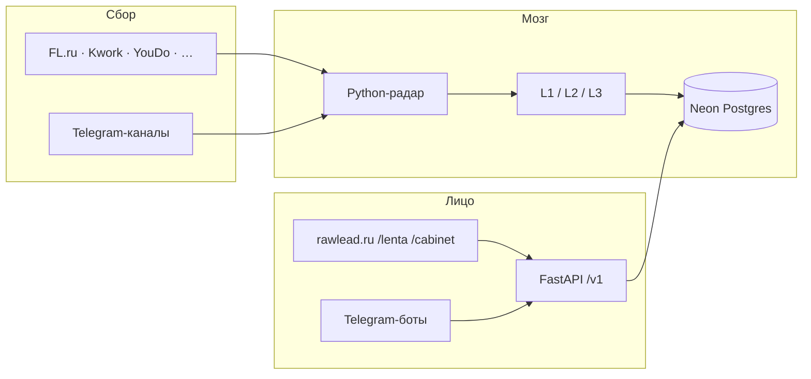

# RawLead — пакет для портфолио

**Версия:** 2026-06-18 · Lead Architect  
**Сайт:** [rawlead.ru](https://rawlead.ru) · **Репо:** Rode51/uisness (private)  
**Статус продукта:** MVP на VPS 24/7 · theme **1.19.20** · pricing **790 ₽/мес** (O105) · match push ✅ · quiz E2E ✅ · YouDo ingest ⏳ antibot watch (O268).

> Этот файл — **одна выжимка** для кейса, Habr, FL-профиля, labs-лендинга (`@lead-portfolio` читает § метрики и факты).  
> Живой prod → [`PROD_FACTS.md`](PROD_FACTS.md) · детали → [`PRODUCT_VISION.md`](../product/PRODUCT_VISION.md) · [`KAK_ETO_RABOTAET.md`](../../KAK_ETO_RABOTAET.md).

---

## Одной фразой (pitch)

**RawLead** — агрегатор фриланс-заказов с ИИ-модерацией и подбором по стеку: сам собирает лиды с бирж и Telegram, режет шум, показывает открытую ленту и для подписчика готовит **уникальный** черновик отклика — без ощущения «ещё одна биржа, где все бегут за одним заказом».

**Аудитория:** digital-фрилансеры (код, дизайн, маркетинг, тексты) — не «все подряд».

**Позиция наружу:** умный подбор · совместимость стека · лиды без шума.  
**Не позиционируем:** аукцион откликов, гонку «кто первый», копипасту одного текста на FL.

---

## Другие кейсы (labs.rawlead.ru)

| Проект | Статус | Для портфолио |
|--------|--------|---------------|
| **RawLead** | Live prod | Главный кейс — этот файл |
| **Crystal Debt** | MVP **paused** (сервер выключен) | Только скрины · подпись «paused» · **без** live demo |
| **Rode51 / labs** | Next.js в работе | Сайт-портфолио, не продукт |

---

## Какую боль решаем

| Боль | Как было | Что даёт RawLead |
|------|----------|------------------|
| Часы на лентах FL/Kwork | Ручной refresh, пропуск хороших заказов | Радар **~1 мин** опрашивает биржи, кладёт в облако |
| Шум и мусор в ленте | Всё подряд | **L1 ИИ:** score, теги, скрытие спама/рефералок |
| «Подходит ли мне?» | Читать ТЗ глазами | **% совместимости** по навыкам + сортировка |
| Писать отклик с нуля | 15–30 мин на заказ | **L2** один сильный каркас + **L3** персональная перефраза |
| Одинаковые отклики с сервиса | Бан на бирже | Uniquify **на каждого** юзера (не один текст всем) |
| Толпа на один hot-заказ | 50 похожих ботов | **O101:** лимит черновиков на заказ, при исчерпании — серая кнопка, карточка в ленте |

---

## Как устроен продукт (три слоя)

### Три канала для людей

| Канал | Где | Для кого | Деньги |
|-------|-----|----------|--------|
| **Dogfood** | @FLPARSINGBOT | Владелец — полный поток, в т.ч. сырой TG | Внутренний ROI |
| **Открытая лента** | `/lenta/` | Любой гость | Бесплатно |
| **ИИ-агент** | `/lenta/` + `/cabinet/` + TG | Зарегистрированный, подписка | **790 ₽/мес** (vision O105) · **300 ⭐** (код есть, GTM после gate) |

**Воронка:** лента → вход через Telegram → навыки → подписка → черновик + push по матчам.

---

## Источники ingest (что парсится, как, когда)

Канон env: `PUBLIC_FEED_SOURCES=fl,kwork,youdo,freelance_ru,freelancejob,pchyol` + TG из [`TG_PUBLIC_FEED_ALLOWLIST.txt`](../../ops/TG_PUBLIC_FEED_ALLOWLIST.txt).  
Полная таблица URL → [`PUBLIC_FEED_WEB_SOURCES.txt`](../../ops/PUBLIC_FEED_WEB_SOURCES.txt).

| Источник | В `/lenta/` | Технология | Частота | Прокси |
|----------|-------------|------------|---------|--------|
| **FL.ru** | ✅ | Playwright **Chromium** (browser fetch O99) | Каждый цикл (~1 мин, `RADAR_CONVEYOR`) | Primary pool, ban per-source |
| **Kwork** | ✅ | Playwright Chromium | Каждый цикл | Primary / `KWORK_PROXY_URLS` |
| **YouDo** | ✅ | **Camoufox (Firefox)** · subprocess worker | Каждый **4-й** цикл (`YOUDO_FETCH_EVERY_N_CYCLES=4`) | DC + RU carousel · **⏳** ServicePipe antibot watch |
| **Freelance.ru** | ✅ | HTTP `requests` | Secondary pool | Secondary |
| **FreelanceJob.ru** | ✅ | HTTP | Secondary | Secondary |
| **Пчёл.нет** | ✅ | HTTP | Secondary | Secondary |
| **Telegram** | ✅ whitelist | **Telethon** · 3 аккаунта (acc1/2/3) | Параллельно с циклом | `TG_PROXY` per acc (≠ биржи) |
| **vc.ru / Habr Career** | ⏸ | Код в `src/`, выкл | — | Job-ленты отложены |
| **Freelancehunt** | ⏸ | — | — | Отключён 2026-05-28 |

**TG allowlist:** **192** канала · join-очередь v4 (~**101** pending на 2026-06-17).

**Честно для кейса:** FL/Kwork стабильны на VPS · YouDo — отдельная инженерная задача (antibot ServicePipe, O254/O268 recovery).

---

## Путь заказа (от биржи до кнопки «Написать отклик»)

1. **Парсер** забирает карточку — FL/Kwork: **Playwright Chromium**; YouDo: **Camoufox**; secondary: HTTP.
2. **Словесный фильтр** (`FILTERS_SITE`) — стоп-слова по нише.
3. **Дедуп** — hash текста, не дублируем в базу и в TG.
4. **Neon** — заказ как лид: заголовок, ТЗ, бюджет, источник, время на бирже.
5. **L1 (лёгкая модель)** — теги, краткое summary, `ai_score`, видимость в публичной ленте, сложность 1–4 (O97).
6. **`/lenta/`** — все видимые лиды; гость может выбрать навыки → **сортировка** по совместимости (лента не пустеет).
7. **Подписчик** жмёт **«Написать отклик»** → **L2** (один shared draft на заказ, pro) → **L3** (flash rephrase, свой текст) → попадает в **inbox** `/cabinet/`.

**Две скорости ленты (O11):** гость — задержка **~30 мин** (`FEED_ANON_DELAY_MINUTES`); подписчик — сразу + **match push** в @rawlead_bot (`MATCH_PUSH=1`, порог у юзера).

---

## Функции и фичи — сводная таблица

### Уже на проде (rawlead.ru + VPS)

| Блок | Что сделано | Зачем |
|------|-------------|--------|
| **Ingest FL/Kwork** | Цикл ~1 мин, конвейер, hot L1 сразу после fetch | Свежая лента |
| **Ingest O99** | Browser-fetch + proxy cascade v2, 2 удара → ban per-source | Меньше 403, FL/Kwork живут |
| **Ingest YouDo** | Camoufox Firefox, DC/RU proxy, hard reset + teardown (O254) | Отдельный antibot-стек |
| **Ingest secondary** | Freelance.ru, FreelanceJob, Пчёл.нет — отдельный пул прокси | Шире база без убийства FL |
| **Telegram ingest** | 3 аккаунта Telethon, join-очередь v4, whitelist **192** канала | Заказы из чатов (не сырой шлак в /lenta/) |
| **Neon + API** | SaaS-ready: `user_id` везде, JWT после TG Login (O253) | Multi-user без переписывания БД |
| **L1** | Модерация, теги, 4 ниши, complexity, judge-gate | Шум не в ленте |
| **Match O82** | % совместимости **стека**, не «качество заказа»; без «Брать/Мимо» на карточке | Moat ≠ биржа |
| **Match push O265** | Пуш в @rawlead_bot при новом матче · 4 кнопки · rate limit | Подписчик не refresh'ит ленту |
| **Лента `/lenta/`** | 4 специализации, навыки (каталог 51+ тег), сортировка, mobile-first NEO UI | Витрина + SEO-потенциал |
| **Skill Tree O92–O94** | 4 ниши, ветки, expand parent→child, cap 12 тегов | Точный match без «каши» |
| **Quiz O218** | Playwright E2E j1–j7 desktop + mobile 390 | Gate перед рекламой |
| **ЛК `/cabinet/`** | Inbox откликов (не вторая лента), навыки, TG-аватар, Stars UI | «Мои отклики» |
| **L2 shared draft** | Один pro-черновик на лид при ingest/regen | Экономия API |
| **L3 uniquify O89** | Per-user rephrase, human-style промпт, anti-ai-smell | Не спамить биржу |
| **O90 lag** | `source_published_at`, отчёт ingest_lag | Видно «как быстро мы» |
| **O91 watchdog** | Пульс радара, TG-алерт, autorестарт | Не молчит ночью |
| **Прокси** | Primary/secondary/TG, SQLite bans, clear script | Ops без паники |
| **L1 scale** | 4 воркера, 2 ключа OpenRouter (RPM) | Очередь L1 не душит fetch |
| **VPS deploy** | `rawlead-radar` · `rawlead-api` · `rawlead-bot-poll` · nginx | ПК не нужен 24/7 |
| **Owner /ops/** | Статистика ingest funnel (только владелец) | Dogfood метрики |
| **Desktop пульт** | Tauri: старт/стоп Site+Legacy, логи, лампочки | Управление с ПК |
| **Тесты** | ingest, proxy, L3, O97, O218 quiz E2E — десятки pytest | Регрессии ловятся |

### В процессе (очередь)

| Блок | Статус |
|------|--------|
| **YouDo O268** | Ephemeral-first recovery · ingest watch 6h |
| **Regen L2 O200** | Прогон shared drafts + judge ≥70% |
| **PRE-PROD AI vault** | После O200 — один прогон «ИИ-тестировщика» |
| **Metrika smoke** | ⏸ owner |

### Запланировано (принято, код позже)

| Блок | Суть |
|------|------|
| **O101 — лимит черновиков** | На один заказ — **K** персональных L3 (старт с 10). Потом кнопка отклика **серая**, карточка **остаётся в ленте**. На карточке: «осталось N из 10». Анти-тык: лимит в час + слот только при нормальном match. **Не** аукцион (отказ O100). |
| **Stars live** | Живая оплата 300 ⭐ |
| **GTM / soft ads** | После gate качества (O218 ✅) |

### Сознательно не делаем

- Mobile app · Freelancehunt · аукцион на лиде (O100) · микросервисы · «50 уникальных шедевров» на один заказ без потолка.

---

## ИИ — три уровня (простыми словами)

| Уровень | Когда | Модель (дефолт кода) | Результат |
|---------|-------|----------------------|-----------|
| **L1** | Каждый новый лид | `google/gemini-2.5-flash-lite` | В ленту или в скрытые; теги; summary; complexity |
| **L2** | Один раз на заказ | premium (часто Claude Sonnet) | `reply_draft` — общий каркас отклика |
| **L3** | Первый клик подписчика | `google/gemini-2.5-flash` uniquify | Твой уникальный текст в inbox |
| **Judge** | QA-прогоны | `anthropic/claude-sonnet-4` | combined score, send_as_is |

**Провайдер:** OpenRouter · L2/judge часто через `OPENROUTER_HTTP_PROXY` (acc2).

**Качество:** цикл **judge** — отдельно L1/L2/L3. Промпты крутятся по отчёту, не «на глаз».

**Потолок L3 (продуктовый факт):** с одного base адекватно **~3–6** различимых откликов для биржи; дальше — каша. Поэтому O101, а не «крутить L3 до 50».

---

## Боты и Telegram

| Компонент | Роль |
|-----------|------|
| **@rawlead_bot** | Site prod: login, pay, draft callbacks, **match push** |
| **@FLPARSINGBOT** | Legacy dogfood: карточки владельцу (разбор + черновик) |
| **Telethon acc1/2/3** | Listen чатов, join v4, relay |
| **Bot API proxy** | `TG_PROXY_URL` / pool — отдельно от бирж |

---

## Сайт (WordPress + API)

| Страница | Назначение |
|----------|------------|
| **Главная** | Hero, как устроено, pricing-preview |
| **`/lenta/`** | Открытая лента, фильтры, карточки, навыки, quiz |
| **`/cabinet/`** | Вход TG, inbox откликов, skill tree, подписка |
| **`/pricing/`** | 790 ₽, trust strip, способы оплаты (O105) |
| **Тарифы / Как / FAQ** | Воронка (часть в footer, страницы по ROADMAP) |

**Дизайн:** NEO-BRUTALIST (Manrope, жёсткие рамки, жёлтый акцент) — Kadence child theme **1.19.20**.

**API:** FastAPI `GET /v1/feed`, `POST /v1/me/leads/{id}/draft`, теги, auth — WP **не** лезет в Postgres напрямую.

---

## Инфраструктура и надёжность

| Компонент | Решение |
|-----------|---------|
| **Хостинг** | Один VPS (rawlead.ru): WP + API + radars |
| **systemd** | `rawlead-radar` · `rawlead-api` · `rawlead-bot-poll` |
| **БД** | Neon Postgres (лиды, юзеры, теги, отклики) + SQLite локально (статус радара, баны прокси) |
| **Browser** | Playwright Chromium (FL/Kwork) · Camoufox Firefox (YouDo) |
| **Прокси** | Primary / secondary / TG — отдельные пулы |
| **Мониторинг** | Watchdog, ingest lag, Healthchecks.io, алерты @FLPARSINGBOT |
| **Деплой** | Python scripts SSH, theme zip, `.env.site` / `.env.legacy` |

---

## Как это делалось (для кейса «solo + AI»)

- **Владелец:** продукт, ops, приёмка; код — **Cursor** (Coder/Mechanic), регламент ролей: Lead Architect, Product, Design, Portfolio.
- **Стек:** Python 3.11 · FastAPI · psycopg · Neon · Telethon · Playwright · Camoufox · WordPress · OpenRouter · Telegram Bot API · Tauri 2 · nginx.
- **Принцип:** один процесс — одна задача; логи подробные; тесты на критичные контракты; **SaaS-ready схема** с первого дня.

### Цифры для слайда (июнь 2026)

| Метрика | Значение |
|---------|----------|
| Web-источники в ленте | **6** (FL, Kwork, YouDo, FR, FreelanceJob, Пчёл) + **TG** |
| TG allowlist | **192** канала |
| Цикл бирж (conveyor) | **~1 мин** |
| L1 воркеры | **4** · 2 ключа OpenRouter |
| Ниши / skill tree | **4** (dev · design · marketing · text) |
| Тегов в каталоге | **51+** |
| Theme (prod verify) | **1.19.20** |
| systemd на VPS | radar + api + bot-poll **active** |
| Тариф (vision) | **790 ₽/мес** · 300 ⭐ |

**Честно на слайде:** «MVP live; YouDo — hardening antibot; O200 regen L2 и Stars billing — следующий релиз».

---

## O101 — фича для портфолио (roadmap, ✅ решение владельца)

**Проблема:** 50 подписчиков × один hot-лид → L3 не сделает 50 живых разных откликов → спам на FL или мусор в тексте.

**Решение (не биржа):**

1. Считаем только **успешные** персональные черновики на заказ.
2. Лимит **K** (калибровка judge, ориентир 8–12).
3. Слоты кончились → кнопка **серая**, карточка **остаётся в ленте** (не аукцион).
4. У кого черновик уже есть — остаётся в **кабинете**.
5. На карточке: **«Осталось 3 из 10 черновиков»** — про ёмкость сервиса, не про «конкурентов».
6. Защита от тыкания: лимит черновиков **в час** + слот только при **нормальном match** по навыкам.

**Статус:** в документах ✅ · в коде — после O200 judge и E2E gate.

---

## Что показать в портфолио (чеклист материалов)

| Материал | Статус |
|----------|--------|
| Скрин `/lenta/` с % совместимости и карточкой | Сделать на prod |
| Скрин `/cabinet/` inbox + skill tree | Сделать |
| Скрин TG @FLPARSINGBOT (dogfood) | Есть у владельца |
| Схема «биржа → ИИ → лента → отклик» | Этот файл § диаграмма |
| 1 абзац pitch | § «Одной фразой» |
| O101 как «продуктовое мышление» | § O101 |
| Crystal Debt | Скрины only · MVP paused |
| labs.rawlead.ru | `@lead-portfolio` + Claude Code |

**Для labs:** без цены и Stars на кейсе RawLead — портфолио, не реклама (`LEAD_PORTFOLIO_PROMPT.md`).

---

## Ссылки внутри репозитория

| Тема | Файл |
|------|------|
| Prod снимок | [`PROD_FACTS.md`](PROD_FACTS.md) |
| Vision | [`../product/PRODUCT_VISION.md`](../product/PRODUCT_VISION.md) |
| Как работает | [`../../KAK_ETO_RABOTAET.md`](../../KAK_ETO_RABOTAET.md) |
| Статус сейчас | [`STATUS.md`](STATUS.md) |
| Источники ленты | [`../../ops/PUBLIC_FEED_WEB_SOURCES.txt`](../../ops/PUBLIC_FEED_WEB_SOURCES.txt) |
| Архитектура | [`../architect/ARCHITECTURE.md`](../architect/ARCHITECTURE.md) |
| Решения владельца | [`../architect/OWNER_INTENT.md`](../architect/OWNER_INTENT.md) § O89, O101 |
| UI-спека | [`../../design/wp/feed-cabinet-mvp.md`](../../design/wp/feed-cabinet-mvp.md) |
| Портфолио сайт | [`../portfolio/README.md`](../portfolio/README.md) |
| Схема БД | [`../architect/NEON_SCHEMA.md`](../architect/NEON_SCHEMA.md) |
| Деплой | [`../../ops/DEPLOY_VPS.md`](../../ops/DEPLOY_VPS.md) |

---

_Обновлять после крупных релизов (ingest, лента, O101, Stars). Lead Architect._
