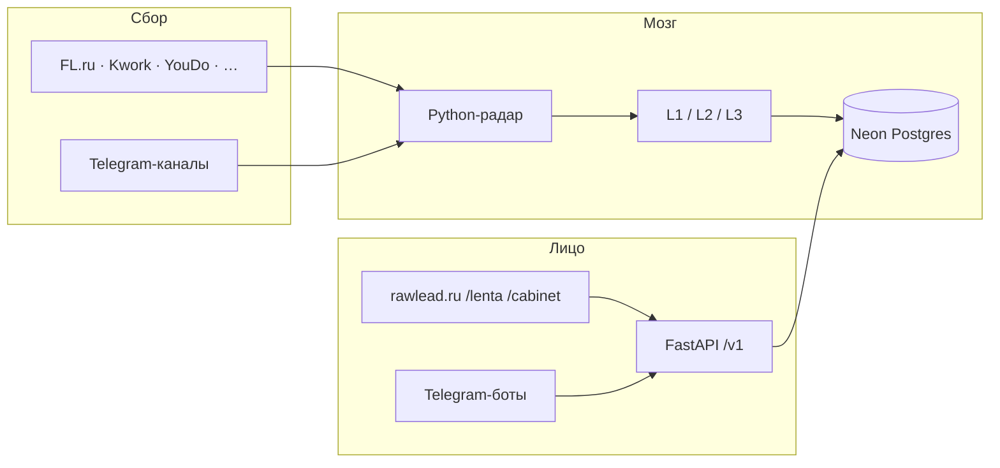

# RawLead — пакет для портфолио

**Версия:** 2026-06-03 · Lead Architect  
**Сайт:** [rawlead.ru](https://rawlead.ru) · **Репо:** Rode51/uisness (private)  
**Статус продукта:** MVP на VPS, theme **1.18.1**, O105 pricing 790 ₽ live · judge/E2E/vault в работе.

> Этот файл — **одна выжимка** для кейса, Habr, FL-профиля, labs-лендинга. Детали живут в [`PRODUCT_VISION.md`](../product/PRODUCT_VISION.md) и [`KAK_ETO_RABOTAET.md`](../../KAK_ETO_RABOTAET.md).

---

## Одной фразой (pitch)

**RawLead** — агрегатор фриланс-заказов с ИИ-модерацией и подбором по стеку: сам собирает лиды с бирж и Telegram, режет шум, показывает открытую ленту и для подписчика готовит **уникальный** черновик отклика — без ощущения «ещё одна биржа, где все бегут за одним заказом».

**Аудитория:** digital-фрилансеры (код, дизайн, маркетинг, тексты) — не «все подряд».

**Позиция наружу:** умный подбор · совместимость стека · лиды без шума.  
**Не позиционируем:** аукцион откликов, гонку «кто первый», копипасту одного текста на FL.

---

## Какую боль решаем

| Боль | Как было | Что даёт RawLead |
|------|----------|------------------|
| Часы на лентах FL/Kwork | Ручной refresh, пропуск хороших заказов | Радар **~1 мин** опрашивает биржи, кладёт в облако |
| Шум и мусор в ленте | Всё подряд | **L1 ИИ:** score, теги, скрытие спама/рефералок |
| «Подходит ли мне?» | Читать ТЗ глазами | **% совместимости** по навыкам + сортировка |
| Писать отклик с нуля | 15–30 мин на заказ | **L2** один сильный каркас + **L3** персональная перефраза |
| Одинаковые отклики с сервиса | Бан на бирже | Uniquify **на каждого** юзера (не один текст всем) |
| Толпа на один hot-заказ | 50 похожих ботов | **O101 (в работе):** лимит черновиков на заказ, карточка уходит из ленты |

---

## Как устроен продукт (три слоя)

### Три канала для людей

| Канал | Где | Для кого | Деньги |
|-------|-----|----------|--------|
| **Dogfood** | @FLPARSINGBOT | Владелец — полный поток, в т.ч. сырой TG | Внутренний ROI |
| **Открытая лента** | `/lenta/` | Любой гость | Бесплатно |
| **ИИ-агент** | `/lenta/` + `/cabinet/` + TG | Зарегистрированный, подписка | **300 ⭐/мес** (код Stars есть, GTM после E2E) · vision **590–990 ₽** |

**Воронка:** лента → вход через Telegram → навыки → подписка → черновик + push по матчам.

---

## Путь заказа (от биржи до кнопки «Написать отклик»)

1. **Парсер** забирает карточку (HTTP или **браузер Playwright** — обход антибота FL/Kwork).
2. **Словесный фильтр** (`FILTERS_SITE`) — стоп-слова по нише.
3. **Дедуп** — hash текста, не дублируем в базу и в TG.
4. **Neon** — заказ как лид: заголовок, ТЗ, бюджет, источник, время на бирже.
5. **L1 (лёгкая модель)** — теги, краткое summary, `ai_score`, видимость в публичной ленте, сложность 1–4 (O97).
6. **`/lenta/`** — все видимые лиды; гость может выбрать навыки → **сортировка** по совместимости (лента не пустеет).
7. **Подписчик** жмёт **«Написать отклик»** → **L2** (один shared draft на заказ, pro) → **L3** (flash-lite, свой текст) → попадает в **inbox** `/cabinet/`.

**Две скорости ленты (O11):** гость видит заказы с задержкой ~15 мин; платный — сразу.

---

## Функции и фичи — сводная таблица

### Уже на проде (rawlead.ru + VPS)

| Блок | Что сделано | Зачем |
|------|-------------|--------|
| **Ingest FL/Kwork** | Цикл ~1 мин, конвейер, hot L1 сразу после fetch | Свежая лента |
| **Ingest O99** | Browser-fetch + proxy cascade v2, 2 удара → ban per-source | Меньше 403, FL/Kwork живут |
| **Ingest secondary** | YouDo, Freelance.ru, FreelanceJob, Пчёл.нет — отдельный пул прокси | Шире база без убийства FL |
| **Telegram ingest** | 3 аккаунта Telethon, join-очередь, whitelist в публичную ленту | Заказы из чатов (не сырой шлак в /lenta/) |
| **Neon + API** | SaaS-ready: `user_id` везде, JWT после TG Login | Multi-user без переписывания БД |
| **L1** | Модерация, теги, 4 ниши, complexity, judge-gate | Шум не в ленте |
| **Match O82** | % совместимости **стека**, не «качество заказа»; без «Брать/Мимо» на карточке | Moat ≠ биржа |
| **Лента `/lenta/`** | 4 специализации, навыки (каталог 51+ тег), сортировка, mobile-first NEO UI | Витрина + SEO-потенциал |
| **Skill Tree O92–O94** | 4 ниши, ветки, expand parent→child, cap 12 тегов | Точный match без «каши» |
| **ЛК `/cabinet/`** | Inbox откликов (не вторая лента), навыки, TG-аватар, Stars UI | «Мои отклики» |
| **L2 shared draft** | Один pro-черновик на лид при ingest/regen | Экономия API |
| **L3 uniquify O89** | Per-user rephrase, human-style промпт, anti-ai-smell | Не спамить биржу |
| **O90 lag** | `source_published_at`, отчёт ingest_lag | Видно «как быстро мы» |
| **O91 watchdog** | Пульс радара, TG-алерт, autorестарт | Не молчит ночью |
| **Прокси** | Primary/secondary, SQLite bans, clear script | Ops без паники |
| **L1 scale** | 4 воркера, 2 ключа OpenRouter (RPM) | Очередь L1 не душит fetch |
| **VPS deploy** | WP + API + systemd radars 24/7 | ПК не нужен 24/7 |
| **Owner /ops/** | Статистика ingest (только владелец) | Dogfood метрики |
| **Desktop пульт** | Tauri: старт/стоп Site+Legacy, логи, лампочки | Управление с ПК |
| **Тесты** | ingest, proxy, L3 style, O97, audit — десятки pytest | Регрессии ловятся |

### В процессе (второй чат / очередь)

| Блок | Статус |
|------|--------|
| **Regen L2** | Прогон shared drafts на свежих лидах + judge |
| **E2E Playwright** | Smoke ленты/ЛК |
| **PRE-PROD AI vault** | После E2E — один прогон «ИИ-тестировщика» |

### Запланировано (принято, код позже)

| Блок | Суть |
|------|------|
| **O101 — лимит черновиков** | На один заказ — **K** персональных L3 (старт с 10, число подберёт judge). Потом карточка **исчезает из ленты**. На карточке: «осталось N слотов». Анти-тык: лимит в час на человека + слот только при нормальном match. **Не** аукцион и **не** «N фрилансеров смотрят» (отказ от Светофора O100). |
| **Stars live** | Живая оплата 300 ⭐ |
| **Match push** | Пуш в @rawlead_bot при новом матче (порог у юзера) |
| **GTM / soft ads** | После gate качества |

### Сознательно не делаем

- Mobile app · Freelancehunt · аукцион на лиде (O100) · микросервисы · «50 уникальных шедевров» на один заказ без потолка.

---

## ИИ — три уровня (простыми словами)

| Уровень | Когда | Модель (типично) | Результат |
|---------|-------|------------------|-----------|
| **L1** | Каждый новый лид | Flash-lite / дешёвая | В ленту или в скрытые; теги; summary; complexity |
| **L2** | Один раз на заказ | Gemini pro | `reply_draft` — общий каркас отклика |
| **L3** | Первый клик подписчика | Flash-lite rephrase | Твой уникальный текст в inbox |

**Качество:** цикл **judge** (Sonnet) — combined score, send_as_is, отдельно L1/L2/L3. Промпты крутятся по отчёту, не «на глаз».

**Потолок L3 (продуктовый факт):** с одного base адекватно **~3–6** различимых откликов для биржи; дальше — каша. Поэтому O101, а не «крутить L3 до 50».

---

## Сайт (WordPress + API)

| Страница | Назначение |
|----------|------------|
| **Главная** | Hero, как устроено, pricing-preview |
| **`/lenta/`** | Открытая лента, фильтры, карточки, навыки |
| **`/cabinet/`** | Вход TG, inbox откликов, skill tree, подписка |
| **Тарифы / Как / FAQ** | Воронка (часть в footer, страницы по ROADMAP) |

**Дизайн:** NEO-BRUTALIST (Manrope, жёсткие рамки, жёлтый акцент) — Kadence child theme, версии 1.14–1.17.x.

**API:** FastAPI `GET /v1/feed`, `POST /v1/me/leads/{id}/draft`, теги, auth — WP **не** лезет в Postgres напрямую.

---

## Инфраструктура и надёжность

| Компонент | Решение |
|-----------|---------|
| **Хостинг** | Один VPS (rawlead.ru): WP + API + radars |
| **БД** | Neon Postgres (лиды, юзеры, теги, отклики) + SQLite локально (статус радара, баны прокси) |
| **Прокси** | Пулы под биржи / TG / secondary; browser fetch |
| **Мониторинг** | Watchdog timer, ingest lag report, health API |
| **Деплой** | Python scripts SSH, theme zip, `.env.site` / `.env.legacy` |

---

## Как это делалось (для кейса «solo + AI»)

- **Владелец:** продукт, ops, приёмка; код — **Cursor** (Composer/Coder), регламент ролей: Lead Architect, Coder, Mechanic, Product, Design.
- **Стек:** Python 3.11 · FastAPI · psycopg · Telethon · Playwright · WordPress · OpenRouter · Telegram Bot API · Tauri 2.
- **Принцип:** один процесс — одна задача; логи подробные; тесты на критичные контракты; **SaaS-ready схема** с первого дня.

**Цифры для слайда (июнь 2026):**

- Источники: **FL, Kwork, TG** + **4 secondary** парсера.
- Цикл бирж на VPS: **~50 с** при живом пуле.
- L1: **4 воркера**, 2 API-ключа.
- Theme prod: **1.18.1** (O105-WP: 790 ₽, trust strip, `/pricing/` payment rows).
- Ingest: browser-first O99 на VPS ✅.

---

## O101 — фича для портфолио (roadmap, ✅ решение владельца)

**Проблема:** 50 подписчиков × один hot-лид → L3 не сделает 50 живых разных откликов → спам на FL или мусор в тексте.

**Решение (не биржа):**

1. Считаем только **успешные** персональные черновики на заказ.
2. Лимит **K** (калибровка judge, ориентир 8–12).
3. Слоты кончились → заказ **пропадает из `/lenta/`** для новых.
4. У кого черновик уже есть — остаётся в **кабинете**.
5. На карточке: **«Осталось 3 из 10 черновиков»** — про ёмкость сервиса, не про «конкурентов».
6. Защита от тыкания: лимит черновиков **в час** + слот только при **нормальном match** по навыкам.

**Статус:** в документах ✅ · в коде — после E2E и прогона judge для K.

---

## Что показать в портфолио (чеклист материалов)

| Материал | Статус |
|----------|--------|
| Скрин `/lenta/` с % совместимости и карточкой | Сделать на prod |
| Скрин `/cabinet/` inbox + skill tree | Сделать |
| Скрин TG @FLPARSINGBOT (dogfood) | Есть у владельца |
| Схема «биржа → ИИ → лента → отклик» | Этот файл § диаграмма |
| 1 абзац pitch | § «Одной фразой» |
| O101 как «продуктовое мышление» | § O101 |
| GitHub / labs | После обновления README · P-PORTFOLIO v2 (Design backlog) |

**Честно на слайде:** «MVP, идёт hardening откликов (judge + regen); биллинг Stars и O101 — следующий релиз».

---

## Ссылки внутри репозитория

| Тема | Файл |
|------|------|
| Vision | [`../product/PRODUCT_VISION.md`](../product/PRODUCT_VISION.md) |
| Как работает | [`../../KAK_ETO_RABOTAET.md`](../../KAK_ETO_RABOTAET.md) |
| Статус сейчас | [`STATUS.md`](STATUS.md) |
| Решения владельца | [`../architect/OWNER_INTENT.md`](../architect/OWNER_INTENT.md) § O89, O101 |
| UI-спека | [`../../design/wp/feed-cabinet-mvp.md`](../../design/wp/feed-cabinet-mvp.md) |
| Схема БД | [`../architect/NEON_SCHEMA.md`](../architect/NEON_SCHEMA.md) |
| Деплой | [`../../ops/DEPLOY_VPS.md`](../../ops/DEPLOY_VPS.md) |

---

_Обновлять после крупных релизов (ingest, лента, O101, Stars). Lead Architect._
