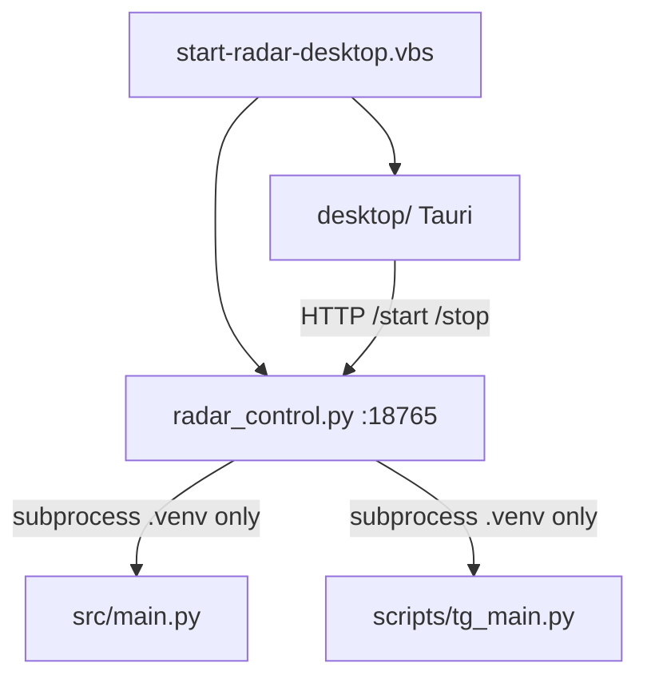

# Карта проекта — для всех AI

**Одна точка входа.** Детали — по ссылкам, не копировать сюда целиком.

## Навигация — перед любой работой

| Шаг | Кто | Действие |
|-----|-----|----------|
| 0 | **Все AI** | [`docs/README.md`](../README.md) — дерево папок `docs/` |
| 1 | **Все AI** | **Этот файл** (`PROJECT_MAP.md`) — зоны, процессы, «куда идти» |
| 2 | **Все AI** | Файл роли из таблицы «Кому» ниже — **не** обходить repo наугад |
| 3 | **Lead Architect** | После приёмки Coder/Mechanic/Product/Design — **обновить эту карту**, если сменились пути, зоны или lock |

**Lead Architect** ведёт чистоту repo: дедуп docs, `git commit` / `git push` (по просьбе владельца). Coder/Mechanic/Designer **не коммитят** без явной просьбы Lead.

---

## Агентам: куда смотреть и куда **не** писать

| Нужно | Единственный канон | Не дублировать в |
|-------|-------------------|------------------|
| Vision / ставка B | [`product/PRODUCT_VISION.md`](../product/PRODUCT_VISION.md) **v0.12** | ROADMAP, STATUS, чат |
| Фазы «сейчас» | [`architect/ROADMAP.md`](../architect/ROADMAP.md) | FOR_YOU, TASKS простынёй |
| Мысли / решения владельца | [`architect/OWNER_INTENT.md`](../architect/OWNER_INTENT.md) | чат, дубли в FOR_YOU |
| Активный план Product | [`product/LEAD_PRODUCT_PROMPT.md`](../product/LEAD_PRODUCT_PROMPT.md) | новый `TZ_*.md` |
| Активный план Marketing | [`marketing/LEAD_MARKETING_PROMPT.md`](../marketing/LEAD_MARKETING_PROMPT.md) | ads copy в чат |
| WP → Next handoff (O280) | [`architect/WP_TO_NEXT_HANDOFF.md`](../architect/WP_TO_NEXT_HANDOFF.md) · [`migration/README.md`](../../migration/README.md) | Claude Code **`rawlead-next/`** · до ads |
| Активный план Portfolio | [`portfolio/LEAD_PORTFOLIO_PROMPT.md`](../portfolio/LEAD_PORTFOLIO_PROMPT.md) · Claude: [`portfolio/CLAUDE_CODE_HANDOFF.md`](../portfolio/CLAUDE_CODE_HANDOFF.md) | P288 legacy · `design/portfolio/refs/` |
| Задача Coder | [`architect/CODER_PROMPT.md`](../architect/CODER_PROMPT.md) hot · [`archive/CODER_PROMPT_ARCHIVE.md`](../archive/CODER_PROMPT_ARCHIVE.md) | TASKS, чат (только копипаст) |
| Задача Designer | [`design/DESIGNER_PROMPT.md`](../design/DESIGNER_PROMPT.md) hot · [`archive/DESIGNER_PROMPT_ARCHIVE.md`](../archive/DESIGNER_PROMPT_ARCHIVE.md) | LEAD_DESIGN архив |
| План Lead Designer | [`design/LEAD_DESIGN_PROMPT.md`](../design/LEAD_DESIGN_PROMPT.md) | |
| Регламент Design | [`design/LEAD_DESIGN.md`](../design/LEAD_DESIGN.md) | **кто какой файл читает** |
| WP канон / brief | `docs/design/wp/REFERENCE.md` · `wave-*-brief.md` | DESIGN_BRIEF (не WP) |
| Снимок / блокеры | [`STATUS.md`](STATUS.md) hot · [`PROD_FACTS.md`](PROD_FACTS.md) **prod snapshot** · [`archive/STATUS_ARCHIVE.md`](../archive/STATUS_ARCHIVE.md) | не копировать ТЗ |
| Очередь | [`TASKS.md`](TASKS.md) — одна строка на трек | FOR_YOU |
| Шаги владельца | [`../FOR_YOU.md`](../FOR_YOU.md) | TASKS, STATUS |
| Поломка | [`../problems/`](../problems/) один файл | новый md в `team/` |
| Устаревшее | [`archive/`](../archive/), [`team/archive/`](archive/) | не обновлять |

| Роль | Пишет | Не пишет |
|------|-------|----------|
| **Lead Product** | `PRODUCT_VISION`, `LEAD_PRODUCT_PROMPT` | `ROADMAP`, `CODER_PROMPT`, `FOR_YOU` |
| **Lead Marketing** | `LEAD_MARKETING_PROMPT`, `LEAD_MARKETING.md` | `src/`, `CODER_PROMPT`, `PRODUCT_VISION` |
| **Lead Designer** | `LEAD_DESIGN*`, `DESIGN_SYSTEM`, `docs/design/wp/` | `wordpress/`, `CODER_PROMPT`, WP в `DESIGN_BRIEF` |
| **Lead Portfolio** | `LEAD_PORTFOLIO*`, `docs/design/portfolio/` | `portfolio/` код · `src/` · `CODER_PROMPT` · Claude CLI |
| **Lead Architect** | `ROADMAP`, `TASKS`, `STATUS`, `CODER_PROMPT`, карты | `src/`, commit чужих без сдачи |
| **Coder** | файлы из § «Файлы» в `CODER_PROMPT` + `STATUS` | `DESIGNER_PROMPT`, `LEAD_DESIGN_PROMPT`, design docs |
| **Designer** | `docs/design/**`, § активная в `DESIGNER_PROMPT` | `LEAD_DESIGN_PROMPT`, архив §, `src/`, `wordpress/`, WP в `DESIGN_BRIEF` |
| **Mechanic** | `docs/problems/*` + код из тикета; модель **Gemini 2.5 (~2M)**; широкий разбор при инциденте | `TASKS`, `FOR_YOU`, vision, активный `CODER_PROMPT` (без дубля) |

**Отменено v0.9 (не возвращать в код/docs):** `contour` owner/saas · демо `/cabinet` на JSON · [`../archive/SOURCES_SAAS.md`](../archive/SOURCES_SAAS.md)

**Регламент docs (каноны, без дублей):** [`DOCS_ARCHITECTURE.md`](DOCS_ARCHITECTURE.md)

**Визуально (для тебя):** mermaid ниже в § «Процессы на ПК» · PNG: [`../../design/rawlead/project-map-owner.png`](../../design/rawlead/project-map-owner.png) · redirect: [`PROJECT_MAP_VISUAL.md`](PROJECT_MAP_VISUAL.md)

## Папки `docs/team/`

| Папка | Кто | Содержание |
|-------|-----|------------|
| **`common/`** | все | PROJECT_MAP, **PROD_FACTS**, STATUS, TASKS, DOCS_ARCHITECTURE, MCP |
| **`architect/`** | Lead Architect, Coder (промпт) | ROADMAP, CODER_PROMPT, ARCHITECTURE, CODE_STRUCTURE, TZ_*, NEON |
| **`product/`** | Lead Product | PRODUCT_VISION, LEAD_PRODUCT_PROMPT |
| **`marketing/`** | Lead Marketing | LEAD_MARKETING*, кампании, UTM |
| **`design/`** | Lead Designer, Designer | LEAD_DESIGN*, DESIGN_SYSTEM, DESIGNER_PROMPT |
| **`portfolio/`** | Lead Portfolio, Claude Code | LEAD_PORTFOLIO*, refs mood, CLAUDE_CODE_HANDOFF |
| **`archive/`** | — | `*_ARCHIVE.md`, TASKS_HISTORY (не обновлять старое) |
| **`templates/`** | Lead | **cursor-team-kit** — bootstrap других проектов |

| Кому | Первый файл |
|------|-------------|
| **Lead Product** | `.cursor/rules/lead-product.mdc` § онбординг **A+B** → `product/PRODUCT_VISION.md` → `LEAD_PRODUCT_PROMPT.md` |
| **Lead Marketing** | `.cursor/rules/lead-marketing.mdc` § онбординг **A+B** → `PRODUCT_VISION` → `LEAD_MARKETING_PROMPT.md` |
| **Lead Architect** | `.cursor/rules/lead-architect.mdc` § онбординг **A+B** → `PROD_FACTS` → `PRODUCT_VISION` v0.12 → `STATUS` → `CODER_PROMPT` |
| **Lead Designer** | `.cursor/rules/lead-designer.mdc` § онбординг **A+B** → `feed-cabinet-mvp.md` → `LEAD_DESIGN_PROMPT.md` |
| **Lead Portfolio** | `.cursor/rules/lead-portfolio.mdc` § **A+B+C** → `LEAD_PORTFOLIO_PROMPT.md` · Claude: `CLAUDE_CODE_HANDOFF.md` |
| **Coder** | **`architect/CODER_PROMPT.md`** → § в шапке · **не** архив |
| **Mechanic** | `docs/problems/` → § «Зоны» |
| **Designer** | `design/DESIGNER_PROMPT.md` § **→ Сейчас** → `docs/design/wp/` |
| **Владелец** | `FOR_YOU.md` |

**Lead обновляет** эту карту после каждой сдачи Coder/Mechanic, если менялись процессы, файлы или lock-правила.  
**Coder не правит** этот файл.

---

## MCP (внешние tools)

Канон: **[`MCP_POOL.md`](MCP_POOL.md)** — Perplexity, Playwright, Firecrawl, Glif, **Recraft**, Chrome; установка в `~/.cursor/mcp.json`.

| Если в сессии нет MCP, а нужен веб/скрейп/медиа | Сказать владельцу: включить сервер из `MCP_POOL.md` |
| Ключи API | Только у владельца, не в repo |

---

## Процессы на ПК (не плодить)



| Правило | Зачем |
|---------|--------|
| **Один venv** | `.venv\Scripts\python.exe` — не системный Python |
| **2 worker'а max** | `main.py` + `tg_main.py` |
| **Lock** | `data/.tg_main.lock`, `data/.radar_desktop.lock` |
| **Дубли** | `src/process_guard.py` — убить чужие main/tg_main перед стартом |
| **Join** | только **внутри** `tg_main` (`TG_JOIN_IN_TG_MAIN=1`) |

Запуск: [`../ops/DESKTOP_LAUNCH.md`](../ops/DESKTOP_LAUNCH.md) · схема: [`ARCHITECTURE.md`](../architect/ARCHITECTURE.md)

---

## Два контура (legacy / site) — решение владельца 2026-05-27

**Один repo, два независимых запуска.** Не «ветка git = проект», а **профиль окружения** `RADAR_PROFILE=legacy|site`.

```text
┌──────────────────────── LEGACY (заморожен) ────────────────────────┐
│ .env.legacy          │ TELEGRAM_BOT_TOKEN = старый бот               │
│ FILTERS_LEGACY.md    │ OpenRouter key = legacy (твой текущий)        │
│ radar_legacy.log     │ Пульт :18765  ·  **consumer** (без main бирж)   │
│ ИИ                   │ legacy ИИ → @FLPARSINGBOT (из Neon Site)        │
│ TG acc               │ нет (RADAR_TG_ENABLED=0)                      │
└──────────────────────────────────────────────────────────────────────┘

┌──────────────────────── SITE (новый продукт) ────────────────────────┐
│ .env.site            │ @rawlead_bot                                  │
│ FILTERS_SITE.md      │ OpenRouter site (L1+L2)                       │
│ radar_site.log       │ Пульт :18775  ·  **единственный** main + tg   │
│ ИИ                   │ L1 → /lenta/  ·  L2 → подписчики              │
│ TG acc               │ acc1–acc3 + join                              │
│ WP                   │ /lenta/ + /cabinet/ + Login Widget            │
└──────────────────────────────────────────────────────────────────────┘
```

| Что | LEGACY | SITE |
|-----|--------|------|
| Фильтры Python | `docs/ops/FILTERS_LEGACY.md` | `docs/ops/FILTERS_SITE.md` |
| Промпты ИИ | `AI.md` § legacy (как сейчас) | `AI.md` § L1/L2 |
| Neon | **читает** (consumer + SQLite дедуп бота) | **пишет** — единственный парсер бирж |
| Кто правит | **Mechanic** только по тикету | **Coder** § S-SPLIT |

**Агентам:** в `CODER_PROMPT` всегда указан профиль. **LEGACY не менять** при задаче SITE. См. § S-SPLIT.

---

## Зоны — кто что трогает

| Зона | Пути | Кто правит | Когда |
|------|------|------------|--------|
| **Пульт UI** | `desktop/src/main.ts`, `desktop/src/styles/` | Coder | только `CODER_PROMPT` § пульт |
| **Пульт API** | `scripts/radar_control.py` | Coder | старт/стоп, логи, process_guard |
| **Биржи** | `src/main.py`, `src/fl_parser.py`, `src/kwork_parser.py` | Coder | по промпту |
| **TG runtime** | `scripts/tg_main.py`, `src/tg_monitor.py` | Coder / Mechanic | промпт / тикет |
| **TG join** | `src/tg_join_*.py`, `docs/ops/TG_JOIN_QUEUE.csv` | Coder | промпт; CSV — Lead + import |
| **Pipeline** | `src/lead_pipeline.py`, `src/filters.py`, `src/ai_analyze.py` | Coder | промпт |
| **Конфиг** | `src/config.py` | Coder | минимальный diff |
| **Guard** | `src/process_guard.py`, `src/health_check.py` | Coder / Mechanic | дубли, lock |
| **Данные ПК** | `data/*` | **никто из AI** | владелец / runtime |
| **Секреты** | `.env` | **владелец** | — |
| **Product docs** | `LEAD_PRODUCT*`, `PRODUCT_VISION`, `ROADMAP` | Lead Product | план с владельцем |
| **Design docs** | `LEAD_DESIGN*`, `DESIGN_SYSTEM`, `docs/design/` | Lead Designer | план с владельцем |
| **Инженерия docs** | `CODER_PROMPT` hot, `TASKS`, `STATUS` hot | Lead Architect | после сдачи → архив |
| **Docs ops** | `docs/ops/*`, `FOR_YOU.md` | Lead Architect + владелец | |
| **Тикеты** | `docs/problems/*` | Mechanic | один инцидент |
| **WP** | `wordpress/rawlead-kadence-child/` | Coder | `CODER_PROMPT` § WP |

**Coder:** правит **только** файлы из таблицы «Файлы» в активном `CODER_PROMPT.md`. Вне списка — стоп, спросить Lead.

**Mechanic:** `src/`, `tests/`, `scripts/` — только файлы из тикета «Решение».

---

## Модули `src/` (куда не лезть без причины)

Полная таблица: [`../architect/CODE_STRUCTURE.md`](../architect/CODE_STRUCTURE.md).

| Симптом / задача | Смотреть сначала |
|------------------|------------------|
| ✕ пульт, ▶/■ | `desktop/src/main.ts`, `radar_control.py` |
| Дубли python | `process_guard.py`, `radar_control.py` `/start` |
| TG не читает чат | `telethon_chat_ids_accN.txt`, `tg_monitor.py`, дубли tg_main |
| Join | `tg_join_runner.py`, `TG_JOIN_QUEUE.csv` |
| Бот молчит | VPN, proxy, `tg_smoke.py`, `telegram_notify.py` |
| Биржи FL/Kwork 403, pool exhausted | `exchange_proxy.py`, `exchange_browser_fetch.py`, `.env` proxy URLs |
| Secondary 0 лидов (YouDo/FR/job/Пчёл) | `youdo_parser.py`, `freelance_*_parser.py`, `pchyol_parser.py` · § **O63-FIX** |
| Фильтр / ИИ | `filters.py`, `lead_pipeline.py`, `docs/ops/FILTERS.md` |

---

## Промпт Coder — обязательный блок

Каждый `CODER_PROMPT.md` **должен** содержать:

```markdown
## Файлы (можно трогать)
- path/to/file — зачем

## Файлы (не трогать)
- всё остальное
```

Lead проверяет перед выдачей промпта. Coder сверяется **до** первой правки.

---

## Чеклист Lead (после сдачи)

- [ ] `STATUS.md` совпадает с кодом
- [ ] `PROJECT_MAP.md` — если новый процесс/файл/lock
- [ ] [`ROADMAP.md`](../architect/ROADMAP.md) — если сменилась фаза, блокер или приоритет «сейчас»
- [ ] `ARCHITECTURE.md` — если изменилась схема процессов
- [ ] `CODE_STRUCTURE.md` — если новый модуль в `src/`
- [ ] `KAK_ETO_RABOTAET.md` — если изменилось поведение для владельца

---

## Связанные документы (не дублировать)

| Документ | Содержание |
|----------|------------|
| [`ARCHITECTURE.md`](../architect/ARCHITECTURE.md) | mermaid, SaaS target, поток данных |
| [`CODE_STRUCTURE.md`](../architect/CODE_STRUCTURE.md) | файлы `src/` и `scripts/` |
| [`LEAD.md`](../architect/LEAD.md) § «Файлы без пересечений» | один источник правды |
| [`SCALE.md`](SCALE.md) | цикл Lead → Coder → приёмка |
| [`PRODUCT_VISION.md`](../product/PRODUCT_VISION.md) | зачем продукт, контуры |

---

_Ведёт Lead · 2026-06-03 · обновлять при смене процессов/зон_
