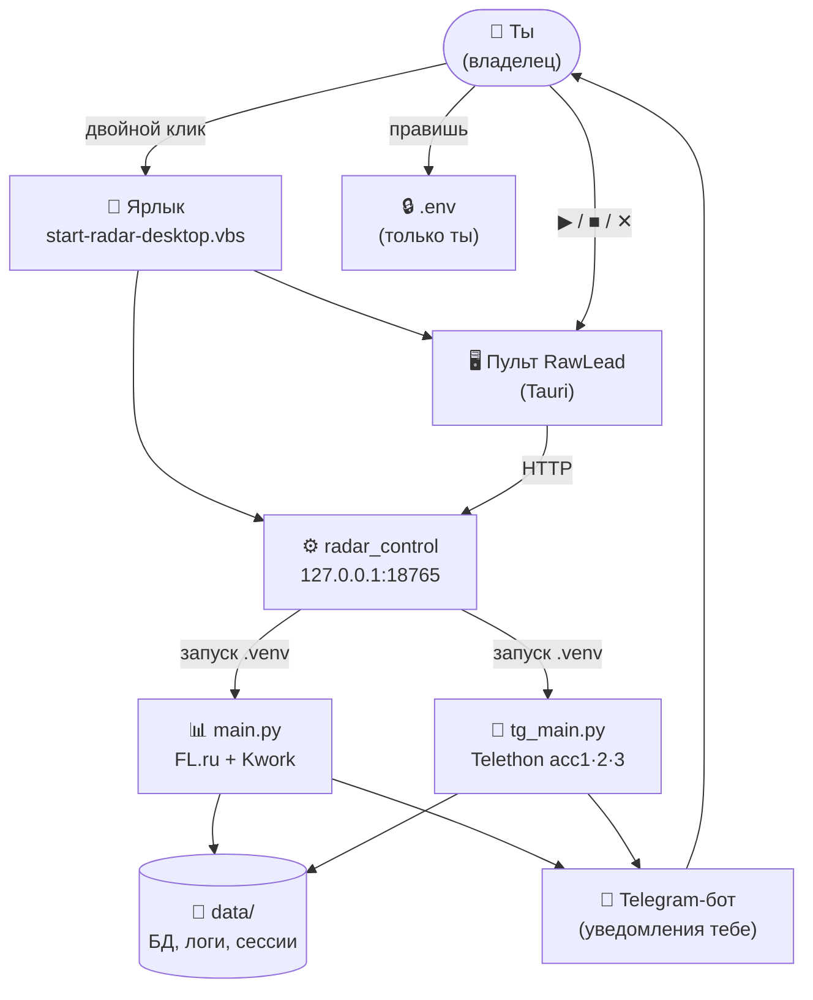
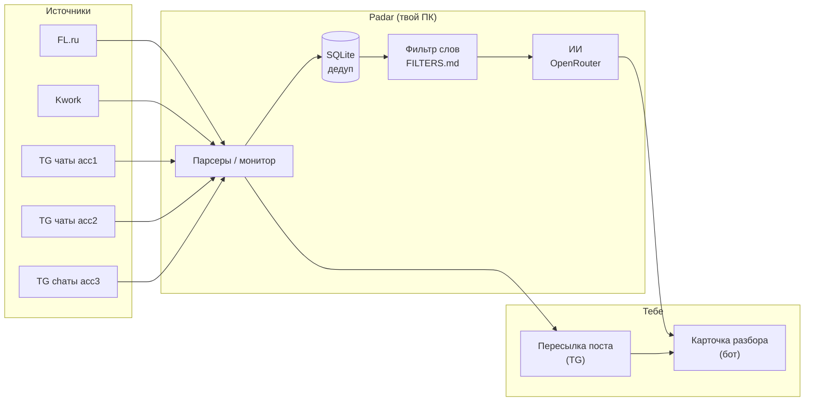
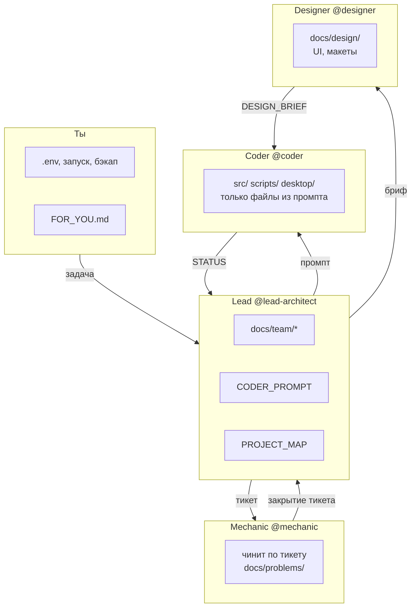
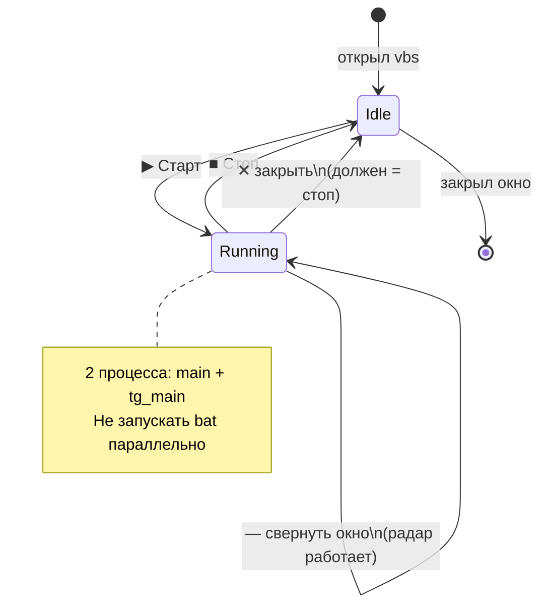

# Карта RawLead — визуально (для владельца)

**Как смотреть:**

| Формат | Файл |
|--------|------|
| **Картинка (Designer ✅)** | [`../design/rawlead/project-map-owner.png`](../design/rawlead/project-map-owner.png) — открой в проводнике |
| **Mermaid в Cursor** | Preview этого файла (`Ctrl+Shift+V`) |

Текстовая карта для AI: [`PROJECT_MAP.md`](PROJECT_MAP.md) · архитектура: [`ARCHITECTURE.md`](../architect/ARCHITECTURE.md)

---

## 1. Ты → программы на ПК

**Правило:** на ПК должно быть **не больше 2** python-процессов радара (`main` + `tg_main`), оба из **`.venv`**.

---

## 2. Откуда берутся заказы

**Контур 1 (сейчас):** всё идёт **тебе в бота**. SaaS / сайт-лента — позже ([`PRODUCT_VISION.md`](../product/PRODUCT_VISION.md)).

---

## 3. Кто что трогает (роли)

---

## 4. Пульт — что не ломать

---

## Красивая картинка (PNG — без Figma)

**Готово (Designer):** [`../design/rawlead/project-map-owner.png`](../design/rawlead/project-map-owner.png) — одна страница: пульт, 2 процесса, acc1–3, бот, роли Lead/Coder/Mechanic. Исходник: `docs/design/rawlead/project-map-owner.svg`.

Mermaid в Markdown — **бесплатно и уже здесь** (Preview в Cursor). Figma **не нужна**.

| Способ | Стоимость | Как |
|--------|-----------|-----|
| **PNG выше** | 0 | открыть как картинку |
| **Preview этого файла** | 0 | Cursor `Ctrl+Shift+V` — 4 схемы сразу |
| **[Mermaid Live](https://mermaid.live)** | 0 | вставить блок `mermaid` → Export PNG |
| **[Excalidraw](https://excalidraw.com)** | 0 | правки → Export PNG → `docs/design/rawlead/` |

Правка большой схемы — чат **`@designer`** + SVG в `docs/design/rawlead/`.

---

_Lead · 2026-05-24_
