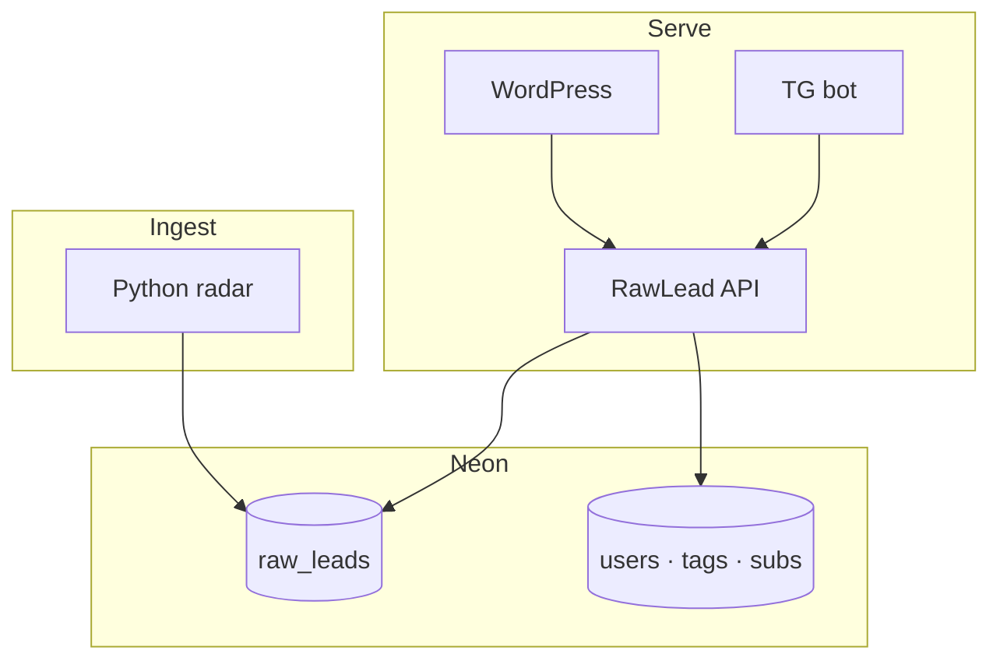
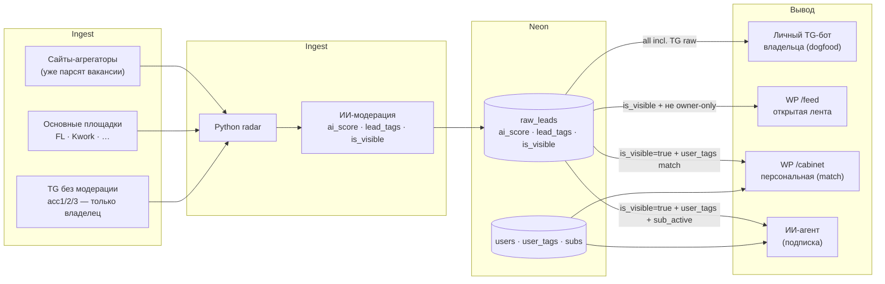

# Видение продукта — match + агрегатор заказов

Версия: **0.11** · Lead Product + владелец · 2026-05-28 (MARKET-INTEL Plan B: цена 590–990 ₽, «Горячий», пауза подписки, freemium hook; §0i без изменений)

Для владельца — **`docs/FOR_YOU.md`**. Код сейчас — **этап 0** (радар + бот). Ниже — **куда идём**.

**Архитектура v1:** [`NEON_SCHEMA.md`](../architect/NEON_SCHEMA.md) · [`TZ_API.md`](../architect/TZ_API.md) · [`TZ_WP.md`](../architect/TZ_WP.md)

---

## 0. Северная звезда (v0.9 — смена ставки 2026-05-24)

**RawLead** — **открытая лента заказов с ИИ-модерацией + персональный ИИ-агент по подписке.**

**Аудитория:** **Digital-специалисты** — 4 ниши: Разработка & Код · Дизайн & Видео · Маркетинг & SMM · Тексты & Переводы (см. §0i). Не «все фрилансеры» (размыто) и не «только IT» (узко). Владелец на вайбкодинге = первый dogfood, не ограничение продукта.

> **Внутри команды:** метафора dating (match, «мэтч»).  
> **Наружу:** **«умный подбор»**, **«совместимость»**, **«лиды без шума»** — слово dating **не используем**. Без узкого «для разработчиков» на лендинге.

### Три канала ценности (новая модель — владелец 2026-05-24)

| # | Канал | Что | Кому | Цена | Приоритет |
|---|-------|-----|------|------|-----------|
| **1** | **Личный ROI / dogfood** | TG-бот владельца с `AI_ENABLED=1` — Контур 1 (шлак→самородки→отклики→деньги) | Владелец | — | ✅ есть |
| **2** | **Открытая лента** | Публичная лента на WP — заказы, которые **прошли в бот** (`notified_at`); навыки, сортировки | Любой посетитель | **бесплатно** | 🟡 строим |
| **3** | **Подписка: персональный ИИ-агент** | После регистрации: лента match'ится по тегам аккаунта; агент сам пишет рыночную цену, черновик отклика, push в TG при новом матче | Платящий фрилансер | **подписка** (цена — после MVP) | 🟡 ядро MVP, монетизация после |

**Логика воронки:**

```
открытая лента (anon) → бесплатная регистрация (match по тегам) → платная подписка (ИИ-агент)
```

**Канал 1 = dogfood владельца** — двигатель всех решений (что не работает у владельца, не идёт в каналы 2/3).

### Поверхности

| Слой | Что |
|------|-----|
| **Этап 0** ✅ | Радар ПК + личный TG-бот владельца (Контур 1) |
| **v0.9 MVP** (строим) | WP `/feed` (открытая лента) + WP `/cabinet` (single-user → SaaS-ready) + бот владельца как dogfood |
| **v1** | Подписка + ИИ-агент (рыночные цены, отклик, push) — multi-user |
| **v2+** | VPS 24/7, аналитика, биллинг, контент-маркетинг |

**Не делаем:** mobile app (владелец 2026-05-23) · отдельный маркетинговый сайт-визитку до канала 3 (2026-05-24) · продающие тексты на WP до MVP (2026-05-24).

---

## 0a. Жёсткое ограничение: владелец на вайбкодинге (фиксация 2026-05-24)

Владелец **не пишет код руками**, использует ИИ-агентов в Cursor. Языки/фреймворки знает на уровне «понимаю что делает», не «пишу с нуля». Это **константа продукта**, а не временное состояние — все архитектурные и продуктовые решения подчиняются этому.

### Что разрешено

- Стандартные библиотеки и популярные фреймворки (Python stdlib, FastAPI, `python-telegram-bot`, OpenAI/Anthropic SDK, `psycopg2`/`sqlite3`)
- Простые архитектуры: один процесс — одна задача; явные имена; короткие функции; плоская структура папок
- **Подробные логи и тесты** — чтобы ИИ-агент мог отлаживать без знаний владельца
- README в каждом модуле; `.env.example` с комментариями
- **SaaS-ready схема с дня 1** (фиксация v0.9, 2026-05-24): даже при single-user (`user_id=1`) все запросы Neon содержат `user_id`; никаких хардкодов имени/тегов владельца. Переход в multi-user — снятие ограничения на регистрацию, не переписывание схемы. Это превращает «MVP single-user» в «SaaS-готовый product» без отдельного спринта.

### Что под запретом

- Свои DSL, кастомные фреймворки, экзотические зависимости
- Микросервисная мода: 5+ контейнеров, оркестрация, шины сообщений
- Невидимая магия: метаклассы, monkey-patching, неявные ORM-хуки
- Бинарные форматы данных, кастомные протоколы

### Следствия для позиционирования

- Владелец **не** «сеньор Python-разработчик»
- Позиционирование: **«AI-инструменты и автоматизации для бизнеса быстро»** — продаёт **скорость + AI-экспертизу + продуктовое чутьё**, не глубокое знание языка
- В каждом коммерческом заказе — открытое использование Cursor/AI как **преимущество** («сделаю за 3 дня вместо 3 недель»), а не как стыд

### Чек для Lead Architect / Coder

Перед каждым архитектурным решением: **«Сможет ли владелец через 3 месяца поддержать это с Cursor — или зайдёт в тупик?»** Если ответ «зайдёт» — упрощать.

### SaaS-ready с дня 1 (фиксация v0.9, 2026-05-24)

Хотя single-user (только владелец) сейчас, **схема и код пишутся сразу как многопользовательские**:

- В Neon: каждая таблица с пользовательскими данными имеет `user_id` (даже если он = `1` пока)
- В REST API: каждый эндпоинт `/v1/...` принимает `user_id` (через JWT после TG Login или из контекста)
- В коде: **никаких `OWNER_TG_CHAT_ID` хардкодов** в логике рейтинга / тегов / уведомлений — только `user_id` из контекста
- Auth-слой можно отложить, но **структура данных** не должна потом мигрироваться

**Цель:** переход single-user → multi-user — это «добавить TG Login + биллинг», а не «переписать модель данных».

---

## 0b. Архитектура v1 (зафиксировано)



### Scoring

| Поле | Когда |
|------|--------|
| `ai_score` | ingest — ИИ, 0–100, «годность заказа» |
| `lead_tags` | ingest — JSON из ИИ |
| `keyword_match` | read — `lead_tags` ∩ `user_tags` |
| **final_rank** | read — `ai_score×0.6 + keyword_match×0.4` |

Детали: [`NEON_SCHEMA.md`](../architect/NEON_SCHEMA.md) §3.

### WP кабинет

Теги юзера → REST **`/v1/feed`** → лента по **final_rank** (не прямой SQL из WP).

### Бот

Per `tg_chat_id`: top-K по rank, только активная подписка.

---

## 0c. Один поток + ИИ-модерация + 4 направления вывода (v0.9 пересмотр 2026-05-24)

**Старая модель «два контура (owner/saas)» — отменена.** Не делим источники на «грязные/чистые», а **режем шлак ИИ-модерацией** на ingest. Один поток → разные представления.



### ИИ-модерация (фильтр шлака на ingest)

| Сигнал | Откуда | Решение |
|--------|--------|---------|
| `ai_score` | LLM по тексту | < `MIN_AI_SCORE` (по умолчанию **40**) → `is_visible=false` |
| `is_spam` | LLM флаг | true → `is_visible=false` |
| `is_referral` | «напиши в ЛС», крипта, MLM | true → `is_visible=false` |
| `budget_text` | парсер бюджета | пустой ИЛИ < 3 500 ₽ → не блокирует, влияет на rank |

`is_visible=false` лиды попадают **только** в личный бот владельца (dogfood контроль модерации), но **не** в публичную ленту.

### Direction A — личный TG-бот владельца (dogfood, **есть**)

| | |
|--|--|
| **Источники** | **всё**, включая TG-каналы **без модерации** (acc1/2/3) — пока только для владельца |
| **Фильтр** | без ограничения `is_visible` / owner-only — полный поток для dogfood |
| **Куда** | TG-бот владельца, `AI_ENABLED=1` |
| **Зачем** | dogfood: каждое решение по WP/агенту обкатано на владельце; ловля самородков → закрытие заказов (личный ROI) |

### Direction B — публичная WP `/feed` (открытая лента, **строим MVP**)

| | |
|--|--|
| **Источники** | агрегаторы + основные площадки; **не** сырые TG-каналы (см. §0h) |
| **Фильтр** | `is_visible=true` + прошло в бот + **не** `source_tier=owner_raw` |
| **Доступ** | без регистрации (anon) |
| **Что есть на странице** | лента карточек, фильтры (источник, бюджет, теги), сортировки (новые/по rank), поиск |
| **Зачем** | привлечение трафика, доказательство ценности, SEO позже |

### Direction C — WP `/cabinet` (персональная лента, **строим MVP**)

| | |
|--|--|
| **Доступ** | бесплатная регистрация (включается после MVP — пока single-user `user_id=1`) |
| **Фильтр** | `is_visible=true` + match по `user_tags` (`final_rank ≥ MIN_PERSONAL`) |
| **Куда** | страница `/cabinet`, лента сортирована по `final_rank` |
| **Зачем** | конверсия anon → free → paid; персональная ценность |

### Direction D — ИИ-агент (подписка, **после MVP single-user**)

| | |
|--|--|
| **Доступ** | активная подписка (`subs.is_active=true`) |
| **Что добавляется к /cabinet** | (1) **кнопка «Написать отклик»** → черновик под `user_tags` + рыночная цена заказа; (2) **push в TG** при новом match'е (`telegram_chat_id` из профиля); (3) **пауза подписки** без штрафов (`subs.paused_until TIMESTAMP`) — антихёрн |
| **Цена** | **590–990 ₽/мес** · зафиксировано 2026-05-28 |
| **Позиционирование** | «Дешевле FL.ru PRO (1 270 ₽/мес), умнее всех агрегаторов» |

---

## 0d. Монетизация — горизонты под ставку B (v0.9, 2026-05-24)

**Тейк владельца 2026-05-24:**

> «Никаких переговоров с площадками, никаких юристов сейчас. Парсим открытые источники. Юзеров не жду — главное проверить навыки и довести MVP до конца».

Это **сильно упрощает** план. Из «SaaS = код + не-код 1–2 мес» убираем не-код (юристы, переговоры, контент-маркетинг сейчас) → получаем **MVP-заявку на SaaS за 1–3 недели вайбкодом**.

| Горизонт | Канал 1 — dogfood | Канал 2 — открытая лента | Канал 3 — подписка ИИ-агент |
|----------|--------------------|--------------------------|------------------------------|
| **0–2 нед** | Стабильный поток самородков владельцу; win-rate замер | Neon-схема + WP `/feed` MVP (без регистрации) + ИИ-модерация | `/cabinet` single-user (владелец как `user_id=1`) с теги→match |
| **2–4 нед** | 1–3 закрытых заказа (≥ 3 500 ₽) | Лента живая, ИИ режет шлак, фильтры/сортировки работают | ИИ-агент: рыночная цена + черновик отклика + push в TG (на владельце) |
| **1–3 мес** | Стабильно 2–3 заказа/мес | SEO/трафик не пушим — зависит от того, заходит ли владельцу самому пользоваться | Обкатать на владельце; ввести multi-user (auth, регистрация); зафиксировать цену подписки |
| **3–6 мес** | Решение: продолжаем dogfood или переключаемся на коммерцию | Опционально: side-канал «услуги на FL.ru» включается, если канал 3 не пошёл (см. §0f) | Первые 3–10 платящих ИЛИ honest pivot |

### Что НЕ делаем сейчас (фиксация владельца 2026-05-24)

- ❌ Переговоры с Habr Career / VK / TG-каналами на ingest
- ❌ Юристы, оферта, ИП/самозанятый — **до первой выручки**
- ❌ Контент-маркетинг (Habr-статьи, рассылки) — **до MVP**
- ❌ Витрина услуг на отдельном сайте — **до MVP** (см. §0g)
- ❌ Продающие тексты и SEO на WP — **до MVP**

### Цель MVP (что значит «MVP первого контура готов»)

1. WP `/feed` показывает живую ленту (≥ 50 валидных заказов/день, ИИ-модерация работает, < 30% шлака)
2. WP `/cabinet` — владелец залогинен, видит **только** match'и по своим тегам, sorted by `final_rank`
3. ИИ-агент: на странице карточки кнопка «Сгенерировать отклик» работает; рыночная цена считается; push в TG-бот владельца при новом match'е
4. Архитектура **multi-user-ready** (см. §0a) — `user_id` во всех запросах
5. Документация позволяет вайбкодом за 1–2 дня включить регистрацию и второго юзера

После MVP — реальный пересмотр (см. §0e метрики).

---

## 0e. ICP и метрики (v0.9, 2026-05-24)

### ICP — кто пользователь каждого канала

| Канал | ICP | Комментарий |
|-------|-----|-------------|
| **1. Dogfood** | **Владелец сам** | Главный фильтр качества: всё, что не работает у владельца, не идёт дальше. |
| **2. Открытая лента** | **Любой фрилансер** (anon) — любая ниша, не только IT | Приманка: большая лента, match по **своим** навыкам/тегам |
| **3. Подписка ИИ-агент** | Фрилансер с потоком заказов, хочет меньше рутины | Цена, черновик отклика, push — **ниша не важна**, важны теги |

### Метрики (что замеряем после MVP)

| Метрика | Канал | Целевой ориентир | Когда смотрим |
|---------|-------|-------------------|----------------|
| Закрытые заказы владельца / 4 нед | 1 | ≥ 3, минимум **3 500 ₽** каждый | сейчас |
| **Win-rate отклика владельца** = закрыто / отправлено | 1 | замер | сейчас |
| Валидных лидов в `/feed` / день | 2 | ≥ 50 | после ИИ-модерации |
| % шлака после ИИ-модерации | 2 | < 30% | после v0.9 ИИ |
| Trafic на `/feed` / день (anon) | 2 | замер, без цели | после публикации |
| Регистраций / нед | 3 | замер, без цели | после регистрации |
| **Конверсия anon → free** | 3 | замер | после регистрации |
| **Конверсия free → paid** | 3 | замер | после биллинга |
| Время до первого «отклика» юзера в `/cabinet` | 3 | < 5 мин | после `/cabinet` |
| LTV / churn / MRR | 3 | замер с 1-го платного | после биллинга |

### Что НЕ метрика сейчас

- SEO-позиции / органический трафик — нет контент-маркетинга
- Виральность, NPS — нет юзеров
- Конкурентный анализ — пока проверяем гипотезу

---

## 0f. Что продаём (v0.9, 2026-05-24)

**Главный продукт — подписка на ИИ-агент** (Direction D из §0c). Каталог 5 услуг (был активным в v0.8) — **отложен в side-канал** до выпуска MVP.

### Главное

| # | Канал | Продукт | Цена | Где |
|---|-------|---------|------|-----|
| 1 | Dogfood | (не продаём — инструмент владельца) | — | TG-бот владельца |
| 2 | Открытая лента | (не продаём — бесплатный продукт-приманка для регистраций) | бесплатно, без регистрации | WP `/feed` |
| **3** | **Подписка ИИ-агент** | Match по тегам + кнопка «Написать отклик» (черновик под профиль) + push в TG + пауза без штрафов | **590–990 ₽/мес** · «Дешевле FL.ru PRO, умнее агрегаторов» | WP \/cabinet\ |

### Side-канал «услуги на FL.ru» — отложено

После публикации MVP оценим, идёт ли подписка. Если **не идёт** — открываем side-канал: 5 услуг через FL.ru (uisness как кейс).

| # | Услуга | От ₽ | Срок | Сложность вайбкодом |
|---|--------|------|------|---------------------|
| 1 | Парсер заказов с одной биржи / TG-чата под теги клиента | 3 500 | 2–3 дн | низкая |
| 2 | Telegram-бот для мониторинга чатов с уведомлениями | 8 000 | 3–7 дн | низкая |
| 3 | AI-фильтр лидов в Google Sheets / простую CRM | 15 000 | 5–10 дн | средняя |
| 4 | Связка «парсер + AI-оценка + уведомления» под нишу заказчика | 25 000 | 1–2 нед | средняя |
| 5 | White-label «свой uisness» под клиента | 50 000 | 2–4 нед | высокая |

**Триггер активации side-канала:** 6 нед после MVP — нет хотя бы 1 платящего → переход на план «портфолио + услуги FL.ru». Иначе — оставляем отложенным.

---

## 0g. Портфолио — после MVP (v0.9, 2026-05-24)

**Решение владельца 2026-05-24:** портфолио и витрина услуг **полностью отложены** до выпуска MVP первого контура. Сначала довести продукт, потом упаковать как кейс.

### Активы, которые уже есть (используются в MVP, не как «портфолио»)

| Актив | Где | Роль в MVP |
|-------|-----|------------|
| WP лендинг editorial | `radarzakaz.local` (Kadence child) | Главная страница продукта (Hero «Лиды без шума») — **остаётся как маркетинг продукта**, не как витрина услуг |
| Пульт Tauri v2 | `desktop/` | Внутренний инструмент владельца, не публичная витрина |
| PNG-карта продукта | [`../design/rawlead/project-map-owner.png`](../design/rawlead/project-map-owner.png) | Внутренний документ |
| Дизайн-система | [`DESIGN_SYSTEM.md`](../design/DESIGN_SYSTEM.md) + [`../design/wp/REFERENCE.md`](../../design/wp/REFERENCE.md) | Базовые токены для WP `/feed` и `/cabinet` (extends to MVP) |
| GitHub `Rode51/uisness` | github.com | Публичный, README устарел; **обновить — после MVP** |
| Текст pitch | [`../PORTFOLIO.md`](../PORTFOLIO.md) + [`PORTFOLIO.md`](PORTFOLIO.md) | Устарел, **обновить — после MVP** |

### Каналы портфолио — все после MVP

| # | Канал | Когда активируем | Триггер |
|---|-------|-------------------|---------|
| 1 | GitHub README обновлённый | после MVP | продукт работает на владельце |
| 2 | FL.ru профиль с 5 услугами (§0f side) | если после 6 нед MVP нет 1-го платящего | pivot на side-канал |
| 3 | Habr Career кейс-статья | после 1-го закрытого заказа Контура 1 ИЛИ 1-го платящего | есть кейс с цифрами |
| 4 | Отдельная страница продукта-визитки | потом, **скорее всего не делаем** (ICP туда не ходит) | — |
| 5 | Продающие тексты на WP | потом, не сейчас | после первых юзеров |

### Принцип

> «Портфолио = работающий продукт на витрине, а не лендинг с обещаниями.» (владелец 2026-05-24)

Сначала: WP `/feed` живая лента + `/cabinet` под владельца + ИИ-агент обкатан. **После этого** Lead Designer возвращается к каналу 1–3.

### Что подразумевается «продукт работает на владельце»

См. § 0d «Цель MVP» (5 пунктов acceptance). После выполнения этих 5 пунктов — Lead Product открывает следующую инициативу (портфолио / multi-user / биллинг — выбирается с владельцем по результатам ретро MVP).

---

Находить заказы в TG (+ биржи), **самому писать** — без автоспама.

---

## 2. Telegram (три роли)

См. прежнюю схему: мониторинг (купленные acc + прокси), бот (уведомления), личный.

**VPN на ПК** режет `TG_PROXY_URL` → бот молчит. См. [`ops/RUN.md`](../ops/RUN.md).

---

## 3. Источники (стратегия §0h)

| Слой | Что | Сейчас | Публичная лента |
|------|-----|--------|-----------------|
| **A. Сайты-агрегаторы** | Уже парсят вакансии с десятков площадок — **мы парсим их** | очередь ingest | ✅ цель — основной рост базы |
| **B. Основные площадки** | FL.ru, Kwork и др. — **берём напрямую** тоже | ✅ в радаре | ✅ |
| **C. TG без модерации** | Купленные acc, relay в бот, много шума | ✅ dogfood владельца | ❌ **не для ленты** — скрыть/убрать позже |

Пулы: [`SOURCES_POOLS.md`](../ops/SOURCES_POOLS.md). Детали ingest: **§0h**.

---

## 0h. Ingest: большая база + TG только для владельца (владелец 2026-05-25, v2)

### Северная звезда данных

**Очень большая база заказов** — за счёт двух рычагов:

1. **Парсим сайты, которые уже парсят вакансии** (агрегаторы, дайджесты, каталоги) — не изобретаем заново то, что они уже собрали; забираем **их выдачу** в Neon с дедупом.
2. **Основные площадки берём напрямую** (FL, Kwork, …) — дубли с агрегаторами режет `content_hash` / fingerprint, а не «отказываемся от площадки».

> **Не путаем с v0.9.1:** мы **не** отказываемся от расширения ingest. Мы **не переписываем** уже работающие парсеры FL/Kwork «с нуля» — **добавляем** слой агрегаторов.

### TG-каналы без модерации (acc1/2/3)

| Этап | Поведение |
|------|-----------|
| **Сейчас (MVP)** | Идут в **личный бот владельца** — dogfood, ловля самородков, проверка ИИ |
| **Потом** | **Убрать из публичной ленты** или полностью скрыть (`source_tier=owner_raw` / флаг в Neon) — остаются **только под владельца**, не для anon и не для платящих «как есть» |

Публичный продукт строится на **агрегаторах + площадках + ИИ-модерации**, а не на сыром TG-шлаке.

### Что в открытой `/lenta/`

- Источники слоя **A + B**, прошедшие ИИ и бот (`notified_at`, `is_visible`).
- **Без** слоя **C** (сырые TG), когда включим разделение — см. Coder: поле `source_tier` или фильтр по `source`.

### Очередь ingest (после MVP волны 2)

| Трек | Суть | Кто |
|------|------|-----|
| **3i Агрегаторы** | Список сайтов-агрегаторов → парсеры в `src/`, ingest в Neon | `@coder` по ТЗ Lead |
| **3j Масштаб площадок** | Расширение B (Habr Career, …) по ROI | по метрикам §0e |
| **3k Скрытие TG raw** | Фильтр owner-only в API + ленте | `@coder` |

**Снято как отдельная цель:** «один парсер Habr вместо стратегии» — вместо этого **волна агрегаторов** (3i).

### TG-каналы в расширенном ingest (v0.10)

При подключении TG-каналов для нетехнических ниш (дизайн, маркетинг, тексты) — **только каналы с явной модерацией** (тематические агрегаторы заказов, каналы с правилами публикации). Сырые чаты без модерации дают критически высокий % шлака в нетехнических нишах. ИИ-модерация (`ai_score`) справляется, но стоит дороже — лучше отсечь на уровне источника.

---

## 0i. Ingest: 4 категории Digital-специалистов (v0.10, 2026-05-26)

**Фокус аудитории:** Digital-специалисты. Не «все фрилансеры» — размыто и дорого по ingest. Не «только IT» — узко и не нужно рынку. 4 категории закрывают основной объём Digital-фриланса на FL/Kwork/TG.

| # | Категория | Что берём | Что дропаем (не в ленту) |
|---|-----------|-----------|--------------------------|
| 1 | **Разработка & Код** | Python, FastAPI, Telegram-боты, парсеры, web (JS/PHP), Supabase, QA, автоворонки с бэкендом (Python/webhook) | 1С, Битрикс, сисадминство, задачи без ТЗ |
| 2 | **Дизайн & Видео** | UI/UX, Figma, Reels/Shorts, видеомонтаж, 2D-анимация, 3D character/explainer/motion graphics, карточки маркетплейсов (визуал) | 3D рендеринг интерьеров/архитектуры, ландшафтный дизайн |
| 3 | **Маркетинг & SMM** | Таргет, контекст, SEO, SMM, трафик, email-маркетинг, автоворонки-концепт (Senler/SaleBot/прогревы), сквозная аналитика | Обзвоны, лайки за деньги, ручной ввод капчи, реферальные схемы |
| 4 | **Тексты & Переводы** | Копирайтинг, локализация, редактура, субтитры (текст), автоматическая транскрибация | Ручная транскрибация аудио, дипломы/рефераты/контрольные |

### Правила пограничных случаев

| Случай | Категория |
|--------|-----------|
| «Написать бота для воронки на Python/FastAPI/webhook» | Разработка & Код |
| «Сборка воронки в SaleBot/Senler, написание прогревов» | Маркетинг & SMM |
| «Субтитры к видео» (текстовая задача) | Тексты & Переводы |
| «Монтаж видео + субтитры» (видеозадача) | Дизайн & Видео |
| «Карточки маркетплейсов» без уточнения | ИИ по контексту ТЗ: визуал → Дизайн, тексты карточек → Тексты |

### Вне scope всех категорий

- **Виртуальные ассистенты (VA)** — ручной труд без Digital-экспертизы, низкий чек
- **Дикторы и озвучка** — требует специфического аудио-парсинга, нет объёма на FL/Kwork
- **Сырые TG-чаты без модерации** — только каналы с явной модерацией (тематические агрегаторы заказов)

### Следствия для инженерии (`@coder` по ТЗ Lead Architect)

| Компонент | Что изменить |
|-----------|-------------|
| `docs/ops/FILTERS.md` | Добавить стоп-слова для дропов по каждой категории; расширить белый список словами Design/Marketing/Texts ниш |
| `docs/ops/PROFILE.md` | Для нетехнических ниш рекомендовать порог `ai_score` 50–55 (меньше конкретики в ТЗ → ИИ чаще сомневается) |
| Skills catalog в `/lenta/` | Теги сгруппировать по 4 категориям — пользователь сразу видит свою нишу |
| TG-каналы при расширении | Отдельный атрибут источника — модерируемый/немодерируемый (влияет на `source_tier`) |

---

## 4. Фазы (v0.11 под ставку B + MARKET-INTEL Plan B)

| Фаза | Статус | Суть |
|------|--------|------|
| 0 Радар ПК | ✅ | FL, Kwork, TG, пульт, бот |
| 1 TG MVP | ✅ | join, proxy wait-loop |
| 2 Scoring | → | `ai_score` + `lead_tags` + `is_visible` (ИИ-модерация на ingest) |
| 3 WP маркетинг | ✅ | Kadence child, REFERENCE E |
| **3b Neon SaaS-ready** | ✅ | schema + ingest |
| **3c REST API + WP `/lenta`** | ✅ | `/v1/feed`, skills, sort |
| **3d WP `/cabinet` single-user** | ✅ | match по тегам |
| **3x Бадж «Горячий»** | → **немедленно** (до/с P5) | `created_at < 5 мин` → badge на карточке; 0.5 дня Coder; бэкенд готов |
| **3i Сайты-агрегаторы** | → после волны 2 | парсим тех, кто уже парсит вакансии (§0h) |
| **3j Площадки напрямую** | → | FL/Kwork + новые по ROI |
| **3k TG raw → только владелец** | → | скрыть из `/lenta/`, оставить в боте |
| **3f ИИ-агент** | → следующий код | кнопка «Написать отклик» + черновик под `user_tags` + рыночная цена + push TG |
| **3g TG Login Widget + регистрация** | → после ИИ-агента работает | multi-user; первая возможность для не-владельца зайти в `/cabinet` |
| **3h Биллинг (590–990 ₽/мес)** | → после 1-го внешнего юзера | один тариф «всё включено»; ЮKassa или ручной перевод |
| **3p Пауза подписки** | → после 1-го платящего | `subs.paused_until TIMESTAMP` + крон; антихёрн −30% оттока |
| **3q Freemium hook** | → после 50 юзеров | «3 матча бесплатно → потом реши» вместо платного триала |
| 4 Аналитика рынка | потом | сводки тегов/бюджетов в `/cabinet` для подписчиков (видны после биллинга) |
| 5 Контент-маркетинг / портфолио | потом | Habr-статья, GitHub README обновлённый, FL.ru профиль (только если канал 3 не пошёл) |

**Под ставку B (2026-05-28):** **3b–3d ✅** · E5 приёмка → P5 деплой → **3x «Горячий»** → **3f ИИ-агент** → TG Login + **3h биллинг** → **3p пауза** → **3q freemium**. ROADMAP — `@lead-architect`.

**Убрано:** mobile app · отдельный сайт-витрина · переговоры с площадками · юристы до выручки · Пивот C (эксклюзивные лиды) — не нужен (владелец 2026-05-28).

---

## 5. Карточка лида (целевая)

```
🔥 Горячий  (created_at < 5 мин — badge; бэкенд готов, фаза 3x)
Совместимость: 88%  (final_rank)
  · Оценка заказа: 92  (ai_score)
  · Ваши теги: 82  (keyword_match)
Источник · ссылка · текст
🤖 Вердикт · [Написать отклик ▶]  (Direction D — черновик под user_tags)
```

---

## 6. Что не делаем (v0.9, ставка B)

- Авто-отклик на биржах · спам в ЛС
- Секреты в Git · Telethon без прокси
- Dating-тон в маркетинге и сообщениях заказчикам
- WP → прямой доступ к Neon (только REST API)
- **Сложный стек, не поддерживаемый через вайбкодинг** (см. §0a) — нет своих DSL, кастомных протоколов, микросервисной мании
- **Скрывать использование AI** в портфолио — это преимущество, а не стыд
- **Дублировать витрину портфолио** — переиспользуем `/cabinet`, лендинг, пульт-скрины, PNG-карту, токены `DESIGN_SYSTEM`; новые активы только через `LEAD_DESIGN_PROMPT.md`
- **Витрина услуг** (`/uslugi`, FL.ru профиль, Habr-статья) — **до MVP не делаем** (§0g)
- **Переговоры с площадками** (Habr Career, VK, закрытые TG) — парсим только открытые URL
- **Юристы / оферта / ИП** — до первой реальной выручки от подписки
- **Контент-маркетинг** (Habr-посты, рассылки) — до выпуска MVP
- **Продающие тексты на WP** — до выпуска MVP
- **Field `raw_leads.contour`** (`owner` | `saas`) — отменено в v0.9, есть только `is_visible` после ИИ-модерации
- **Хардкод владельца** в коде агента/уведомлений/тегов — только `user_id` из контекста (§0a SaaS-ready)
- **Несколько тарифов** в MVP — один «всё включено» **590–990 ₽/мес** (зафиксировано 2026-05-28), тарифная сетка после первых платящих
- **Пивот C (эксклюзивные лиды)** — отменён (владелец 2026-05-28); нужен объём, не нужна сложность
- **Сырые TG-каналы в публичной ленте** — только владелец; см. **§0h** слой C

---

## 7. Данные

| Что | Где |
|-----|-----|
| Этап 0 | SQLite `data/projects.db` |
| v1+ | Neon — [`NEON_SCHEMA.md`](../architect/NEON_SCHEMA.md) |
| WP | MySQL хостера — только users WP, не лиды |

---

## 8. Документы

| Файл | Роль |
|------|------|
| [`NEON_SCHEMA.md`](../architect/NEON_SCHEMA.md) | Таблицы, формула |
| [`TZ_API.md`](../architect/TZ_API.md) | REST, бот, ingest |
| [`TZ_WP.md`](../architect/TZ_WP.md) | Кабинет, подписки |
| [`ARCHITECTURE.md`](../architect/ARCHITECTURE.md) | Схемы |
| [`TASKS.md`](../common/TASKS.md) | Очередь |

---

_Владелец 2026-05-23: два контура owner/saas; dating — внутренний язык; rank = ai_score + user tags._

_Владелец 2026-05-24: ставка **A — Контур 1 + портфолио**; SaaS отложен до устойчивой выручки канала 1; темп пересмотрен (этап 0 собран за 3 дня); см. [`LEAD_PRODUCT_PROMPT.md`](LEAD_PRODUCT_PROMPT.md)._

_Владелец 2026-05-24 (v0.7): минимум закрытого заказа **3 500 ₽**; портфолио в GitHub + FL.ru (отдельная страница потом); владелец на вайбкодинге — добавлен §0a как жёсткое ограничение; каталог услуг §0f; преподнесение §0g._

_Lead Product 2026-05-24 (v0.8): после изучения всех docs — **переписан §0g**. Витрина портфолио = **каскад 6 каналов**, опирается на существующие активы (WP лендинг, пульт Tauri v2, PNG-карта, DESIGN_SYSTEM, REFERENCE.md, GitHub repo) — не выдумываем «с нуля»; дополнительный пункт §6 «не дублировать витрину»._

_Владелец 2026-05-24 (v0.9, ставка B): открытая лента + подписка ИИ-агент; SaaS-ready; без `contour`._

_Владелец 2026-05-25 (v0.9.2): **§0h** — агрегаторы + площадки; TG raw только владельцу._

_Владелец 2026-05-25 (v0.9.3): продукт для **всех фрилансеров**, не только IT._

_Lead Product + владелец 2026-05-26 (v0.10): аудитория уточнена — **Digital-специалисты**, 4 категории: Разработка & Код · Дизайн & Видео · Маркетинг & SMM · Тексты & Переводы (§0i). «Все фрилансеры» отменено как слишком размытое. VA, дикторы — вне scope. TG-каналы в ingest — только с модерацией._

_Lead Product + владелец 2026-05-28 (v0.11): **MARKET-INTEL Plan B зафиксирован**. Цена подписки — **590–990 ₽/мес** (заменяет «от 300»). Новые фазы: **3x «Горячий» badge** (немедленно), **3f кнопка «Написать отклик»** (Direction D уточнён), **3p пауза подписки** (после 1-го платящего), **3q freemium hook** (после 50 юзеров). Позиционирование: «Дешевле FL.ru PRO, умнее агрегаторов». Пивот C (эксклюзивные лиды) — отменён._
