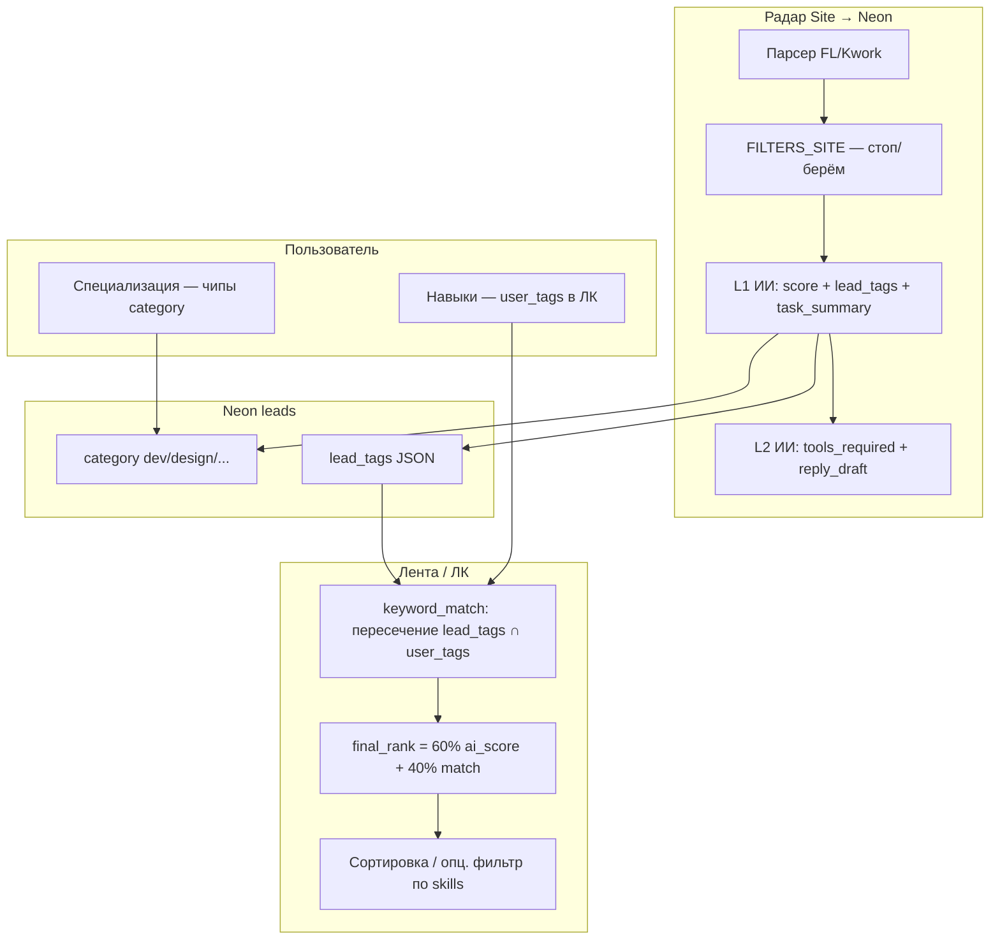

# Research: каталог навыков и инструментов (промпт)

**Для:** владелец + `@lead-product` (опц. Perplexity / ручной ресерч)  
**Когда:** этап **E2** — после рабочего ЛК, **до** `@lead-designer`  
**Результат:** `SKILLS_TOOLS_CATALOG.md` (или CSV в `docs/archive/`) — согласовано с владельцем  
**Канон продукта:** [`PRODUCT_VISION.md`](PRODUCT_VISION.md) §0i · [`LEAD_PRODUCT_PROMPT.md`](LEAD_PRODUCT_PROMPT.md) § SKILLS-TOOLS-RESEARCH

---

## 1. Зачем этот research (простыми словами)

Сейчас чипы навыков на сайте ≈ **топ-50 тегов из уже попавших в ленту заказов** (`GET /v1/skills/catalog`). Это узко и запаздывает: новая ниша в UI появляется только когда ИИ уже разметил лиды.

**Цель research:** заранее собрать **полный словарь** по 4 специализациям, чтобы:
- пользователю было **понятно**, что выбрать;
- ИИ стабильнее ставил `lead_tags` на заказы;
- match % был осмысленным, а не «случайные слова из прошлой недели».

**Не цель:** придумать 500 кнопок «на всякий случай» — перегруз убивает UX и **режет** видимые заказы (см. §4).

---

## 2. Как это работает в продукте (механика)



| Слой | Что делает | Кто настраивает |
|------|------------|-----------------|
| **FILTERS_SITE** | Отсекает мусор **до** ленты (дипломы, VA, 1С…) | Product + `docs/ops/FILTERS_SITE.md` |
| **category** | Ниша заказа: dev / design / marketing / text | Парсер + L1 + эвристика |
| **lead_tags** | Теги заказа для match (python, figma, seo…) | L1 промпт [`AI.md`](../architect/AI.md) |
| **user_tags** | Навыки пользователя в ЛК | Пользователь (+ research-каталог в UI) |
| **keyword_match** | % совпадения тегов заказа и профиля | Код `src/rank.py` |
| **tools_required** | Инструменты для L2 (отдельно от match) | L2 промпт, показ в кабинете |

**Важно:** навыки пользователя **не** решают, попадёт ли заказ в базу. Они влияют на **сортировку** и на **жёсткий фильтр**, если пользователь явно выбрал навыки и нажал «Применить» (тогда в SQL: заказ должен иметь **хотя бы один** совпадающий `lead_tag`).

---

## 3. Два словаря — не смешивать

| Тип | Для чего | Пример | Где в UI |
|-----|----------|--------|----------|
| **Навыки (skills)** | Match %, фильтр ленты, профиль ЛК | `python`, `figma`, `таргет`, `копирайт` | Чипы «Навыки» |
| **Инструменты (tools)** | Блок L2 «что понадобится», не match | `Figma`, `After Effects`, `Salebot`, `WordPress` | Раскрытие карточки / ЛК подписчик |

**Правило research:** в таблице **две колонки** — `skill_tag` и `tool_label`. Один и тот же «Figma» может быть и навыком (match), и инструментом (L2) — зафиксировать в глоссарии.

---

## 4. Как не «терять вакансии» (продуктовые правила)

### 4.1 Что реально «теряет» заказы

| Действие | Эффект |
|----------|--------|
| Слишком жёсткий **FILTERS_SITE** | Заказ **не попадает** в Neon |
| Плохие **lead_tags** у L1 | Match всегда 0% — заказ есть, но «не виден» |
| Пользователь выбрал **много навыков** + «Применить» | SQL оставляет только заказы с пересечением тегов — **сужение** |
| Узкий каталог в UI | Пользователь не находит свой skill → не матчится |

### 4.2 Что НЕ должно терять заказы

- Специализация (category) — **широкий** выбор (1–2 ниши), не «один навык».
- По умолчанию лента: **все заказы ниши** (или все видимые), сортировка по времени; match % — подсказка.
- Навыки — **уточнение**, не обязательный вход.

### 4.3 Рекомендации для research (зафиксировать в каталоге)

| Уровень | Сколько | Зачем |
|---------|---------|--------|
| **Tier A — ядро** | 8–15 навыков на нишу | 80% заказов, показывать в UI первым рядом |
| **Tier B — расширение** | +10–20 | «Показать ещё» / поиск |
| **Tier C — редкие** | остальное в справочнике | Только для L1-синонимов, не обязательно чипом |

Для каждого навыка Tier A/B указать:
- `canonical_tag` (одно слово в БД, lowercase)
- `synonyms[]` (RU/EN/опечатки) — для будущего матчинга
- `category` (dev|design|marketing|text)
- `shows_in_ui` (yes / tier_b_only / l1_only)

**Продуктовое правило для Design (предложение):** подсказка «Выбери 3–7 ключевых навыков — так больше релевантных заказов»; предупреждение при >10.

---

## 5. Метод research (пошагово)

### Шаг 0 — рамка (30 мин, владелец + PM)

Ответить письменно:
1. Кто первый пользователь: только dev или все 4 ниши сразу?
2. Приоритет: **широта ленты** vs **точность match** (если конфликт)?
3. Нужны ли кросс-нишевые навыки (`wordpress`, `telegram bot`) в нескольких category?

### Шаг 1 — сбор сырья (2–4 ч)

| Источник | Что выписать |
|----------|--------------|
| FL.ru / Kwork | Названия рубрик и подрубрик по 4 нишам |
| 20–30 реальных карточек из нашей ленты | Какие слова в title/body (без ПДн — обобщить) |
| 2–3 конкурента (агрегаторы лидов) | Как они называют фильтры/навыки |
| [`FILTERS_SITE.md`](../../ops/FILTERS_SITE.md) «Берём» | Уже согласованные токены |
| [`AI.md`](../architect/AI.md) `lead_tags` | Как ИИ должен тегировать |
| Опрос владельца | «Что ты сам ищешь на FL/Kwork?» 10–15 фраз на нишу |

### Шаг 2 — нормализация (2–3 ч)

Для каждой фразы:
1. Отнести к **одной** category.
2. Решить: **skill** или **tool** или **стоп** (уже в FILTERS).
3. Присвоить `canonical_tag` (латиница или транслит, без пробелов: `ui_ux`, `yandex_direct`).
4. Записать синонимы (минимум RU + EN).

**Дедуп:** `react` = `reactjs` = `реакт` → один canonical.

### Шаг 3 — проверка на «не теряем» (1–2 ч)

Взять **10 реальных** lead title+body из Neon (владелец или export):
- Для каждого проставить 2–4 тега из черновика каталога.
- Если ≥3 из 10 не покрываются — добавить Tier A или синоним.
- Если тег слишком общий (`сайт`, `дизайн`) — в **запрет для UI**, оставить только для L1 с контекстом.

### Шаг 4 — инструменты (отдельно, 1–2 ч)

По нишам список **инструментов** (20–40 на нишу): название продукта, не навык.
- Dev: IDE, фреймворки как **tools** только если в L2 «нужен Docker», не дублировать skill `python`.
- Design: Figma, AE, Premiere…
- Marketing: Meta Ads, Директ, Senler…
- Text: Google Docs, Notion, Transcription API…

### Шаг 5 — артефакт и приёмка

Файл **`SKILLS_TOOLS_CATALOG.md`** (шаблон ниже) + опц. `skills_tools_catalog.csv`.

**Приёмка владельцем:**
- [ ] По каждой нише есть Tier A (8–15 навыков) — «я бы так искал»
- [ ] Нет дублей и «мусорных» чипов (сайт, работа, срочно)
- [ ] Понятно, что skill vs tool
- [ ] Есть 1 абзац «как пользоваться фильтром, чтобы не резать ленту»
- [ ] Готово передать `@lead-designer` (E3)

---

## 6. Шаблон таблицы (копировать в артефакт)

### Навыки

| canonical_tag | category | tier | title_ru | synonyms | shows_in_ui | notes |
|---------------|----------|------|----------|----------|-------------|-------|
| python | dev | A | Python | py, питон | yes | |
| figma | design | A | Figma | фигма | yes | |

### Инструменты

| tool_label | category | tier | title_ru | related_skills | notes |
|------------|----------|------|----------|----------------|-------|
| Figma | design | A | Figma | figma, ui_ux | L2 block |

### Глоссарий UX (для Design + Product)

| Термин в UI | Значение для пользователя |
|-------------|---------------------------|
| Специализация | В какой **нише** ищешь заказы (можно 1–2) |
| Навыки | Что умеешь → **совместимость %** |
| Совместимость | Насколько заказ похож на твой профиль (не «оценка качества заказа») |
| Применить | Уточнить ленту (может **скрыть** заказы без выбранных тегов) |

---

## 7. После research — кто что делает

| Кто | Задача |
|-----|--------|
| **@lead-designer** | UI: специализация → навыки; Tier A на виду; mobile; не «окошко» |
| **@lead-product** | Подписи, подсказки «3–7 навыков», empty states |
| **@coder** | Импорт каталога в API/UI; опц. synonym map в `keyword_match`; L1 промпт под canonical tags |

**Не в scope E2:** биллинг, push в TG, новый парсер.

---

## 8. Вопросы для спора с владельцем (чеклист сессии)

1. Match по **точному** тегу или нужны **группы синонимов** в v1?
2. Фильтр навыков: **AND** (все выбранные) или **OR** (хотя бы один) — сейчас в коде **OR** (один совпавший). Устраивает?
3. Публичная `/lenta/`: навыки без регистрации — только сортировка или тоже жёсткий фильтр?
4. Один пользователь — несколько специализаций: навыки **объединяются** или панель меняется при смене category?
5. Инструменты в профиле ЛК нужны или только в L2 на карточке?

---

## 9. Копипаст для чата

```text
@lead-product
Проведи § SKILLS-TOOLS-RESEARCH по промпту:
docs/team/product/SKILLS_TOOLS_RESEARCH_PROMPT.md

С владельцем: шаг 0 + шаг 3 (10 реальных лидов).
Сдай SKILLS_TOOLS_CATALOG.md (Tier A/B, skills vs tools, глоссарий UX).
Не начинай Design, пока владелец не принял артефакт.
```

---

_Lead Architect · 2026-05-27 · этап E2_
